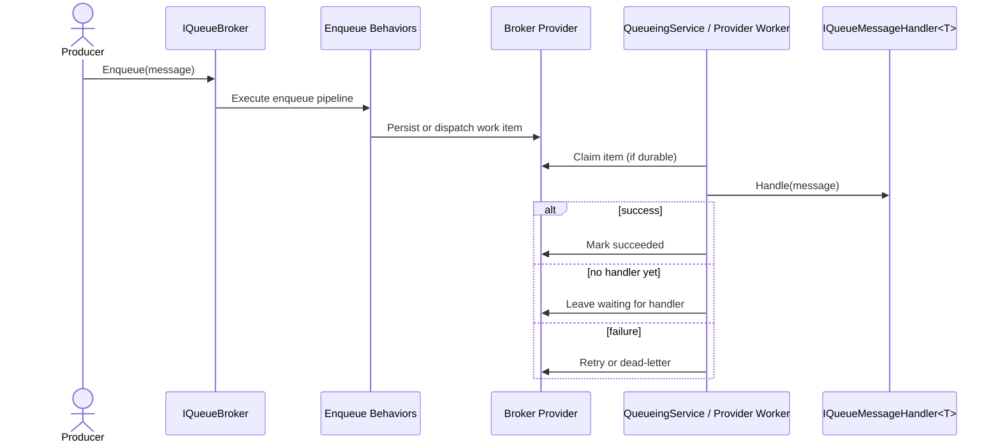

# Queueing Feature Documentation

> Process single-consumer work items through in-process or durable queue brokers with retained-message inspection, retry/archive controls, and queue/type pause-resume control.

[TOC]

## Overview

Queueing provides an application-level abstraction for background work that must be processed by exactly one logical handler per queued message type. It complements Messaging rather than replacing it:

- Messaging is for pub/sub fan-out where multiple handlers may react to the same event.
- Queueing is for work dispatch where one queued item must be processed once by one handler when a compatible handler is available.

The current queueing implementation ships with three brokers:

- `InProcessQueueBroker` for local, process-bound work distribution and tests.
- `EntityFrameworkQueueBroker<TContext>` for durable SQL-backed processing with renewable leases and runtime-safe competing consumers.
- `ServiceBusQueueBroker` for Azure Service Bus queue transport with manual complete/abandon/dead-letter semantics.

The feature also includes an operational web endpoint surface for queue broker summary, subscription inspection, waiting-message inspection, and queue/type pause-resume control.

## Challenges

- Single-consumer semantics: one handler per queued message type while still allowing multiple host instances to compete for work.
- Delayed handler availability: work can be enqueued before a handler is registered and should wait instead of failing.
- Durability: persisted messages need retries, leases, expiration, and dead-lettering behavior without depending on the messaging feature.
- Operational control: support engineers need visibility into waiting work, active subscriptions, and queue pause state.

## Solution

- Contracts: `IQueueMessage`, `IQueueMessageHandler<TMessage>`, `IQueueBroker`, and `IQueueBrokerService` provide a queue-specific API.
- Runtime: `QueueingService` is the single hosted service for the feature and applies subscriptions after host startup.
- Providers: brokers implement `QueueBrokerBase`; provider-specific background work plugs into the single runtime through `IQueueBrokerBackgroundProcessor`.
- Operations: `IQueueBrokerService` and `Presentation.Web.Queueing` expose broker inspection and operational controls, including retained-message queries, retry/archive actions, waiting-message inspection, purge, and queue/type pause-resume management.

## Architecture



## Core Contracts

- `IQueueBroker` ([src/Application.Queueing/IQueueBroker.cs](src/Application.Queueing/IQueueBroker.cs))
  - Subscribe/unsubscribe queue handlers.
  - Enqueue messages and optionally wait for provider-specific persistence confirmation.
  - Process messages through the shared queue dispatch pipeline.
- `IQueueBrokerService` ([src/Application.Queueing/IQueueBrokerService.cs](src/Application.Queueing/IQueueBrokerService.cs))
  - Inspect queue summary, subscriptions, and waiting messages.
  - Pause or resume queues and specific message types.
- `QueueBrokerBase` ([src/Application.Queueing/QueueBrokerBase.cs](src/Application.Queueing/QueueBrokerBase.cs))
  - Validates messages, runs behaviors, resolves handlers, and enforces queue semantics.
- `QueueingService` ([src/Application.Queueing/QueueingService.cs](src/Application.Queueing/QueueingService.cs))
  - The single hosted service for the whole feature.

## Getting Started

### In-process broker

```csharp
builder.Services.AddQueueing(builder.Configuration, context =>
 context.WithSubscription<OrderQueuedMessage, OrderQueuedHandler>())
  .WithInProcessBroker(new InProcessQueueBrokerConfiguration
  {
   MaxDegreeOfParallelism = 1,
   EnsureOrdered = true
 })
 .AddEndpoints();
```

### Entity Framework broker

```csharp
builder.Services.AddDbContext<AppDbContext>(...);

builder.Services.AddQueueing(builder.Configuration, context =>
 context.WithSubscription<OrderQueuedMessage, OrderQueuedHandler>())
  .WithEntityFrameworkBroker<AppDbContext>(new EntityFrameworkQueueBrokerConfiguration
  {
   AutoSave = true,
   ProcessingInterval = TimeSpan.FromSeconds(15),
   LeaseDuration = TimeSpan.FromSeconds(30)
  })
  .AddEndpoints(options => options.RequireAuthorization());
```

### Azure Service Bus broker

```csharp
builder.Services.AddQueueing(builder.Configuration, context =>
 context.WithSubscription<OrderQueuedMessage, OrderQueuedHandler>())
  .WithServiceBusBroker(new ServiceBusQueueBrokerConfiguration
  {
   ConnectionString = configuration["Queueing:ServiceBus:ConnectionString"],
   QueueNamePrefix = "bit",
   AutoCreateQueue = true,
   MaxConcurrentCalls = 8,
   MaxDeliveryAttempts = 5
  })
  .AddEndpoints(options => options.RequireAuthorization());
```

Your `DbContext` must implement `IQueueingContext`:

```csharp
public class AppDbContext : DbContext, IQueueingContext
{
 public DbSet<QueueMessage> QueueMessages { get; set; }
}
```

### Define a queue message and handler

```csharp
public sealed class OrderQueuedMessage(Guid orderId) : QueueMessageBase
{
 public Guid OrderId { get; } = orderId;
}

public sealed class OrderQueuedHandler : IQueueMessageHandler<OrderQueuedMessage>
{
 public Task Handle(OrderQueuedMessage message, CancellationToken cancellationToken)
 {
  // process one logical work item
  return Task.CompletedTask;
 }
}
```

### Enqueue work

```csharp
public sealed class OrdersService(IQueueBroker queueBroker)
{
 public Task QueueOrderAsync(Guid orderId, CancellationToken cancellationToken)
 {
  return queueBroker.Enqueue(new OrderQueuedMessage(orderId), cancellationToken);
 }
}
```

## Operational Endpoints

The retained-message operational surface lives in [src/Presentation.Web.Queueing/QueueingEndpoints.cs](src/Presentation.Web.Queueing/QueueingEndpoints.cs).

When you reference `Presentation.Web.Queueing`, you can register it directly from the fluent queueing builder:

```csharp
builder.Services.AddQueueing(builder.Configuration)
  .WithSubscription<OrderQueuedMessage, OrderQueuedHandler>()
  .WithEntityFrameworkBroker<AppDbContext>()
  .AddEndpoints(options => options
    .GroupPath("/api/_system/queueing")
    .GroupTag("_System.Queueing")
    .RequireAuthorization());
```

If you prefer separate registration, the existing `builder.Services.AddQueueingEndpoints(options => options.RequireAuthorization())` helper is also available.

Routes:

- `GET /api/_system/queueing/stats`
- `GET /api/_system/queueing/subscriptions`
- `GET /api/_system/queueing/messages`
- `GET /api/_system/queueing/messages/{id}`
- `GET /api/_system/queueing/messages/{id}/content`
- `GET /api/_system/queueing/messages/stats`
- `GET /api/_system/queueing/messages/waiting?take=50`
- `POST /api/_system/queueing/messages/{id}/retry`
- `POST /api/_system/queueing/messages/{id}/lease/release`
- `POST /api/_system/queueing/messages/{id}/archive`
- `DELETE /api/_system/queueing/messages`
- `POST /api/_system/queueing/queues/{queueName}/pause`
- `POST /api/_system/queueing/queues/{queueName}/resume`
- `POST /api/_system/queueing/types/{type}/pause`
- `POST /api/_system/queueing/types/{type}/resume`
- `POST /api/_system/queueing/types/{type}/circuit/reset`

All brokers implement the same `IQueueBrokerService` operational contract. The in-process broker exposes it over runtime-tracked items, the Entity Framework broker adds durable retained history plus archive-aware filtering and lease management, and the Service Bus broker provides lightweight in-memory operational tracking.

For Entity Framework, the most relevant broker-specific retention options are:

- `AutoArchiveAfter` to archive terminal messages automatically after a retention period.
- `AutoArchiveStatuses` to limit auto-archival to specific terminal states such as `Succeeded`, `DeadLettered`, or `Expired`.

## Runtime Behavior

- Duplicate handlers fail fast. A second handler for the same queue message type is rejected.
- Missing handlers produce `WaitingForHandler` instead of immediate failure.
- Durable providers use at-least-once delivery semantics; handlers should remain idempotent.
- `AddQueueing(...)` may be called from multiple modules. Registrations accumulate, but queueing still uses one hosted service.

### Multi-host Deployment Notes

- `EntityFrameworkQueueBroker<TContext>` is intended to support **multiple host instances competing for work** against the same durable store.
- For real multi-host deployments, prefer **SQL Server** or **PostgreSQL** so lease claim and renewal can use efficient conditional updates in the database.
- Queueing still provides **at-least-once** delivery semantics. The goal is one logical owner at a time, not an exactly-once execution guarantee.
- A queued item can be reprocessed if a host crashes after side effects but before finalize, or if lease ownership changes after expiry.
- Queue handlers should therefore be **idempotent** and safe to execute more than once for the same `MessageId`.
- Set `LeaseDuration` longer than normal handler execution time and `LeaseRenewalInterval` low enough that healthy workers renew ownership before expiry.
- `SQLite` is suitable for local/dev and lightweight durable scenarios, but it is **not the recommended storage engine for distributed multi-host queue processing**.
- Workers verify `LockedBy` before finalizing state. If another node took ownership, the older worker skips finalization rather than overwriting the newer lease owner.

## Relation To Messaging

Use Messaging when one event should fan out to many handlers. Use Queueing when one work item should be owned by one handler execution. The APIs are intentionally similar so the developer experience stays familiar, but the runtime semantics are different.

## Testing Guidance

The queueing slice is covered by focused application and presentation tests:

- [tests/Application.UnitTests/Queueing/QueueSubscriptionMapTests.cs](tests/Application.UnitTests/Queueing/QueueSubscriptionMapTests.cs)
- [tests/Application.IntegrationTests/Queueing/QueueingRegistrationTests.cs](tests/Application.IntegrationTests/Queueing/QueueingRegistrationTests.cs)
- [tests/Application.IntegrationTests/Queueing/InProcessQueueingBrokerTests.cs](tests/Application.IntegrationTests/Queueing/InProcessQueueingBrokerTests.cs)
- [tests/Application.IntegrationTests/Queueing/EntityFrameworkQueueingBrokerTests.cs](tests/Application.IntegrationTests/Queueing/EntityFrameworkQueueingBrokerTests.cs)
- [tests/Infrastructure.IntegrationTests/EntityFramework/Queueing/EntityFrameworkSqliteQueueBrokerTests.cs](tests/Infrastructure.IntegrationTests/EntityFramework/Queueing/EntityFrameworkSqliteQueueBrokerTests.cs)
- [tests/Infrastructure.IntegrationTests/EntityFramework/Queueing/EntityFrameworkSqlServerQueueBrokerTests.cs](tests/Infrastructure.IntegrationTests/EntityFramework/Queueing/EntityFrameworkSqlServerQueueBrokerTests.cs)
- [tests/Infrastructure.IntegrationTests/EntityFramework/Queueing/EntityFrameworkPostgresQueueBrokerTests.cs](tests/Infrastructure.IntegrationTests/EntityFramework/Queueing/EntityFrameworkPostgresQueueBrokerTests.cs)
- [tests/Presentation.UnitTests/Web/Queueing/QueueingEndpointsTests.cs](tests/Presentation.UnitTests/Web/Queueing/QueueingEndpointsTests.cs)

These tests cover additive registration with a single hosted service, in-process waiting/requeue and pause/resume behavior, Entity Framework durable processing and retention behavior, waiting-message ordering, retry state reset, competing-worker lease behavior, and the operational endpoint surface across SQLite, SQL Server, and PostgreSQL.

Service Bus specific tests:

- [tests/Infrastructure.UnitTests/Azure.ServiceBus/Queueing/ServiceBusQueueBrokerOptionsBuilderTests.cs](tests/Infrastructure.UnitTests/Azure.ServiceBus/Queueing/ServiceBusQueueBrokerOptionsBuilderTests.cs)
- [tests/Infrastructure.UnitTests/Azure.ServiceBus/Queueing/ServiceBusQueueBrokerConfigurationTests.cs](tests/Infrastructure.UnitTests/Azure.ServiceBus/Queueing/ServiceBusQueueBrokerConfigurationTests.cs)
- [tests/Infrastructure.UnitTests/Azure.ServiceBus/Queueing/ServiceBusQueueBrokerRuntimeTests.cs](tests/Infrastructure.UnitTests/Azure.ServiceBus/Queueing/ServiceBusQueueBrokerRuntimeTests.cs)
- [tests/Infrastructure.IntegrationTests/Azure.ServiceBus/Queueing/ServiceBusQueueBrokerTests.cs](tests/Infrastructure.IntegrationTests/Azure.ServiceBus/Queueing/ServiceBusQueueBrokerTests.cs)

Integration tests against a real Azure Service Bus namespace can be enabled by setting the `TEST_SERVICEBUS_CONNECTIONSTRING` environment variable.
