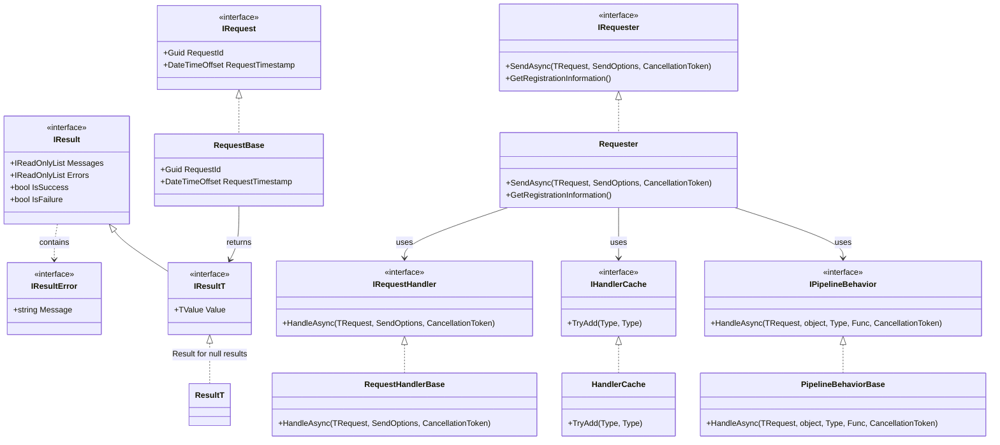

# Requester and Notifier Feature Documentation

[TOC]

## Overview

The `Requester` system is a robust framework designed to streamline the handling of requests—such as commands and queries—in modern applications. It provides a structured approach to dispatching requests to their respective handlers through a customizable pipeline of behaviors, allowing developers to address cross-cutting concerns like validation, retries, and timeouts without altering core business logic. By enforcing a consistent and type-safe mechanism for request processing, the system ensures predictability and maintainability in complex applications. The `Requester` system also includes a set of extensible pipeline behaviors that can be shared with other systems, such as the `Notifier`, ensuring consistency across different types of request handling.

### Challenges

When developing applications, managing the core mechanics of request dispatching and handler execution presents several challenges:

1. **Inconsistent Request Dispatching**: Without a standardized mechanism, dispatching requests to handlers can vary across the application, leading to unpredictable behavior.
2. **Error Propagation Complexity**: Propagating errors from handlers through multiple layers while preserving context is difficult, often resulting in lost information.
3. **Coupling of Concerns**: Handlers often mix business logic with technical concerns (e.g., error handling, logging), making them harder to maintain and test.
4. **Extensibility Limitations**: Adding new functionality (e.g., validation, retries) typically requires modifying existing handlers, increasing complexity and risk.
5. **Type Safety Issues**: Ensuring type-safe handling of requests and their results, especially for operations with no meaningful return value, can be error-prone.
6. **Request Tracking**: Tracking request metadata (e.g., IDs, timestamps) for debugging and auditing is often ad hoc, leading to inconsistent monitoring.

These challenges are why request-handling systems are popular—they provide a structured approach to dispatching requests, managing errors, and extending functionality without modifying core logic. The `Requester` system addresses these challenges by offering a standardized, extensible, and type-safe solution for request and handler management.

### Solution

The `Requester` system provides a comprehensive solution by:

1. Standardizing request dispatching through a central `IRequester` interface, ensuring consistent behavior across the application.
2. Enabling structured error propagation with `Result<TValue>`, preserving context across layers.
3. Decoupling concerns by using a pipeline of behaviors to handle technical aspects (e.g., validation, retries) separately from business logic.
4. Supporting extensibility through behaviors that can be added without modifying handlers.
5. Providing type-safe handling with `Result<Unit>` for commands with no meaningful return value.
6. Including built-in request metadata (`RequestId`, `RequestTimestamp`) for tracking and auditing.

### Key Features

- Type-safe request handling with `Result<TResponse>` outcomes.
- DI integration with scoped handler lifetimes.
- Request metadata (`RequestId`, `RequestTimestamp`) via `RequestBase<TResponse>`.
- Async-only handler implementation via `RequestHandlerBase<TRequest, TResponse>`.
- Pipeline behaviors for validation, retry, timeout, and custom logic.
- Per-handler timeout and retry policies via attributes.
- Contravariance for derived request types.
- Generic handlers with constraints (e.g., `Handler<TEntity>`).
- Progress reporting via `IProgress<ProgressReport>`.
- Automatic handler and validator discovery via assembly scanning.

### Architecture

The `Requester` system is built around the `IRequester` interface, which dispatches requests to handlers through a pipeline of behaviors. Requests inherit from `RequestBase<TValue>`, providing metadata (`RequestId`, `RequestTimestamp`). Handlers implement `IRequestHandler<TRequest, TValue>`, returning a `Result<TValue>` (or `Result<Unit>` for null results). Behaviors implement `IPipelineBehavior<TRequest, TResponse>`, applying cross-cutting concerns like validation, retries, or transactions. The `RequesterBuilder` configures the system, allowing registration of handlers and behaviors via a fluent API, including automatic discovery of validators embedded in requests.



### Use Cases

The `Requester` system is particularly useful in the following scenarios:

- Creating a customer (`Result<Unit>`).
- Updating a customer’s email (`Result<string>`).
- Fetching customer details (`Result<CustomerDto>`).
- Applying retry/timeout policies to critical operations.
- Handling polymorphic requests (e.g., `Request<Customer>` with a `Request<Person>` handler).
- Processing generic entities (e.g., `SaveEntityRequest<TEntity>`).

## Part 1: Requester

### Basic Usage

#### Request Dispatching

```csharp
// Creating a command
var command = new DoSomethingCommand { Message = "Performing task..." };

// Dispatching the command
var requester = provider.GetRequiredService<IRequester>();
var result = await requester.SendAsync(command);

// Checking result status
if (result.IsSuccess)
{
    Console.WriteLine("Task performed successfully.");
}
else
{
    Console.WriteLine($"Failed: {result.Errors.FirstOrDefault()?.Message}");
}

// Dispatching a query with a value
var query = new GetUserQuery { UserId = Guid.NewGuid() };
var queryResult = await requester.SendAsync(query);

if (queryResult.IsSuccess)
{
    Console.WriteLine($"User found: {queryResult.Value.Username}");
}
```

#### Command with Unit Result

```csharp
public class DoSomethingCommand : RequestBase<Unit>
{
    public string Message { get; set; }

    // Nested FluentValidation validator for automatic discovery
    public class Validator : AbstractValidator<DoSomethingCommand>
    {
        public Validator()
        {
            RuleFor(x => x.Message).NotEmpty().WithMessage("Message cannot be empty.");
        }
    }
}

[HandlerRetry(3, 200)] // Retry 3 times with 200ms delay
public class DoSomethingCommandHandler : RequestHandlerBase<DoSomethingCommand, Unit>
{
    protected override async Task<Result<Unit>> HandleAsync(DoSomethingCommand request, SendOptions options, CancellationToken cancellationToken)
    {
        await Task.Delay(100, cancellationToken); // Simulate async operation
        return Result<Unit>.Success(Unit.Value);
    }
}
```

#### Query with Value Result

```csharp
public class User : IEntity
{
    public Guid Id { get; set; }
    public string Username { get; set; }

    public bool HasIdentity() => this.Id != Guid.Empty;
}

public class GetUserQuery : RequestBase<User>
{
    public Guid UserId { get; set; }

    // Nested FluentValidation validator for automatic discovery
    public class Validator : AbstractValidator<GetUserQuery>
    {
        public Validator()
        {
            RuleFor(x => x.UserId).NotEmpty().WithMessage("UserId cannot be empty.");
        }
    }
}

[HandlerTimeout(500)] // Timeout after 500ms
public class GetUserQueryHandler : RequestHandlerBase<GetUserQuery, User>
{
    private readonly IGenericReadOnlyRepository<User> userRepository;

    public GetUserQueryHandler(IGenericReadOnlyRepository<User> userRepository)
    {
        this.userRepository = userRepository;
    }

    protected override async Task<Result<User>> HandleAsync(GetUserQuery request, SendOptions options, CancellationToken cancellationToken)
    {
        var user = await this.userRepository.FindOneAsync(request.UserId, cancellationToken: cancellationToken);
        return user != null
            ? Result<User>.Success(user)
            : Result<User>.Failure().WithMessage($"User with ID {request.UserId} not found.");
    }
}
```

#### FluentValidation Setup in Requests

Requests can include a nested `Validator` class that extends `FluentValidation.AbstractValidator<TRequest>`. The `RequesterBuilder` automatically discovers these validators during assembly scanning and registers them for use with the `ValidationBehavior`.

```csharp
public class CreateCustomerCommand : RequestBase<Unit>
{
    public string Email { get; set; }

    public class Validator : AbstractValidator<CreateCustomerCommand>
    {
        public Validator()
        {
            RuleFor(x => x.Email)
                .NotEmpty().WithMessage("Email cannot be empty.")
                .EmailAddress().WithMessage("Invalid email format.");
        }
    }
}
```

#### Validation Behavior

The `ValidationBehavior` is a pipeline behavior that automatically validates requests using FluentValidation if a validator is registered. It runs before the handler, ensuring validation errors are caught early.

```csharp
// Ensure the ValidationBehavior is registered
services.AddRequester()
    .AddHandlers(new[] { "^System\\..*" })
    .WithBehavior<ValidationBehavior<,>>();

// Example request with validation
public class UpdateEmailCommand : RequestBase<string>
{
    public string Email { get; set; }

    public class Validator : AbstractValidator<UpdateEmailCommand>
    {
        public Validator()
        {
            RuleFor(x => x.Email)
                .NotEmpty().WithMessage("Email cannot be empty.")
                .EmailAddress().WithMessage("Invalid email format.");
        }
    }
}

public class UpdateEmailCommandHandler : RequestHandlerBase<UpdateEmailCommand, string>
{
    protected override async Task<Result<string>> HandleAsync(UpdateEmailCommand request, SendOptions options, CancellationToken cancellationToken)
    {
        // ValidationBehavior ensures Email is valid before this executes
        return Result<string>.Success(request.Email);
    }
}
```

#### Using SendOptions

```csharp
var requester = provider.GetRequiredService<IRequester>();
var query = new GetUserQuery { UserId = Guid.NewGuid() };

// Configure SendOptions to throw exceptions
var options = new SendOptions
{
    HandleExceptionsAsResultError = false
};

try
{
    var result = await requester.SendAsync(query, options);
    if (result.IsSuccess)
    {
        Console.WriteLine($"User found: {result.Value.Username}");
    }
}
catch (Exception ex)
{
    Console.WriteLine($"Error: {ex.Message}");
}
```

#### Request Metadata and Cancellation

```csharp
public class CancelableCommand : RequestBase<Unit>
{
    public Guid TaskId { get; set; }
}

public class CancelableCommandHandler : RequestHandlerBase<CancelableCommand, Unit>
{
    protected override async Task<Result<Unit>> HandleAsync(CancelableCommand request, SendOptions options, CancellationToken cancellationToken)
    {
        Console.WriteLine($"Request ID: {request.RequestId}, Timestamp: {request.RequestTimestamp}");
        await Task.Delay(5000, cancellationToken); // Long-running operation
        return Result<Unit>.Success(Unit.Value);
    }
}

var cts = new CancellationTokenSource(TimeSpan.FromSeconds(2));
var result = await requester.SendAsync(new CancelableCommand { TaskId = Guid.NewGuid() }, cancellationToken: cts.Token);
```

#### Best Practices

1. **Early Returns**: Check `result.IsSuccess` early to avoid unnecessary processing.
   ```csharp
   var result = await requester.SendAsync(request);
   if (result.IsFailure)
   {
       return result;
   }
   ```

2. **Meaningful Messages**: Include context in error messages for better debugging.
   ```csharp
   return Result<Unit>.Failure($"Failed to process task {request.TaskId}: Invalid input");
   ```

3. **Order Behaviors**: Place critical behaviors (e.g., validation, transactions) early in the pipeline.
   ```csharp
   services.AddRequester()
       .AddHandlers(new[] { "^System\\..*" })
       .WithBehavior<ValidationBehavior<,>>()
       .WithBehavior<TransactionPipelineBehavior<,>>()
       .WithBehavior<RetryPipelineBehavior<,>>();
   ```

### Examples

#### Command Handling Example

```csharp
public class DoSomethingCommand : RequestBase<Unit>
{
    public string Message { get; set; }

    public class Validator : AbstractValidator<DoSomethingCommand>
    {
        public Validator()
        {
            RuleFor(x => x.Message).NotEmpty().WithMessage("Message cannot be empty.");
        }
    }
}

[HandlerRetry(3, 200)] // Retry 3 times with 200ms delay
public class DoSomethingCommandHandler : RequestHandlerBase<DoSomethingCommand, Unit>
{
    protected override async Task<Result<Unit>> HandleAsync(DoSomethingCommand request, SendOptions options, CancellationToken cancellationToken)
    {
        await Task.Delay(100, cancellationToken); // Simulate async operation
        return Result<Unit>.Success(Unit.Value);
    }
}

var command = new DoSomethingCommand { Message = "Performing task..." };
var result = await requester.SendAsync(command);

if (result.IsSuccess)
{
    Console.WriteLine("Task performed successfully.");
}
else
{
    Console.WriteLine($"Failed: {result.Errors.FirstOrDefault()?.Message}");
}
```

#### Query Handling Example

```csharp
public class User : IEntity
{
    public Guid Id { get; set; }
    public string Username { get; set; }

    public bool HasIdentity() => this.Id != Guid.Empty;
}

public class GetUserQuery : RequestBase<User>
{
    public Guid UserId { get; set; }

    public class Validator : AbstractValidator<GetUserQuery>
    {
        public Validator()
        {
            RuleFor(x => x.UserId).NotEmpty().WithMessage("UserId cannot be empty.");
        }
    }
}

[HandlerTimeout(500)] // Timeout after 500ms
public class GetUserQueryHandler : RequestHandlerBase<GetUserQuery, User>
{
    private readonly IGenericReadOnlyRepository<User> userRepository;

    public GetUserQueryHandler(IGenericReadOnlyRepository<User> userRepository)
    {
        this.userRepository = userRepository;
    }

    protected override async Task<Result<User>> HandleAsync(GetUserQuery request, SendOptions options, CancellationToken cancellationToken)
    {
        var user = await this.userRepository.FindOneAsync(request.UserId, cancellationToken: cancellationToken);
        return user != null
            ? Result<User>.Success(user)
            : Result<User>.Failure().WithMessage($"User with ID {request.UserId} not found.");
    }
}

var query = new GetUserQuery { UserId = Guid.NewGuid() };
var result = await requester.SendAsync(query);

if (result.IsSuccess)
{
    Console.WriteLine($"User found: {result.Value.Username}");
}
else
{
    Console.WriteLine($"Failed: {result.Errors.FirstOrDefault()?.Message}");
}
```

#### API Controller Example

```csharp
[ApiController]
[Route("api/[controller]")]
public class UsersController : ControllerBase
{
    private readonly IRequester requester;

    public UsersController(IRequester requester)
    {
        this.requester = requester;
    }

    [HttpGet("{id}")]
    public async Task<IActionResult> GetUser(Guid id)
    {
        var query = new GetUserQuery { UserId = id };
        var result = await this.requester.SendAsync(query);

        if (result.IsFailure)
        {
            return this.BadRequest(new
            {
                Errors = result.Errors.Select(e => e.Message),
                Messages = result.Messages
            });
        }

        return this.Ok(result.Value);
    }
}
```

## Part 2: Notifier

### Overview

### Basic Usage

### Examples

## Part 3: Pipeline Behaviors

### Basic Usage

#### Configuring Behaviors

Pipeline behaviors can be added to both the `Requester` and `Notifier` systems to handle cross-cutting concerns. They are registered using the fluent API during system configuration.

```csharp
// Adding validation, retry, and timeout behaviors
services.AddRequester()
    .AddHandlers(new[] { "^System\\..*" })
    .WithBehavior<ValidationBehavior<,>>()
    .WithBehavior<RetryPipelineBehavior<,>>()
    .WithBehavior<TimeoutPipelineBehavior<,>>();
```

#### Creating a Custom Behavior

You can create custom pipeline behaviors to add your own cross-cutting concerns. To do so, inherit from `PipelineBehaviorBase<TRequest, TResponse>` and implement the required methods.

```csharp
public class LoggingPipelineBehavior<TRequest, TResponse> : PipelineBehaviorBase<TRequest, TResponse>
    where TRequest : class
    where TResponse : IResult
{
    public LoggingPipelineBehavior(ILoggerFactory loggerFactory) : base(loggerFactory) { }

    protected override bool CanProcess(TRequest request, Type handlerType)
    {
        return true;
    }

    protected override async Task<TResponse> Process(TRequest request, Type handlerType, Func<Task<TResponse>> next, CancellationToken cancellationToken)
    {
        this.Logger.LogInformation($"Processing request: {request.GetType().Name}");
        var result = await next();
        this.Logger.LogInformation($"Request processed: {result.IsSuccess}");
        return result;
    }
}

services.AddRequester()
    .AddHandlers(new[] { "^System\\..*" })
    .WithBehavior<LoggingPipelineBehavior<,>>();
```

### Examples

#### Progress Reporting

- Allows handlers and behaviors to report progress during request processing using the `SendOptions.Progress` property.
- Useful for long-running operations where you want to provide feedback to the caller.

```csharp
public class LongRunningCommand : RequestBase<Unit> { }

public class LongRunningCommandHandler : RequestHandlerBase<LongRunningCommand, Unit>
{
    protected override async Task<Result<Unit>> HandleAsync(LongRunningCommand request, SendOptions options, CancellationToken cancellationToken)
    {
        for (int i = 0; i <= 100; i += 10)
        {
            options.Progress?.Report(new ProgressReport("LongRunningCommand", new[] { $"Processing {i}%" }, i));
            await Task.Delay(100, cancellationToken);
        }
        return Result<Unit>.Success(Unit.Value);
    }
}

// Dispatch with progress reporting
var options = new SendOptions
{
    Progress = new Progress<ProgressReport>(report => Console.WriteLine($"Progress: {report.Messages.First()} ({report.PercentageComplete}%)"))
};
var result = await requester.SendAsync(new LongRunningCommand(), options);
```

#### TransactionPipelineBehavior

- Wraps request handling in a database transaction to ensure data consistency.
- Configured with `HandlerDatabaseTransactionAttribute` to specify isolation level, rollback behavior, and the `DbContext` type.

```csharp
// Command to update a user
public class UpdateUserCommand : RequestBase<Unit>
{
    public Guid UserId { get; set; }
    public string Username { get; set; }

    public class Validator : AbstractValidator<UpdateUserCommand>
    {
        public Validator()
        {
            RuleFor(x => x.UserId).NotEmpty().WithMessage("UserId cannot be empty.");
            RuleFor(x => x.Username).NotEmpty().WithMessage("Username cannot be empty.");
        }
    }
}

[HandlerDatabaseTransactionAttribute<MyDbContext>(IsolationLevel.ReadCommitted, true)]
public class UpdateUserCommandHandler : RequestHandlerBase<UpdateUserCommand, Unit>
{
    private readonly IGenericRepository<User> userRepository;

    public UpdateUserCommandHandler(IGenericRepository<User> userRepository)
    {
        this.userRepository = userRepository;
    }

    protected override async Task<Result<Unit>> HandleAsync(UpdateUserCommand request, SendOptions options, CancellationToken cancellationToken)
    {
        var user = await this.userRepository.FindOneAsync(request.UserId, cancellationToken: cancellationToken);
        if (user == null)
        {
            return Result<Unit>.Failure().WithMessage($"User with ID {request.UserId} not found.");
        }

        user.Username = request.Username;
        await this.userRepository.UpdateAsync(user, cancellationToken);
        return Result<Unit>.Success(Unit.Value);
    }
}

// Register the behavior
services.AddDbContext<MyDbContext>(options => options.UseSqlServer("connection_string"));
services.AddRequester()
    .AddHandlers(new[] { "^System\\..*" })
    .WithBehavior<ValidationBehavior<,>>()
    .WithBehavior<TransactionPipelineBehavior<,>>();
```

#### ChaosPipelineBehavior

- Injects random failures to test system resilience.
- Configured with `HandlerChaosAttribute` to specify the injection rate and whether it’s enabled.

```csharp
// Command to test chaos
public class TestChaosCommand : RequestBase<Unit> { }

[HandlerChaos(0.1, true)] // 10% chance of failure
public class TestChaosCommandHandler : RequestHandlerBase<TestChaosCommand, Unit>
{
    protected override async Task<Result<Unit>> HandleAsync(TestChaosCommand request, SendOptions options, CancellationToken cancellationToken)
    {
        await Task.Delay(50, cancellationToken); // Simulate some work
        return Result<Unit>.Success(Unit.Value);
    }
}

// Register the behavior
services.AddRequester()
    .AddHandlers(new[] { "^System\\..*" })
    .WithBehavior<ChaosPipelineBehavior<,>>();
```

#### CircuitBreakerPipelineBehavior

- Implements a circuit breaker pattern to prevent repeated failures.
- Configured with `HandlerCircuitBreakerAttribute` to specify attempts, break duration, and backoff settings.

```csharp
// Command for a critical operation
public class CriticalOperationCommand : RequestBase<Unit> { }

[HandlerCircuitBreaker(3, 30, 200, true)] // 3 attempts, 30s break, 200ms backoff, exponential
public class CriticalOperationCommandHandler : RequestHandlerBase<CriticalOperationCommand, Unit>
{
    protected override async Task<Result<Unit>> HandleAsync(CriticalOperationCommand request, SendOptions options, CancellationToken cancellationToken)
    {
        await Task.Delay(50, cancellationToken); // Simulate critical operation
        return Result<Unit>.Success(Unit.Value);
    }
}

// Register the behavior
services.AddRequester()
    .AddHandlers(new[] { "^System\\..*" })
    .WithBehavior<CircuitBreakerPipelineBehavior<,>>();
```

#### CacheInvalidatePipelineBehavior

- Invalidates cache entries after request processing.
- Configured with `HandlerCacheInvalidateAttribute` to specify the cache key to invalidate.

```csharp
// Command to clear user cache
public class ClearUserCacheCommand : RequestBase<Unit> { }

[HandlerCacheInvalidate("user-cache")] // Invalidate cache entries starting with "user-cache"
public class ClearUserCacheCommandHandler : RequestHandlerBase<ClearUserCacheCommand, Unit>
{
    protected override async Task<Result<Unit>> HandleAsync(ClearUserCacheCommand request, SendOptions options, CancellationToken cancellationToken)
    {
        return Result<Unit>.Success(Unit.Value);
    }
}

// Register the behavior
services.AddRequester()
    .AddHandlers(new[] { "^System\\..*" })
    .WithBehavior<CacheInvalidatePipelineBehavior<,>>();
```

## Appendix A: CQS Pattern

The `Requester` system aligns with the Command-Query Separation (CQS) pattern, which separates operations into commands (actions that modify state) and queries (requests that retrieve data). This pattern offers several benefits:

- **Clarity**: Commands and queries have distinct roles, making the code easier to understand and maintain.
- **Predictability**: Commands modify state without returning data, while queries return data without modifying state, reducing side effects.
- **Scalability**: Separating concerns allows for better optimization, such as caching query results or applying different behaviors to commands and queries.

By using the `Requester` system, you can enforce CQS principles, ensuring a clean and predictable request-handling architecture.