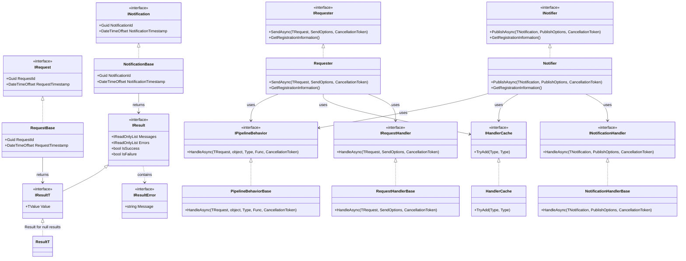

# Requester and Notifier Feature Documentation

[TOC]

## Overview

The `Requester` and `Notifier` systems form a robust framework designed to streamline the handling of requests (commands and queries) and notifications in modern applications. These systems provide structured approaches to dispatching messages to their respective handlers through a customizable pipeline of behaviors, allowing developers to address cross-cutting concerns like validation, retries, and timeouts without altering core business logic. By enforcing consistent and type-safe mechanisms for message processing, the systems ensure predictability and maintainability in complex applications. They share a set of extensible pipeline behaviors, ensuring consistency across different types of message handling.

Two kinds of messages are supported:
- **Request/Response Messages** (via `Requester`): Dispatched to a single handler, typically for commands (actions that modify state) or queries (requests that retrieve data).
- **Notification Messages** (via `Notifier`): Dispatched to multiple handlers in a publish/subscribe (pub/sub) model, typically for domain events where multiple components need to react to an event (e.g., user registration, system updates).

Using these components (requests for commands/queries and notifications for domain events) helps decrease coupling in the application by isolating message handling logic from the business logic of the application. For instance, a service can publish a domain event via the `Notifier` without knowing which components will handle it, and a command can be dispatched via the `Requester` without the caller needing to know the implementation details of the handler.

### Challenges

Managing the core mechanics of message dispatching and handler execution presents several challenges:

1. **Inconsistent Dispatching**: Without a standardized mechanism, dispatching requests or notifications to handlers can vary across the application, leading to unpredictable behavior.
2. **Error Propagation Complexity**: Propagating errors from handlers through multiple layers while preserving context is difficult, often resulting in lost information.
3. **Coupling of Concerns**: Handlers often mix business logic with technical concerns (e.g., error handling, logging), making them harder to maintain and test. Additionally, tight coupling between components can make the system rigid and harder to evolve.
4. **Extensibility Limitations**: Adding new functionality (e.g., validation, retries) typically requires modifying existing handlers, increasing complexity and risk.
5. **Type Safety Issues**: Ensuring type-safe handling of requests, notifications, and their results, especially for operations with no meaningful return value, can be error-prone.
6. **Message Tracking**: Tracking message metadata (e.g., IDs, timestamps) for debugging and auditing is often ad hoc, leading to inconsistent monitoring.
7. **Multiple Handler Coordination**: For notifications, coordinating multiple handlers (e.g., sequential, concurrent, or fire-and-forget execution) adds complexity, especially when ensuring consistent error handling.

These challenges are why message-handling systems like `Requester` and `Notifier` are popular—they provide structured approaches to dispatching messages, managing errors, and extending functionality without modifying core logic. The `Requester` and `Notifier` systems address these challenges by offering standardized, extensible, and type-safe solutions for request, notification, and handler management.

### Solution

The `Requester` and `Notifier` systems provide comprehensive solutions by:

1. Standardizing message dispatching through central interfaces (`IRequester` for requests, `INotifier` for notifications), ensuring consistent behavior across the application.
2. Enabling structured error propagation with `Result<TValue>` (for requests) and `Result` (for notifications), preserving context across layers.
3. Decoupling concerns by using a pipeline of behaviors to handle technical aspects (e.g., validation, retries) separately from business logic, and reducing coupling between components through the use of requests (for commands/queries) and notifications (for domain events).
4. Supporting extensibility through shared behaviors that can be added without modifying handlers.
5. Providing type-safe handling with `Result<Unit>` for commands with no meaningful return value and non-generic `Result` for notifications.
6. Including built-in message metadata (`RequestId`, `RequestTimestamp` for requests; `NotificationId`, `NotificationTimestamp` for notifications) for tracking and auditing.
7. Supporting multiple handler coordination for notifications with configurable execution modes (sequential, concurrent, fire-and-forget).

### Key Features

- **Type-Safe Handling**:
  - `Requester`: Uses `Result<TResponse>` for requests.
  - `Notifier`: Uses non-generic `Result` for notifications, as they don’t return values.
- **DI Integration**: Scoped handler lifetimes for both systems.
- **Message Metadata**:
  - `RequestBase<TResponse>`: Provides `RequestId`, `RequestTimestamp`.
  - `NotificationBase`: Provides `NotificationId`, `NotificationTimestamp`.
- **Async-Only Handlers**:
  - `RequestHandlerBase<TRequest, TResponse>` for requests.
  - `NotificationHandlerBase<TNotification>` for notifications.
- **Shared Pipeline Behaviors**: For validation, retry, timeout, and custom logic, applicable to both systems.
- **Execution Modes (Notifier)**: Sequential (default), concurrent, or fire-and-forget, configurable per notification.
- **Per-Handler Policies**: Timeout, retry, and chaos injection policies via attributes.
- **Progress Reporting**: Via `IProgress<ProgressReport>` in `SendOptions` (requests) and `PublishOptions` (notifications).
- **Automatic Discovery**: Handler and validator discovery via assembly scanning for both systems.

### Architecture

The `Requester` and `Notifier` systems are built around their respective interfaces: `IRequester` for dispatching requests to a single handler, and `INotifier` for dispatching notifications to multiple handlers in a pub/sub model. Requests inherit from `RequestBase<TValue>`, and notifications inherit from `NotificationBase`, both providing metadata for tracking. Handlers implement `IRequestHandler<TRequest, TValue>` for requests (returning `Result<TValue>`) and `INotificationHandler<TNotification>` for notifications (returning `Result`). Shared behaviors implement `IPipelineBehavior<TRequest, TResponse>`, applying cross-cutting concerns like validation or retries. The `RequesterBuilder` and `NotifierBuilder` configure their respective systems, allowing registration of handlers and behaviors via a fluent API, including automatic discovery of validators embedded in messages.



### Use Cases

- **Requester**:
  - Creating a customer (`Result<Unit>`).
  - Updating a customer’s email (`Result<string>`).
  - Fetching customer details (`Result<CustomerDto>`).
  - Applying retry/timeout policies to critical operations.
  - Processing generic entities (e.g., `SaveEntityRequest<TEntity>`).
- **Notifier**:
  - Sending email notifications after user registration (handled by multiple components like email sender, logger).
  - Logging domain events to multiple destinations (database, file, external service).
  - Updating caches in a fire-and-forget manner after data changes.
  - Broadcasting system events to multiple subscribers (e.g., audit logging, metrics collection).

## Part 1: Requester

### Basic Usage

#### Request Dispatching

```csharp
// Creating a command
var command = new DoSomethingCommand { Message = "Performing task..." };

// Dispatching the command
var requester = provider.GetRequiredService<IRequester>();
var result = await requester.SendAsync(command);

// Checking result status
if (result.IsSuccess)
{
    Console.WriteLine("Task performed successfully.");
}
else
{
    Console.WriteLine($"Failed: {result.Errors.FirstOrDefault()?.Message}");
}

// Dispatching a query with a value
var query = new GetUserQuery { UserId = Guid.NewGuid() };
var queryResult = await requester.SendAsync(query);

if (queryResult.IsSuccess)
{
    Console.WriteLine($"User found: {queryResult.Value.Username}");
}
```

#### Command with Unit Result

```csharp
public class DoSomethingCommand : RequestBase<Unit>
{
    public string Message { get; set; }

    // Nested FluentValidation validator for automatic discovery
    public class Validator : AbstractValidator<DoSomethingCommand>
    {
        public Validator()
        {
            RuleFor(x => x.Message).NotEmpty().WithMessage("Message cannot be empty.");
        }
    }
}

[HandlerRetry(3, 200)] // Retry 3 times with 200ms delay
public class DoSomethingCommandHandler : RequestHandlerBase<DoSomethingCommand, Unit>
{
    protected override async Task<Result<Unit>> HandleAsync(DoSomethingCommand request, SendOptions options, CancellationToken cancellationToken)
    {
        await Task.Delay(100, cancellationToken); // Simulate async operation
        return Result<Unit>.Success(Unit.Value);
    }
}
```

#### Query with Value Result

```csharp
public class User : IEntity
{
    public Guid Id { get; set; }
    public string Username { get; set; }

    public bool HasIdentity() => this.Id != Guid.Empty;
}

public class GetUserQuery : RequestBase<User>
{
    public Guid UserId { get; set; }

    // Nested FluentValidation validator for automatic discovery
    public class Validator : AbstractValidator<GetUserQuery>
    {
        public Validator()
        {
            RuleFor(x => x.UserId).NotEmpty().WithMessage("UserId cannot be empty.");
        }
    }
}

[HandlerTimeout(500)] // Timeout after 500ms
public class GetUserQueryHandler : RequestHandlerBase<GetUserQuery, User>
{
    private readonly IGenericReadOnlyRepository<User> userRepository;

    public GetUserQueryHandler(IGenericReadOnlyRepository<User> userRepository)
    {
        this.userRepository = userRepository;
    }

    protected override async Task<Result<User>> HandleAsync(GetUserQuery request, SendOptions options, CancellationToken cancellationToken)
    {
        var user = await this.userRepository.FindOneAsync(request.UserId, cancellationToken: cancellationToken);
        return user != null
            ? Result<User>.Success(user)
            : Result<User>.Failure().WithMessage($"User with ID {request.UserId} not found.");
    }
}
```

#### FluentValidation Setup in Requests

Requests can include a nested `Validator` class that extends `FluentValidation.AbstractValidator<TRequest>`. The `RequesterBuilder` automatically discovers these validators during assembly scanning and registers them for use with the `ValidationPipelineBehavior`.

```csharp
public class CreateCustomerCommand : RequestBase<string>
{
    public string Email { get; set; }

    public class Validator : AbstractValidator<CreateCustomerCommand>
    {
        public Validator()
        {
            RuleFor(x => x.Email)
                .NotEmpty().WithMessage("Email cannot be empty.")
                .EmailAddress().WithMessage("Invalid email format.");
        }
    }
}
```

#### Validation Behavior

The `ValidationPipelineBehavior` is a pipeline behavior that automatically validates requests using FluentValidation if a validator is registered. It runs before the handler, ensuring validation errors are caught early.

```csharp
// Ensure the ValidationPipelineBehavior is registered
services.AddRequester()
    .AddHandlers()
    .WithBehavior<ValidationPipelineBehavior<,>>();

// Example request with validation
public class UpdateEmailCommand : RequestBase<string>
{
    public string Email { get; set; }

    public class Validator : AbstractValidator<UpdateEmailCommand>
    {
        public Validator()
        {
            RuleFor(x => x.Email)
                .NotEmpty().WithMessage("Email cannot be empty.")
                .EmailAddress().WithMessage("Invalid email format.");
        }
    }
}

public class UpdateEmailCommandHandler : RequestHandlerBase<UpdateEmailCommand, string>
{
    protected override async Task<Result<string>> HandleAsync(UpdateEmailCommand request, SendOptions options, CancellationToken cancellationToken)
    {
        // ValidationPipelineBehavior ensures Email is valid before this executes
        return Result<string>.Success(request.Email);
    }
}
```

#### Using SendOptions

```csharp
var requester = provider.GetRequiredService<IRequester>();
var query = new GetUserQuery { UserId = Guid.NewGuid() };

// Configure SendOptions to throw exceptions
var options = new SendOptions
{
    HandleExceptionsAsResultError = false
};

try
{
    var result = await requester.SendAsync(query, options);
    if (result.IsSuccess)
    {
        Console.WriteLine($"User found: {result.Value.Username}");
    }
}
catch (Exception ex)
{
    Console.WriteLine($"Error: {ex.Message}");
}
```

#### Request Metadata and Cancellation

```csharp
public class CancelableCommand : RequestBase<Unit>
{
    public Guid TaskId { get; set; }
}

public class CancelableCommandHandler : RequestHandlerBase<CancelableCommand, Unit>
{
    protected override async Task<Result<Unit>> HandleAsync(CancelableCommand request, SendOptions options, CancellationToken cancellationToken)
    {
        Console.WriteLine($"Request ID: {request.RequestId}, Timestamp: {request.RequestTimestamp}");
        await Task.Delay(5000, cancellationToken); // Long-running operation
        return Result<Unit>.Success(Unit.Value);
    }
}

var cts = new CancellationTokenSource(TimeSpan.FromSeconds(2));
var result = await requester.SendAsync(new CancelableCommand { TaskId = Guid.NewGuid() }, cancellationToken: cts.Token);
```

#### Best Practices

1. **Early Returns**: Check `result.IsSuccess` early to avoid unnecessary processing.
   ```csharp
   var result = await requester.SendAsync(request);
   if (result.IsFailure)
   {
       return result;
   }
   ```

2. **Meaningful Messages**: Include context in error messages for better debugging.
   ```csharp
   return Result<Unit>.Failure($"Failed to process task {request.TaskId}: Invalid input");
   ```

3. **Order Behaviors**: Place critical behaviors (e.g., validation, transactions) early in the pipeline.
   ```csharp
   services.AddRequester()
       .AddHandlers()
       .WithBehavior<ValidationPipelineBehavior<,>>()
       .WithBehavior<TransactionPipelineBehavior<,>>()
       .WithBehavior<RetryPipelineBehavior<,>>();
   ```

### Examples

#### Command Handling Example

```csharp
public class DoSomethingCommand : RequestBase<Unit>
{
    public string Message { get; set; }

    public class Validator : AbstractValidator<DoSomethingCommand>
    {
        public Validator()
        {
            RuleFor(x => x.Message).NotEmpty().WithMessage("Message cannot be empty.");
        }
    }
}

[HandlerRetry(3, 200)] // Retry 3 times with 200ms delay
public class DoSomethingCommandHandler : RequestHandlerBase<DoSomethingCommand, Unit>
{
    protected override async Task<Result<Unit>> HandleAsync(DoSomethingCommand request, SendOptions options, CancellationToken cancellationToken)
    {
        await Task.Delay(100, cancellationToken); // Simulate async operation
        return Result<Unit>.Success(Unit.Value);
    }
}

var command = new DoSomethingCommand { Message = "Performing task..." };
var result = await requester.SendAsync(command);

if (result.IsSuccess)
{
    Console.WriteLine("Task performed successfully.");
}
else
{
    Console.WriteLine($"Failed: {result.Errors.FirstOrDefault()?.Message}");
}
```

#### Query Handling Example

```csharp
public class User : IEntity
{
    public Guid Id { get; set; }
    public string Username { get; set; }

    public bool HasIdentity() => this.Id != Guid.Empty;
}

public class GetUserQuery : RequestBase<User>
{
    public Guid UserId { get; set; }

    public class Validator : AbstractValidator<GetUserQuery>
    {
        public Validator()
        {
            RuleFor(x => x.UserId).NotEmpty().WithMessage("UserId cannot be empty.");
        }
    }
}

[HandlerTimeout(500)] // Timeout after 500ms
public class GetUserQueryHandler : RequestHandlerBase<GetUserQuery, User>
{
    private readonly IGenericReadOnlyRepository<User> userRepository;

    public GetUserQueryHandler(IGenericReadOnlyRepository<User> userRepository)
    {
        this.userRepository = userRepository;
    }

    protected override async Task<Result<User>> HandleAsync(GetUserQuery request, SendOptions options, CancellationToken cancellationToken)
    {
        var user = await this.userRepository.FindOneAsync(request.UserId, cancellationToken: cancellationToken);
        return user != null
            ? Result<User>.Success(user)
            : Result<User>.Failure().WithMessage($"User with ID {request.UserId} not found.");
    }
}

var query = new GetUserQuery { UserId = Guid.NewGuid() };
var result = await requester.SendAsync(query);

if (result.IsSuccess)
{
    Console.WriteLine($"User found: {result.Value.Username}");
}
else
{
    Console.WriteLine($"Failed: {result.Errors.FirstOrDefault()?.Message}");
}
```

## Part 2: Notifier

### Overview

The `Notifier` system complements the `Requester` by providing a publish/subscribe (pub/sub) model for handling notifications. Unlike requests, which are dispatched to a single handler, notifications are dispatched to multiple handlers, enabling scenarios where multiple components need to react to a domain event (e.g., user registration, system updates). The `Notifier` shares the same pipeline behaviors as the `Requester`, ensuring consistency in cross-cutting concerns like validation and retries. It supports configurable execution modes (sequential, concurrent, fire-and-forget) to control how handlers are invoked, and it returns a non-generic `Result` to aggregate outcomes from all handlers.

#### Challenges Addressed by Notifier
- **Multiple Handler Coordination**: Coordinating multiple handlers for a single notification, with options for sequential, concurrent, or fire-and-forget execution.
- **Consistent Error Handling**: Aggregating errors from multiple handlers into a single `Result` while preserving context.
- **Execution Flexibility**: Allowing different execution modes to suit various use cases (e.g., ordered processing, parallel execution, non-blocking dispatch).
- **Shared Behaviors**: Reusing the same pipeline behaviors as the `Requester` for consistency (e.g., validation, retries).

#### Solution
The `Notifier` system addresses these challenges by:
1. Providing a central `INotifier` interface for publishing notifications to multiple handlers.
2. Aggregating handler outcomes into a non-generic `Result`, indicating overall success or failure.
3. Supporting three execution modes (sequential, concurrent, fire-and-forget) configurable via `PublishOptions`.
4. Reusing the `Requester`’s pipeline behaviors for consistency in cross-cutting concerns.

#### Key Features Specific to Notifier
- **Pub/Sub Model**: Dispatches notifications to multiple handlers.
- **Execution Modes**:
  - **Sequential**: Handlers run one after another, stopping on the first failure (default).
  - **Concurrent**: Handlers run in parallel, with results aggregated.
  - **Fire-and-Forget**: Handlers are invoked without awaiting completion, returning immediately.
- **Non-Generic Result**: Returns a `Result` (without a value) to aggregate outcomes from all handlers.
- **Shared Behaviors**: Uses the same pipeline behaviors as `Requester` (e.g., validation, retries).

### Basic Usage

#### Notification Dispatching

```csharp
// Creating a notification
var notification = new UserRegisteredNotification { UserId = Guid.NewGuid(), Email = "user@example.com" };

// Dispatching the notification
var notifier = provider.GetRequiredService<INotifier>();
var result = await notifier.PublishAsync(notification);

// Checking result status
if (result.IsSuccess)
{
    Console.WriteLine("Notification processed successfully by all handlers.");
}
else
{
    Console.WriteLine($"Failed: {result.Errors.FirstOrDefault()?.Message}");
}
```

#### Notification with Multiple Handlers

```csharp
public class UserRegisteredNotification : NotificationBase
{
    public Guid UserId { get; set; }
    public string Email { get; set; }

    // Nested FluentValidation validator for automatic discovery
    public class Validator : AbstractValidator<UserRegisteredNotification>
    {
        public Validator()
        {
            RuleFor(x => x.UserId).NotEmpty().WithMessage("UserId cannot be empty.");
            RuleFor(x => x.Email)
                .NotEmpty().WithMessage("Email cannot be empty.")
                .EmailAddress().WithMessage("Invalid email format.");
        }
    }
}

// Handler to send an email
public class SendEmailNotificationHandler : NotificationHandlerBase<UserRegisteredNotification>
{
    protected override async Task<Result> HandleAsync(UserRegisteredNotification notification, PublishOptions options, CancellationToken cancellationToken)
    {
        // Simulate sending an email
        await Task.Delay(100, cancellationToken);
        Console.WriteLine($"Email sent to {notification.Email} for user {notification.UserId}");
        return Result.Success();
    }
}

// Handler to log the event
public class LogUserRegistrationHandler : NotificationHandlerBase<UserRegisteredNotification>
{
    protected override async Task<Result> HandleAsync(UserRegisteredNotification notification, PublishOptions options, CancellationToken cancellationToken)
    {
        // Simulate logging
        await Task.Delay(50, cancellationToken);
        Console.WriteLine($"Logged registration for user {notification.UserId}");
        return Result.Success();
    }
}

// Dispatching the notification
var result = await notifier.PublishAsync(new UserRegisteredNotification 
{ 
    UserId = Guid.NewGuid(), 
    Email = "user@example.com" 
});

if (result.IsSuccess)
{
    Console.WriteLine("User registration notification processed successfully.");
}
else
{
    Console.WriteLine($"Failed: {result.Errors.FirstOrDefault()?.Message}");
}
```

#### FluentValidation Setup in Notifications

Notifications, like requests, can include a nested `Validator` class that extends `FluentValidation.AbstractValidator<TNotification>`. The `NotifierBuilder` automatically discovers these validators during assembly scanning and registers them for use with the `ValidationPipelineBehavior`.

```csharp
public class EmailSentNotification : NotificationBase
{
    public string EmailAddress { get; set; }

    public class Validator : AbstractValidator<EmailSentNotification>
    {
        public Validator()
        {
            RuleFor(x => x.EmailAddress)
                .NotEmpty().WithMessage("Email cannot be empty.")
                .EmailAddress().WithMessage("Invalid email format.");
        }
    }
}
```

#### Using PublishOptions

```csharp
var notifier = provider.GetRequiredService<INotifier>();
var notification = new UserRegisteredNotification { UserId = Guid.NewGuid(), Email = "user@example.com" };

// Configure PublishOptions for concurrent execution
var options = new PublishOptions
{
    ExecutionMode = ExecutionMode.Concurrent,
    HandleExceptionsAsResultError = true
};

var result = await notifier.PublishAsync(notification, options);

if (result.IsSuccess)
{
    Console.WriteLine("Notification processed successfully by all handlers.");
}
else
{
    Console.WriteLine($"Failed: {result.Errors.FirstOrDefault()?.Message}");
}
```

#### Notification Metadata and Cancellation

```csharp
public class SystemEventNotification : NotificationBase
{
    public string EventType { get; set; }
}

public class SystemEventLoggerHandler : NotificationHandlerBase<SystemEventNotification>
{
    protected override async Task<Result> HandleAsync(SystemEventNotification notification, PublishOptions options, CancellationToken cancellationToken)
    {
        Console.WriteLine($"Notification ID: {notification.NotificationId}, Timestamp: {notification.NotificationTimestamp}");
        await Task.Delay(5000, cancellationToken); // Long-running operation
        return Result.Success();
    }
}

var cts = new CancellationTokenSource(TimeSpan.FromSeconds(2));
var result = await notifier.PublishAsync(new SystemEventNotification { EventType = "SystemStarted" }, cancellationToken: cts.Token);
```

#### Best Practices

1. **Execution Mode Selection**:
   - Use `Sequential` for ordered processing where one handler’s failure should stop others.
   - Use `Concurrent` for performance when handlers can run independently.
   - Use `FireAndForget` for non-critical tasks where immediate return is needed.
   ```csharp
   var options = new PublishOptions { ExecutionMode = ExecutionMode.Concurrent };
   var result = await notifier.PublishAsync(notification, options);
   ```

2. **Error Aggregation**:
   - Check `result.Errors` to handle failures from multiple handlers.
   ```csharp
   if (result.IsFailure)
   {
       foreach (var error in result.Errors)
       {
           Console.WriteLine($"Handler error: {error.Message}");
       }
   }
   ```

3. **Order Behaviors**: Ensure critical behaviors (e.g., validation) run early, as with the `Requester`.
   ```csharp
   services.AddNotifier()
       .AddHandlers()
       .WithBehavior<ValidationPipelineBehavior<,>>()
       .WithBehavior<RetryPipelineBehavior<,>>();
   ```

### Examples

#### Notification with Sequential Execution

```csharp
public class UserRegisteredNotification : NotificationBase
{
    public Guid UserId { get; set; }
    public string Email { get; set; }

    public class Validator : AbstractValidator<UserRegisteredNotification>
    {
        public Validator()
        {
            RuleFor(x => x.UserId).NotEmpty().WithMessage("UserId cannot be empty.");
            RuleFor(x => x.Email)
                .NotEmpty().WithMessage("Email cannot be empty.")
                .EmailAddress().WithMessage("Invalid email format.");
        }
    }
}

public class SendEmailNotificationHandler : NotificationHandlerBase<UserRegisteredNotification>
{
    protected override async Task<Result> HandleAsync(UserRegisteredNotification notification, PublishOptions options, CancellationToken cancellationToken)
    {
        await Task.Delay(100, cancellationToken);
        Console.WriteLine($"Email sent to {notification.Email} for user {notification.UserId}");
        return Result.Success();
    }
}

public class LogUserRegistrationHandler : NotificationHandlerBase<UserRegisteredNotification>
{
    protected override async Task<Result> HandleAsync(UserRegisteredNotification notification, PublishOptions options, CancellationToken cancellationToken)
    {
        await Task.Delay(50, cancellationToken);
        Console.WriteLine($"Logged registration for user {notification.UserId}");
        return Result.Success();
    }
}

// Register the Notifier with ValidationPipelineBehavior
services.AddNotifier()
    .AddHandlers()
    .WithBehavior<ValidationPipelineBehavior<,>>();

var notification = new UserRegisteredNotification 
{ 
    UserId = Guid.NewGuid(), 
    Email = "user@example.com" 
};
var result = await notifier.PublishAsync(notification);

if (result.IsSuccess)
{
    Console.WriteLine("User registration notification processed successfully.");
}
else
{
    Console.WriteLine($"Failed: {result.Errors.FirstOrDefault()?.Message}");
}
```

#### Notification with Concurrent Execution

```csharp
// Using the same UserRegisteredNotification as above
var options = new PublishOptions { ExecutionMode = ExecutionMode.Concurrent };
var result = await notifier.PublishAsync(new UserRegisteredNotification 
{ 
    UserId = Guid.NewGuid(), 
    Email = "user@example.com" 
}, options);

if (result.IsSuccess)
{
    Console.WriteLine("User registration notification processed concurrently by all handlers.");
}
else
{
    Console.WriteLine($"Failed: {result.Errors.FirstOrDefault()?.Message}");
}
```

#### Notification with Fire-and-Forget Execution

```csharp
public class CacheUpdateNotification : NotificationBase
{
    public Guid EntityId { get; set; }
}

public class CacheUpdaterHandler : NotificationHandlerBase<CacheUpdateNotification>
{
    protected override async Task<Result> HandleAsync(CacheUpdateNotification notification, PublishOptions options, CancellationToken cancellationToken)
    {
        await Task.Delay(500, cancellationToken); // Simulate cache update
        Console.WriteLine($"Cache updated for entity {notification.EntityId}");
        return Result.Success();
    }
}

var options = new PublishOptions { ExecutionMode = ExecutionMode.FireAndForget };
var result = await notifier.PublishAsync(new CacheUpdateNotification 
{ 
    EntityId = Guid.NewGuid() 
}, options);

Console.WriteLine("Notification dispatched in fire-and-forget mode.");
```

## Part 3: Pipeline Behaviors

### Basic Usage

#### Configuring Behaviors

Pipeline behaviors can be added to both the `Requester` and `Notifier` systems to handle cross-cutting concerns. They are registered using the fluent API during system configuration and are shared between the two systems for consistency.

```csharp
// Adding validation, retry, and timeout behaviors for both Requester and Notifier
services.AddRequester()
    .AddHandlers()
    .WithBehavior<ValidationPipelineBehavior<,>>()
    .WithBehavior<RetryPipelineBehavior<,>>()
    .WithBehavior<TimeoutPipelineBehavior<,>>();

services.AddNotifier()
    .AddHandlers()
    .WithBehavior<ValidationPipelineBehavior<,>>()
    .WithBehavior<RetryPipelineBehavior<,>>()
    .WithBehavior<TimeoutPipelineBehavior<,>>();
```

#### Creating a Custom Behavior

You can create custom pipeline behaviors to add your own cross-cutting concerns. To do so, inherit from `PipelineBehaviorBase<TRequest, TResponse>` and implement the required methods. The behavior can be used by both `Requester` and `Notifier`.

```csharp
public class LoggingPipelineBehavior<TRequest, TResponse> : PipelineBehaviorBase<TRequest, TResponse>
    where TRequest : class
    where TResponse : IResult
{
    public LoggingPipelineBehavior(ILoggerFactory loggerFactory) : base(loggerFactory) { }

    protected override bool CanProcess(TRequest request, Type handlerType)
    {
        return true;
    }

    protected override async Task<TResponse> Process(TRequest request, Type handlerType, Func<Task<TResponse>> next, CancellationToken cancellationToken)
    {
        this.Logger.LogInformation($"Processing request: {request.GetType().Name}");
        var result = await next();
        this.Logger.LogInformation($"Message processed: {result.IsSuccess}");
        return result;
    }

    public override bool IsHandlerSpecific() => false;
}

services.AddRequester()
    .AddHandlers()
    .WithBehavior<LoggingPipelineBehavior<,>>();

services.AddNotifier()
    .AddHandlers()
    .WithBehavior<LoggingPipelineBehavior<,>>();
```

### Examples

#### Progress Reporting

- Allows handlers and behaviors to report progress during message processing using the `SendOptions.Progress` property.
- Useful for long-running operations where you want to provide feedback to the caller.

```csharp
public class LongRunningCommand : RequestBase<Unit> { }

public class LongRunningCommandHandler : RequestHandlerBase<LongRunningCommand, Unit>
{
    protected override async Task<Result<Unit>> HandleAsync(LongRunningCommand request, SendOptions options, CancellationToken cancellationToken)
    {
        for (int i = 0; i <= 100; i += 10)
        {
            options.Progress?.Report(new ProgressReport("LongRunningCommand", new[] { $"Processing {i}%" }, i));
            await Task.Delay(100, cancellationToken);
        }
        return Result<Unit>.Success(Unit.Value);
    }
}

// Dispatch with progress reporting
var options = new SendOptions
{
    Progress = new Progress<ProgressReport>(report => Console.WriteLine($"Progress: {report.Messages.First()} ({report.PercentageComplete}%)"))
};
var result = await requester.SendAsync(new LongRunningCommand(), options);
```

#### TransactionPipelineBehavior

- Wraps message handling in a database transaction to ensure data consistency.
- Configured with `HandlerDatabaseTransactionAttribute` to specify isolation level, rollback behavior, and the `DbContext` type.

```csharp
// Command to update a user
public class UpdateUserCommand : RequestBase<Unit>
{
    public Guid UserId { get; set; }
    public string Username { get; set; }

    public class Validator : AbstractValidator<UpdateUserCommand>
    {
        public Validator()
        {
            RuleFor(x => x.UserId).NotEmpty().WithMessage("UserId cannot be empty.");
            RuleFor(x => x.Username).NotEmpty().WithMessage("Username cannot be empty.");
        }
    }
}

[HandlerDatabaseTransactionAttribute<MyDbContext>(IsolationLevel.ReadCommitted, true)]
public class UpdateUserCommandHandler : RequestHandlerBase<UpdateUserCommand, Unit>
{
    private readonly IGenericRepository<User> userRepository;

    public UpdateUserCommandHandler(IGenericRepository<User> userRepository)
    {
        this.userRepository = userRepository;
    }

    protected override async Task<Result<Unit>> HandleAsync(UpdateUserCommand request, SendOptions options, CancellationToken cancellationToken)
    {
        var user = await this.userRepository.FindOneAsync(request.UserId, cancellationToken: cancellationToken);
        if (user == null)
        {
            return Result<Unit>.Failure().WithMessage($"User with ID {request.UserId} not found.");
        }

        user.Username = request.Username;
        await this.userRepository.UpdateAsync(user, cancellationToken);
        return Result<Unit>.Success(Unit.Value);
    }
}

// Register the behavior
services.AddDbContext<MyDbContext>(options => options.UseSqlServer("connection_string"));
services.AddRequester()
    .AddHandlers()
    .WithBehavior<ValidationPipelineBehavior<,>>()
    .WithBehavior<TransactionPipelineBehavior<,>>();
```

#### ChaosPipelineBehavior

- Injects random failures to test system resilience.
- Configured with `HandlerChaosAttribute` to specify the injection rate and whether it’s enabled.

```csharp
// Command to test chaos
public class TestChaosCommand : RequestBase<Unit> { }

[HandlerChaos(0.1, true)] // 10% chance of failure
public class TestChaosCommandHandler : RequestHandlerBase<TestChaosCommand, Unit>
{
    protected override async Task<Result<Unit>> HandleAsync(TestChaosCommand request, SendOptions options, CancellationToken cancellationToken)
    {
        await Task.Delay(50, cancellationToken); // Simulate some work
        return Result<Unit>.Success(Unit.Value);
    }
}

// Register the behavior
services.AddRequester()
    .AddHandlers()
    .WithBehavior<ChaosPipelineBehavior<,>>();
```

#### CircuitBreakerPipelineBehavior

- Implements a circuit breaker pattern to prevent repeated failures.
- Configured with `HandlerCircuitBreakerAttribute` to specify attempts, break duration, and backoff settings.

```csharp
// Command for a critical operation
public class CriticalOperationCommand : RequestBase<Unit> { }

[HandlerCircuitBreaker(3, 30, 200, true)] // 3 attempts, 30s break, 200ms backoff, exponential
public class CriticalOperationCommandHandler : RequestHandlerBase<CriticalOperationCommand, Unit>
{
    protected override async Task<Result<Unit>> HandleAsync(CriticalOperationCommand request, SendOptions options, CancellationToken cancellationToken)
    {
        await Task.Delay(50, cancellationToken); // Simulate critical operation
        return Result<Unit>.Success(Unit.Value);
    }
}

// Register the behavior
services.AddRequester()
    .AddHandlers()
    .WithBehavior<CircuitBreakerPipelineBehavior<,>>();
```

#### CacheInvalidatePipelineBehavior

- Invalidates cache entries after message processing.
- Configured with `HandlerCacheInvalidateAttribute` to specify the cache key to invalidate.

```csharp
// Command to clear user cache
public class ClearUserCacheCommand : RequestBase<Unit> { }

[HandlerCacheInvalidate("user-cache")] // Invalidate cache entries starting with "user-cache"
public class ClearUserCacheCommandHandler : RequestHandlerBase<ClearUserCacheCommand, Unit>
{
    protected override async Task<Result<Unit>> HandleAsync(ClearUserCacheCommand request, SendOptions options, CancellationToken cancellationToken)
    {
        return Result<Unit>.Success(Unit.Value);
    }
}

// Register the behavior
services.AddRequester()
    .AddHandlers()
    .WithBehavior<CacheInvalidatePipelineBehavior<,>>();
```

## Appendix A: CQS Pattern

The Command-Query Separation (CQS) pattern is a design principle that separates operations into two distinct categories: commands and queries. Introduced by Bertrand Meyer as part of his work on the Eiffel programming language, CQS aims to improve code clarity, maintainability, and predictability by enforcing a clear distinction between operations that modify state and those that retrieve data.

### General Pattern

In the CQS pattern:
- **Commands**: Operations that modify the state of the system but do not return a value. Commands are responsible for performing actions, such as updating a database, sending an email, or changing an object's state. For example, a method like `UpdateUser(userId, newName)` would be a command because it modifies the user’s name but does not return a result.
- **Queries**: Operations that retrieve data from the system without modifying its state. Queries are responsible for fetching information, such as retrieving a user’s details or calculating a total. For example, a method like `GetUser(userId)` would be a query because it returns the user’s data without altering the system.

The key principle of CQS is that a method should either be a command or a query, but not both. This separation ensures that:
- **Commands do not return values**: They focus solely on state modification, making their intent clear.
- **Queries do not have side effects**: They are safe to call without worrying about unintended state changes.

This distinction leads to several benefits:
- **Predictability**: Developers can easily understand whether a method will change the system’s state or simply return data, reducing the risk of unexpected side effects.
- **Testability**: Queries, being side-effect-free, are easier to test because their output depends only on their input and the system’s state. Commands can be tested by verifying state changes.
- **Maintainability**: Separating concerns makes the codebase easier to navigate and modify, as commands and queries have distinct roles.
- **Scalability**: Queries can be optimized (e.g., through caching) without affecting commands, and commands can be audited or logged independently of queries.

### CQS in Practice

In practice, adhering strictly to CQS can sometimes be challenging, especially in scenarios where a command might need to return a value (e.g., the ID of a newly created resource). To address this, variations like Command-Query Responsibility Segregation (CQRS) extend CQS by allowing commands to return minimal data (e.g., a success status or identifier) while maintaining separation between state-changing and data-retrieving operations.

The `Requester` feature aligns with the CQS pattern by providing a structured way to handle commands and queries:
- **Commands**: Represented as requests that return `Result<Unit>`, focusing on state modification without returning meaningful data. For example, a `CreateUserCommand` might update a database and return `Result<Unit>.Success(Unit.Value)` to indicate success.
- **Queries**: Represented as requests that return `Result<TValue>`, focusing on data retrieval without modifying state. For example, a `GetUserQuery` might return `Result<User>` with the user’s details.

This alignment offers several benefits:
- **Clarity**: Commands and queries have distinct roles, making the code easier to understand and maintain.
- **Predictability**: Commands modify state without returning data, while queries return data without modifying state, reducing side effects.
- **Scalability**: Separating concerns allows for better optimization, such as caching query results or applying different behaviors to commands and queries.

By using the `Requester` feature, you can enforce CQS principles, ensuring a clean and predictable request-handling architecture. For example, pipeline behaviors like `ValidationPipelineBehavior` can be applied to both commands and queries, while `RetryPipelineBehavior` might be more relevant for commands that interact with external systems.

## Appendix B: Comparison with MediatR

The `Requester` and `Notifier` systems share similarities with the popular **MediatR** library but offer distinct features tailored to specific needs:

- **Similarities**:
  - Both support request/response (`IRequest<TResponse>`) and pub/sub (`INotification`) patterns for dispatching messages to handlers.
  - Both use a pipeline behavior model to handle cross-cutting concerns (e.g., validation, logging).
  - Both integrate with dependency injection for handler resolution.

- **Differences**:
  - **Execution Modes (Notifier)**: The `Notifier` supports sequential, concurrent, and fire-and-forget execution modes for notifications, while MediatR processes notifications sequentially by default with no built-in concurrency options.
  - **Built-in Behaviors**: `Requester` and `Notifier` provide pre-built behaviors (e.g., retry, timeout, chaos injection) via attributes, whereas MediatR requires custom implementation of such features.
  - **Result Type**: `Requester` uses `Result<TValue>` and `Notifier` uses `Result` for consistent error handling, while MediatR allows handlers to return any type, leaving error handling to the user.
  - **Metadata**: `RequestBase<TValue>` and `NotificationBase` include built-in metadata (`RequestId`, `NotificationId`, timestamps), which MediatR lacks by default.

# Appendix C: Generic Handlers in Requester and Notifier

## Overview

Generic handlers in the `Requester` and `Notifier` systems enable handling of generic request/notification types (e.g., `GenericRequest<TData>`, `GenericNotification<TData>`) with a single handler, reducing code duplication. They are registered using `AddGenericHandlers`, which discovers open generic handlers, validates constraints, and registers closed handlers (e.g., `GenericDataProcessor<UserData>`).

## Key Features
- **Automatic Discovery**: `AddGenericHandlers` scans assemblies for open generic handlers and discovers type arguments based on constraints.
- **Constraint Validation**: Ensures type arguments meet constraints (e.g., `where TData : class, IDataItem`).

## Setup with `AddGenericHandlers`

### Requester
```csharp
services.AddRequester()
    .AddHandlers()
    .AddGenericHandlers()
    .WithBehavior<ValidationPipelineBehavior<,>>();
```

### Notifier
```csharp
services.AddNotifier()
    .AddHandlers()
    .AddGenericHandlers()
    .WithBehavior<ValidationPipelineBehavior<,>>();
```

`AddGenericHandlers` discovers open generic handlers (e.g., `GenericDataProcessor<TData>`), finds type arguments (e.g., `UserData`, `OrderData`) that satisfy constraints, and registers closed handlers.

## Examples

### Generic Request Handler (Requester)
```csharp
public class ProcessDataRequest<TData> : RequestBase<string>
    where TData : class, IDataItem
{
    public TData Data { get; set; }

    public class Validator : AbstractValidator<ProcessDataRequest<TData>>
    {
        public Validator()
        {
            RuleFor(x => x.Data).NotNull();
        }
    }
}

public class GenericDataProcessor<TData> : RequestHandlerBase<ProcessDataRequest<TData>, string>
    where TData : class, IDataItem
{
    protected override async Task<Result<string>> HandleAsync(
        ProcessDataRequest<TData> request,
        SendOptions options,
        CancellationToken cancellationToken)
    {
        return Result<string>.Success($"Processed: {request.Data.Id}");
    }
}

public interface IDataItem { string Id { get; set; } }
public class UserData : IDataItem { public string Id { get; set; } public string Name { get; set; } }

// Dispatching
var userRequest = new ProcessDataRequest<UserData> { Data = new UserData { Id = "user123" } };
var result = await requester.SendAsync(userRequest); // "Processed: user123"
```

### Generic Notification Handler (Notifier)
```csharp
public class GenericNotification<TData> : NotificationBase
    where TData : class, IDataItem
{
    public TData Data { get; set; }

    public class Validator : AbstractValidator<GenericNotification<TData>>
    {
        public Validator()
        {
            RuleFor(x => x.Data).NotNull();
        }
    }
}

public class GenericNotificationHandler<TData> : NotificationHandlerBase<GenericNotification<TData>>
    where TData : class, IDataItem
{
    protected override async Task<Result> HandleAsync(
        GenericNotification<TData> notification,
        PublishOptions options,
        CancellationToken cancellationToken)
    {
        Console.WriteLine($"Handled: {notification.Data.Id}");
        return Result.Success();
    }
}

// Dispatching
var userNotification = new GenericNotification<UserData> { Data = new UserData { Id = "user123" } };
var result = await notifier.PublishAsync(userNotification); // Logs: "Handled: user123"
```