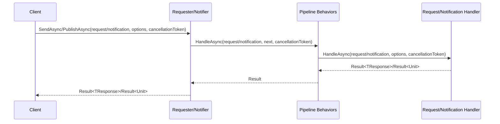

# Documentation for Requester and Notifier

This document provides a practical guide for developers using the `Requester` and `Notifier` libraries in .NET applications. The `Requester` handles commands (operations that modify state) and queries (operations that retrieve data) following the Command Query Separation (CQS) pattern, while the `Notifier` publishes notifications (domain events) to multiple handlers for event-driven architectures. Both libraries are designed for type safety, asynchronous processing, and integration with Dependency Injection (DI), offering features like validation, progress reporting, and pipeline behaviors. This guide focuses on usage, examples, and testing, with technical design details available in `Design.md`.

## Introduction

The `Requester` and `Notifier` libraries simplify processing requests and notifications in .NET applications, ensuring consistency, scalability, and developer productivity. The `Requester` dispatches requests through a pipeline of behaviors, returning structured `Result<TResponse>` outcomes, while the `Notifier` broadcasts notifications to multiple handlers, returning `Result<Unit>`. Both leverage the `Result` pattern for unified success or failure handling, with configurable options via `SendOptions` and `PublishOptions`. For integration with minimal API endpoints, see `Extensions.md`.

### Request and Notification Flow

The following Mermaid sequence diagram illustrates the high-level flow of a request or notification:



The client invokes `SendAsync` (requests) or `PublishAsync` (notifications), processing the message through behaviors before reaching the handler(s), which return a result that propagates back to the client.

## Requester

The `Requester` is a type-safe, asynchronous library for handling commands and queries, supporting validation, progress reporting, and per-handler policies.

### Key Features

- Type-safe request handling with `Result<TResponse>` outcomes.
- DI integration with scoped handler lifetimes.
- Request metadata (`RequestId`, `RequestTimestamp`) via `RequestBase<TResponse>`.
- Async-only handler implementation via `RequestHandlerBase<TRequest, TResponse>`.
- Pipeline behaviors for validation, retry, timeout, and custom logic.
- Per-handler timeout and retry policies via attributes.
- Contravariance for derived request types.
- Generic handlers with constraints (e.g., `Handler<TEntity>`).
- Progress reporting via `IProgress<ProgressReport>`.
- Automatic handler and validator discovery via assembly scanning.

### Use Cases

- Creating a customer (`Result<Unit>`).
- Updating a customer’s email (`Result<string>`).
- Fetching customer details (`Result<CustomerDto>`).
- Applying retry/timeout policies to critical operations.
- Handling polymorphic requests (e.g., `Request<Customer>` with a `Request<Person>` handler).
- Processing generic entities (e.g., `SaveEntityRequest<TEntity>`).

### Validation

Validation uses nested `Validator` classes within request types, executed by the mandatory `ValidationBehavior`. Invalid requests return `Result.Failure()` with `FluentValidationError`, short-circuiting the pipeline. Register `ValidationBehavior` with `WithBehavior<ValidationBehavior>()` to enable validation.

### Usage

#### Setup

Add the `Requester` to your .NET project and configure it with DI (e.g., Microsoft.Extensions.DependencyInjection):

```csharp
var services = new ServiceCollection();
services.AddLogging(builder => builder.AddConsole());
services.AddSingleton<IRepository, MockRepository>();
services.AddRequester()
    .WithBehavior<ValidationBehavior>()
    .WithBehavior<RetryBehavior>()
    .WithBehavior<TimeoutBehavior>()
    .AddHandlers(new[] { "System.*", "Microsoft.*" });
var provider = services.BuildServiceProvider();
```

Resolve `IRequester` within a scope:

```csharp
using var scope = provider.CreateScope();
var requester = scope.ServiceProvider.GetRequiredService<IRequester>();
```

#### Defining Requests

Requests inherit from `RequestBase<TResponse>`, providing `RequestId` and `RequestTimestamp`. Nested `Validator` classes enable validation.

**Command Example**:

```csharp
public class CustomerCreateCommand : RequestBase<string>
{
    public string Name { get; set; }

    public class Validator : AbstractValidator<CustomerCreateCommand>
    {
        public Validator()
        {
            RuleFor(x => x.Name).NotEmpty().WithMessage("Name cannot be empty.");
        }
    }
}
```

**Query Example**:

```csharp
public class GetCustomerQuery : RequestBase<CustomerDto>
{
    public int Id { get; set; }

    public class Validator : AbstractValidator<GetCustomerQuery>
    {
        public Validator()
        {
            RuleFor(x => x.Id).GreaterThan(0).WithMessage("Id must be positive.");
        }
    }
}
```

#### Defining Handlers

Handlers inherit from `RequestHandlerBase<TRequest, TResponse>`, implementing `HandleAsync`:

```csharp
public class CustomerCreateCommandHandler : RequestHandlerBase<CustomerCreateCommand, string>
{
    private readonly ILogger<CustomerCreateCommandHandler> logger;
    private readonly IRepository repository;

    public CustomerCreateCommandHandler(ILogger<CustomerCreateCommandHandler> logger, IRepository repository)
    {
        this.logger = logger;
        this.repository = repository;
    }

    protected override async Task<Result<string>> HandleAsync(CustomerCreateCommand request, SendOptions options, CancellationToken cancellationToken = default)
    {
        return await Result<string>.TryAsync(async ct =>
        {
            if (ct.IsCancellationRequested)
            {
                return Result<string>.Failure().WithMessage("Operation canceled");
            }
            this.logger.LogInformation("Handling CustomerCreateCommand for {Name}", request.Name);
            options.Progress?.Report(new ProgressReport(nameof(CustomerCreateCommand), new[] { "Processing command" }, 50.0));
            await this.repository.SaveAsync(request.Name, ct);
            options.Progress?.Report(new ProgressReport(nameof(CustomerCreateCommand), new[] { "Command processed" }, 100.0, true));
            return Result<string>.Success($"Customer {request.Name} created");
        }, cancellationToken);
    }
}
```

#### Dispatching Requests

Dispatch requests using `SendAsync` with `SendOptions`:

```csharp
var request = new CustomerCreateCommand { Name = "John Doe" };
var options = new SendOptions
{
    Progress = new Progress<ProgressReport>(p => Console.WriteLine($"Progress: {string.Join(", ", p.Messages)} ({p.PercentageComplete}%)"))
};
var result = await requester.SendAsync<CustomerCreateCommand, string>(request, options)
    .Match(
        value => $"Success: {value}",
        errors => $"Failure: {string.Join(", ", errors.Select(e => e.Message 0}", request.RequestId.ToString("N"));
        TypedLogger.LogProcessed(this.logger, "ValidationBehavior", requestType, requestId, watch.GetElapsedMilliseconds());
        return nextResult;
    }
}
```

### RetryBehavior

```csharp
/// <summary>
/// Retries failed requests or notifications based on HandlerRetry attributes using Polly.
/// </summary>
public class RetryBehavior : IPipelineBehavior
{
    private readonly IServiceProvider serviceProvider;
    private readonly ILogger<RetryBehavior> logger;

    /// <summary>
    /// Initializes a new instance of the RetryBehavior class.
    /// </summary>
    /// <param name="serviceProvider">The service provider for resolving policies.</param>
    /// <param name="logger">The logger for retry processing.</param>
    public RetryBehavior(IServiceProvider serviceProvider, ILogger<RetryBehavior> logger)
    {
        this.serviceProvider = serviceProvider;
        this.logger = logger;
    }

    public async Task<Result> HandleAsync(object request, Func<Task<Result>> next, CancellationToken cancellationToken = default)
    {
        string requestType = request.GetType().Name;
        string requestId = (request as INotification)?.NotificationId.ToString("N") ?? (request as IRequest)?.RequestId.ToString("N") ?? "Unknown";
        TypedLogger.LogProcessing(this.logger, "RetryBehavior", requestType, requestId);
        var watch = ValueStopwatch.StartNew();

        // Assume handler type is resolved from request type (simplified for documentation)
        var handlerType = request.GetType().GetInterfaces()
            .Where(i => i.IsGenericType && (i.GetGenericTypeDefinition() == typeof(IRequestHandler<,>) || i.GetGenericTypeDefinition() == typeof(INotificationHandler<>)))
            .Select(i => i.GetGenericArguments()[0])
            .FirstOrDefault()?.GetTypeInfo();

        var retryAttribute = handlerType?.GetCustomAttribute<HandlerRetryAttribute>();
        if (retryAttribute != null)
        {
            var policy = Policy
                .Handle<Exception>()
                .WaitAndRetryAsync(
                    retryAttribute.Attempts,
                    attempt => TimeSpan.FromSeconds(Math.Pow(retryAttribute.DelaySeconds, attempt)) * (retryAttribute.Jitter ? (new Random().NextDouble() * 0.1 + 0.95) : 1));
            var result = await policy.ExecuteAsync(next);
            TypedLogger.LogProcessed(this.logger, "RetryBehavior", requestType, requestId, watch.GetElapsedMilliseconds());
            return result;
        }

        var nextResult = await next();
        TypedLogger.LogProcessed(this.logger, "RetryBehavior", requestType, requestId, watch.GetElapsedMilliseconds());
        return nextResult;
    }
}
```

### TimeoutBehavior

```csharp
/// <summary>
/// Enforces timeouts for requests or notifications based on HandlerTimeout attributes using Polly.
/// </summary>
public class TimeoutBehavior : IPipelineBehavior
{
    private readonly IServiceProvider serviceProvider;
    private readonly ILogger<TimeoutBehavior> logger;

    /// <summary>
    /// Initializes a new instance of the TimeoutBehavior class.
    /// </summary>
    /// <param name="serviceProvider">The service provider for resolving policies.</param>
    /// <param name="logger">The logger for timeout processing.</param>
    public TimeoutBehavior(IServiceProvider serviceProvider, ILogger<TimeoutBehavior> logger)
    {
        this.serviceProvider = serviceProvider;
        this.logger = logger;
    }

    public async Task<Result> HandleAsync(object request, Func<Task<Result>> next, CancellationToken cancellationToken = default)
    {
        string requestType = request.GetType().Name;
        string requestId = (request as INotification)?.NotificationId.ToString("N") ?? (request as IRequest)?.RequestId.ToString("N") ?? "Unknown";
        TypedLogger.LogProcessing(this.logger, "TimeoutBehavior", requestType, requestId);
        var watch = ValueStopwatch.StartNew();

        // Assume handler type is resolved from request type (simplified for documentation)
        var handlerType = request.GetType().GetInterfaces()
            .Where(i => i.IsGenericType && (i.GetGenericTypeDefinition() == typeof(IRequestHandler<,>) || i.GetGenericTypeDefinition() == typeof(INotificationHandler<>)))
            .Select(i => i.GetGenericArguments()[0])
            .FirstOrDefault()?.GetTypeInfo();

        var timeoutAttribute = handlerType?.GetCustomAttribute<HandlerTimeoutAttribute>();
        if (timeoutAttribute != null)
        {
            var policy = Policy.TimeoutAsync(timeoutAttribute.Seconds);
            try
            {
                var result = await policy.ExecuteAsync(next);
                TypedLogger.LogProcessed(this.logger, "TimeoutBehavior", requestType, requestId, watch.GetElapsedMilliseconds());
                return result;
            }
            catch (TimeoutRejectedException)
            {
                TypedLogger.LogProcessed(this.logger, "TimeoutBehavior", requestType, requestId, watch.GetElapsedMilliseconds());
                return Result.Failure().WithError(new TimeoutError($"Operation timed out after {timeoutAttribute.Seconds} seconds"));
            }
        }

        var nextResult = await next();
        TypedLogger.LogProcessed(this.logger, "TimeoutBehavior", requestType, requestId, watch.GetElapsedMilliseconds());
        return nextResult;
    }
}
```

### ChaosBehavior

```csharp
/// <summary>
/// Simulates failures for requests or notifications to test resilience.
/// </summary>
public class ChaosBehavior : IPipelineBehavior
{
    private readonly ILogger<ChaosBehavior> logger;
    private readonly Random random = new Random();
    private readonly double failureProbability;
    private readonly int minDelayMs;
    private readonly int maxDelayMs;

    /// <summary>
    /// Initializes a new instance of the ChaosBehavior class.
    /// </summary>
    /// <param name="logger">The logger for chaos behavior processing.</param>
    /// <param name="failureProbability">The probability of failure (0.0 to 1.0).</param>
    /// <param name="minDelayMs">The minimum delay in milliseconds.</param>
    /// <param name="maxDelayMs">The maximum delay in milliseconds.</param>
    public ChaosBehavior(ILogger<ChaosBehavior> logger, double failureProbability = 0.1, int minDelayMs = 100, int maxDelayMs = 1000)
    {
        this.logger = logger;
        this.failureProbability = failureProbability;
        this.minDelayMs = minDelayMs;
        this.maxDelayMs = maxDelayMs;
    }

    public async Task<Result> HandleAsync(object request, Func<Task<Result>> next, CancellationToken cancellationToken = default)
    {
        string requestType = request.GetType().Name;
        string requestId = (request as INotification)?.NotificationId.ToString("N") ?? (request as IRequest)?.RequestId.ToString("N") ?? "Unknown";
        TypedLogger.LogProcessing(this.logger, "ChaosBehavior", requestType, requestId);
        var watch = ValueStopwatch.StartNew();

        if (this.random.NextDouble() < this.failureProbability)
        {
            if (this.random.NextDouble() < 0.5)
            {
                int delay = this.random.Next(this.minDelayMs, this.maxDelayMs);
                await Task.Delay(delay, cancellationToken);
            }
            else
            {
                TypedLogger.LogProcessed(this.logger, "ChaosBehavior", requestType, requestId, watch.GetElapsedMilliseconds());
                return Result.Failure().WithError(new ChaosError("Simulated failure"));
            }
        }

        var result = await next();
        TypedLogger.LogProcessed(this.logger, "ChaosBehavior", requestType, requestId, watch.GetElapsedMilliseconds());
        return result;
    }
}
```

### HandlerPolicyBehavior

```csharp
/// <summary>
/// Applies per-handler policies based on attributes like HandlerRetry and HandlerTimeout.
/// </summary>
public class HandlerPolicyBehavior : IPipelineBehavior
{
    private readonly IServiceProvider serviceProvider;

    /// <summary>
    /// Initializes a new instance of the HandlerPolicyBehavior class.
    /// </summary>
    /// <param name="serviceProvider">The service provider for resolving policies.</param>
    public HandlerPolicyBehavior(IServiceProvider serviceProvider)
    {
        this.serviceProvider = serviceProvider;
    }

    public async Task<Result> HandleAsync(object request, Func<Task<Result>> next, CancellationToken cancellationToken = default)
    {
        // Simplified for documentation; actual implementation inspects handler attributes
        return await next();
    }
}
```

## Other Classes

### SendOptions

```csharp
/// <summary>
/// Configures options for dispatching a request.
/// </summary>
public class SendOptions
{
    /// <summary>
    /// Gets or sets the progress reporter for request processing updates.
    /// If null, no progress reporting occurs.
    /// </summary>
    public IProgress<ProgressReport> Progress { get; set; }
}
```

### PublishOptions

```csharp
/// <summary>
/// Configures options for publishing a notification.
/// </summary>
public class PublishOptions
{
    /// <summary>
    /// Gets or sets the error handling strategy for multiple handlers.
    /// </summary>
    public NotificationErrorHandlingStrategy ErrorHandling { get; set; } = NotificationErrorHandlingStrategy.Continue;

    /// <summary>
    /// Gets or sets the progress reporter for notification processing updates.
    /// If null, no progress reporting occurs.
    /// </summary>
    public IProgress<ProgressReport> Progress { get; set; }

    /// <summary>
    /// Gets or sets the concurrency mode for handler execution.
    /// </summary>
    public NotificationConcurrencyMode ConcurrencyMode { get; set; } = NotificationConcurrencyMode.Parallel;

    /// <summary>
    /// Gets or sets a value indicating whether to wait for all handlers to complete.
    /// </summary>
    public bool WaitForAllHandlers { get; set; } = true;
}
```

### ProgressReport

```csharp
/// <summary>
/// Represents progress updates for a request or notification.
/// </summary>
public class ProgressReport
{
    /// <summary>
    /// Gets the type of the request or notification being processed.
    /// </summary>
    public string MessageType { get; }

    /// <summary>
    /// Gets a collection of status messages for the current progress.
    /// </summary>
    public IReadOnlyList<string> Messages { get; }

    /// <summary>
    /// Gets the percentage of completion (0.0 to 100.0).
    /// </summary>
    public double PercentageComplete { get; }

    /// <summary>
    /// Gets a value indicating whether the request or notification processing is complete.
    /// </summary>
    public bool IsCompleted { get; }

    /// <summary>
    /// Initializes a new instance of the ProgressReport class.
    /// </summary>
    /// <param name="messageType">The type of the request or notification.</param>
    /// <param name="messages">A collection of status messages.</param>
    /// <param name="percentageComplete">The percentage of completion (0.0 to 100.0).</param>
    /// <param name="isCompleted">Indicates whether the processing is complete.</param>
    public ProgressReport(string messageType, IReadOnlyList<string> messages, double percentageComplete = 0.0, bool isCompleted = false)
    {
        this.MessageType = messageType;
        this.Messages = messages;
        this.PercentageComplete = percentageComplete;
        this.IsCompleted = isCompleted;
    }
}
```

## Fluent Builders

### RequesterBuilder

```csharp
/// <summary>
/// Configures and builds the Requester service for DI registration.
/// </summary>
/// <remarks>
/// Provides a fluent API for registering handlers and pipeline behaviors.
/// </remarks>
/// <example>
/// <code>
/// var services = new ServiceCollection();
/// services.AddRequester()
///     .AddHandlers(new[] { "^System\\..*" })
///     .WithBehavior<ValidationBehavior>()
///     .WithBehavior<RetryBehavior>();
/// </code>
/// </example>
public class RequesterBuilder
{
    private readonly IServiceCollection services;
    private readonly List<IPipelineBehavior> pipelineBehaviors = new List<IPipelineBehavior>();
    private readonly List<Type> validatorTypes = new List<Type>();

    /// <summary>
    /// Initializes a new instance of the RequesterBuilder class.
    /// </summary>
    /// <param name="services">The service collection for DI registration.</param>
    public RequesterBuilder(IServiceCollection services)
    {
        this.services = services;
    }

    /// <summary>
    /// Adds handlers and validators by scanning all loaded assemblies, excluding those matching blacklist patterns.
    /// </summary>
    /// <param name="blacklistPatterns">Optional regex patterns to exclude assemblies.</param>
    /// <returns>The RequesterBuilder for fluent chaining.</returns>
    public RequesterBuilder AddHandlers(IEnumerable<string> blacklistPatterns = null)
    {
        var assemblies = AppDomain.CurrentDomain.GetAssemblies()
            .Where(a => !blacklistPatterns?.Any(p => Regex.IsMatch(a.GetName().Name, p)) ?? true);
        foreach (var assembly in assemblies)
        {
            var types = SafeGetTypes(assembly);
            foreach (var type in types)
            {
                if (type.GetInterfaces().Any(i => i.IsGenericType && i.GetGenericTypeDefinition() == typeof(IRequestHandler<,>)))
                {
                    this.services.AddScoped(type);
                    var requestType = type.GetInterfaces()
                        .First(i => i.IsGenericType && i.GetGenericTypeDefinition() == typeof(IRequestHandler<,>))
                        .GetGenericArguments()[0];
                    var validatorType = requestType.GetNestedType("Validator");
                    if (validatorType != null && validatorType.GetInterfaces().Any(i => i == typeof(IValidator<>).MakeGenericType(requestType)))
                    {
                        this.validatorTypes.Add(validatorType);
                    }
                }
            }
        }
        return this;
    }

    /// <summary>
    /// Adds a pipeline behavior to the request processing pipeline.
    /// </summary>
    /// <typeparam name="T">The type of the behavior.</typeparam>
    /// <returns>The RequesterBuilder for fluent chaining.</returns>
    public RequesterBuilder WithBehavior<T>() where T : IPipelineBehavior
    {
        this.services.AddScoped<IPipelineBehavior, T>();
        this.pipelineBehaviors.Add(this.services.BuildServiceProvider().GetRequiredService<T>());
        return this;
    }
}
```

### NotifierBuilder

```csharp
/// <summary>
/// Configures and builds the Notifier service for DI registration.
/// </summary>
/// <remarks>
/// Provides a fluent API for registering handlers and pipeline behaviors.
/// </remarks>
/// <example>
/// <code>
/// var services = new ServiceCollection();
/// services.AddNotifier()
///     .AddHandlers(new[] { "^System\\..*" })
///     .WithBehavior<ValidationBehavior>();
/// </code>
/// </example>
public class NotifierBuilder
{
    private readonly IServiceCollection services;
    private readonly List<IPipelineBehavior> pipelineBehaviors = new List<IPipelineBehavior>();
    private readonly List<Type> validatorTypes = new List<Type>();

    /// <summary>
    /// Initializes a new instance of the NotifierBuilder class.
    /// </summary>
    /// <param name="services">The service collection for DI registration.</param>
    public NotifierBuilder(IServiceCollection services)
    {
        this.services = services;
    }

    /// <summary>
    /// Adds handlers and validators by scanning all loaded assemblies, excluding those matching blacklist patterns.
    /// </summary>
    /// <param name="blacklistPatterns">Optional regex patterns to exclude assemblies.</param>
    /// <returns>The NotifierBuilder for fluent chaining.</returns>
    public NotifierBuilder AddHandlers(IEnumerable<string> blacklistPatterns = null)
    {
        var assemblies = AppDomain.CurrentDomain.GetAssemblies()
            .Where(a => !blacklistPatterns?.Any(p => Regex.IsMatch(a.GetName().Name, p)) ?? true);
        foreach (var assembly in assemblies)
        {
            var types = SafeGetTypes(assembly);
            foreach (var type in types)
            {
                if (type.GetInterfaces().Any(i => i.IsGenericType && i.GetGenericTypeDefinition() == typeof(INotificationHandler<>)))
                {
                    this.services.AddScoped(type);
                    var notificationType = type.GetInterfaces()
                        .First(i => i.IsGenericType && i.GetGenericTypeDefinition() == typeof(INotificationHandler<>))
                        .GetGenericArguments()[0];
                    var validatorType = notificationType.GetNestedType("Validator");
                    if (validatorType != null && validatorType.GetInterfaces().Any(i => i == typeof(IValidator<>).MakeGenericType(notificationType)))
                    {
                        this.validatorTypes.Add(validatorType);
                    }
                }
            }
        }
        return this;
    }

    /// <summary>
    /// Adds a pipeline behavior to the notification processing pipeline.
    /// </summary>
    /// <typeparam name="T">The type of the behavior.</typeparam>
    /// <returns>The NotifierBuilder for fluent chaining.</returns>
    public NotifierBuilder WithBehavior<T>() where T : IPipelineBehavior
    {
        this.services.AddScoped<IPipelineBehavior, T>();
        this.pipelineBehaviors.Add(this.services.BuildServiceProvider().GetRequiredService<T>());
        return this;
    }
}
```

## Testing

Testing ensures reliable behavior for both `Requester` and `Notifier`. Tests use xUnit, NSubstitute for mocking, Shouldly for assertions, and FluentValidation for validation, with minimal setups focused on DI-based integration.

### Unit Testing Handlers

Test request and notification handlers by mocking dependencies and invoking `HandleAsync`:

```csharp
public class CustomerCreateCommandHandlerTests
{
    private readonly IRepository repository = Substitute.For<IRepository>();
    private readonly ILogger<CustomerCreateCommandHandler> logger = Substitute.For<ILogger<CustomerCreateCommandHandler>>();
    private readonly List<ProgressReport> progressUpdates = [];

    [Fact]
    public async Task HandleAsync_ValidCommand_ReturnsSuccessResult()
    {
        var handler = new CustomerCreateCommandHandler(this.logger, this.repository);
        var request = new CustomerCreateCommand { Name = "John Doe" };
        var options = new SendOptions
        {
            Progress = new Progress<ProgressReport>(p => this.progressUpdates.Add(p))
        };
        this.repository.SaveAsync("John Doe", Arg.Any<CancellationToken>()).Returns(Task.CompletedTask);

        var result = await handler.HandleAsync(request, options);

        result.ShouldBeSuccess();
        result.Value.ShouldBe("Customer John Doe created");
        this.progressUpdates.ShouldNotBeEmpty();
        this.progressUpdates[0].MessageType.ShouldBe(nameof(CustomerCreateCommand));
        this.progressUpdates[0].Messages.ShouldContain("Processing command");
        await this.repository.Received(1).SaveAsync("John Doe", Arg.Any<CancellationToken>());
    }
}
```

```csharp
public class CustomerCreatedNotificationHandlerTests
{
    private readonly ILogger<CustomerCreatedNotificationHandler> logger = Substitute.For<ILogger<CustomerCreatedNotificationHandler>>();
    private readonly List<ProgressReport> progressUpdates = [];

    [Fact]
    public async Task HandleAsync_ValidNotification_ReturnsSuccessResult()
    {
        var handler = new CustomerCreatedNotificationHandler(this.logger);
        var notification = new CustomerCreatedNotification { Name = "John Doe" };
        var options = new PublishOptions
        {
            Progress = new Progress<ProgressReport>(p => this.progressUpdates.Add(p)),
            ConcurrencyMode = NotificationConcurrencyMode.Parallel,
            ErrorHandling = NotificationErrorHandlingStrategy.Continue,
            WaitForAllHandlers = true
        };

        var result = await handler.HandleAsync(notification, options);

        result.ShouldBeSuccess();
        this.progressUpdates.ShouldNotBeEmpty();
        this.progressUpdates[0].MessageType.ShouldBe(nameof(CustomerCreatedNotification));
        this.progressUpdates[0].Messages.ShouldContain("Logging notification");
    }
}
```

### Testing Validation

Test validators for valid and invalid inputs:

```csharp
public class CustomerCreateCommandValidatorTests
{
    private readonly CustomerCreateCommand.Validator validator = new();

    [Fact]
    public void Validate_ValidCommand_Passes()
    {
        var command = new CustomerCreateCommand { Name = "John Doe" };

        var result = this.validator.Validate(command);

        result.IsValid.ShouldBeTrue();
        result.Errors.ShouldBeEmpty();
    }

    [Fact]
    public void Validate_EmptyName_Fails()
    {
        var command = new CustomerCreateCommand { Name = "" };

        var result = this.validator.Validate(command);

        result.IsValid.ShouldBeFalse();
        result.Errors.ShouldHaveSingleItem();
        result.Errors[0].PropertyName.ShouldBe("Name");
        result.Errors[0].ErrorMessage.ShouldBe("Name cannot be empty.");
    }
}
```

### Integration Testing

Test the full pipeline with behaviors:

```csharp
public class RequesterIntegrationTests
{
    private readonly IRepository repository = Substitute.For<IRepository>();
    private readonly ILogger<CustomerCreateCommandHandler> handlerLogger = Substitute.For<ILogger<CustomerCreateCommandHandler>>();
    private readonly ILogger<Requester> requesterLogger = Substitute.For<ILogger<Requester>>();
    private readonly ILoggerFactory loggerFactory = Substitute.For<ILoggerFactory>();

    public RequesterIntegrationTests()
    {
        this.loggerFactory.CreateLogger(Arg.Any<string>()).Returns(this.requesterLogger);
        this.loggerFactory.CreateLogger(nameof(CustomerCreateCommandHandler)).Returns(this.handlerLogger);
    }

    [Fact]
    public async Task SendAsync_ValidCommand_ReturnsSuccess()
    {
        var services = new ServiceCollection();
        services.AddSingleton<IRepository>(this.repository);
        services.AddSingleton<ILoggerFactory>(this.loggerFactory);
        services.AddRequester()
            .WithBehavior<ValidationBehavior>()
            .AddHandlers();
        var provider = services.BuildServiceProvider();
        using var scope = provider.CreateScope();
        var requester = scope.ServiceProvider.GetRequiredService<IRequester>();
        var request = new CustomerCreateCommand { Name = "John Doe" };
        this.repository.SaveAsync("John Doe", Arg.Any<CancellationToken>()).Returns(Task.CompletedTask);

        var result = await requester.SendAsync<CustomerCreateCommand, string>(request, new SendOptions());

        result.ShouldBeSuccess();
        result.Value.ShouldBe("Customer John Doe created");
        await this.repository.Received(1).SaveAsync("John Doe", Arg.Any<CancellationToken>());
    }

    [Fact]
    public async Task SendAsync_InvalidCommand_ReturnsValidationFailure()
    {
        var services = new ServiceCollection();
        services.AddSingleton<IRepository>(this.repository);
        services.AddSingleton<ILoggerFactory>(this.loggerFactory);
        services.AddRequester()
            .WithBehavior<ValidationBehavior>()
            .AddHandlers();
        var provider = services.BuildServiceProvider();
        using var scope = provider.CreateScope();
        var requester = scope.ServiceProvider.GetRequiredService<IRequester>();
        var request = new CustomerCreateCommand { Name = "" };

        var result = await requester.SendAsync<CustomerCreateCommand, string>(request, new SendOptions());

        result.IsSuccess.ShouldBeFalse();
        result.Messages.ShouldContain("Validation failed");
        result.Errors.ShouldHaveSingleItem();
        result.Errors[0].ShouldBeOfType<FluentValidationError>();
        await this.repository.DidNotReceive().SaveAsync(Arg.Any<string>(), Arg.Any<CancellationToken>());
    }
}
```

```csharp
public class NotifierIntegrationTests
{
    private readonly ILogger<CustomerCreatedNotificationHandler> handlerLogger = Substitute.For<ILogger<CustomerCreatedNotificationHandler>>();
    private readonly ILogger<Notifier> notifierLogger = Substitute.For<ILogger<Notifier>>();
    private readonly ILoggerFactory loggerFactory = Substitute.For<ILoggerFactory>();

    public NotifierIntegrationTests()
    {
        this.loggerFactory.CreateLogger(Arg.Any<string>()).Returns(this.notifierLogger);
        this.loggerFactory.CreateLogger(nameof(CustomerCreatedNotificationHandler)).Returns(this.handlerLogger);
    }

    [Fact]
    public async Task PublishAsync_ValidNotification_ReturnsSuccess()
    {
        var services = new ServiceCollection();
        services.AddSingleton<ILoggerFactory>(this.loggerFactory);
        services.AddNotifier()
            .WithBehavior<ValidationBehavior>()
            .AddHandlers();
        var provider = services.BuildServiceProvider();
        using var scope = provider.CreateScope();
        var notifier = scope.ServiceProvider.GetRequiredService<INotifier>();
        var notification = new CustomerCreatedNotification { Name = "John Doe" };

        var result = await notifier.PublishAsync(notification, new PublishOptions { ConcurrencyMode = NotificationConcurrencyMode.Parallel });

        result.ShouldBeSuccess();
    }
}
```

## Error Handling

Both systems handle errors consistently:

- **Normal Flow Errors**: Returned as `Result.Failure()` with errors like `FluentValidationError`, `TimeoutError`, or `ExceptionResultError`. Exceptions are caught and logged internally, converted to `Result.Failure()` by default.
- **Exceptional Cases**: Throw `RequesterException` for critical issues like missing handlers or type mismatches, requiring developer intervention.
- **Notifications**: `PublishOptions.ErrorHandling` configures whether publishing continues (`Continue`) or stops (`StopOnFirstFailure`) on handler errors, aggregating errors in `Result<Unit>`.

Example for Requests:

```csharp
var request = new CustomerCreateCommand { Name = "John Doe" };
var result = await requester.SendAsync<CustomerCreateCommand, string>(request, new SendOptions())
    .Match(
        value => $"Success: {value}",
        errors => $"Failure: {string.Join(", ", errors.Select(e => e.Message))}");
Console.WriteLine(result);
```

Example for Notifications:

```csharp
var notification = new CustomerCreatedNotification { Name = "John Doe" };
var result = await notifier.PublishAsync(notification, new PublishOptions { ErrorHandling = NotificationErrorHandlingStrategy.Continue })
    .Match(
        _ => "Notification published successfully",
        errors => $"Notification failed: {string.Join(", ", errors.Select(e => e.Message))}");
Console.WriteLine(result);
```

## Design Decisions and Internals

For detailed design decisions and internal implementation details, including interfaces, classes, and DI setup, refer to `Design.md`. Key design choices include:

- **Async-Only Processing**: Ensures non-blocking execution.
- **Structured Results**: Uses `Result<TResponse>` for type-safe outcomes.
- **Integrated Validation**: Leverages FluentValidation for consistency.
- **Fluent Builder and Assembly Scanning**: Automates handler registration.
- **Pipeline Behaviors**: Modular cross-cutting concerns.
- **Scoped Handlers**: Resolved per scope for proper DI.

## Conclusion

The `Requester` and `Notifier` libraries provide robust, type-safe frameworks for CQS and event-driven architectures in .NET. The `Requester` excels in handling commands and queries with integrated validation, structured results, and progress reporting, while the `Notifier` supports notifications with configurable concurrency and error handling.


--------------------------------------

# Design Documentation for Requester and Notifier

This document details the internal interfaces, base classes, implementations, and fluent builders of the `Requester` and `Notifier` libraries, providing a technical reference for developers maintaining or extending the system. All public symbols include XML comments for clarity, with usage examples where applicable. The `Requester` handles commands and queries using the Command Query Separation (CQS) pattern, while the `Notifier` publishes notifications for event-driven architectures. Both systems are async-only, type-safe, and integrate with Dependency Injection (DI). A summary of design decisions is included at the beginning to capture the rationale behind key architectural choices.

## Design Decisions

The `Requester` and `Notifier` libraries were designed with several key architectural choices to ensure robustness, scalability, and developer productivity. Below is a summary of these decisions, capturing the rationale behind each:

 1. **Async-Only Processing**:

    - **Decision**: Both systems use asynchronous processing exclusively, with `HandleAsync` as the sole entry point for handlers.
    - **Rationale**: Aligns with modern .NET practices, ensuring non-blocking execution, supporting cancellation via `CancellationToken`, and avoiding synchronous pitfalls. This simplifies concurrency and improves performance in high-throughput applications.

 2. **Structured Results**:

    - **Decision**: Use the `Result<TResponse>` pattern (`Result<Unit>` for notifications) with fluent methods (`TryAsync`, `Match`, `Bind`, `Map`, `Switch`) for type-safe outcomes.
    - **Rationale**: Provides consistent success/failure handling, reduces exception overhead for normal flow errors, and enables declarative workflows inspired by functional programming. Requires explicit result handling but enhances robustness and readability.

 3. **Integrated Validation**:

    - **Decision**: Use FluentValidation with nested `Validator` classes, automatically discovered during handler registration, executed by the mandatory `ValidationBehavior`.
    - **Rationale**: Reduces boilerplate, ensures consistent validation across requests and notifications, and supports asynchronous validation with cancellation. The dependency on FluentValidation is justified by its maturity and flexibility, with early rejection of invalid messages improving efficiency.

 4. **Fluent Builder and Assembly Scanning**:

    - **Decision**: Provide `RequesterBuilder` and `NotifierBuilder` with `AddHandlers(IEnumerable<string> blacklistPatterns)` to scan all assemblies, excluding those matching blacklist patterns using `MatchAny` (e.g., `System.*`).
    - **Rationale**: Automates handler and validator registration, eliminating manual configuration for large projects. `MatchAny` provides robust wildcard-based pattern matching, ensuring flexible exclusion of irrelevant assemblies while optimizing startup performance.

 5. **Pipeline Behaviors**:

    - **Decision**: Use a unified `IPipelineBehavior` interface for shared behaviors (`ValidationBehavior`, `RetryBehavior`, `TimeoutBehavior`, `ChaosBehavior`, `HandlerPolicyBehavior`), executed in registration order.
    - **Rationale**: Reduces code duplication, enables modular cross-cutting concerns, and ensures predictable processing. Registration order allows developers to control behavior precedence (e.g., validation before retries).

 6. **Behavior Scoping**:

    - **Decision**: Register behaviors as scoped services (`AddScoped<IPipelineBehavior, T>`) in `WithBehavior<T>`, resolved at runtime by `Requester` or `Notifier` using their `IServiceProvider`. Each system maintains a separate behavior pipeline.
    - **Rationale**: Ensures behaviors are scoped to the request or notification lifetime, preventing interference between `Requester` and `Notifier`. Runtime resolution avoids premature instantiation, maintaining proper DI lifetimes and avoiding singleton issues.

 7. **Handler Scoping and Resolution**:

    - **Decision**: Register handlers as scoped services (`AddScoped`) in `AddHandlers`, resolved at runtime by `Requester` or `Notifier` using `IServiceProvider` during `SendAsync` or `PublishAsync`.
    - **Rationale**: Ensures handlers are instantiated per scope (e.g., per HTTP request in ASP.NET Core), supporting dependency injection and isolation. Runtime resolution aligns with DI best practices, providing fresh handler instances for each operation, as discussed in our April 21, 2025 conversation on DI setup.

 8. **Error Handling Strategy**:

    - **Decision**: Fix request error handling to `Result.Failure()` with automatic exception catching and logging (`ExceptionResultError`). For notifications, allow `PublishOptions.ErrorHandling` (`Continue` or `StopOnFirstFailure`) to control multi-handler behavior. Throw `RequesterException` for exceptional cases (e.g., missing handlers).
    - **Rationale**: Ensures consistency for requests, with flexibility for notifications to accommodate partial success scenarios. Exceptional cases signal critical issues requiring developer intervention.

 9. **Progress Reporting**:

    - **Decision**: Implement opt-in progress reporting via `SendOptions.Progress` and `PublishOptions.Progress` using a unified `ProgressReport` class with `MessageType`, `Messages`, `PercentageComplete`, and `IsCompleted`.
    - **Rationale**: Supports long-running operations with detailed tracking (messages and percentage) without overhead when not needed. A single `ProgressReport` class simplifies the API and ensures consistency across requests and notifications.

10. **Notification Concurrency and Wait Behavior**:

    - **Decision**: Allow `PublishOptions.ConcurrencyMode` (`Parallel` or `Sequential`) and `PublishOptions.WaitForAllHandlers` (default: `true`) to control notification handler execution. Requests use sequential processing by a single handler.
    - **Rationale**: Provides flexibility for notifications, where multiple handlers may benefit from concurrent execution or immediate return. Sequential request processing simplifies the design and ensures predictability.

11. **Attribute-Based Policies**:

    - **Decision**: Use `HandlerRetry` and `HandlerTimeout` attributes on handlers, applied by `RetryBehavior` and `TimeoutBehavior` using Polly.
    - **Rationale**: Decentralizes policy configuration, keeping it close to handlers for clarity. Polly’s robust retry (with exponential backoff) and timeout policies enhance resilience, though attribute inspection requires reflection.

12. **Internal Logging and Timing**:

    - **Decision**: Handle logging internally using typed log messages (`LoggerMessage`) with patterns like `"Processing {HandlerType} for {RequestType} ({RequestId})"`. Use `ValueStopwatch` for timing. Handlers use standard `ILogger`.
    - **Rationale**: Ensures high-performance, low-allocation logging for `Requester` and `Notifier` internals, with detailed diagnostics. Standard `ILogger` in handlers simplifies implementation while maintaining flexibility.

13. **Contravariance**:

    - **Decision**: Support contravariance for requests, allowing handlers for base types (e.g., `Request<Person>`) to process derived types (e.g., `Request<Customer>`).
    - **Rationale**: Enables polymorphic handling, common in domain-driven design, with minimal runtime overhead using `in TRequest` and `IsAssignableFrom` checks.

14. **Request Metadata in IRequest**:

    - **Decision**: Include `RequestId` and `RequestTimestamp` in the non-generic `IRequest` interface, inherited by all request types.
    - **Rationale**: Ensures all requests, regardless of response type, have consistent metadata for traceability, simplifying implementation and avoiding duplication in `IRequest<TResponse>`.

## Interfaces

### IRequest

```csharp
/// <summary>
/// Marker interface for requests that can be handled by the Requester.
/// </summary>
/// <remarks>
/// Extended by IRequest<TResponse> to specify the response type. Includes metadata for all requests.
/// </remarks>
public interface IRequest
{
    /// <summary>
    /// Gets the unique identifier for the request.
    /// </summary>
    Guid RequestId { get; }

    /// <summary>
    /// Gets the UTC timestamp when the request was created.
    /// </summary>
    DateTimeOffset RequestTimestamp { get; }
}
```

### IRequest

```csharp
/// <summary>
/// Defines a request that can be handled to produce a result of type TResponse.
/// </summary>
/// <typeparam name="TResponse">The type of the response value.</typeparam>
/// <remarks>
/// Implementations typically inherit from RequestBase<TResponse> to include metadata inherited from IRequest.
/// </remarks>
public interface IRequest<TResponse> : IRequest
{
}
```

### INotification

```csharp
/// <summary>
/// Defines a notification that can be published to multiple handlers.
/// </summary>
/// <remarks>
/// Implementations typically inherit from NotificationBase to include metadata like NotificationId and Timestamp.
/// </remarks>
public interface INotification
{
    /// <summary>
    /// Gets the unique identifier for the notification.
    /// </summary>
    Guid NotificationId { get; }

    /// <summary>
    /// Gets the UTC timestamp when the notification was created.
    /// </summary>
    DateTimeOffset Timestamp { get; }
}
```

### IRequester

```csharp
/// <summary>
/// Defines the interface for dispatching requests asynchronously.
/// </summary>
/// <remarks>
/// Provides a mechanism to send requests to their respective handlers, processing them through a pipeline of behaviors.
/// </remarks>
public interface IRequester
{
    /// <summary>
    /// Dispatches a request to its handler, processing it through the configured pipeline.
    /// </summary>
    /// <typeparam name="TRequest">The type of the request.</typeparam>
    /// <typeparam name="TResponse">The type of the response value.</typeparam>
    /// <param name="request">The request to process.</param>
    /// <param name="options">The options for request processing.</param>
    /// <param name="cancellationToken">The cancellation token.</param>
    /// <returns>A task representing the result of the request.</returns>
    /// <example>
    /// <code>
    /// var requester = serviceProvider.GetRequiredService<IRequester>();
    /// var request = new CustomerCreateCommand { Name = "John Doe" };
    /// var options = new SendOptions { Progress = new Progress<ProgressReport>(p => Console.WriteLine(p.Messages[0])) };
    /// var result = await requester.SendAsync<CustomerCreateCommand, string>(request, options);
    /// </code>
    /// </example>
    Task<Result<TResponse>> SendAsync<TRequest, TResponse>(
        TRequest request,
        SendOptions options = null,
        CancellationToken cancellationToken = default)
        where TRequest : IRequest<TResponse>;
}
```

### INotifier

```csharp
/// <summary>
/// Defines the interface for publishing notifications asynchronously.
/// </summary>
/// <remarks>
/// Provides a mechanism to publish notifications to multiple handlers, processing them through a pipeline of behaviors.
/// </remarks>
public interface INotifier
{
    /// <summary>
    /// Publishes a notification to all registered handlers, processing it through the configured pipeline.
    /// </summary>
    /// <typeparam name="TNotification">The type of the notification.</typeparam>
    /// <param name="notification">The notification to publish.</param>
    /// <param name="options">The options for notification publishing.</param>
    /// <param name="cancellationToken">The cancellation token.</param>
    /// <returns>A task representing the result of the notification publishing.</returns>
    /// <example>
    /// <code>
    /// var notifier = serviceProvider.GetRequiredService<INotifier>();
    /// var notification = new CustomerCreatedNotification { Name = "John Doe" };
    /// var options = new PublishOptions { Progress = new Progress<ProgressReport>(p => Console.WriteLine(p.Messages[0])) };
    /// var result = await notifier.PublishAsync(notification, options);
    /// </code>
    /// </example>
    Task<Result<Unit>> PublishAsync<TNotification>(
        TNotification notification,
        PublishOptions options = null,
        CancellationToken cancellationToken = default)
        where TNotification : INotification;
}
```

### IPipelineBehavior

```csharp
/// <summary>
/// Defines a pipeline behavior for processing requests or notifications.
/// </summary>
public interface IPipelineBehavior
{
    /// <summary>
    /// Processes a request or notification, calling the next behavior or handler in the pipeline.
    /// </summary>
    /// <param name="request">The request or notification to process.</param>
    /// <param name="next">The delegate to call the next behavior or handler.</param>
    /// <param name="cancellationToken">The cancellation token.</param>
    /// <returns>A task representing the result of the operation.</returns>
    Task<Result> HandleAsync(object request, Func<Task<Result>> next, CancellationToken cancellationToken = default);
}
```

### IRequestHandler&lt;TRequest, TResponse&gt;

```csharp
/// <summary>
/// Defines a handler for a specific request type.
/// </summary>
/// <typeparam name="TRequest">The type of the request.</typeparam>
/// <typeparam name="TResponse">The type of the response value.</typeparam>
public interface IRequestHandler<in TRequest, TResponse> where TRequest : IRequest<TResponse>
{
    /// <summary>
    /// Handles the specified request asynchronously.
    /// </summary>
    /// <param name="request">The request to handle.</param>
    /// <param name="options">The options for request processing.</param>
    /// <param name="cancellationToken">The cancellation token.</param>
    /// <returns>A task representing the result of the request handling.</returns>
    Task<Result<TResponse>> HandleAsync(TRequest request, SendOptions options, CancellationToken cancellationToken = default);
}
```

### INotificationHandler

```csharp
/// <summary>
/// Defines a handler for a specific notification type.
/// </summary>
/// <typeparam name="TNotification">The type of the notification.</typeparam>
public interface INotificationHandler<in TNotification> where TNotification : INotification
{
    /// <summary>
    /// Handles the specified notification asynchronously.
    /// </summary>
    /// <param name="notification">The notification to handle.</param>
    /// <param name="options">The options for notification processing.</param>
    /// <param name="cancellationToken">The cancellation token.</param>
    /// <returns>A task representing the result of the notification handling.</returns>
    Task<Result<Unit>> HandleAsync(TNotification notification, PublishOptions options, CancellationToken cancellationToken = default);
}
```

## Base Classes

### RequestBase

```csharp
/// <summary>
/// Base class for requests, providing metadata and implementing IRequest<TResponse>.
/// </summary>
/// <typeparam name="TResponse">The type of the response value.</typeparam>
public abstract class RequestBase<TResponse> : IRequest<TResponse>
{
    /// <summary>
    /// Gets the unique identifier for the request.
    /// </summary>
    public Guid RequestId { get; } = GuidGenerator.CreateSequential();

    /// <summary>
    /// Gets the UTC timestamp when the request was created.
    /// </summary>
    public DateTimeOffset RequestTimestamp { get; } = DateTimeOffset.UtcNow;
}
```

### NotificationBase

```csharp
/// <summary>
/// Base class for notifications, providing metadata and implementing INotification.
/// </summary>
public abstract class NotificationBase : INotification
{
    /// <summary>
    /// Gets the unique identifier for the notification.
    /// </summary>
    public Guid NotificationId { get; } = GuidGenerator.CreateSequential();

    /// <summary>
    /// Gets the UTC timestamp when the notification was created.
    /// </summary>
    public DateTimeOffset Timestamp { get; } = DateTimeOffset.UtcNow;
}
```

### RequestHandlerBase&lt;TRequest, TResponse&gt;

```csharp
/// <summary>
/// Base class for request handlers, providing a template for handling requests.
/// </summary>
/// <typeparam name="TRequest">The type of the request.</typeparam>
/// <typeparam name="TResponse">The type of the response value.</typeparam>
public abstract class RequestHandlerBase<TRequest, TResponse> : IRequestHandler<TRequest, TResponse>
    where TRequest : IRequest<TResponse>
{
    /// <summary>
    /// Handles the specified request asynchronously.
    /// </summary>
    /// <param name="request">The request to handle.</param>
    /// <param name="options">The options for request processing.</param>
    /// <param name="cancellationToken">The cancellation token.</param>
    /// <returns>A task representing the result of the request handling.</returns>
    protected abstract Task<Result<TResponse>> HandleAsync(TRequest request, SendOptions options, CancellationToken cancellationToken = default);

    async Task<Result<TResponse>> IRequestHandler<TRequest, TResponse>.HandleAsync(TRequest request, SendOptions options, CancellationToken cancellationToken)
    {
        return await this.HandleAsync(request, options, cancellationToken);
    }
}
```

## Implementations

### Requester

```csharp
/// <summary>
/// Implements IRequester for dispatching requests through a pipeline of behaviors.
/// </summary>
public class Requester : IRequester
{
    private readonly IServiceProvider serviceProvider;
    private readonly ILogger<Requester> logger;
    private readonly ConcurrentDictionary<Type, Type> handlerTypes;
    private readonly IReadOnlyList<Type> pipelineBehaviorTypes;

    /// <summary>
    /// Initializes a new instance of the Requester class.
    /// </summary>
    /// <param name="serviceProvider">The service provider for resolving handlers and behaviors.</param>
    /// <param name="logger">The logger for request processing.</param>
    /// <param name="handlerTypes">The dictionary of registered handler types.</param>
    /// <param name="pipelineBehaviorTypes">The list of pipeline behavior types.</param>
    public Requester(
        IServiceProvider serviceProvider,
        ILogger<Requester> logger,
        ConcurrentDictionary<Type, Type> handlerTypes,
        IReadOnlyList<Type> pipelineBehaviorTypes)
    {
        this.serviceProvider = serviceProvider;
        this.logger = logger;
        this.handlerTypes = handlerTypes;
        this.pipelineBehaviorTypes = pipelineBehaviorTypes;
    }

    public async Task<Result<TResponse>> SendAsync<TRequest, TResponse>(
        TRequest request,
        SendOptions options = null,
        CancellationToken cancellationToken = default)
        where TRequest : IRequest<TResponse>
    {
        TypedLogger.LogProcessing(this.logger, "Requester", typeof(TRequest).Name, request.RequestId.ToString("N"));
        var watch = ValueStopwatch.StartNew();

        try
        {
            if (!this.handlerTypes.TryGetValue(typeof(IRequestHandler<TRequest, TResponse>), out var handlerType))
            {
                throw new RequesterException($"No handler found for request type {typeof(TRequest).Name}");
            }

            var handler = (IRequestHandler<TRequest, TResponse>)this.serviceProvider.GetRequiredService(handlerType);
            Func<Task<Result>> next = async () =>
                await handler.HandleAsync(request, options, cancellationToken);

            var allBehaviors = new List<IPipelineBehavior> { (IPipelineBehavior)this.serviceProvider.GetRequiredService(typeof(HandlerPolicyBehavior)) };
            allBehaviors.AddRange(this.pipelineBehaviorTypes.Select(t => (IPipelineBehavior)this.serviceProvider.GetRequiredService(t)));

            foreach (var behavior in allBehaviors.Reverse())
            {
                var behaviorType = behavior.GetType().Name;
                TypedLogger.LogProcessing(this.logger, behaviorType, typeof(TRequest).Name, request.RequestId.ToString("N"));
                var behaviorWatch = ValueStopwatch.StartNew();
                var currentNext = next;
                next = async () =>
                {
                    var result = await behavior.HandleAsync(request, currentNext, cancellationToken);
                    TypedLogger.LogProcessed(this.logger, behaviorType, typeof(TRequest).Name, request.RequestId.ToString("N"), behaviorWatch.GetElapsedMilliseconds());
                    return result;
                };
            }

            var result = await next();
            TypedLogger.LogProcessed(this.logger, "Requester", typeof(TRequest).Name, request.RequestId.ToString("N"), watch.GetElapsedMilliseconds());
            return result as Result<TResponse> ?? Result<TResponse>.Failure().WithMessage("Invalid result type");
        }
        catch (Exception ex)
        {
            TypedLogger.LogError(this.logger, ex, "Request processing failed for {RequestType} ({RequestId})", typeof(TRequest).Name, request.RequestId.ToString("N"));
            return Result<TResponse>.Failure().WithError(new ExceptionResultError(ex));
        }
    }
}
```

### Notifier

```csharp
/// <summary>
/// Implements INotifier for publishing notifications to multiple handlers through a pipeline.
/// </summary>
public class Notifier : INotifier
{
    private readonly IServiceProvider serviceProvider;
    private readonly ILogger<Notifier> logger;
    private readonly ConcurrentDictionary<Type, IReadOnlyList<Type>> handlerTypes;
    private readonly IReadOnlyList<Type> pipelineBehaviorTypes;

    /// <summary>
    /// Initializes a new instance of the Notifier class.
    /// </summary>
    /// <param name="serviceProvider">The service provider for resolving handlers and behaviors.</param>
    /// <param name="logger">The logger for notification processing.</param>
    /// <param name="handlerTypes">The dictionary of registered handler types.</param>
    /// <param name="pipelineBehaviorTypes">The list of pipeline behavior types.</param>
    public Notifier(
        IServiceProvider serviceProvider,
        ILogger<Notifier> logger,
        ConcurrentDictionary<Type, IReadOnlyList<Type>> handlerTypes,
        IReadOnlyList<Type> pipelineBehaviorTypes)
    {
        this.serviceProvider = serviceProvider;
        this.logger = logger;
        this.handlerTypes = handlerTypes;
        this.pipelineBehaviorTypes = pipelineBehaviorTypes;
    }

    public async Task<Result<Unit>> PublishAsync<TNotification>(
        TNotification notification,
        PublishOptions options = null,
        CancellationToken cancellationToken = default)
        where TNotification : INotification
    {
        TypedLogger.LogProcessing(this.logger, "Notifier", typeof(TNotification).Name, notification.NotificationId.ToString("N"));
        var watch = ValueStopwatch.StartNew();

        try
        {
            if (!this.handlerTypes.TryGetValue(typeof(INotificationHandler<TNotification>), out var handlerTypeList) || handlerTypeList.Count == 0)
            {
                throw new RequesterException($"No handlers found for notification type {typeof(TNotification).Name}");
            }

            var results = new List<Result>();
            if (options?.ConcurrencyMode == NotificationConcurrencyMode.Parallel)
            {
                var tasks = handlerTypeList.Select(handlerType =>
                    ProcessNotification(this.serviceProvider.GetRequiredService(handlerType) as INotificationHandler<TNotification>, notification, options, cancellationToken));
                if (options?.WaitForAllHandlers ?? true)
                {
                    results.AddRange(await Task.WhenAll(tasks));
                }
                else
                {
                    // Fire and forget
                    _ = Task.WhenAll(tasks);
                    results.Add(Result.Success());
                }
            }
            else
            {
                foreach (var handlerType in handlerTypeList)
                {
                    var result = await ProcessNotification(this.serviceProvider.GetRequiredService(handlerType) as INotificationHandler<TNotification>, notification, options, cancellationToken);
                    results.Add(result);
                    if (options?.ErrorHandling == NotificationErrorHandlingStrategy.StopOnFirstFailure && result.IsFailure)
                    {
                        break;
                    }
                }
            }

            var errors = results.Where(r => r.IsFailure).SelectMany(r => r.Errors).ToList();
            if (errors.Any() && (options?.ErrorHandling == NotificationErrorHandlingStrategy.StopOnFirstFailure || results.All(r => r.IsFailure)))
            {
                return Result<Unit>.Failure().WithErrors(errors);
            }

            TypedLogger.LogProcessed(this.logger, "Notifier", typeof(TNotification).Name, notification.NotificationId.ToString("N"), watch.GetElapsedMilliseconds());
            return Result<Unit>.Success(Unit.Value);
        }
        catch (Exception ex)
        {
            TypedLogger.LogError(this.logger, ex, "Notification processing failed for {NotificationType} ({NotificationId})", typeof(TNotification).Name, notification.NotificationId.ToString("N"));
            return Result<Unit>.Failure().WithError(new ExceptionResultError(ex));
        }
    }

    private async Task<Result> ProcessNotification<TNotification>(
        INotificationHandler<TNotification> handler,
        TNotification notification,
        PublishOptions options,
        CancellationToken cancellationToken)
        where TNotification : INotification
    {
        Func<Task<Result>> next = async () => await handler.HandleAsync(notification, options, cancellationToken);

        var allBehaviors = new List<IPipelineBehavior> { (IPipelineBehavior)this.serviceProvider.GetRequiredService(typeof(HandlerPolicyBehavior)) };
        allBehaviors.AddRange(this.pipelineBehaviorTypes.Select(t => (IPipelineBehavior)this.serviceProvider.GetRequiredService(t)));

        foreach (var behavior in allBehaviors.Reverse())
        {
            var behaviorType = behavior.GetType().Name;
            TypedLogger.LogProcessing(this.logger, behaviorType, typeof(TNotification).Name, notification.NotificationId.ToString("N"));
            var behaviorWatch = ValueStopwatch.StartNew();
            var currentNext = next;
            next = async () =>
            {
                var result = await behavior.HandleAsync(notification, currentNext, cancellationToken);
                TypedLogger.LogProcessed(this.logger, behaviorType, typeof(TNotification).Name, notification.NotificationId.ToString("N"), behaviorWatch.GetElapsedMilliseconds());
                return result;
            };
        }

        return await next();
    }
}
```

### ValidationBehavior

```csharp
/// <summary>
/// Validates requests or notifications using nested Validator classes.
/// </summary>
public class ValidationBehavior : IPipelineBehavior
{
    private readonly IServiceProvider serviceProvider;
    private readonly ILogger<ValidationBehavior> logger;

    /// <summary>
    /// Initializes a new instance of the ValidationBehavior class.
    /// </summary>
    /// <param name="serviceProvider">The service provider for resolving validators.</param>
    /// <param name="logger">The logger for validation processing.</param>
    public ValidationBehavior(IServiceProvider serviceProvider, ILogger<ValidationBehavior> logger)
    {
        this.serviceProvider = serviceProvider;
        this.logger = logger;
    }

    public async Task<Result> HandleAsync(object request, Func residedHandler<TRequest, TResponse> where TRequest : IRequest<TResponse>
{
    /// <summary>
    /// Handles the specified request asynchronously.
    /// </summary>
    /// <param name="request">The request to handle.</param>
    /// <param name="options">The options for request processing.</param>
    /// <param name="cancellationToken">The cancellation token.</param>
    /// <returns>A task representing the result of the request handling.</returns>
    protected abstract Task<Result<TResponse>> HandleAsync(TRequest request, SendOptions options, CancellationToken cancellationToken = default);

    async Task<Result<TResponse>> IRequestHandler<TRequest, TResponse>.HandleAsync(TRequest request, SendOptions options, CancellationToken cancellationToken)
    {
        return await this.HandleAsync(request, options, cancellationToken);
    }
}
```

## Implementations

### Requester

```csharp
/// <summary>
/// Implements IRequester for dispatching requests through a pipeline of behaviors.
/// </summary>
public class Requester : IRequester
{
    private readonly IServiceProvider serviceProvider;
    private readonly ILogger<Requester> logger;
    private readonly ConcurrentDictionary<Type, Type> handlerTypes;
    private readonly IReadOnlyList<Type> pipelineBehaviorTypes;

    /// <summary>
    /// Initializes a new instance of the Requester class.
    /// </summary>
    /// <param name="serviceProvider">The service provider for resolving handlers and behaviors.</param>
    /// <param name="logger">The logger for request processing.</param>
    /// <param name="handlerTypes">The dictionary of registered handler types.</param>
    /// <param name="pipelineBehaviorTypes">The list of pipeline behavior types.</param>
    public Requester(
        IServiceProvider serviceProvider,
        ILogger<Requester> logger,
        ConcurrentDictionary<Type, Type> handlerTypes,
        IReadOnlyList<Type> pipelineBehaviorTypes)
    {
        this.serviceProvider = serviceProvider;
        this.logger = logger;
        this.handlerTypes = handlerTypes;
        this.pipelineBehaviorTypes = pipelineBehaviorTypes;
    }

    public async Task<Result<TResponse>> SendAsync<TRequest, TResponse>(
        TRequest request,
        SendOptions options = null,
        CancellationToken cancellationToken = default)
        where TRequest : IRequest<TResponse>
    {
        TypedLogger.LogProcessing(this.logger, "Requester", typeof(TRequest).Name, request.RequestId.ToString("N"));
        var watch = ValueStopwatch.StartNew();

        try
        {
            if (!this.handlerTypes.TryGetValue(typeof(IRequestHandler<TRequest, TResponse>), out var handlerType))
            {
                throw new RequesterException($"No handler found for request type {typeof(TRequest).Name}");
            }

            var handler = (IRequestHandler<TRequest, TResponse>)this.serviceProvider.GetRequiredService(handlerType);
            Func<Task<Result>> next = async () =>
                await handler.HandleAsync(request, options, cancellationToken);

            var allBehaviors = new List<IPipelineBehavior> { (IPipelineBehavior)this.serviceProvider.GetRequiredService(typeof(HandlerPolicyBehavior)) };
            allBehaviors.AddRange(this.pipelineBehaviorTypes.Select(t => (IPipelineBehavior)this.serviceProvider.GetRequiredService(t)));

            foreach (var behavior in allBehaviors.Reverse())
            {
                var behaviorType = behavior.GetType().Name;
                TypedLogger.LogProcessing(this.logger, behaviorType, typeof(TRequest).Name, request.RequestId.ToString("N"));
                var behaviorWatch = ValueStopwatch.StartNew();
                var currentNext = next;
                next = async () =>
                {
                    var result = await behavior.HandleAsync(request, currentNext, cancellationToken);
                    TypedLogger.LogProcessed(this.logger, behaviorType, typeof(TRequest).Name, request.RequestId.ToString("N"), behaviorWatch.GetElapsedMilliseconds());
                    return result;
                };
            }

            var result = await next();
            TypedLogger.LogProcessed(this.logger, "Requester", typeof(TRequest).Name, request.RequestId.ToString("N"), watch.GetElapsedMilliseconds());
            return result as Result<TResponse> ?? Result<TResponse>.Failure().WithMessage("Invalid result type");
        }
        catch (Exception ex)
        {
            TypedLogger.LogError(this.logger, ex, "Request processing failed for {RequestType} ({RequestId})", typeof(TRequest).Name, request.RequestId.ToString("N"));
            return Result<TResponse>.Failure().WithError(new ExceptionResultError(ex));
        }
    }
}
```

### Notifier

```csharp
/// <summary>
/// Implements INotifier for publishing notifications to multiple handlers through a pipeline.
/// </summary>
public class Notifier : INotifier
{
    private readonly IServiceProvider serviceProvider;
    private readonly ILogger<Notifier> logger;
    private readonly ConcurrentDictionary<Type, IReadOnlyList<Type>> handlerTypes;
    private readonly IReadOnlyList<Type> pipelineBehaviorTypes;

    /// <summary>
    /// Initializes a new instance of the Notifier class.
    /// </summary>
    /// <param name="serviceProvider">The service provider for resolving handlers and behaviors.</param>
    /// <param name="logger">The logger for notification processing.</param>
    /// <param name="handlerTypes">The dictionary of registered handler types.</param>
    /// <param name="pipelineBehaviorTypes">The list of pipeline behavior types.</param>
    public Notifier(
        IServiceProvider serviceProvider,
        ILogger<Notifier> logger,
        ConcurrentDictionary<Type, IReadOnlyList<Type>> handlerTypes,
        IReadOnlyList<Type> pipelineBehaviorTypes)
    {
        this.serviceProvider = serviceProvider;
        this.logger = logger;
        this.handlerTypes = handlerTypes;
        this.pipelineBehaviorTypes = pipelineBehaviorTypes;
    }

    public async Task<Result<Unit>> PublishAsync<TNotification>(
        TNotification notification,
        PublishOptions options = null,
        CancellationToken cancellationToken = default)
        where TNotification : INotification
    {
        TypedLogger.LogProcessing(this.logger, "Notifier", typeof(TNotification).Name, notification.NotificationId.ToString("N"));
        var watch = ValueStopwatch.StartNew();

        try
        {
            if (!this.handlerTypes.TryGetValue(typeof(INotificationHandler<TNotification>), out var handlerTypeList) || handlerTypeList.Count == 0)
            {
                throw new RequesterException($"No handlers found for notification type {typeof(TNotification).Name}");
            }

            var results = new List<Result>();
            if (options?.ConcurrencyMode == NotificationConcurrencyMode.Parallel)
            {
                var tasks = handlerTypeList.Select(handlerType =>
                    ProcessNotification(this.serviceProvider.GetRequiredService(handlerType) as INotificationHandler<TNotification>, notification, options, cancellationToken));
                if (options?.WaitForAllHandlers ?? true)
                {
                    results.AddRange(await Task.WhenAll(tasks));
                }
                else
                {
                    // Fire and forget
                    _ = Task.WhenAll(tasks);
                    results.Add(Result.Success());
                }
            }
            else
            {
                foreach (var handlerType in handlerTypeList)
                {
                    var result = await ProcessNotification(this.serviceProvider.GetRequiredService(handlerType) as INotificationHandler<TNotification>, notification, options, cancellationToken);
                    results.Add(result);
                    if (options?.ErrorHandling == NotificationErrorHandlingStrategy.StopOnFirstFailure && result.IsFailure)
                    {
                        break;
                    }
                }
            }

            var errors = results.Where(r => r.IsFailure).SelectMany(r => r.Errors).ToList();
            if (errors.Any() && (options?.ErrorHandling == NotificationErrorHandlingStrategy.StopOnFirstFailure || results.All(r => r.IsFailure)))
            {
                return Result<Unit>.Failure().WithErrors(errors);
            }

            TypedLogger.LogProcessed(this.logger, "Notifier", typeof(TNotification).Name, notification.NotificationId.ToString("N"), watch.GetElapsedMilliseconds());
            return Result<Unit>.Success(Unit.Value);
        }
        catch (Exception ex)
        {
            TypedLogger.LogError(this.logger, ex, "Notification processing failed for {NotificationType} ({NotificationId})", typeof(TNotification).Name, notification.NotificationId.ToString("N"));
            return Result<Unit>.Failure().WithError(new ExceptionResultError(ex));
        }
    }

    private async Task<Result> ProcessNotification<TNotification>(
        INotificationHandler<TNotification> handler,
        TNotification notification,
        PublishOptions options,
        CancellationToken cancellationToken)
        where TNotification : INotification
    {
        Func<Task<Result>> next = async () => await handler.HandleAsync(notification, options, cancellationToken);

        var allBehaviors = new List<IPipelineBehavior> { (IPipelineBehavior)this.serviceProvider.GetRequiredService(typeof(HandlerPolicyBehavior)) };
        allBehaviors.AddRange(this.pipelineBehaviorTypes.Select(t => (IPipelineBehavior)this.serviceProvider.GetRequiredService(t)));

        foreach (var behavior in allBehaviors.Reverse())
        {
            var behaviorType = behavior.GetType().Name;
            TypedLogger.LogProcessing(this.logger, behaviorType, typeof(TNotification).Name, notification.NotificationId.ToString("N"));
            var behaviorWatch = ValueStopwatch.StartNew();
            var currentNext = next;
            next = async () =>
            {
                var result = await behavior.HandleAsync(notification, currentNext, cancellationToken);
                TypedLogger.LogProcessed(this.logger, behaviorType, typeof(TNotification).Name, notification.NotificationId.ToString("N"), behaviorWatch.GetElapsedMilliseconds());
                return result;
            };
        }

        return await next();
    }
}
```

### ValidationBehavior

```csharp
/// <summary>
/// Validates requests or notifications using nested Validator classes.
/// </summary>
public class ValidationBehavior : IPipelineBehavior
{
    private readonly IServiceProvider serviceProvider;
    private readonly ILogger<ValidationBehavior> logger;

    /// <summary>
    /// Initializes a new instance of the ValidationBehavior class.
    /// </summary>
    /// <param name="serviceProvider">The service provider for resolving validators.</param>
    /// <param name="logger">The logger for validation processing.</param>
    public ValidationBehavior(IServiceProvider serviceProvider, ILogger<ValidationBehavior> logger)
    {
        this.serviceProvider = serviceProvider;
        this.logger = logger;
    }

    public async Task<Result> HandleAsync(object request, Func<Task<Result>> next, CancellationToken cancellationToken = default)
    {
        string requestType = request.GetType().Name;
        string requestId = (request as INotification)?.NotificationId.ToString("N") ?? (request as IRequest)?.RequestId.ToString("N") ?? "Unknown";
        TypedLogger.LogProcessing(this.logger, "ValidationBehavior", requestType, requestId);
        var watch = ValueStopwatch.StartNew();

        var validatorType = typeof(IValidator<>).MakeGenericType(request.GetType());
        var validator = this.serviceProvider.GetService(validatorType) as IValidator;

        if (validator != null)
        {
            var context = new ValidationContext<object>(request);
            var result = await validator.ValidateAsync(context, cancellationToken);
            if (!result.IsValid)
            {
                TypedLogger.LogProcessed(this.logger, "ValidationBehavior", requestType, requestId, watch.GetElapsedMilliseconds());
                return Result.Failure()
                    .WithMessage("Validation failed")
                    .WithError(new FluentValidationError(result));
            }
        }

        var nextResult = await next();
        TypedLogger.LogProcessed(this.logger, "ValidationBehavior", requestType, requestId, watch.GetElapsedMilliseconds());
        return nextResult;
    }
}
```

### RetryBehavior

```csharp
/// <summary>
/// Retries failed requests or notifications based on HandlerRetry attributes using Polly.
/// </summary>
public class RetryBehavior : IPipelineBehavior
{
    private readonly IServiceProvider serviceProvider;
    private readonly ILogger<RetryBehavior> logger;

    /// <summary>
    /// Initializes a new instance of the RetryBehavior class.
    /// </summary>
    /// <param name="serviceProvider">The service provider for resolving policies.</param>
    /// <param name="logger">The logger for retry processing.</param>
    public RetryBehavior(IServiceProvider serviceProvider, ILogger<RetryBehavior> logger)
    {
        this.serviceProvider = serviceProvider;
        this.logger = logger;
    }

    public async Task<Result> HandleAsync(object request, Func<Task<Result>> next, CancellationToken cancellationToken = default)
    {
        string requestType = request.GetType().Name;
        string requestId = (request as INotification)?.NotificationId.ToString("N") ?? (request as IRequest)?.RequestId.ToString("N") ?? "Unknown";
        TypedLogger.LogProcessing(this.logger, "RetryBehavior", requestType, requestId);
        var watch = ValueStopwatch.StartNew();

        // Assume handler type is resolved from request type (simplified for documentation)
        var handlerType = request.GetType().GetInterfaces()
            .Where(i => i.IsGenericType && (i.GetGenericTypeDefinition() == typeof(IRequestHandler<,>) || i.GetGenericTypeDefinition() == typeof(INotificationHandler<>)))
            .Select(i => i.GetGenericArguments()[0])
            .FirstOrDefault()?.GetTypeInfo();

        var retryAttribute = handlerType?.GetCustomAttribute<HandlerRetryAttribute>();
        if (retryAttribute != null)
        {
            var policy = Policy
                .Handle<Exception>()
                .WaitAndRetryAsync(
                    retryAttribute.Attempts,
                    attempt => TimeSpan.FromSeconds(Math.Pow(retryAttribute.DelaySeconds, attempt)) * (retryAttribute.Jitter ? (new Random().NextDouble() * 0.1 + 0.95) : 1));
            var result = await policy.ExecuteAsync(next);
            TypedLogger.LogProcessed(this.logger, "RetryBehavior", requestType, requestId, watch.GetElapsedMilliseconds());
            return result;
        }

        var nextResult = await next();
        TypedLogger.LogProcessed(this.logger, "RetryBehavior", requestType, requestId, watch.GetElapsedMilliseconds());
        return nextResult;
    }
}
```

### TimeoutBehavior

```csharp
/// <summary>
/// Enforces timeouts for requests or notifications based on HandlerTimeout attributes using Polly.
/// </summary>
public class TimeoutBehavior : IPipelineBehavior
{
    private readonly IServiceProvider serviceProvider;
    private readonly ILogger<TimeoutBehavior> logger;

    /// <summary>
    /// Initializes a new instance of the TimeoutBehavior class.
    /// </summary>
    /// <param name="serviceProvider">The service provider for resolving policies.</param>
    /// <param name="logger">The logger for timeout processing.</param>
    public TimeoutBehavior(IServiceProvider serviceProvider, ILogger<TimeoutBehavior> logger)
    {
        this.serviceProvider = serviceProvider;
        this.logger = logger;
    }

    public async Task<Result> HandleAsync(object request, Func<Task<Result>> next, CancellationToken cancellationToken = default)
    {
        string requestType = request.GetType().Name;
        string requestId = (request as INotification)?.NotificationId.ToString("N") ?? (request as IRequest)?.RequestId.ToString("N") ?? "Unknown";
        TypedLogger.LogProcessing(this.logger, "TimeoutBehavior", requestType, requestId);
        var watch = ValueStopwatch.StartNew();

        // Assume handler type is resolved from request type (simplified for documentation)
        var handlerType = request.GetType().GetInterfaces()
            .Where(i => i.IsGenericType && (i.GetGenericTypeDefinition() == typeof(IRequestHandler<,>) || i.GetGenericTypeDefinition() == typeof(INotificationHandler<>)))
            .Select(i => i.GetGenericArguments()[0])
            .FirstOrDefault()?.GetTypeInfo();

        var timeoutAttribute = handlerType?.GetCustomAttribute<HandlerTimeoutAttribute>();
        if (timeoutAttribute != null)
        {
            var policy = Policy.TimeoutAsync(timeoutAttribute.Seconds);
            try
            {
                var result = await policy.ExecuteAsync(next);
                TypedLogger.LogProcessed(this.logger, "TimeoutBehavior", requestType, requestId, watch.GetElapsedMilliseconds());
                return result;
            }
            catch (TimeoutRejectedException)
            {
                TypedLogger.LogProcessed(this.logger, "TimeoutBehavior", requestType, requestId, watch.GetElapsedMilliseconds());
                return Result.Failure().WithError(new TimeoutError($"Operation timed out after {timeoutAttribute.Seconds} seconds"));
            }
        }

        var nextResult = await next();
        TypedLogger.LogProcessed(this.logger, "TimeoutBehavior", requestType, requestId, watch.GetElapsedMilliseconds());
        return nextResult;
    }
}
```

### ChaosBehavior

```csharp
/// <summary>
/// Simulates failures for requests or notifications to test resilience.
/// </summary>
public class ChaosBehavior : IPipelineBehavior
{
    private readonly ILogger<ChaosBehavior> logger;
    private readonly Random random = new Random();
    private readonly double failureProbability;
    private readonly int minDelayMs;
    private readonly int maxDelayMs;

    /// <summary>
    /// Initializes a new instance of the ChaosBehavior class.
    /// </summary>
    /// <param name="logger">The logger for chaos behavior processing.</param>
    /// <param name="failureProbability">The probability of failure (0.0 to 1.0).</param>
    /// <param name="minDelayMs">The minimum delay in milliseconds.</param>
    /// <param name="maxDelayMs">The maximum delay in milliseconds.</param>
    public ChaosBehavior(ILogger<ChaosBehavior> logger, double failureProbability = 0.1, int minDelayMs = 100, int maxDelayMs = 1000)
    {
        this.logger = logger;
        this.failureProbability = failureProbability;
        this.minDelayMs = minDelayMs;
        this.maxDelayMs = maxDelayMs;
    }

    public async Task<Result> HandleAsync(object request, Func<Task<Result>> next, CancellationToken cancellationToken = default)
    {
        string requestType = request.GetType().Name;
        string requestId = (request as INotification)?.NotificationId.ToString("N") ?? (request as IRequest)?.RequestId.ToString("N") ?? "Unknown";
        TypedLogger.LogProcessing(this.logger, "ChaosBehavior", requestType, requestId);
        var watch = ValueStopwatch.StartNew();

        if (this.random.NextDouble() < this.failureProbability)
        {
            if (this.random.NextDouble() < 0.5)
            {
                int delay = this.random.Next(this.minDelayMs, this.maxDelayMs);
                await Task.Delay(delay, cancellationToken);
            }
            else
            {
                TypedLogger.LogProcessed(this.logger, "ChaosBehavior", requestType, requestId, watch.GetElapsedMilliseconds());
                return Result.Failure().WithError(new ChaosError("Simulated failure"));
            }
        }

        var result = await next();
        TypedLogger.LogProcessed(this.logger, "ChaosBehavior", requestType, requestId, watch.GetElapsedMilliseconds());
        return result;
    }
}
```

### HandlerPolicyBehavior

```csharp
/// <summary>
/// Applies per-handler policies based on attributes like HandlerRetry and HandlerTimeout.
/// </summary>
public class HandlerPolicyBehavior : IPipelineBehavior
{
    private readonly IServiceProvider serviceProvider;

    /// <summary>
    /// Initializes a new instance of the HandlerPolicyBehavior class.
    /// </summary>
    /// <param name="serviceProvider">The service provider for resolving policies.</param>
    public HandlerPolicyBehavior(IServiceProvider serviceProvider)
    {
        this.serviceProvider = serviceProvider;
    }

    public async Task<Result> HandleAsync(object request, Func<Task<Result>> next, CancellationToken cancellationToken = default)
    {
        // Simplified for documentation; actual implementation inspects handler attributes
        return await next();
    }
}
```

## Other Classes

### SendOptions

```csharp
/// <summary>
/// Configures options for dispatching a request.
/// </summary>
public class SendOptions
{
    /// <summary>
    /// Gets or sets the progress reporter for request processing updates.
    /// If null, no progress reporting occurs.
    /// </summary>
    public IProgress<ProgressReport> Progress { get; set; }
}
```

### PublishOptions

```csharp
/// <summary>
/// Configures options for publishing a notification.
/// </summary>
public class PublishOptions
{
    /// <summary>
    /// Gets or sets the error handling strategy for multiple handlers.
    /// </summary>
    public NotificationErrorHandlingStrategy ErrorHandling { get; set; } = NotificationErrorHandlingStrategy.Continue;

    /// <summary>
    /// Gets or sets the progress reporter for notification processing updates.
    /// If null, no progress reporting occurs.
    /// </summary>
    public IProgress<ProgressReport> Progress { get; set; }

    /// <summary>
    /// Gets or sets the concurrency mode for handler execution.
    /// </summary>
    public NotificationConcurrencyMode ConcurrencyMode { get; set; } = NotificationConcurrencyMode.Parallel;

    /// <summary>
    /// Gets or sets a value indicating whether to wait for all handlers to complete.
    /// </summary>
    public bool WaitForAllHandlers { get; set; } = true;
}
```

### ProgressReport

```csharp
/// <summary>
/// Represents progress updates for a request or notification.
/// </summary>
public class ProgressReport
{
    /// <summary>
    /// Gets the type of the request or notification being processed.
    /// </summary>
    public string MessageType { get; }

    /// <summary>
    /// Gets a collection of status messages for the current progress.
    /// </summary>
    public IReadOnlyList<string> Messages { get; }

    /// <summary>
    /// Gets the percentage of completion (0.0 to 100.0).
    /// </summary>
    public double PercentageComplete { get; }

    /// <summary>
    /// Gets a value indicating whether the request or notification processing is complete.
    /// </summary>
    public bool IsCompleted { get; }

    /// <summary>
    /// Initializes a new instance of the ProgressReport class.
    /// </summary>
    /// <param name="messageType">The type of the request or notification.</param>
    /// <param name="messages">A collection of status messages.</param>
    /// <param name="percentageComplete">The percentage of completion (0.0 to 100.0).</param>
    /// <param name="isCompleted">Indicates whether the processing is complete.</param>
    public ProgressReport(string messageType, IReadOnlyList<string> messages, double percentageComplete = 0.0, bool isCompleted = false)
    {
        this.MessageType = messageType;
        this.Messages = messages;
        this.PercentageComplete = percentageComplete;
        this.IsCompleted = isCompleted;
    }
}
```

## Fluent Builders

### RequesterBuilder

```csharp
/// <summary>
/// Configures and builds the Requester service for DI registration.
/// </summary>
public class RequesterBuilder
{
    private readonly IServiceCollection services;
    private readonly List<Type> pipelineBehaviorTypes = new List<Type>();
    private readonly List<Type> validatorTypes = new List<Type>();

    /// <summary>
    /// Initializes a new instance of the RequesterBuilder class.
    /// </summary>
    /// <param name="services">The service collection for DI registration.</param>
    public RequesterBuilder(IServiceCollection services)
    {
        this.services = services;
    }

    /// <summary>
    /// Adds handlers and validators by scanning all loaded assemblies, excluding those matching blacklist patterns.
    /// </summary>
    /// <param name="blacklistPatterns">Optional regex patterns to exclude assemblies.</param>
    /// <returns>The RequesterBuilder for fluent chaining.</returns>
    public RequesterBuilder AddHandlers(IEnumerable<string> blacklistPatterns = null)
    {
        var assemblies = AppDomain.CurrentDomain.GetAssemblies()
            .Where(a => !a.GetName().Name.MatchAny(blacklistPatterns))
            .ToList();
        foreach (var assembly in assemblies)
        {
            var types = SafeGetTypes(assembly);
            foreach (var type in types)
            {
                if (type.GetInterfaces().Any(i => i.IsGenericType && i.GetGenericTypeDefinition() == typeof(IRequestHandler<,>)))
                {
                    this.services.AddScoped(type);
                    var requestType = type.GetInterfaces()
                        .First(i => i.IsGenericType && i.GetGenericTypeDefinition() == typeof(IRequestHandler<,>))
                        .GetGenericArguments()[0];
                    var validatorType = requestType.GetNestedType("Validator");
                    if (validatorType != null && validatorType.GetInterfaces().Any(i => i == typeof(IValidator<>).MakeGenericType(requestType)))
                    {
                        this.validatorTypes.Add(validatorType);
                    }
                }
            }
        }
        return this;
    }

    /// <summary>
    /// Adds a pipeline behavior to the request processing pipeline.
    /// </summary>
    /// <typeparam name="T">The type of the behavior.</typeparam>
    /// <returns>The RequesterBuilder for fluent chaining.</returns>
    public RequesterBuilder WithBehavior<T>() where T : IPipelineBehavior
    {
        this.services.AddScoped<IPipelineBehavior, T>();
        this.pipelineBehaviorTypes.Add(typeof(T));
        return this;
    }
}
```

### NotifierBuilder

```csharp
/// <summary>
/// Configures and builds the Notifier service for DI registration.
/// </summary>
public class NotifierBuilder
{
    private readonly IServiceCollection services;
    private readonly List<Type> pipelineBehaviorTypes = new List<Type>();
    private readonly List<Type> validatorTypes = new List<Type>();

    /// <summary>
    /// Initializes a new instance of the NotifierBuilder class.
    /// </summary>
    /// <param name="services">The service collection for DI registration.</param>
    public NotifierBuilder(IServiceCollection services)
    {
        this.services = services;
    }

    /// <summary>
    /// Adds handlers and validators by scanning all loaded assemblies, excluding those matching blacklist patterns.
    /// </summary>
    /// <param name="blacklistPatterns">Optional regex patterns to exclude assemblies.</param>
    /// <returns>The NotifierBuilder for fluent chaining.</returns>
    public NotifierBuilder AddHandlers(IEnumerable<string> blacklistPatterns = null)
    {
        var assemblies = AppDomain.CurrentDomain.GetAssemblies()
            .Where(a => !a.GetName().Name.MatchAny(blacklistPatterns))
            .ToList();
        foreach (var assembly in assemblies)
        {
            var types = SafeGetTypes(assembly);
            foreach (var type in types)
            {
                if (type.GetInterfaces().Any(i => i.IsGenericType && i.GetGenericTypeDefinition() == typeof(INotificationHandler<>)))
                {
                    this.services.AddScoped(type);
                    var notificationType = type.GetInterfaces()
                        .First(i => i.IsGenericType && i.GetGenericTypeDefinition() == typeof(INotificationHandler<>))
                        .GetGenericArguments()[0];
                    var validatorType = notificationType.GetNestedType("Validator");
                    if (validatorType != null && validatorType.GetInterfaces().Any(i => i == typeof(IValidator<>).MakeGenericType(notificationType)))
                    {
                        this.validatorTypes.Add(validatorType);
                    }
                }
            }
        }
        return this;
    }

    /// <summary>
    /// Adds a pipeline behavior to the notification processing pipeline.
    /// </summary>
    /// <typeparam name="T">The type of the behavior.</typeparam>
    /// <returns>The NotifierBuilder for fluent chaining.</returns>
    public NotifierBuilder WithBehavior<T>() where T : IPipelineBehavior
    {
        this.services.AddScoped<IPipelineBehavior, T>();
        this.pipelineBehaviorTypes.Add(typeof(T));
        return this;
    }
}
```

## Conclusion

The `Requester` and `Notifier` libraries are designed to provide robust, type-safe frameworks for CQS and event-driven architectures. The interfaces, base classes, implementations, and fluent builders ensure a modular, extensible system, with design decisions prioritizing performance, consistency, and developer productivity. This documentation serves as a technical reference for maintaining and extending the libraries, capturing the rationale behind each architectural choice.