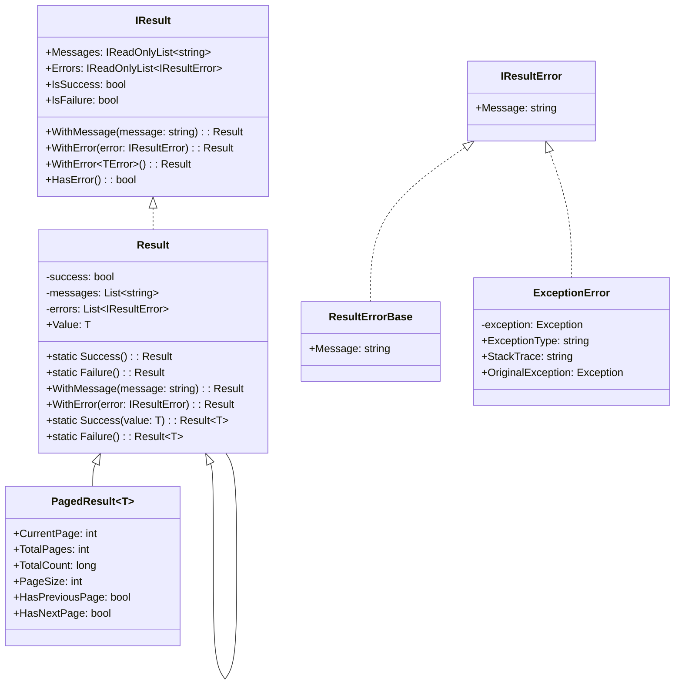

# Results Feature Documentation

<!-- TOC -->

* [Overview](#overview)
  * [Challenges](#challenges)
  * [Solution](#solution)
  * [Architecture](#architecture)
  * [Use Cases](#use-cases)
* [Usage](#usage)
  * [Basic Result Operations](#basic-result-operations)
  * [Result with Values](#result-with-values)
  * [Error Handling](#error-handling)
  * [Working with Messages](#working-with-messages)
  * [Paged Results](#paged-results)
  * [Custom Error Types](#custom-error-types)
  * [Exception Handling](#exception-handling)
  * [Best Practices](#best-practices)
* [Examples](#examples)
  * [Repository Pattern Example](#repository-pattern-example)
  * [Service Layer Example](#service-layer-example)
  * [API Controller Example](#api-controller-example)
  * [Complex Workflow Example](#complex-workflow-example)
* [Appendix A: Repository Extensions](#appendix-a-repository-extensions)

<!-- TOC -->

## Overview

### Challenges

When developing modern applications, handling operation outcomes effectively presents several
challenges:

1. **Inconsistent Error Handling**: Different parts of the application may handle errors in
   different ways, leading to inconsistent error reporting and handling.
2. **Context Loss**: Important error context and details can be lost when exceptions are caught and
   rethrown up the call stack.
3. **Mixed Concerns**: Business logic errors often get mixed with technical exceptions, making it
   harder to handle each appropriately.
4. **Pagination Complexity**: Managing paginated data with associated metadata adds complexity to
   result handling.
5. **Type Safety**: Maintaining type safety while handling both successful and failed operations can
   be challenging.
6. **Error Propagation**: Propagating errors through multiple layers of the application while
   preserving context.

### Solution

The Result pattern implementation provides a comprehensive solution by:

1. Providing a standardized way to handle operation outcomes
2. Encapsulating success/failure status, messages, and errors in a single object
3. Supporting generic result types for operations that return values
4. Offering specialized support for paginated results
5. Enabling strongly-typed error handling
6. Maintaining immutability with a fluent interface design

### Architecture



### Use Cases

The Result pattern is particularly useful in the following scenarios:

1. **Service Layer Operations**

- Handling business rule validations
- Processing complex operations with multiple potential failure points
- Returning domain-specific errors

2. **Data Access Operations**

- Managing database operations
- Handling entity not found scenarios
- Dealing with validation errors

3. **API Endpoints**

- Returning paginated data
- Handling complex operation outcomes
- Providing detailed error information

4. **Complex Workflows**

- Managing multi-step processes
- Handling conditional operations
- Aggregating errors from multiple sources

## Usage

### Basic Result Operations

```csharp
public class ResultDemo
{
    public void BasicOperations()
    {
        // Creating success results
        var success = Result.Success();
        var successWithMessage = Result.Success("Operation completed successfully");

        // Creating failure results
        var failure = Result.Failure();
        var failureWithMessage = Result.Failure("Operation failed");

        // Checking result status
        if (success.IsSuccess)
        {
            // Handle success
        }

        if (failure.IsFailure)
        {
            // Handle failure
        }
    }
}
```

### Result with Values

```csharp
public class UserService
{
    private readonly IUserRepository repository;

    public UserService(IUserRepository repository)
    {
        this.repository = repository;
    }

    public Result<User> GetUserById(int id)
    {
        var user = this.repository.FindById(id);
        if (user == null)
        {
            return Result<User>.Failure()
                .WithError<NotFoundResultError>()
                .WithMessage($"User {id} not found");
        }

        return Result<User>.Success(user);
    }
}
```

### Error Handling

```csharp
public class ValidationError : ResultErrorBase
{
    public ValidationError(string message) : base(message)
    {
    }
}

public class ValidationService
{
    public Result ValidateData(DataModel model)
    {
        var result = Result.Success();

        if (!this.IsValid(model))
        {
            result = Result.Failure()
                .WithError(new ValidationError("Invalid input"))
                .WithMessage("Validation failed");
        }

        // Check for specific errors
        if (result.HasError<ValidationError>())
        {
            // Handle validation error
        }

        if (result.HasError<ValidationError>(out var validationErrors))
        {
            foreach (var error in validationErrors)
            {
                Console.WriteLine(error.Message);
            }
        }

        return result;
    }

    private bool IsValid(DataModel model)
    {
        // Validation logic
        return true;
    }
}
```

### Working with Messages

```csharp
public class WorkflowService
{
    public Result ProcessWorkflow()
    {
        var result = Result.Success()
            .WithMessage("Step 1 completed")
            .WithMessage("Step 2 completed");

        var messages = new[] { "Process started", "Process completed" };
        result = Result.Success()
            .WithMessages(messages);

        foreach (var message in result.Messages)
        {
            Console.WriteLine(message);
        }

        return result;
    }
}
```

### Paged Results

```csharp
public class ProductService
{
    private readonly IProductRepository repository;
    private readonly ILogger<ProductService> logger;

    public ProductService(
        IProductRepository repository,
        ILogger<ProductService> logger)
    {
        this.repository = repository;
        this.logger = logger;
    }

    public async Task<PagedResult<Product>> GetProductsAsync(int page = 1, int pageSize = 10)
    {
        try
        {
            var totalCount = await this.repository.CountAsync();
            var products = await this.repository.GetPageAsync(page, pageSize);

            return PagedResult<Product>.Success(
                products,
                totalCount,
                page,
                pageSize);
        }
        catch (Exception ex)
        {
            this.logger.LogError(ex, "Failed to get products");
            return PagedResult<Product>.Failure()
                .WithError(new ExceptionError(ex));
        }
    }
}
```

### Custom Error Types

```csharp
public class ValidationResultError : ResultErrorBase
{
    public ValidationResultError(string field, string message)
        : base($"Validation failed for {field}: {message}")
    {
    }
}

public class UnauthorizedResultError : ResultErrorBase
{
    public UnauthorizedResultError()
        : base("User is not authorized to perform this action")
    {
    }
}

public class OrderService
{
    private readonly IAuthService authService;
    private readonly IOrderRepository orderRepository;

    public OrderService(
        IAuthService authService,
        IOrderRepository orderRepository)
    {
        this.authService = authService;
        this.orderRepository = orderRepository;
    }

    public Result<Order> CreateOrder(OrderRequest request)
    {
        if (!this.authService.CanCreateOrders())
        {
            return Result<Order>.Failure<UnauthorizedResultError>();
        }

        if (request.Quantity <= 0)
        {
            return Result<Order>.Failure()
                .WithError(new ValidationResultError("Quantity", "Must be greater than zero"));
        }

        var order = this.orderRepository.Create(request);
        return Result<Order>.Success(order, "Order created successfully");
    }
}
```

### Exception Handling

```csharp
public class DataService
{
    private readonly IDataRepository repository;
    private readonly ILogger<DataService> logger;

    public DataService(
        IDataRepository repository,
        ILogger<DataService> logger)
    {
        this.repository = repository;
        this.logger = logger;
    }

    public Result<Data> GetData()
    {
        try
        {
            var data = this.repository.FetchData();
            return Result<Data>.Success(data);
        }
        catch (Exception ex)
        {
            this.logger.LogError(ex, "Failed to fetch data");
            return Result<Data>.Failure()
                .WithError(new ExceptionError(ex))
                .WithMessage("Failed to fetch data");
        }
    }
}
```

### Best Practices

1. **Early Returns**: Return failures as soon as possible to avoid unnecessary processing.

```csharp
public class OrderProcessor
{
    public Result<Order> ProcessOrder(OrderRequest request)
    {
        if (request == null)
        {
            return Result<Order>.Failure("Request cannot be null");
        }

        if (!request.IsValid)
        {
            return Result<Order>.Failure("Invalid request");
        }

        // Continue processing
        return Result<Order>.Success(new Order(request));
    }
}
```

2. **Meaningful Messages**: Include context in error messages.

```csharp
public Result ProcessOrderById(int orderId, string status)
{
    return Result.Failure($"Failed to process order {orderId}: Invalid status {status}");
}
```

3. **Type-Safe Errors**: Use strongly-typed errors for better error handling.

```csharp
public class OrderNotFoundError : ResultErrorBase
{
    public OrderNotFoundError(int orderId)
        : base($"Order {orderId} not found")
    {
    }
}
```

## Examples

### Repository Pattern Example

```csharp
public class UserRepository
{
    private readonly DbContext dbContext;

    public UserRepository(DbContext dbContext)
    {
        this.dbContext = dbContext;
    }

    public Result<User> GetById(int id)
    {
        try
        {
            var user = this.dbContext.Users.FindById(id);
            if (user == null)
            {
                return Result<User>.Failure<NotFoundResultError>();
            }

            return Result<User>.Success(user);
        }
        catch (Exception ex)
        {
            return Result<User>.Failure()
                .WithError(new ExceptionError(ex))
                .WithMessage($"Failed to retrieve user {id}");
        }
    }
}
```

### Service Layer Example

```csharp
public class UserService
{
    private readonly IUserRepository repository;
    private readonly IValidator<User> validator;
    private readonly IMapper mapper;

    public UserService(
        IUserRepository repository,
        IValidator<User> validator,
        IMapper mapper)
    {
        this.repository = repository;
        this.validator = validator;
        this.mapper = mapper;
    }

    public Result<UserDto> UpdateUser(int id, UpdateUserRequest request)
    {
        var getUserResult = this.repository.GetById(id);
        if (getUserResult.IsFailure)
        {
            return Result<UserDto>.Failure()
                .WithErrors(getUserResult.Errors)
                .WithMessages(getUserResult.Messages);
        }

        var user = getUserResult.Value;
        user.Update(request);

        var validationResult = this.validator.Validate(user);
        if (!validationResult.IsValid)
        {
            return Result<UserDto>.Failure()
                .WithError(new ValidationResultError("User", validationResult.Error));
        }

        var savedUser = this.repository.Save(user);
        return Result<UserDto>.Success(this.mapper.ToDto(savedUser));
    }
}
```

### API Controller Example

```csharp
[ApiController]
[Route("api/[controller]")]
public class ProductsController : ControllerBase
{
    private readonly IProductService productService;

    public ProductsController(IProductService productService)
    {
        this.productService = productService;
    }

    [HttpGet]
    public async Task<IActionResult> GetProducts([FromQuery] int page = 1, [FromQuery] int pageSize = 10)
    {
        var result = await this.productService.GetProductsAsync(page, pageSize);

        if (result.IsFailure)
        {
            return this.BadRequest(new
            {
                Errors = result.Errors.Select(e => e.Message),
                Messages = result.Messages
            });
        }

        return this.Ok(new
        {
            Data = result.Value,
            Pagination = new
            {
                result.CurrentPage,
                result.TotalPages,
                result.TotalCount,
                result.HasNextPage,
                result.HasPreviousPage
            }
        });
    }
}
```

### Complex Workflow Example

```csharp
public class OrderProcessor
{
    private readonly IOrderRepository orderRepository;
    private readonly IInventoryService inventoryService;
    private readonly IPaymentService paymentService;
    private readonly INotificationService notificationService;
    private readonly IValidator<OrderRequest> validator;
    private readonly ILogger<OrderProcessor> logger;

    public OrderProcessor(
        IOrderRepository orderRepository,
        IInventoryService inventoryService,
        IPaymentService paymentService,
        INotificationService notificationService,
        IValidator<OrderRequest> validator,
        ILogger<OrderProcessor> logger)
    {
        this.orderRepository = orderRepository;
        this.inventoryService = inventoryService;
        this.paymentService = paymentService;
        this.notificationService = notificationService;
        this.validator = validator;
        this.logger = logger;
    }

    public async Task<Result<Order>> ProcessOrderAsync(OrderRequest request)
    {
        // Validate request
        var validationResult = await this.ValidateOrderRequestAsync(request);
        if (validationResult.IsFailure)
        {
            return Result<Order>.Failure()
                .WithErrors(validationResult.Errors)
                .WithMessage("Order validation failed");
        }

        // Reserve inventory
        var inventoryResult = await this.ReserveInventoryAsync(request.Items);
        if (inventoryResult.IsFailure)
        {
            return Result<Order>.Failure()
                .WithErrors(inventoryResult.Errors)
                .WithMessage("Inventory reservation failed");
        }

        try
        {
            // Process payment
            var paymentResult = await this.ProcessPaymentAsync(request.Payment);
            if (paymentResult.IsFailure)
            {
                // Rollback inventory reservation
                await this.ReleaseInventoryAsync(request.Items);
                return Result<Order>.Failure()
                    .WithErrors(paymentResult.Errors)
                    .WithMessage("Payment processing failed");
            }

            // Create order
            var order = await this.CreateOrderAsync(request, paymentResult.Value);
            if (order.IsFailure)
            {
                // Rollback payment and inventory
                await this.ReversePaymentAsync(paymentResult.Value);
                await this.ReleaseInventoryAsync(request.Items);
                return Result<Order>.Failure()
                    .WithErrors(order.Errors)
                    .WithMessage("Order creation failed");
            }

            // Send notifications
            await this.notificationService.SendOrderConfirmationAsync(order.Value);

            return Result<Order>.Success(order.Value)
                .WithMessage("Order processed successfully");
        }
        catch (Exception ex)
        {
            this.logger.LogError(ex, "Unexpected error during order processing");
            return Result<Order>.Failure()
                .WithError(new ExceptionError(ex))
                .WithMessage("An unexpected error occurred while processing the order");
        }
    }

    private async Task<Result> ValidateOrderRequestAsync(OrderRequest request)
    {
        try
        {
            var validationResult = await this.validator.ValidateAsync(request);
            if (!validationResult.IsValid)
            {
                return Result.Failure()
                    .WithError(new ValidationResultError("Order", validationResult.Message));
            }

            return Result.Success();
        }
        catch (Exception ex)
        {
            this.logger.LogError(ex, "Validation error");
            return Result.Failure()
                .WithError(new ExceptionError(ex));
        }
    }

    private async Task<Result<InventoryReservation>> ReserveInventoryAsync(IEnumerable<OrderItem> items)
    {
        try
        {
            return await this.inventoryService.ReserveItemsAsync(items);
        }
        catch (Exception ex)
        {
            this.logger.LogError(ex, "Inventory reservation error");
            return Result<InventoryReservation>.Failure()
                .WithError(new ExceptionError(ex));
        }
    }

    private async Task<Result<PaymentTransaction>> ProcessPaymentAsync(PaymentDetails payment)
    {
        try
        {
            var transaction = await this.paymentService.ProcessAsync(payment);
            if (transaction.IsFailure)
            {
                this.logger.LogWarning("Payment failed: {Message}", transaction.Messages.FirstOrDefault());
            }

            return transaction;
        }
        catch (Exception ex)
        {
            this.logger.LogError(ex, "Payment processing error");
            return Result<PaymentTransaction>.Failure()
                .WithError(new ExceptionError(ex));
        }
    }

    private async Task<Result<Order>> CreateOrderAsync(OrderRequest request, PaymentTransaction transaction)
    {
        try
        {
            var order = new Order(request, transaction);
            return await this.orderRepository.InsertResultAsync(order);
        }
        catch (Exception ex)
        {
            this.logger.LogError(ex, "Order creation error");
            return Result<Order>.Failure()
                .WithError(new ExceptionError(ex));
        }
    }

    private async Task ReleaseInventoryAsync(IEnumerable<OrderItem> items)
    {
        try
        {
            await this.inventoryService.ReleaseReservationAsync(items);
        }
        catch (Exception ex)
        {
            this.logger.LogError(ex, "Error releasing inventory");
        }
    }

    private async Task ReversePaymentAsync(PaymentTransaction transaction)
    {
        try
        {
            await this.paymentService.ReverseTransactionAsync(transaction);
        }
        catch (Exception ex)
        {
            this.logger.LogError(ex, "Error reversing payment");
        }
    }
}
```

This example demonstrates:

1. **Proper Error Handling**

- Each operation returns a `Result` or `Result<T>`
- Errors are properly propagated and transformed
- Rollback operations are performed when needed

2. **Clean Code Practices**

- Follows the .editorconfig standards
- Proper use of dependency injection
- Clear separation of concerns
- Consistent error handling

3. **Workflow Management**

- Sequential processing with proper validation
- Rollback mechanisms for failed operations
- Proper logging at each step

4. **Result Pattern Usage**

- Consistent use of Result objects
- Proper error aggregation
- Clear success/failure paths

5. **Resource Management**

- Proper cleanup in case of failures
- Structured error handling
- Comprehensive logging

# Appendix A: Repository Extensions

> The DevKit provides extension methods for repositories that don't natively support the Result
> pattern. These extensions wrap standard repository operations in Result objects, providing
> consistent error handling and operation results across your application.

### Available Extensions

1. Read-Only Repository Extensions (`GenericReadOnlyRepositoryResultExtensions`):

- Count operations
- Find operations
- Paged query operations

2. Repository Extensions (`GenericRepositoryResultExtensions`):

- Insert operations
- Update operations
- Upsert operations
- Delete operations

## Usage Examples

### Basic CRUD Operations

```csharp
public class UserService
{
    private readonly IGenericRepository<User> _repository;

    // Insert with Result
    public async Task<Result<User>> CreateUserAsync(User user)
    {
        return await _repository.InsertResultAsync(user);
    }

    // Update with Result
    public async Task<Result<User>> UpdateUserAsync(User user)
    {
        return await _repository.UpdateResultAsync(user);
    }

    // Delete with Result
    public async Task<Result<RepositoryActionResult>> DeleteUserAsync(int id)
    {
        return await _repository.DeleteByIdResultAsync(id);
    }
}
```

### Query Operations

```csharp
public class ProductService
{
    private readonly IGenericReadOnlyRepository<Product> _repository;

    // Count with Result
    public async Task<Result<long>> GetProductCountAsync()
    {
        return await _repository.CountResultAsync();
    }

    // Find One with Result
    public async Task<Result<Product>> GetProductByIdAsync(int id)
    {
        return await _repository.FindOneResultAsync(id);
    }

    // Find All Paged with Result
    public async Task<PagedResult<Product>> GetProductsPagedAsync(
        int page = 1,
        int pageSize = 10)
    {
        return await _repository.FindAllPagedResultAsync(
            ordering: "Name ascending",
            page: page,
            pageSize: pageSize);
    }
}
```

### Advanced Queries

```csharp
public class OrderService
{
    private readonly IGenericReadOnlyRepository<Order> _repository;

    // Complex query with specifications
    public async Task<PagedResult<Order>> GetOrdersAsync(
        FilterModel filterModel,
        IEnumerable<ISpecification<Order>> additionalSpecs = null)
    {
        return await _repository.FindAllPagedResultAsync(
            filterModel,
            additionalSpecs);
    }

    // Query with includes
    public async Task<Result<Order>> GetOrderWithDetailsAsync(int id)
    {
        return await _repository.FindOneResultAsync(
            id,
            options: new FindOptions<Order>
            {
                Include = new IncludeOption<Order>(o => o.OrderItems)
            });
    }
}
```

### Error Handling

The extensions automatically handle exceptions and wrap them in Result objects:

```csharp
public class InventoryService
{
    private readonly IGenericRepository<Inventory> _repository;

    public async Task<Result<Inventory>> UpdateInventoryAsync(Inventory inventory)
    {
        var result = await _repository.UpdateResultAsync(inventory);

        if (result.IsFailure)
        {
            // Check for specific errors
            if (result.HasError<ExceptionError>())
            {
                // Handle database exception
                _logger.LogError(result.Errors.First().Message);
            }
        }

        return result;
    }
}
```

## Best Practices

1. **Consistent Usage**: Use these extensions throughout the application for consistent error
   handling:

```csharp
// Instead of:
try {
    var product = await _repository.FindOneAsync(id);
    return product;
}
catch (Exception ex) {
    // Handle error
}

// Use:
var result = await _repository.FindOneResultAsync(id);
return result;
```

2. **Combining Operations**: Chain repository operations while maintaining error handling:

```csharp
public async Task<Result<Order>> ProcessOrderAsync(Order order)
{
    // Check inventory
    var inventoryResult = await _inventoryRepository
        .FindOneResultAsync(order.ProductId);

    if (inventoryResult.IsFailure)
        return Result<Order>.Failure()
            .WithErrors(inventoryResult.Errors);

    // Insert order
    var orderResult = await _orderRepository
        .InsertResultAsync(order);

    return orderResult;
}
```

3. **Paged Queries with Specifications**:

```csharp
public async Task<PagedResult<Product>> SearchProductsAsync(
    string searchTerm,
    int page = 1,
    int pageSize = 10)
{
    var specification = new Specification<Product>(p => p.Name.Contains(searchTerm));

    return await _repository.FindAllPagedResultAsync(specification);
}
```

4. **Filtering with model**:

```csharp
public async Task<PagedResult<Order>> GetOrdersAsync(FilterModel filterModel)
{
    var specifications = new List<ISpecification<Order>>
    {
        new Specification<Order>(o => o.Status == OrderStatus.Active)
    };

    return await _repository.FindAllPagedResultAsync(filterModel, specifications);
}
```

These extensions provide a seamless way to integrate the Result pattern with existing repository
implementations, ensuring consistent error handling and operation results across your application.