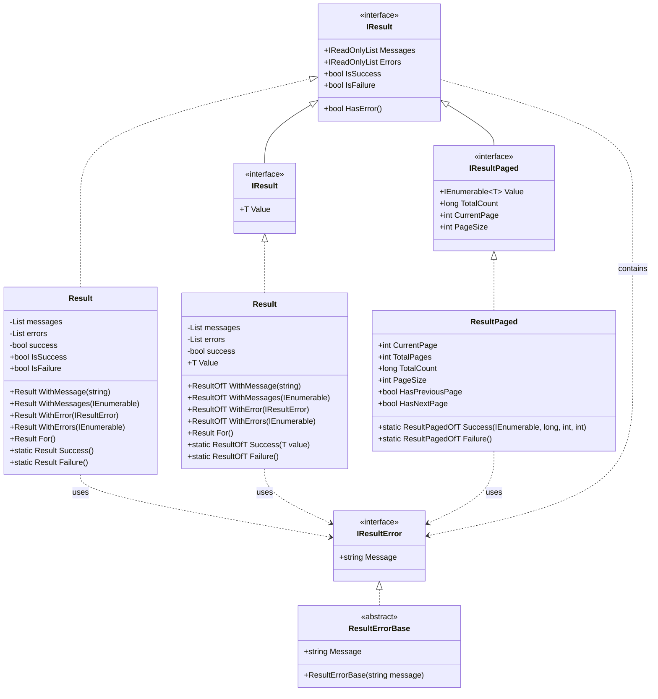
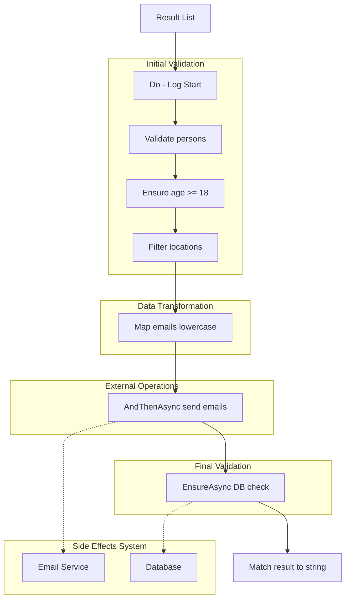

# Results

> Represent success, failure, messages, and errors explicitly with immutable Result types.

[TOC]

## Overview

## Challenges

Application operations need one contract for expected success and failure outcomes:

1. Different layers can otherwise report and classify errors in different ways.
2. Catching and rethrowing exceptions can lose useful context.
3. Expected business failures need a different path from unexpected technical exceptions.
4. Paged data needs values and pagination metadata in the same outcome.
5. Composed operations must preserve typed errors when an earlier step fails.

## Solution

The Results feature provides readonly result structs and composition extensions:

1. `Result` represents an outcome without a value.
2. `Result<T>` adds a typed value.
3. `ResultPaged<T>` adds values and pagination metadata.
4. `IResultError` provides a common contract for typed errors.
5. Fluent methods return a new result with added messages or errors.

## Key Features

- Readonly `Result`, `Result<T>`, and `ResultPaged<T>` structs
- Typed errors through `IResultError` and `ResultErrorBase`
- Message and error aggregation
- Synchronous and asynchronous composition extensions
- Conditional factories, merging, validation, and collection operations
- Scoped operations with commit and rollback callbacks
- ASP.NET Core typed-result mappings
- `System.Text.Json` converters
- `Either<T1, T2>` for two valid alternative value types

## Architecture

> A type-safe Result pattern implementation for explicit success and failure handling with
> functional extensions.

The feature has three independent readonly structs. `Result` tracks success, messages, and errors.
`Result<T>` also carries one typed value. `ResultPaged<T>` carries a sequence and its pagination
metadata. The structs implement `IResult`, `IResult<T>`, or `IResultPaged<T>` as applicable.
`IResultError` supports custom error types across all three result forms.

The package includes functional extensions such as `Map` and `Bind` for transformations, `Tap` for
side effects, and `Filter` and `Unless` for conditions.
See [Appendix B: Functional Extensions](#appendix-b-functional-extensions) for an overview
of the available functional operations.


```mermaid
classDiagram
    class IResultError {
        <<interface>>
        +string Message
    }

    class ResultErrorBase {
        <<abstract>>
        +string Message
        +ResultErrorBase(string message)
    }

    class IResult {
        <<interface>>
        +IReadOnlyList Messages
        +IReadOnlyList Errors
        +bool IsSuccess
        +bool IsFailure
        +bool HasError()
    }

    class IResultOfT["IResult<T>"] {
        <<interface>>
        +T Value
    }

    class IResultPagedOfT["IResultPaged<T>"] {
        <<interface>>
        +IEnumerable~T~ Value
        +long TotalCount
        +int CurrentPage
        +int PageSize
    }

    class Result {
        -List messages
        -List errors
        -bool success
        +bool IsSuccess
        +bool IsFailure
        +Result WithMessage(string)
        +Result WithMessages(IEnumerable)
        +Result WithError(IResultError)
        +Result WithErrors(IEnumerable)
        +Result For()
        +static Result Success()
        +static Result Failure()
    }

    class ResultOfT["Result<T>"] {
        -List messages
        -List errors
        -bool success
        +T Value
        +ResultOfT WithMessage(string)
        +ResultOfT WithMessages(IEnumerable)
        +ResultOfT WithError(IResultError)
        +ResultOfT WithErrors(IEnumerable)
        +Result For()
        +static ResultOfT Success(T value)
        +static ResultOfT Failure()
    }

    class ResultPagedOfT["ResultPaged<T>"] {
        +int CurrentPage
        +int TotalPages
        +long TotalCount
        +int PageSize
        +bool HasPreviousPage
        +bool HasNextPage
        +static ResultPagedOfT Success(IEnumerable, long, int, int)
        +static ResultPagedOfT Failure()
    }

    IResultError <|.. ResultErrorBase
    IResult <|-- IResultOfT
    IResult <|-- IResultPagedOfT
    IResult <|.. Result
    IResultOfT <|.. ResultOfT
    IResultPagedOfT <|.. ResultPagedOfT
    Result ..> IResultError : uses
    ResultOfT ..> IResultError : uses
    ResultPagedOfT ..> IResultError : uses
    IResult ..> IResultError : contains
```

## Use Cases

Use results in these scenarios:

### Service layer operations

- Handling business rule validations
- Processing complex operations with multiple potential failure points
- Returning domain-specific errors

### Data access operations

- Managing database operations
- Handling entity not found scenarios
- Dealing with validation errors

### API endpoints

- Returning paginated data
- Handling complex operation outcomes
- Providing detailed error information

### Complex workflows

- Managing multi-step processes
- Handling conditional operations
- Aggregating errors from multiple sources

## Basic Usage

This example validates a title, checks the failure path, and prints the successful value:

```csharp
static Result<string> NormalizeTitle(string title)
{
	if (string.IsNullOrWhiteSpace(title))
	{
		return Result<string>.Failure(
			new ValidationError("A title is required.", nameof(title)));
	}

	return Result<string>.Success(title.Trim());
}

var result = NormalizeTitle("  Release notes  ");

if (result.IsFailure)
{
	Console.Error.WriteLine(
		string.Join(Environment.NewLine, result.Errors.Select(error => error.Message)));
	return;
}

Console.WriteLine(result.Value);
```

Output:

```text
Release notes
```

### Result operations

```csharp
// Creating success results
var success = Result.Success();
var successWithMessage = Result.Success("Operation completed successfully");

// Creating failure results
var failure = Result.Failure("Operation failed")
  .WithError<ValidationError>();

// Checking result status
if (success.IsSuccess)
{
    // Handle success
}

if (failure.IsFailure)
{
    // Handle failure
}

// Error handling
if (failure.HasError<ValidationError>())
{
    // Handle specific error type
}

// Paged result
var resultPaged = ResultPaged<Item>.Success(
    items, count: 100, page: 1, pageSize: 10
);
```

### Results with values

```csharp
public class UserService
{
    private readonly IUserRepository repository;

    public UserService(IUserRepository repository)
    {
        this.repository = repository;
    }

    public Result<User> GetUserById(int id)
    {
        var user = this.repository.FindById(id);
        if (user == null)
        {
            return Result<User>.Failure()
                .WithError<NotFoundError>()
                .WithMessage($"User {id} not found");
        }

        return Result<User>.Success(user);
    }
}
```

### Imperative and declarative styles

Imperative programming expresses logic as a sequence of explicit steps and checks. Declarative programming describes the desired outcome.
In the Result pattern, imperative style requires explicit success checks and error handling, while declarative style creates a clean pipeline of operations using the functional extensions.

```csharp
// IMPERATIVE STYLE (traditional)
public Result<UserDto> ProcessRegistration(UserRequest request)
{
    var validationResult = ValidateUser(request);     // Validate user
    if (validationResult.IsFailure)
        return Result<UserDto>.Failure(validationResult);


    var user = new User(request);     // Create user
    var saveResult = SaveUser(user);
    if (saveResult.IsFailure)
        return Result<UserDto>.Failure(saveResult);

    var emailResult = SendWelcomeEmail(user);     // Send email
    if (emailResult.IsFailure)
        return Result<UserDto>.Failure(emailResult);

    return Result<UserDto>.Success(user.ToDto());
}

// DECLARATIVE STYLE (with functional extensions)
public Result<UserDto> ProcessRegistration(UserRequest request) =>
    Result<UserRequest>.Success(request)
        .Bind(ValidateUser)
        .Map(req => new User(req))
        .Bind(SaveUser)
        .Tap(SendWelcomeEmail)
        .Map(user => user.ToDto());
```

### Error handling

```csharp
public class ValidationError : ResultErrorBase
{
    public ValidationError(string message) : base(message)
    {
    }
}

public class ValidationService
{
    public Result ValidateData(DataModel model)
    {
        var result = Result.Success();

        if (!this.IsValid(model))
        {
            result = Result.Failure()
                .WithError(new ValidationError("Invalid input"))
                .WithMessage("Validation failed");
        }

        // Check for specific errors
        if (result.HasError<ValidationError>())
        {
            // Handle validation error
        }

        if (result.HasError<ValidationError>(out var validationErrors))
        {
            foreach (var error in validationErrors)
            {
                Console.WriteLine(error.Message);
            }
        }

        return result;
    }

    private bool IsValid(DataModel model)
    {
        // Validation logic
        return true;
    }
}
```

### Working with messages

```csharp
public class WorkflowService
{
    public Result ProcessWorkflow()
    {
        var result = Result.Success()
            .WithMessage("Step 1 completed")
            .WithMessage("Step 2 completed");

        var messages = new[] { "Process started", "Process completed" };
        result = Result.Success()
            .WithMessages(messages);

        foreach (var message in result.Messages)
        {
            Console.WriteLine(message);
        }

        return result;
    }
}
```

### Paged results

```csharp
public class ProductService
{
    private readonly IProductRepository repository;
    private readonly ILogger<ProductService> logger;

    public ProductService(
        IProductRepository repository,
        ILogger<ProductService> logger)
    {
        this.repository = repository;
        this.logger = logger;
    }

    public async Task<ResultPaged<Product>> GetProductsAsync(int page = 1, int pageSize = 10)
    {
        try
        {
            var totalCount = await this.repository.CountAsync();
            var products = await this.repository.GetPageAsync(page, pageSize);

            return ResultPaged<Product>.Success(
                products,
                totalCount,
                page,
                pageSize);
        }
        catch (Exception ex)
        {
            this.logger.LogError(ex, "Failed to get products");
            return ResultPaged<Product>.Failure()
                .WithError(new ExceptionError(ex));
        }
    }
}
```

### Custom error types

```csharp
public class ValidationResultError : ResultErrorBase
{
    public ValidationResultError(string field, string message)
        : base($"Validation failed for {field}: {message}")
    {
    }
}

public class UnauthorizedResultError : ResultErrorBase
{
    public UnauthorizedResultError()
        : base("User is not authorized to perform this action")
    {
    }
}

public class OrderService
{
    private readonly IAuthService authService;
    private readonly IOrderRepository orderRepository;

    public OrderService(
        IAuthService authService,
        IOrderRepository orderRepository)
    {
        this.authService = authService;
        this.orderRepository = orderRepository;
    }

    public Result<Order> CreateOrder(OrderRequest request)
    {
        if (!this.authService.CanCreateOrders())
        {
            return Result<Order>.Failure<UnauthorizedResultError>();
        }

        if (request.Quantity <= 0)
        {
            return Result<Order>.Failure()
                .WithError(new ValidationResultError("Quantity", "Must be greater than zero"));
        }

        var order = this.orderRepository.Create(request);
        return Result<Order>.Success(order, "Order created successfully");
    }
}
```

### Exception handling

```csharp
public class DataService
{
    private readonly IDataRepository repository;
    private readonly ILogger<DataService> logger;

    public DataService(
        IDataRepository repository,
        ILogger<DataService> logger)
    {
        this.repository = repository;
        this.logger = logger;
    }

    public Result<Data> GetData()
    {
        try
        {
            var data = this.repository.FetchData();
            return Result<Data>.Success(data);
        }
        catch (Exception ex)
        {
            this.logger.LogError(ex, "Failed to fetch data");
            return Result<Data>.Failure()
                .WithError(new ExceptionError(ex))
                .WithMessage("Failed to fetch data");
        }
    }
}
```

### Best practices

### Early returns

Return failures as soon as possible to avoid unnecessary processing.

```csharp
public class OrderProcessor
{
    public Result<Order> ProcessOrder(OrderRequest request)
    {
        if (request == null)
        {
            return Result<Order>.Failure("Request cannot be null");
        }

        if (!request.IsValid)
        {
            return Result<Order>.Failure("Invalid request");
        }

        // Continue processing
        return Result<Order>.Success(new Order(request));
    }
}
```

### Meaningful messages

Include context in error messages.

```csharp
public Result ProcessOrderById(int orderId, string status)
{
    return Result.Failure($"Failed to process order {orderId}: Invalid status {status}");
}
```

### Type-safe errors

Use strongly typed errors for better error handling.

```csharp
public class OrderNotFoundError : ResultErrorBase
{
    public OrderNotFoundError(int orderId)
        : base($"Order {orderId} not found")
    {
    }
}
```

## Examples

### Repository pattern example

```csharp
public class UserRepository
{
    private readonly DbContext dbContext;

    public UserRepository(DbContext dbContext)
    {
        this.dbContext = dbContext;
    }

    public Result<User> GetById(int id)
    {
        try
        {
            var user = this.dbContext.Users.Find(id);
            if (user == null)
            {
                return Result<User>.Failure<NotFoundError>();
            }

            return Result<User>.Success(user);
        }
        catch (Exception ex)
        {
            return Result<User>.Failure()
                .WithError(new ExceptionError(ex))
                .WithMessage($"Failed to retrieve user {id}");
        }
    }
}
```

### Service layer example

```csharp
public class UserService
{
    private readonly IUserRepository repository;
    private readonly IValidator<User> validator;
    private readonly IMapper mapper;

    public UserService(
        IUserRepository repository,
        IValidator<User> validator,
        IMapper mapper)
    {
        this.repository = repository;
        this.validator = validator;
        this.mapper = mapper;
    }

    public Result<UserDto> UpdateUser(int id, UpdateUserRequest request)
    {
        var getUserResult = this.repository.GetById(id);
        if (getUserResult.IsFailure)
        {
            return Result<UserDto>.Failure()
                .WithErrors(getUserResult.Errors)
                .WithMessages(getUserResult.Messages);
        }

        var user = getUserResult.Value;
        user.Update(request);

        var validationResult = this.validator.Validate(user);
        if (!validationResult.IsValid)
        {
            return Result<UserDto>.Failure()
                .WithError(new ValidationResultError(
                    "User",
                    string.Join(", ", validationResult.Errors.Select(error => error.ErrorMessage))));
        }

        var savedUser = this.repository.Save(user);
        return Result<UserDto>.Success(this.mapper.ToDto(savedUser));
    }
}
```

### API controller example

```csharp
[ApiController]
[Route("api/[controller]")]
public class ProductsController : ControllerBase
{
    private readonly IProductService productService;

    public ProductsController(IProductService productService)
    {
        this.productService = productService;
    }

    [HttpGet]
    public async Task<IActionResult> GetProducts([FromQuery] int page = 1, [FromQuery] int pageSize = 10)
    {
        var result = await this.productService.GetProductsAsync(page, pageSize);

        if (result.IsFailure)
        {
            return this.BadRequest(new
            {
                Errors = result.Errors.Select(e => e.Message),
                Messages = result.Messages
            });
        }

        return this.Ok(new
        {
            Data = result.Value,
            Pagination = new
            {
                result.CurrentPage,
                result.TotalPages,
                result.TotalCount,
                result.HasNextPage,
                result.HasPreviousPage
            }
        });
    }
}
```

### Complex workflow example

```csharp
public class OrderProcessor
{
    private readonly IOrderRepository orderRepository;
    private readonly IInventoryService inventoryService;
    private readonly IPaymentService paymentService;
    private readonly INotificationService notificationService;
    private readonly IValidator<OrderRequest> validator;
    private readonly ILogger<OrderProcessor> logger;

    public OrderProcessor(
        IOrderRepository orderRepository,
        IInventoryService inventoryService,
        IPaymentService paymentService,
        INotificationService notificationService,
        IValidator<OrderRequest> validator,
        ILogger<OrderProcessor> logger)
    {
        this.orderRepository = orderRepository;
        this.inventoryService = inventoryService;
        this.paymentService = paymentService;
        this.notificationService = notificationService;
        this.validator = validator;
        this.logger = logger;
    }

    public async Task<Result<Order>> ProcessOrderAsync(OrderRequest request)
    {
        // Validate request
        var validationResult = await this.ValidateOrderRequestAsync(request);
        if (validationResult.IsFailure)
        {
            return Result<Order>.Failure()
                .WithErrors(validationResult.Errors)
                .WithMessage("Order validation failed");
        }

        // Reserve inventory
        var inventoryResult = await this.ReserveInventoryAsync(request.Items);
        if (inventoryResult.IsFailure)
        {
            return Result<Order>.Failure()
                .WithErrors(inventoryResult.Errors)
                .WithMessage("Inventory reservation failed");
        }

        try
        {
            // Process payment
            var paymentResult = await this.ProcessPaymentAsync(request.Payment);
            if (paymentResult.IsFailure)
            {
                // Rollback inventory reservation
                await this.ReleaseInventoryAsync(request.Items);
                return Result<Order>.Failure()
                    .WithErrors(paymentResult.Errors)
                    .WithMessage("Payment processing failed");
            }

            // Create order
            var order = await this.CreateOrderAsync(request, paymentResult.Value);
            if (order.IsFailure)
            {
                // Rollback payment and inventory
                await this.ReversePaymentAsync(paymentResult.Value);
                await this.ReleaseInventoryAsync(request.Items);
                return Result<Order>.Failure()
                    .WithErrors(order.Errors)
                    .WithMessage("Order creation failed");
            }

            // Send notifications
            await this.notificationService.SendOrderConfirmationAsync(order.Value);

            return Result<Order>.Success(order.Value)
                .WithMessage("Order processed successfully");
        }
        catch (Exception ex)
        {
            this.logger.LogError(ex, "Unexpected error during order processing");
            return Result<Order>.Failure()
                .WithError(new ExceptionError(ex))
                .WithMessage("An unexpected error occurred while processing the order");
        }
    }

    private async Task<Result> ValidateOrderRequestAsync(OrderRequest request)
    {
        try
        {
            var validationResult = await this.validator.ValidateAsync(request);
            if (!validationResult.IsValid)
            {
                return Result.Failure()
                    .WithError(new ValidationResultError("Order", validationResult.Message));
            }

            return Result.Success();
        }
        catch (Exception ex)
        {
            this.logger.LogError(ex, "Validation error");
            return Result.Failure()
                .WithError(new ExceptionError(ex));
        }
    }

    private async Task<Result<InventoryReservation>> ReserveInventoryAsync(IEnumerable<OrderItem> items)
    {
        try
        {
            return await this.inventoryService.ReserveItemsAsync(items);
        }
        catch (Exception ex)
        {
            this.logger.LogError(ex, "Inventory reservation error");
            return Result<InventoryReservation>.Failure()
                .WithError(new ExceptionError(ex));
        }
    }

    private async Task<Result<PaymentTransaction>> ProcessPaymentAsync(PaymentDetails payment)
    {
        try
        {
            var transaction = await this.paymentService.ProcessAsync(payment);
            if (transaction.IsFailure)
            {
                this.logger.LogWarning("Payment failed: {Message}", transaction.Messages.FirstOrDefault());
            }

            return transaction;
        }
        catch (Exception ex)
        {
            this.logger.LogError(ex, "Payment processing error");
            return Result<PaymentTransaction>.Failure()
                .WithError(new ExceptionError(ex));
        }
    }

    private async Task<Result<Order>> CreateOrderAsync(OrderRequest request, PaymentTransaction transaction)
    {
        try
        {
            var order = new Order(request, transaction);
            return await this.orderRepository.InsertResultAsync(order);
        }
        catch (Exception ex)
        {
            this.logger.LogError(ex, "Order creation error");
            return Result<Order>.Failure()
                .WithError(new ExceptionError(ex));
        }
    }

    private async Task ReleaseInventoryAsync(IEnumerable<OrderItem> items)
    {
        try
        {
            await this.inventoryService.ReleaseReservationAsync(items);
        }
        catch (Exception ex)
        {
            this.logger.LogError(ex, "Error releasing inventory");
        }
    }

    private async Task ReversePaymentAsync(PaymentTransaction transaction)
    {
        try
        {
            await this.paymentService.ReverseTransactionAsync(transaction);
        }
        catch (Exception ex)
        {
            this.logger.LogError(ex, "Error reversing payment");
        }
    }
}
```

This example demonstrates:

1. **Proper error handling**

   - Each operation returns a `Result` or `Result<T>`
   - Errors are properly propagated and transformed
   - Rollback operations are performed when needed

2. **Clean code practices**

   - Follows the .editorconfig standards
   - Proper use of dependency injection
   - Clear separation of concerns
   - Consistent error handling

3. **Workflow management**

   - Sequential processing with proper validation
   - Rollback mechanisms for failed operations
   - Proper logging at each step

4. **Result pattern usage**

   - Consistent use of Result objects
   - Proper error aggregation
   - Clear success/failure paths

5. **Resource management**

   - Proper cleanup in case of failures
   - Structured error handling
   - Structured logging

## Result operation scope

### Overview

`ResultOperationScope<T, TOperation>` is a **generic scoped operation pattern** that provides a fluent API for wrapping Result chains within any operation requiring scoped resource management. While commonly demonstrated with database transactions, this pattern is applicable to **any operation that requires**:

- **Lazy Start**: Operation begins only when needed
- **Automatic Cleanup**: Resources are properly released
- **All-or-Nothing Semantics**: Either complete successfully or rollback/cleanup
- **Railway-Oriented Programming**: Clean error handling with short-circuiting

It implements the Railway-Oriented Programming pattern with automatic resource management, ensuring that all operations within the scope are either committed on success or rolled back on failure.

### Key features

- **Lazy Operation Start**: Operation is only started when the first async operation is executed
- **Automatic Commit/Rollback**: Operation is automatically committed on success or rolled back on failure/exception
- **Fluent API**: Chaining of operations with async/await support
- **Railway-Oriented Programming**: Short-circuits on failure, continuing only on success path
- **Clean Architecture**: Abstract interface pattern allows any scoped operation implementation
- **Generic Pattern**: Works with transactions, locks, file operations, API sessions, sagas, and more

### Basic usage

#### Simple transaction example

```csharp
var result = await Result<User>.Success(user)
    // Start transaction scope (lazy - not started yet)
    .StartOperation(async ct => await transaction.BeginAsync(ct))
    // Set properties (sync operation - transaction still not started)
    .Tap(u => u.UpdatedAt = DateTime.UtcNow)
    // First async operation - TRANSACTION STARTS HERE
    .TapAsync(async (u, ct) =>
        await auditService.LogUpdateAsync(u.Id, ct), cancellationToken)
    // Validate business rules
    .EnsureAsync(async (u, ct) =>
        await permissionService.CanUpdateAsync(u),
        new UnauthorizedError(),
        cancellationToken)
    // Update in database (within transaction)
    .BindAsync(async (u, ct) =>
        await repository.UpdateResultAsync(u, ct), cancellationToken)
    // End transaction (commit on success, rollback on failure)
    .EndOperationAsync(cancellationToken);
```

#### Complex example: TodoItem creation with transaction in command

```csharp
protected override async Task<Result<TodoItemModel>> HandleAsync(
    TodoItemCreateCommand request,
    SendOptions options,
    CancellationToken cancellationToken) =>
    await Result<TodoItem>.Success(mapper.Map<TodoItemModel, TodoItem>(request.Model))
        // Start transaction scope using repository transaction
        .StartOperation(async ct => await transaction.BeginAsync(ct))
        // Set current user (sync)
        .Tap(e => e.UserId = currentUserAccessor.UserId)
        // Generate sequence number (first async - transaction starts here)
        .TapAsync(async (e, ct) =>
        {
            var seqResult = await numberGenerator.GetNextAsync("TodoItemSequence", "core", ct);
            e.Number = seqResult.IsSuccess ? (int)seqResult.Value : 0;
        }, cancellationToken)
        // Check business rules
        .UnlessAsync(async (e, ct) => await Rule
            .Add(RuleSet.IsNotEmpty(e.Title))
            .Add(RuleSet.NotEqual(e.Title, "todo"))
            .Add(new TitleShouldBeUniqueRule(e.Title, repository))
            .CheckAsync(ct), cancellationToken)
        // Register domain event
        .Tap(e => e.DomainEvents.Register(new TodoItemCreatedDomainEvent(e)))
        // Insert into database (within transaction)
        .BindAsync(async (e, ct) =>
            await repository.InsertResultAsync(e, ct), cancellationToken)
        // Set permissions
        .Tap(e =>
            new EntityPermissionProviderBuilder(permissionProvider)
                .ForUser(e.UserId)
                    .WithPermission<TodoItem>(e.Id, Permission.Read)
                    .WithPermission<TodoItem>(e.Id, Permission.Write)
                    .WithPermission<TodoItem>(e.Id, Permission.Delete)
                .Build())
        // Audit logging
        .Tap(e => Console.WriteLine("AUDIT"))
        // End transaction (commit on success, rollback on failure)
        .EndOperationAsync(cancellationToken)
        // Map entity back to model
        .Map(mapper.Map<TodoItem, TodoItemModel>);
```

### API reference

#### Starting an operation scope

```csharp
// With async operation factory
public static ResultOperationScope<T, TOperation> StartOperation<T, TOperation>(
    this Result<T> result,
    Func<CancellationToken, Task<TOperation>> startAsync)
    where TOperation : class

// With synchronously created operation
public static ResultOperationScope<T, TOperation> StartOperation<T, TOperation>(
    this Result<T> result,
    TOperation operation)
    where TOperation : class
```

#### Available operations

All standard Result operations are available within the scope:

- **Tap / TapAsync**: Execute side effects
- **Map / MapAsync**: Transform the value
- **Bind / BindAsync**: Chain Result-returning operations
- **Ensure / EnsureAsync**: Validate conditions (fails if predicate returns false)
- **UnlessAsync**: Validate conditions (fails if predicate returns true or if Rule validation fails)

#### Ending an operation scope

##### Simplified API (recommended for IOperationScope implementations)

```csharp
public async Task<Result<T>> EndOperationAsync(
    CancellationToken cancellationToken = default)
    where TOperation : IOperationScope
```

Use this overload when your operation implements `IOperationScope`. It automatically calls `CommitAsync()` on success or `RollbackAsync()` on failure/exception.

**Example:**

```csharp
var result = await Result<User>.Success(user)
    .StartOperation(async ct => await transaction.BeginAsync(ct))
    .BindAsync(async (u, ct) => await repository.UpdateResultAsync(u, ct), cancellationToken)
    .EndOperationAsync(cancellationToken); // Clean and simple!
```

##### Delegate-based API (for custom operations or legacy code)

```csharp
public async Task<Result<T>> EndOperationAsync(
    Func<TOperation, CancellationToken, Task> commitAsync,
    Func<TOperation, Exception, CancellationToken, Task> rollbackAsync = null,
    CancellationToken cancellationToken = default)
```

Use this overload for operations that don't implement `IOperationScope` or when you need custom commit/rollback logic.

### Operation scope interfaces

#### IOperationScope (base interface)

The `IOperationScope` interface is the foundation for all scoped operations in the Result pattern. Any operation implementing this interface can be used with the simplified `EndOperationAsync` API.

```csharp
/// <summary>
///     Represents a scoped operation that can be committed or rolled back.
///     This is the base interface for all operation scopes used with ResultOperationScope.
/// </summary>
public interface IOperationScope
{
    /// <summary>
    ///     Commits the operation, finalizing all changes.
    ///     Called when the Result chain completes successfully.
    /// </summary>
    Task CommitAsync(CancellationToken cancellationToken = default);

    /// <summary>
    ///     Rolls back the operation, undoing all changes and cleaning up resources.
    ///     Called when the Result chain fails or an exception occurs.
    /// </summary>
    Task RollbackAsync(CancellationToken cancellationToken = default);
}
```

**Key Benefits:**

- **Simplified API**: Operations implementing `IOperationScope` can use the cleaner `EndOperationAsync(cancellationToken)` overload
- **Type Safety**: Interface contract ensures all required methods are implemented
- **Discoverability**: All scopes follow the same pattern
- **Testability**: Easy to mock with standard mocking frameworks

#### `IRepositoryTransaction<TEntity>`

```csharp
public interface IRepositoryTransaction<TEntity>
    where TEntity : class, IEntity
{
    // Legacy methods
    Task ExecuteScopedAsync(Func<Task> action, CancellationToken cancellationToken = default);
    Task<TEntity> ExecuteScopedAsync(Func<Task<TEntity>> action, CancellationToken cancellationToken = default);

    // New method for explicit transaction control
    Task<ITransactionOperationScope> BeginAsync(CancellationToken cancellationToken = default);
}
```

#### ITransactionOperationScope

```csharp
public interface ITransactionOperationScope : IOperationScope
{
    // Inherits CommitAsync and RollbackAsync from IOperationScope
}
```

### Use cases beyond database transactions

While `ResultOperationScope` is demonstrated with database transactions, this pattern is a **generic scoped operation pattern** applicable to many scenarios:

#### 1. File system operations

**Scenario**: Create multiple files atomically - if any operation fails, cleanup all created files.

```csharp
public class FileSystemScope : IOperationScope
{
    private readonly List<string> createdFiles = new();
    private readonly List<string> createdDirectories = new();

    public void TrackFile(string filePath) => createdFiles.Add(filePath);
    public void TrackDirectory(string dirPath) => createdDirectories.Add(dirPath);

    public Task CommitAsync(CancellationToken cancellationToken = default)
    {
        // Files are already written, just clear tracking
        createdFiles.Clear();
        createdDirectories.Clear();
        return Task.CompletedTask;
    }

    public async Task RollbackAsync(CancellationToken cancellationToken = default)
    {
        // Delete all created files and directories
        foreach (var file in createdFiles)
        {
            if (File.Exists(file))
                File.Delete(file);
        }

        foreach (var dir in createdDirectories.OrderByDescending(d => d.Length))
        {
            if (Directory.Exists(dir))
                Directory.Delete(dir, recursive: true);
        }
    }
}
```

#### 2. Saga/Workflow orchestration

The [Saga design pattern](https://learn.microsoft.com/en-us/azure/architecture/patterns/saga) helps maintain data consistency in distributed systems by coordinating transactions across multiple services. A saga is a sequence of local transactions where each service performs its operation and initiates the next step through events or messages. If a step in the sequence fails, the saga performs compensating transactions to undo the completed steps. This approach helps maintain data consistency.

**Scenario**: Execute a multi-step workflow with compensation logic for rollback. See the
[saga scope tests](../tests/Common.UnitTests/Results/ResultOperationSagaScopeTests.cs).

```csharp
// Usage: Book trip (flight + hotel + car) with compensations
var saga = new SagaOperationScope();
var result = await Result<TripBooking>.Success(new TripBooking())
    .StartOperation(saga)
      .BindAsync(async (booking, ct) =>
      {
          var flight = await flightService.BookAsync(booking.FlightDetails, ct);
          saga.RegisterCompensation(async ct => await flightService.CancelAsync(flight.Id, ct));
          booking.FlightConfirmation = flight.ConfirmationNumber;
          return Result<TripBooking>.Success(booking);
      }, cancellationToken)
      .BindAsync(async (booking, ct) =>
      {
          var hotel = await hotelService.BookAsync(booking.HotelDetails, ct);
          saga.RegisterCompensation(async ct => await hotelService.CancelAsync(hotel.Id, ct));
          booking.HotelConfirmation = hotel.ConfirmationNumber;
          return Result<TripBooking>.Success(booking);
      }, cancellationToken)
    .EndOperationAsync(cancellationToken); // Commit or rollback entire saga, calling compensations as needed
```

## Appendix A: repository extensions

> The bITdevKit provides extension methods for repositories that don't natively support the Result
> pattern. These extensions wrap standard repository operations in Result objects, providing
> consistent error handling and operation results across your application.

This appendix shows Result-based repository usage. For the repository abstraction itself, see [Domain Repositories](./features-domain-repositories.md), and for reusable query criteria, see [Domain Specifications](./features-domain-specifications.md).

### Available extensions

1. Read-only repository extensions (`GenericReadOnlyRepositoryResultExtensions`):

   - Count operations
   - Find operations
   - Paged query operations

2. Repository extensions (`GenericRepositoryResultExtensions`):

   - Insert operations
   - Update operations
   - Upsert operations
   - Delete operations

### Usage examples

#### Basic CRUD operations

```csharp
public class UserService
{
    private readonly IGenericRepository<User> _repository;

    // Insert with Result
    public async Task<Result<User>> CreateUserAsync(User user)
    {
        return await _repository.InsertResultAsync(user);
    }

    // Update with Result
    public async Task<Result<User>> UpdateUserAsync(User user)
    {
        return await _repository.UpdateResultAsync(user);
    }

    // Delete with Result
    public async Task<Result<RepositoryActionResult>> DeleteUserAsync(int id)
    {
        return await _repository.DeleteByIdResultAsync(id);
    }
}
```

#### Query operations

```csharp
public class ProductService
{
    private readonly IGenericReadOnlyRepository<Product> _repository;

    // Count with Result
    public async Task<Result<long>> GetProductCountAsync()
    {
        return await _repository.CountResultAsync();
    }

    // Find One with Result
    public async Task<Result<Product>> GetProductByIdAsync(int id)
    {
        return await _repository.FindOneResultAsync(id);
    }

    // Find All Paged with Result
    public async Task<ResultPaged<Product>> GetProductsPagedAsync(
        int page = 1,
        int pageSize = 10)
    {
        return await _repository.FindAllResultPagedAsync(
            ordering: "Name ascending",
            page: page,
            pageSize: pageSize);
    }
}
```

#### Advanced queries

```csharp
public class OrderService
{
    private readonly IGenericReadOnlyRepository<Order> _repository;

    // Complex query with specifications
    public async Task<ResultPaged<Order>> GetOrdersAsync(
        FilterModel filterModel,
        IEnumerable<ISpecification<Order>> additionalSpecs = null)
    {
        return await _repository.FindAllResultPagedAsync(
            filterModel,
            additionalSpecs);
    }

    // Query with includes
    public async Task<Result<Order>> GetOrderWithDetailsAsync(int id)
    {
        return await _repository.FindOneResultAsync(
            id,
            options: new FindOptions<Order>
            {
                Include = new IncludeOption<Order>(o => o.OrderItems)
            });
    }
}
```

#### Error handling

The extensions automatically handle exceptions and wrap them in Result objects:

```csharp
public class InventoryService
{
    private readonly IGenericRepository<Inventory> _repository;

    public async Task<Result<Inventory>> UpdateInventoryAsync(Inventory inventory)
    {
        var result = await _repository.UpdateResultAsync(inventory);

        if (result.IsFailure)
        {
            // Check for specific errors
            if (result.HasError<ExceptionError>())
            {
                // Handle database exception
                _logger.LogError(result.Errors.First().Message);
            }
        }

        return result;
    }
}
```

### Best practices

#### Consistent usage

Use these extensions throughout the application for consistent error handling:

```csharp
// Instead of:
try {
    var product = await _repository.FindOneAsync(id);
    return product;
}
catch (Exception ex) {
    // Handle error
}

// Use:
var result = await _repository.FindOneResultAsync(id);
return result;
```

#### Combining operations

Chain repository operations while maintaining error handling:

```csharp
public async Task<Result<Order>> ProcessOrderAsync(Order order)
{
    // Check inventory
    var inventoryResult = await _inventoryRepository
        .FindOneResultAsync(order.ProductId);

    if (inventoryResult.IsFailure)
        return inventoryResult.For<Order>(); // convert to Order result

    // Insert order
    var orderResult = await _orderRepository
        .InsertResultAsync(order);

    return orderResult;
}
```

#### Paged queries with specifications

```csharp
public async Task<ResultPaged<Product>> SearchProductsAsync(
    string searchTerm,
    int page = 1,
    int pageSize = 10)
{
    var specification = new Specification<Product>(p => p.Name.Contains(searchTerm));

    return await _repository.FindAllResultPagedAsync(specification);
}
```

#### Filtering with a model

```csharp
public async Task<ResultPaged<Order>> GetOrdersAsync(FilterModel filterModel)
{
    var specifications = new List<ISpecification<Order>>
    {
        new Specification<Order>(o => o.Status == OrderStatus.Active)
    };

    return await _repository.FindAllResultPagedAsync(filterModel, specifications);
}
```

These extensions integrate the Result pattern with repository implementations so repository
operations return the same result forms as the rest of the application.

## Appendix B: functional extensions

> Composable, type-safe operations for Result error handling and flow control.

The functional programming extensions transform the Result pattern from a simple success/failure
container into a composition type. By providing fluent, chainable operations like `Map`,
`Bind`, and `Match`, complex workflows can be expressed as a series of small, focused
transformations. This approach eliminates nested error handling, reduces complexity, and makes the
code's intent clearer.

Each operation maintains the Result context, automatically handling error
propagation and ensuring type safety throughout the chain. The pattern enables both synchronous and
asynchronous operations, side effects, and validations while keeping the core business logic clean
and maintainable. This functional style particularly shines in handling complex flows where multiple
operations must be composed together, each potentially failing, with proper error context preserved
throughout the chain.

### Core operations

> Essential value transformations and validations ensuring Result integrity.

- **Map**: Transform success value into different type

```csharp
await result.MapAsync(async (user, ct) => await LoadUserPreferencesAsync(user));
```

- **Bind**: Chain Results together, preserving errors

```csharp
await result.BindAsync(async (user, ct) => await ValidateAndTransformUserAsync(user));
```

- **Ensure**: Verify condition on success value

```csharp
await result.EnsureAsync(
    async (user, ct) => await CheckUserStatusAsync(user),
    new Error("Invalid status"));
```

- **Try**: Wrap async operation in Result handling exceptions

```csharp
await Result<User>.TryAsync(async ct => await repository.GetUserAsync(userId, ct));
```

- **Validate**: Validate collection of values using FluentValidation

```csharp
await result.ValidateAsync(new UserValidator(),
    strategy => strategy.IncludeRuleSets("Create"));
```

### Side effects

> Execute operations without changing Result value.

- **Tap**: Execute side effect on success value

```csharp
await result.TapAsync(async (user, ct) => await _cache.StoreUserAsync(user));
```

- **TeeMap**: Transform and execute side effect

```csharp
await result.TeeMapAsync(
    user => user.ToDto(),
    async (dto, ct) => await _cache.StoreDtoAsync(dto));
```

- **Do**: Execute action regardless of Result state

```csharp
await result.DoAsync(async ct => await InitializeSystemAsync(ct));
```

- **AndThen**: Chain operations preserving original value

```csharp
await result.AndThenAsync(async (user, ct) => await ValidateUserAsync(user));
```

### Control flow

> Conditional logic and alternative paths.

- **When**: Conditionally execute a Result chain based on a condition or predicate

```csharp
// Execute operations only when external condition is true
await result.When(
    user.IsActive,
    r => r
        .Ensure(u => u.Age >= 18, new Error("Must be adult"))
        .Map(u => u.Email));

// Execute operations only when predicate matches the value
await result.When(
    user => user.Role == "Admin",
    r => r
        .Tap(u => Console.WriteLine("Admin user detected"))
        .Bind(ValidateAdminPermissions));

// Async version with cancellation support
await result.WhenAsync(
    true,
    async (r, ct) => await r
        .EnsureAsync(async (u, ct) => await HasPermissionAsync(u), new Error("No permission"), ct)
        .MapAsync(async (u, ct) => await LoadUserDetailsAsync(u), ct),
    cancellationToken);

// Multiple When blocks for different conditions
var finalResult = result
    .When(user => user.IsActive, r => r.Map(u => u.WithStatus("active")))
    .When(user => user.IsPremium, r => r.Map(u => u.WithBadge("premium")))
    .When(user => user.IsVerified, r => r.Map(u => u.WithBadge("verified")));
```

- **Filter**: Convert to failure if predicate fails

```csharp
await result.FilterAsync(
    async (user, ct) => await HasValidSubscriptionAsync(user),
    new SubscriptionError("Invalid subscription"));
```

- **Unless**: Convert to failure if predicate succeeds

```csharp
await result.UnlessAsync(
    async (user, ct) => await IsBlacklistedAsync(user),
    new BlacklistError("Blacklisted"));
```

- **OrElse**: Provide fallback value on failure

```csharp
await result.OrElseAsync(
    async ct => await LoadDefaultUserAsync());
```

- **Switch**: Execute conditional side effect

```csharp
await result.SwitchAsync(
    user => user.IsAdmin,
    async (user, ct) => await NotifyAdminLoginAsync(user));
```

### Transformations

> Value mappings and collection handling.

- **BiMap**: Transform both success and failure cases

```csharp
await result.BiMap(
    user => new UserDto(user),
    errors => errors.Select(e => new PublicError(e)));
```

- **Choose**: Filter optional values

```csharp
await result.ChooseAsync(async (user, ct) =>
    user.IsActive ? Option<UserDto>.Some(new UserDto(user)) : Option<UserDto>.None());
```

- **Collect**: Transform collection preserving all errors

```csharp
await result.CollectAsync(async (user, ct) => await ValidateUserAsync(user));
```

### Pattern matching

> Success/failure case handling.

- **Match**: Handle success/failure with async functions

```csharp
await result.MatchAsync(
    async (user, ct) => await ProcessUserAsync(user),
    async (errors, ct) => await HandleErrorsAsync(errors));
```

- **MatchAsync (mixed)**: Handle with mix of sync/async functions

```csharp
await result.MatchAsync(
    async (user, ct) => await ProcessUserAsync(user),
    errors => "Processing failed");
```

- **Match (values)**: Return different values for success/failure

```csharp
await result.Match(
    success: "Valid",
    failure: "Invalid");
```

- **HandleAsync**: Execute async actions with full async handlers

```csharp
await result.HandleAsync(
    async (success, ct) => await ProcessSuccessAsync(success, ct),
    async (failure, ct) => await ProcessFailureAsync(failure, ct));
```

- **HandleAsync (mixed)**: Mix of sync/async handlers

```csharp
await result.HandleAsync(
    async (success, ct) => await ProcessSuccessAsync(success, ct),
    failure => Console.WriteLine($"Failure: {failure}"));
```

Key differences from Match:

- Handlers are actions (void/Task) rather than functions returning values
- Returns the original Result for fluent chaining
- Maintains result context through the chain

Example usage in workflow:

```csharp
await result
    .HandleAsync(
        async (success, ct) => await LogSuccessAsync(success, ct),
        async (failure, ct) => await LogFailureAsync(failure, ct))
    .TapAsync(async (user, ct) => await _cache.StoreUserAsync(user))
    .EnsureAsync(
        async (user, ct) => await CheckUserStatusAsync(user),
        new Error("Invalid status"));
```

### Usage example

> Clean validation, external integration and transformation flow with automatic error propagation.

The chain processes a list of persons through a series of validations and transformations.
Starting with input validation (age checks, location requirements), it transforms the data (email
normalization), interacts with external services (email notifications), and performs final
validations (database checks). Each operation in the chain either transforms the data or validates
it, with errors propagating automatically through the chain (`Result<T>`).

The functional style ensures that if
any step fails, subsequent operations are skipped and the error context is preserved. The chain
concludes by matching the result to either a success or failure message.


``` mermaid
flowchart TB
    Input[Result List<Person>] --> A

    subgraph "Initial Validation"
        A[Do - Log Start] --> B[Validate persons]
        B --> C[Ensure age >= 18]
        C --> E[Filter locations]
    end

    subgraph "Data Transformation"
        E --> F[Map emails lowercase]
    end

    subgraph "External Operations"
        F --> H[AndThenAsync send emails]
    end

    subgraph "Final Validation"
        H --> K[EnsureAsync DB check]
    end

    K --> Final[Match result to string]

    %% Side Effects
    subgraph "Side Effects System"
        direction LR
        Email[Email Service]
        DB[Database]
    end

    H -.-> Email
    K -.-> DB
```

```csharp
var people = new List<Person>{ personA, personB };
var result = await Result<List<Person>>.Success(people)
    .Do(() => logger.LogInformation("Starting person processing"))
    .Validate(validator)
    .Ensure(
        persons => persons.All(p => p.Age >= 18),
        new Error("All persons must be adults"))
    .Filter(
        persons => persons.All(p => p.Locations.Any()),
        new Error("All persons must have at least one location"))
    .Map(persons => persons.Select(p => {
        var email = EmailAddress.Create(p.Email.Value.ToLowerInvariant());
        return new Person(p.FirstName, p.LastName, email, p.Age, p.Locations);
    }).ToList())
    .AndThenAsync(async (persons, ct) =>
        await emailService.SendWelcomeEmailAsync(persons),
        CancellationToken.None)
    .EnsureAsync(async (persons, ct) =>
        await database.PersonsExistAsync(persons),
        new Error("Not all persons were saved correctly"))
    .Match(
        list => $"Successfully processed {list.Count} persons",
        errors => $"Processing failed: {string.Join(", ", errors)}"
    );
```

## Appendix C: Result creation methods

> Guidance to creating and initializing `Result<T>` instances.

### Success creation

```csharp
// Basic success with value
var result1 = Result<int>.Success(42);

// Success with message
var result2 = Result<User>.Success(user, "User created successfully");

// Success with multiple messages
var result3 = Result<Order>.Success(
    order,
    new[] { "Order validated", "Payment processed" });

// Empty success (default value)
var result4 = Result<List<string>>.Success();
```

### Failure creation

```csharp
// Basic failure (default value)
var result1 = Result<User>.Failure();

// Failure with specific error type
var result2 = Result<Order>.Failure<ValidationError>();

// Failure with value
var result3 = Result<int>.Failure(42);

// Failure with message
var result4 = Result<User>.Failure("User creation failed");

// Failure with value and message
var result5 = Result<User>.Failure(user, "Validation failed");

// Failure with error instance
var result6 = Result<Order>.Failure()
    .WithError(new ValidationError("Invalid order"));

// Failure with messages and errors
var result7 = Result<Product>.Failure(
    new[] { "Validation failed", "Invalid price" },
    new IResultError[]
    {
        new ValidationError("Must be positive", "price"),
        new DomainError("Invalid product state")
    });
```

### Conditional creation

```csharp
// Success if condition is met
var result1 = Result<User>.SuccessIf(
    user.Age >= 18,
    user,
    new ValidationError("Must be 18 or older"));

// Success if predicate is satisfied
var result2 = Result<Order>.SuccessIf(
    order => order.Total > 0,
    order,
    new ValidationError("Order total must be positive"));

// Failure if condition is met
var result3 = Result<Product>.FailureIf(
    product.Stock == 0,
    product,
    new OutOfStockError());

// Failure if predicate is satisfied
var result4 = Result<User>.FailureIf(
    user => user.IsBlacklisted,
    user,
    new ValidationError("User is blacklisted"));
```

### Operation wrapping

```csharp
// Wrap synchronous operation
var result1 = Result.Bind(() =>
    userRepository.GetById(userId));

// Wrap async operation
var result2 = await Result.BindAsync(
    ct => orderRepository.GetByIdAsync(orderId, ct),
    cancellationToken);

// Wrap operation with error handling
var result3 = Result.Bind(() =>
{
    if (amount <= 0)
        throw new ArgumentException("Amount must be positive");
    return CalculateDiscount(amount);
});

// Wrap async operation with cancellation
var result4 = await Result.BindAsync(
    ct => productRepository.GetAllAsync(ct),
    cancellationToken);
```

### Type conversion

```csharp
// Convert to non-generic Result
Result baseResult = Result<int>.Success(42);

// Map a successful value to a different Result<T> type
var result1 = userResult.Map(user => new UserDto(user));

// Preserve failure information while mapping a value
var result2 = orderResult.Map(order => new OrderDto(order));

// Implicit conversion to bool
bool isSuccess = Result<User>.Success(user);

// Implicit conversion from value
Result<int> result3 = 42; // Creates successful result

// Implicit conversion from IResult<T>
IResult<User> interfaceResult = GetUser();
Result<User> result4 = interfaceResult;
```

## Appendix D: `Either<T1, T2>`

### Overview

The Either type represents a value that can be one of two different types. Unlike Result, which specifically handles success and failure states, Either provides a more general mechanism for working with two distinct types. This makes it particularly valuable in scenarios where an operation might produce different but equally valid outcomes.

The type makes both alternatives explicit and stores its selected value in init-only state. It
integrates with `Result<T>` when one alternative becomes a failure at an application boundary.

### When to use `Either`

Use `Either<T1, T2>` when an operation can produce two different but valid value types. Examples
include input that can be numeric or textual and an API that has two valid response shapes.

However, Either isn't always the right choice. When you're primarily concerned with success and failure scenarios, the Result type is more appropriate. Similarly, if one of your types represents an error state, Result provides better semantics for that use case. Either also isn't suitable when you need to handle more than two types or when a simple null check would suffice.

### Basic usage

The Either type provides multiple ways to create and handle values:

#### Direct creation

```csharp
// Create Either from first type
Either<int, string> numericCase = 42;
Either<int, string> firstCase = Either<int, string>.FromFirst(42);

// Create Either from second type
Either<int, string> textCase = "Hello";
Either<int, string> secondCase = Either<int, string>.FromSecond("Hello");

// Check which type is contained
if (numericCase.IsFirst) { }
if (textCase.IsSecond) { }

// Safe access to values
int number = numericCase.FirstValue;  // Throws if not first type
string text = textCase.SecondValue;  // Throws if not second type
```

### Pattern matching

`Match` and `Switch` require handlers for both possible values:

#### Synchronous pattern matching

```csharp
// Basic matching
string result = either.Match(
    firstValue => $"Number: {firstValue}",
    secondValue => $"Text: {secondValue}");

// Async matching
await either.MatchAsync(
    async number => await ProcessNumberAsync(number),
    async text => await ProcessTextAsync(text));

// Action matching with Switch
either.Switch(
    number => Console.WriteLine($"Got number: {number}"),
    text => Console.WriteLine($"Got text: {text}"));

// Match with transformations
var numericEither = Either<int, string>.FromFirst(42);
var result = numericEither.Match(
    num => num * 2,
    text => int.Parse(text));

// Switch for side effects
var executed = false;
numericEither.Switch(
    num => executed = true,
    _ => throw new Exception("Should not execute"));
```

#### Asynchronous pattern matching

```csharp
// Async match operations
await either.MatchAsync(
    async number => await ProcessNumberAsync(number),
    async text => await ProcessTextAsync(text));

// Async switch
await either.SwitchAsync(
    async num => {
        await Task.Delay(100);
        return ProcessNumber(num);
    },
    async text => {
        await Task.Delay(100);
        return ProcessText(text);
    });
```

### Error handling and try operations

Either provides built-in support for handling operations that might fail:

```csharp
// Basic try operation
var parsed = Either<int, Exception>.Try(() => int.Parse("42"));

// Async try with potential failure
var result = await Either<Data, Exception>.TryAsync(
    async () => await FetchDataAsync());

// Filter operations
var filtered = either.Filter(
    num => num > 0,
    "Number must be positive");
```

### Integration with `Result`

Either integrates naturally with the Result type, allowing you to transition between the two approaches when needed:

```csharp
// Converting Either to Result
Result<int> result = either.ToResult(
    firstMatch: num => num,
    secondMatch: text => int.Parse(text),
    errorFactory: error => new ValidationError(error));

// Using Try operations
Either<int, Exception> parsed = Either<int, Exception>
    .Try(() => int.Parse("42"));

// Async operations
var result = await Either<int, Exception>
    .TryAsync(async () => await GetValueAsync());

// Convert to Result with custom error
var resultWithError = either.ToResult(
    firstMatch: num => num.ToString(),
    secondMatch: err => "0",
    errorFactory: err => new CustomError(err));

// Convert with simple error message
var simpleResult = either.ToResult(
    firstMatch: num => num,
    errorMessage: "Conversion failed");
```

### Examples

Here's how Either can be used in practical scenarios:

#### API response handling

The following example handles two API response types:

```csharp
public class ApiExample
{
    public Either<SuccessResponse, ErrorDetails> CallApi()
    {
        try
        {
            var response = api.Call();
            return response.IsSuccess
                ? new SuccessResponse(response)
                : new ErrorDetails(response.Error);
        }
        catch (Exception ex)
        {
            return new ErrorDetails(ex);
        }
    }

    public async Task ProcessApiCall()
    {
        var result = await CallApi()
            .MatchAsync(
                async success => await ProcessSuccess(success),
                async error => await HandleError(error));
    }
}
```

#### Data processing

The following example handles parsed data and validation errors:

```csharp
public class DataProcessor
{
    public Either<ParsedData, ValidationErrors> ProcessInput(string input)
    {
        return ValidateInput(input)
            .Match(
                valid => ParsedData.Create(valid),
                errors => new ValidationErrors(errors));
    }

    public void HandleData(string input)
    {
        ProcessInput(input)
            .Switch(
                parsed => SaveToDatabase(parsed),
                errors => LogValidationErrors(errors));
    }
}
```

### Usage guidance

When working with Either, focus on using it for truly bifurcated scenarios where both types represent valid outcomes. Always handle both cases through pattern matching to ensure type-safe operations. Consider async operations when dealing with I/O or time-consuming processes.

Avoid using Either for simple boolean conditions or null checks, as these scenarios are better served by simpler constructs. Don't use Either when you need to handle more than two types, and avoid throwing exceptions in Either handlers as this defeats its purpose of type-safe handling.

### Technical considerations

`Either<T1, T2>` is a reference type with init-only stored values. `FirstValue` and `SecondValue`
throw `InvalidOperationException` when the instance contains the other type. Prefer `Match`, `Switch`,
`TryGetFirstValue`, or `TryGetSecondValue` when the selected type is not already known.

---

## Appendix E: Mapping results to HTTP responses

`ResultMapExtensions` provides extension methods that map `Result`, `Result<T>`, and
`ResultPaged<T>` instances to typed ASP.NET Core minimal API responses. The extensions delegate to
`ResultMapHttpExtensions` for the default success and error mappings.

### Mapping methods

#### `MapHttpNoContent`

- Maps a non-generic `Result` to a response for no-content operations (e.g., DELETE).
- **Usage**:

  ```csharp
  var response = await mediator.Send(new DeleteCommand(id));
  return response.Result.MapHttpNoContent(logger);
  ```

- **Outcomes**: `204 No Content`, `404 Not Found`, `401 Unauthorized`, `400 Bad Request`, or `500 Problem`.

#### `MapHttpOk<T>`

- Maps a `Result<T>` to a response with a value (e.g., GET).
- **Usage**:

  ```csharp
  var response = await mediator.Send(new GetItemQuery(id));
  return response.Result.MapHttpOk(logger);
  ```

- **Outcomes**: `200 OK` with `T`, `404 Not Found`, `401 Unauthorized`, `400 Bad Request`, or `500 Problem`.

#### `MapHttpOk`

- Maps a non-generic `Result` to a simple success response.
- **Usage**:

  ```csharp
  var response = await mediator.Send(new SimpleOperationCommand());
  return response.Result.MapHttpOk(logger);
  ```

- **Outcomes**: `200 OK`, `404 Not Found`, `401 Unauthorized`, `400 Bad Request`, or `500 Problem`.

#### `MapHttpOkAll<T>`

- Maps a `Result<T>` to a response with a value, excluding not-found errors (e.g., broad success cases).
- **Usage**:

  ```csharp
  var response = await mediator.Send(new GetItemQuery(id));
  return response.Result.MapHttpOkAll(logger);
  ```

- **Outcomes**: `200 OK` with `T`, `401 Unauthorized`, `400 Bad Request`, or `500 Problem`.

#### `MapHttpCreated<T>`

- Maps a `Result<T>` to a create response (e.g., POST), with URI or location factory.
- **Usage**:

  ```csharp
  var response = await mediator.Send(new CreateItemCommand(item));
  return response.Result.MapHttpCreated($"/api/items/{response.Result.Value.Id}", logger);
  // OR with factory:
  return response.Result.MapHttpCreated(value => $"/api/items/{value.Id}", logger);
  ```

- **Outcomes**: `201 Created` with `T` and `Location`, `401 Unauthorized`, `400 Bad Request`, or `500 Problem`.

#### `MapHttpAccepted` and `MapHttpAccepted<T>`

- Maps a `Result` or `Result<T>` to a `202 Accepted` response for long-running tasks.
- **Usage**:

  ```csharp
  var response = await mediator.Send(new StartLongRunningTaskCommand());
  return response.Result.MapHttpAccepted("/api/status/123", logger);
  ```

- **Outcomes**: `202 Accepted` (with `T` if generic), `401 Unauthorized`, `400 Bad Request`, or `500 Problem`.

#### `MapHttpOkPaged<T>`

- Maps a `ResultPaged<T>` to a paginated data response.
- **Usage**:

  ```csharp
  var response = await mediator.Send(new GetPagedItemsQuery(page: 1, pageSize: 10));
  return response.Result.MapHttpOkPaged(logger);
  ```

- **Outcomes**: `200 OK` with `PagedResponse<T>`, `401 Unauthorized`, `400 Bad Request`, or `500 Problem`.

#### `MapHttpFile`

- Maps a `Result<FileContent>` to a file download response.
- **Usage**:

  ```csharp
  var response = await mediator.Send(new GetFileCommand(id));
  return response.Result.MapHttpFile(logger);
  ```

- **Outcomes**: File download, `404 Not Found`, `401 Unauthorized`, `400 Bad Request`, or `500 Problem`.

#### `MapHttp<TSuccess, ...>`

- Flexible mapping for custom success and error types.
- **Usage**:

  ```csharp
  var response = await mediator.Send(new CustomOperationCommand());
  return response.Result.MapHttp<Created<string>, NotFound, UnauthorizedHttpResult, BadRequest, ProblemHttpResult>(
      value => TypedResults.Created("/api/custom", value), logger);
  ```

- **Outcomes**: Depends on types; errors typically `500 Problem`.

### Custom error handling

- **Registering Handlers**: Override defaults with `RegisterErrorHandler<TError>`.

  ```csharp
  ResultMapHttpExtensions.RegisterErrorHandler<ValidationError>((logger, result) =>
      TypedResults.Problem(detail: result.ToString(), statusCode: 422, title: "Validation Failed"));
  ```

- **Behavior**: Specific methods wrap unrecognized custom results in `ProblemHttpResult`; generic `MapHttp` uses `MapError<TProblem>`.

### Notes

- **Usage Context**: These methods are designed for minimal API endpoints.
- **Logging**: Pass an optional `ILogger` for debug/error logging.
- **Error Precedence**: First matching error type determines the response.
