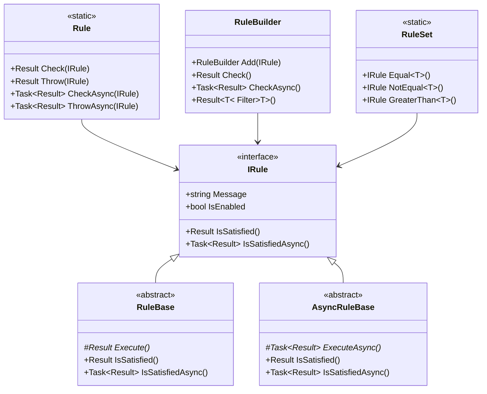

# Rules Feature Documentation

[TOC]

## Overview

The Rules feature provides a centralized approach to defining and evaluating business rules in a
composable and maintainable way. This feature is designed to handle evaluation, business logic
enforcement, and complex conditional rule chains while integrating seamlessly with the [Result](./features-results.md)
pattern.

Key benefits:

- Centralized rule definition and execution
- Composable rule chains
- Clear error handling through the Result pattern
- Rich set of predefined rules through RuleSet
- Extensible design for custom rules

## Basic Usage

The Rules feature provides a fluent API for validating conditions and enforcing business rules. Here
are the most common usage patterns:

### Single Rule Validation

```csharp
// Basic rule check
var result = Rule.Check(RuleSet.IsNotEmpty(customer.Name));
if (result.IsSuccess)
{
    // Validation passed
}

// Multiple evaluations
var result = Rule
    .Add(RuleSet.IsNotEmpty(order.Id))
    .Add(RuleSet.GreaterThan(order.Amount, 0))
    .Check();
```

### Conditional Rules

```csharp
// Basic conditional rule
var result = Rule
    .Add(RuleSet.IsNotEmpty(order.Id))
    .When(!order.IsDigital, RuleSet.IsNotEmpty(order.ShippingAddress))
    .Check();

// Multiple conditional rules
var result = Rule
    .Add(RuleSet.IsNotEmpty(order.Id))
    .When(order.RequiresShipping, builder => builder
        .Add(RuleSet.IsNotEmpty(order.ShippingAddress))
        .Add(RuleSet.IsNotEmpty(order.ContactEmail)))
    .Check();
```

### Working with Collections

```csharp
// Filter valid items
var result = Rule
    .Add(RuleSet.GreaterThan(o => o.Amount, 0))
    .Add(RuleSet.IsNotEmpty(o => o.CustomerId))
    .Filter(orders);

// Split and process valid/invalid items
var result = Rule
    .Add(RuleSet.GreaterThan(o => o.Amount, 0))
    .Switch(orders,
        validOrders => ProcessValidOrders(validOrders),
        invalidOrders => LogInvalidOrders(invalidOrders));
```

# Rule Builder Patterns

The Rule Builder provides a fluent interface for combining multiple rules and conditions into
expressive evaluation chains. This section covers common patterns for building and composing rules.

## Building Basic Rule Chains

Rule chains allow you to combine multiple evaluations in a readable sequence:

```csharp
var result = Rule
    .Add(RuleSet.IsNotEmpty(order.Id))
    .Add(RuleSet.IsNotNull(order.Customer))
    .Add(RuleSet.GreaterThan(order.Amount, 0))
    .Check();
```

You can also continue evaluation after failures to collect all errors:

```csharp
var result = Rule
    .Add(RuleSet.IsNotEmpty(order.Id))
    .Add(RuleSet.IsNotNull(order.Customer))
    .ContinueOnFailure()
    .Check();
```

## Conditional Rules

Apply rules based on conditions using `When`, `Unless`, and other conditional methods:

```csharp
// Single condition
var result = Rule
    .When(order.RequiresShipping, RuleSet.IsNotEmpty(order.ShippingAddress))
    .Check();

// Multiple rules under one condition
var result = Rule
    .When(order.HasDiscount, builder => builder
        .Add(RuleSet.GreaterThan(order.DiscountAmount, 0))
        .Add(RuleSet.LessThan(order.DiscountAmount, order.TotalAmount)))
    .Check();

// Inverse condition with Unless
var result = Rule
    .Unless(order.IsDigital, RuleSet.IsNotEmpty(order.ShippingAddress))
    .Check();
```

## Multiple Conditions

Handle complex scenarios with multiple conditions:

```csharp
// All conditions must be true
var result = Rule
    .WhenAll(new[]
    {
        order.RequiresShipping,
        order.Amount > 1000,
        order.IsInternational
    }, RuleSet.IsNotEmpty(order.CustomsDeclaration))
    .Check();

// Any condition must be true
var result = Rule
    .WhenAny(new[]
    {
        order.UseCredit,
        order.UsePaypal
    }, RuleSet.IsNotEmpty(order.PaymentDetails))
    .Check();
```

## Collection Processing

The Rules feature provides two ways to process collections of items:

### Filtering Collections

Use Filter to get valid items matching your rules:

```csharp
var result = Rule
    .Add(RuleSet.GreaterThan(o => o.Amount, 0))
    .Add(RuleSet.IsNotEmpty(o => o.CustomerId))
    .Filter(orders);

if (result.IsSuccess)
{
    var validOrders = result.Value;
    // Process valid orders
}
```

### Splitting Collections

Use Switch to handle valid and invalid items separately:

```csharp
var result = Rule
    .Add(RuleSet.GreaterThan(o => o.Amount, 0))
    .Switch(orders,
        validOrders => ProcessValidOrders(validOrders),
        invalidOrders => HandleInvalidOrders(invalidOrders));
```

## Practical Example

Here's a complete example showing multiple patterns together:

```csharp
public Result ValidateOrder(Order order)
{
    return Rule
        // Basic evaluation
        .Add(RuleSet.IsNotEmpty(order.Id))
        .Add(RuleSet.IsNotNull(order.Customer))

        // Customer evaluation when present
        .When(order.Customer != null, builder => builder
            .Add(RuleSet.IsValidEmail(order.Customer.Email))
            .Add(RuleSet.IsNotEmpty(order.Customer.Name)))

        // Shipping evaluation for physical goods
        .Unless(order.IsDigital, builder => builder
            .Add(RuleSet.IsNotEmpty(order.ShippingAddress))
            .When(order.IsInternational,
                RuleSet.IsNotEmpty(order.CustomsInfo)))

        // Continue to collect all evaluation errors
        .ContinueOnFailure()
        .Check();
}
```

# Architecture

## Component Overview

The Rules feature consists of several key components that work together to provide flexible rule evaluation:



## Key Components

### Rule Static Class

The `Rule` class serves as the main entry point for rule evaluation:

- Provides static methods for rule checking and rule chain building
- Handles rule execution and error aggregation
- Creates RuleBuilder instances for complex evaluation chains

```csharp
// Direct rule checking
var result = Rule.Check(someRule);

// Start building a rule chain
var builder = Rule.Add();
```

### RuleBuilder

The `RuleBuilder` enables fluent rule chain construction:

- Combines multiple rules into a single evaluation chain
- Handles conditional rule execution
- Provides collection processing capabilities

```csharp
var builder = Rule
    .Add(firstRule)
    .Add(secondRule)
    .When(condition, conditionalRule);
```

### RuleSet

The `RuleSet` class contains predefined rules for common evaluation scenarios:

- Value comparisons (Equal, GreaterThan, etc.)
- String evaluations (IsEmpty, Contains, etc.)
- Collection evaluations (HasItems, All, Any, etc.)

```csharp
// Using predefined rules
var emailRule = RuleSet.IsValidEmail(email);
var rangeRule = RuleSet.NumericRange(amount, 0, 100);
```

## Rule Types

### Value Rules

Rules that validate simple values or properties:

- Equality checks
- Numeric comparisons
- String operations

### Collection Rules

Rules for validating collections or sequences:

- Size evaluation
- Item evaluation
- Aggregation checks

### Composite Rules

Rules that combine multiple evaluations:

- Conditional rules
- Rule chains
- Complex business rules

## Integration with Result Pattern

The Rules feature integrates with the Result pattern to provide consistent error handling:

- All rule evaluations return a Result object
- Failed evaluations include detailed error information
- Results can be combined and aggregated

# Advanced Usage

This section covers advanced patterns and scenarios for using the Rules feature.

## Complex Rule Chains

Combine multiple evaluation conditions and rules for sophisticated business logic:

```csharp
public Result ValidateOrder(Order order)
{
    return Rule
        // Basic evaluation
        .Add(RuleSet.IsNotEmpty(order.Id))
        .Add(RuleSet.IsNotNull(order.Customer))

        // Payment evaluation based on method
        .WhenAny(new[]
        {
            order.UseCredit,
            order.UseCash,
            order.UsePaypal
        }, builder => builder
            .Add(RuleSet.GreaterThan(order.Amount, 0))
            .Add(RuleSet.IsNotNull(order.PaymentDetails)))

        // Special order handling
        .WhenAll(new[]
        {
            order.IsInternational,
            order.Amount > 1000
        }, RuleSet.IsNotEmpty(order.CustomsDeclaration))

        .ContinueOnFailure()
        .Check();
}
```

## Working with Collections

### Collection Filtering with Complex Rules

Apply multiple rules to filter collections:

```csharp
public Result<IEnumerable<Order>> GetValidOrders(IEnumerable<Order> orders)
{
    return Rule
        .Add(RuleSet.IsNotEmpty(o => o.Id))
        .Add(RuleSet.GreaterThan(o => o.Amount, 0))
        .When(o => o.IsInternational, builder => builder
            .Add(RuleSet.IsNotEmpty(o => o.CustomsDeclaration)))
        .Filter(orders);
}
```

### Advanced Collection Processing

Handle complex collection scenarios with Switch:

```csharp
public Result ProcessOrders(IEnumerable<Order> orders)
{
    return Rule
        .Add(RuleSet.IsNotEmpty(o => o.Id))
        .Add(RuleSet.GreaterThan(o => o.Amount, 0))
        .Switch(orders,
            validOrders => {
                // Process valid orders
                foreach (var order in validOrders)
                {
                    ProcessOrder(order);
                }
                return Result.Success();
            },
            invalidOrders => {
                // Log invalid orders
                foreach (var order in invalidOrders)
                {
                    LogInvalidOrder(order);
                }
                return Result.Success();
            });
}
```

## Custom Rules

Create custom rules by inheriting from RuleBase:

```csharp
public class BusinessHoursRule : RuleBase
{
    private readonly DateTime dateTime;

    public BusinessHoursRule(DateTime dateTime)
    {
        this.dateTime = dateTime;
    }

    public override string Message =>
        "Operation must be performed during business hours (9 AM - 5 PM)";

    protected override Result Execute()
    {
        return Result.SuccessIf(
            dateTime.Hour >= 9 &&
            dateTime.Hour < 17 &&
            dateTime.DayOfWeek != DayOfWeek.Saturday &&
            dateTime.DayOfWeek != DayOfWeek.Sunday);
    }
}

// Using custom rule
var result = Rule
    .Add(new BusinessHoursRule(DateTime.Now))
    .Check();
```

## Domain Validation Example

Here's a complete example showing how to validate a domain entity with complex rules:

```csharp
public class OrderValidator
{
    public Result ValidateOrder(Order order)
    {
        return Rule
            // Basic evaluation
            .Add(RuleSet.IsNotEmpty(order.Id))
            .Add(RuleSet.IsNotNull(order.Customer))

            // Customer evaluation
            .When(order.Customer != null, builder => builder
                .Add(RuleSet.IsValidEmail(order.Customer.Email))
                .Add(RuleSet.IsNotEmpty(order.Customer.Name)))

            // Order items evaluation
            .When(order.Items?.Any() == true, builder => builder
                .Add(RuleSet.All(order.Items, item =>
                    RuleSet.GreaterThan(item.Quantity, 0))))

            // Payment evaluation
            .When(order.HasDiscount, builder => builder
                .Add(RuleSet.GreaterThan(order.DiscountAmount, 0))
                .Add(RuleSet.LessThan(order.DiscountAmount, order.Amount)))

            // Shipping evaluation
            .Unless(order.IsDigital, builder => builder
                .Add(RuleSet.IsNotEmpty(order.ShippingAddress))
                .WhenAll(new[]
                {
                    order.IsInternational,
                    order.Amount > 1000
                }, RuleSet.IsNotEmpty(order.CustomsDeclaration)))

            .ContinueOnFailure()
            .Check();
    }
}
```

# Appendix A: Async Usage

While the Rules feature is primarily used synchronously, it also supports asynchronous operations.
This appendix provides a brief overview of async usage patterns.

## Basic Async Validation

Use `CheckAsync` for async rule evaluation:

```csharp
public async Task<Result> ValidateOrderAsync(Order order)
{
    return await Rule
        .Add(RuleSet.IsNotEmpty(order.Id))
        .Add(new ValidateCustomerAsync(order.CustomerId))
        .CheckAsync();
}
```

## Async Conditional Rules

Async conditions can be used with `WhenAsync`:

```csharp
public async Task<Result> ValidateOrderAsync(Order order)
{
    return await Rule
        .Add(RuleSet.IsNotEmpty(order.Id))
        .WhenAsync(
            async token => await customerService.ExistsAsync(order.CustomerId, token),
            RuleSet.IsNotEmpty(order.ShippingAddress))
        .CheckAsync();
}
```

## Custom Async Rules

Create async rules by inheriting from AsyncRuleBase:

```csharp
public class ValidateCustomerAsync : AsyncRuleBase
{
    private readonly string customerId;
    private readonly ICustomerService customerService;

    public ValidateCustomerAsync(string customerId, ICustomerService customerService)
    {
        this.customerId = customerId;
        this.customerService = customerService;
    }

    public override string Message => "Customer evaluation failed";

    protected override async Task<Result> ExecuteAsync(CancellationToken cancellationToken)
    {
        var customer = await customerService.GetCustomerAsync(customerId, cancellationToken);
        return Result.SuccessIf(customer != null && customer.IsActive);
    }
}
```

## Async Collection Processing

Both Filter and Switch operations support async rules:

```csharp
public async Task<Result> ProcessOrdersAsync(IEnumerable<Order> orders)
{
    // Async filtering
    var validOrders = await Rule
        .Add(RuleSet.GreaterThan(o => o.Amount, 0))
        .Add(async token => await ValidateCustomerAsync(token))
        .FilterAsync(orders);

    // Async switch operation
    return await Rule
        .Add(RuleSet.GreaterThan(o => o.Amount, 0))
        .SwitchAsync(orders,
            async valid => await ProcessValidOrdersAsync(valid),
            async invalid => await HandleInvalidOrdersAsync(invalid));
}
```

## Important Notes

1. All async methods accept an optional CancellationToken parameter
2. Async rules should inherit from AsyncRuleBase
3. Use CheckAsync() instead of Check() when working with async rules
4. Async and sync rules can be mixed in the same chain
5. For best performance, prefer sync rules when async operations aren't required

# Appendix B: Disclaimer

> The Rules feature is designed to be a lightweight, code-based solution for handling business
> rules and evaluations within your application.

The Rules feature is not meant to replace dedicated workflow or business rule engines. While it
handles common evaluation and business rule scenarios effectively, some situations call for more
specialized tools. If your project requires visual rule design tools, business user configuration of
rules, complex workflow orchestration, or long-running rule processes, a dedicated workflow or rules
engine might be more appropriate. Similarly, if you need rule persistence, versioning, or dynamic
rule compilation, consider exploring specialized solutions.

## When to Use the Rules Feature

The feature excels through its low barrier to entry, requiring minimal setup and working out of the
box. Since it's part of your application code with no external dependencies, it integrates
seamlessly with your existing codebase and other bITdevKit features.

Remember: Choose the simplest tool that meets your requirements. The feature provides a
lightweight, code-based approach to handling business rules, while staying consistent with
the bITdevKit philosophy of simple, effective solutions to common development problems.