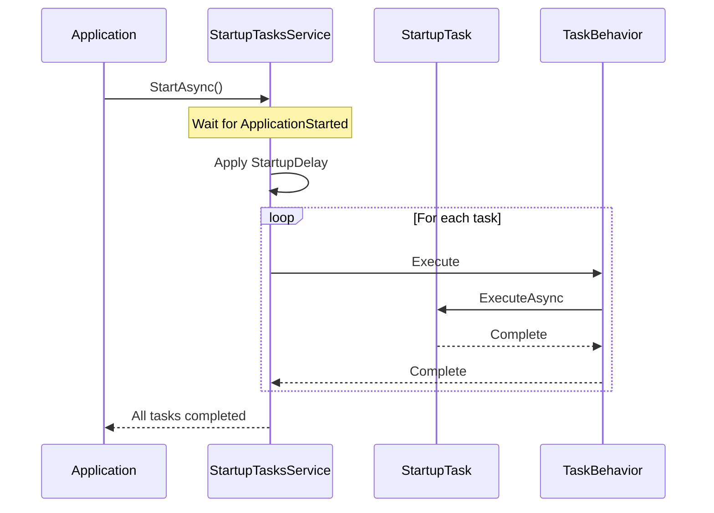

# StartupTasks Feature Documentation

[TOC]

## Overview

The StartupTasks feature provides a structured way to execute initialization tasks during application startup in ASP.NET Core applications. It allows developers to define, configure, and manage tasks that need to run when the application starts, such as database seeding, configuration validation, or system checks.



## Challenges
- Managing the order of initialization tasks
- Handling task failures gracefully
- Configuring different behaviors for development and production environments
- Controlling task execution timing and delays

## Solution
The StartupTasks feature solves these challenges by providing:
- A flexible configuration system
- Task execution ordering
- Environment-specific task enabling/disabling
- Configurable delays and parallel execution
- Built-in logging and error handling

## Use Cases
- Database seeding for development environments
- System configuration validation
- Initial data caching
- Resource preparation and validation
- Integration testing setup

## Usage

### Basic Setup
Add startup tasks to your application in `Program.cs`:

```csharp
builder.Services.AddStartupTasks(o => o
    .Enabled()
    .StartupDelay("00:00:05"))
    .WithTask<DatabaseSeederTask>(o => o
        .Enabled(builder.Environment.IsDevelopment())
        .StartupDelay("00:00:03"));
```

### Creating a Startup Task
Implement the `IStartupTask` interface:

```csharp
public class DatabaseSeederTask : IStartupTask
{
    private readonly ILogger<DatabaseSeederTask> _logger;
    private readonly IDbContext _dbContext;

    public DatabaseSeederTask(ILogger<DatabaseSeederTask> logger, IDbContext dbContext)
    {
        _logger = logger;
        _dbContext = dbContext;
    }

    public async Task ExecuteAsync(CancellationToken cancellationToken)
    {
        _logger.LogInformation("Starting database seeding...");
        // Seeding logic here
        await _dbContext.SeedAsync(cancellationToken);
    }
}
```

### Configuration Options
Tasks can be configured with various options:

```csharp
builder.Services.AddStartupTasks()
    .WithTask<ConfigValidationTask>(o => o
        .Enabled(true)        // Enable/disable the task
        .StartupDelay("00:00:02")  // Add delay before execution
        .Order(1))            // Set execution order
    .WithTask<CacheWarmupTask>(o => o
        .Enabled(builder.Environment.IsProduction())
        .Order(2));
```

### Adding Behaviors
Add behaviors to modify task execution:

```csharp
builder.Services.AddStartupTasks()
    .WithTask<DataInitializerTask>()
    .WithBehavior<LoggingBehavior>()
    .WithBehavior<RetryBehavior>();
```

The StartupTasks feature provides a clean and organized way to handle application initialization, making it easier to manage complex startup sequences while maintaining code clarity and separation of concerns.