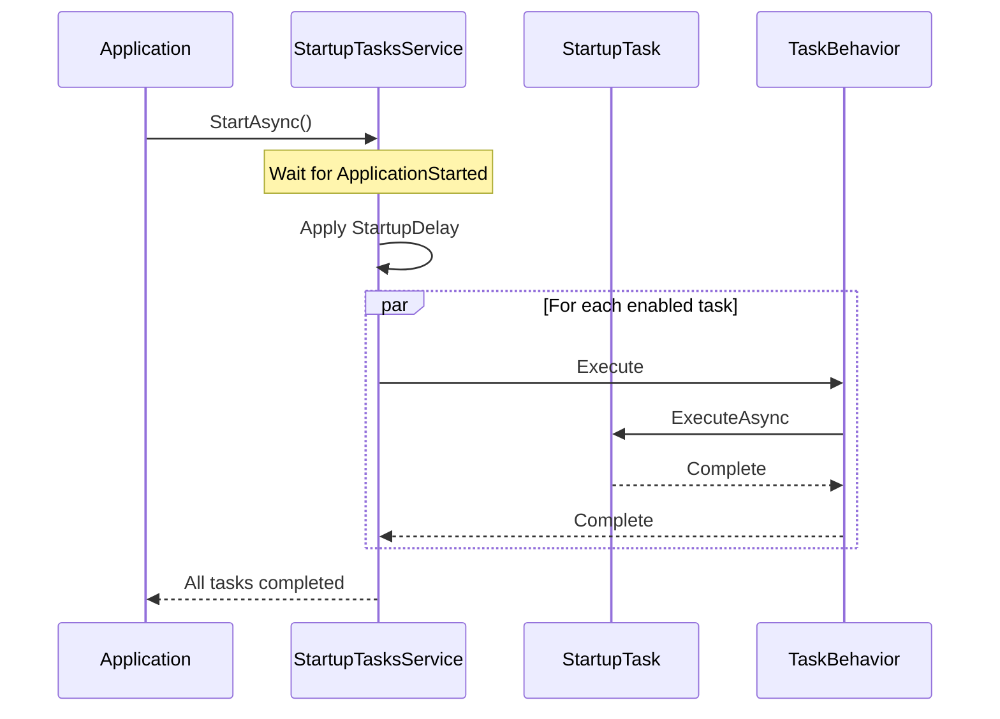

# Startup Tasks

> Run application startup work after the host reports that it has started.

[TOC]

## Overview

The Startup Tasks feature executes registered initialization work after `IHostApplicationLifetime.ApplicationStarted` fires. Use it for work such as development data seeding, resource checks or cache preparation that does not need to block `IHostedService.StartAsync`.


```mermaid
sequenceDiagram
    participant App as Application
    participant STS as StartupTasksService
    participant Task as StartupTask
    participant Behavior as TaskBehavior

    App->>STS: StartAsync()
    Note over STS: Wait for ApplicationStarted
    STS->>STS: Apply StartupDelay
    par For each enabled task
        STS->>Behavior: Execute
        Behavior->>Task: ExecuteAsync
        Task-->>Behavior: Complete
        Behavior-->>STS: Complete
    end
    STS-->>App: All tasks completed
```

## Challenges

- Avoiding hidden dependencies between concurrently started initialization tasks
- Handling task failures gracefully
- Configuring different behaviors for development and production environments
- Controlling task execution timing and delays

## Solution

The Startup Tasks feature provides:

- service-level and task-level enablement and startup delays
- per-task dependency-injection scopes
- a behavior pipeline around each task
- structured start, completion, duration and failure logs
- optional process termination when a task fails

## Key Features

- Register class-based tasks or task factories with `WithTask`.
- Enable or disable the service and individual tasks.
- Apply global and per-task startup delays.
- Wrap all tasks with retry, timeout, circuit-breaker, chaos or custom behaviors.
- Run each enabled task in its own dependency-injection scope.
- Cancel in-flight tasks during host shutdown and wait for up to ten seconds.

## Architecture

`AddStartupTasks` registers `StartupTasksService` as a hosted service. Its `StartAsync` method registers a callback and returns immediately. After `ApplicationStarted`, the service applies the global delay, creates one asynchronous operation per enabled definition, resolves each task in a new scope and executes the global behavior chain around `IStartupTask.ExecuteAsync`.

Tasks currently run concurrently through `Task.WhenAll`. `Order` sorts definitions before their operations are started, but it does not create a dependency or sequential execution guarantee. `MaxDegreeOfParallelism` exists on `StartupTaskServiceOptions`, but the current service does not apply it. Do not use either option to coordinate tasks that depend on each other.

## Use Cases

- Database seeding for development environments
- System configuration validation
- Initial data caching
- Resource preparation and validation
- Integration testing setup

## Basic Usage

### Basic setup

Add startup tasks to your application in `Program.cs`:

```csharp
builder.Services.AddStartupTasks(o => o
    .Enabled()
    .StartupDelay("00:00:05"))
    .WithTask<DatabaseSeederTask>(o => o
        .Enabled(builder.Environment.IsDevelopment())
        .StartupDelay("00:00:03"));

var app = builder.Build();
app.Run();
```

### Creating a startup task

Implement the `IStartupTask` interface:

```csharp
public sealed class DatabaseSeederTask(
    ILogger<DatabaseSeederTask> logger,
    AppDbContext dbContext) : IStartupTask, IRetryStartupTask, ITimeoutStartupTask
{
    RetryStartupTaskOptions IRetryStartupTask.Options => new()
    {
        Attempts = 3,
        Backoff = TimeSpan.FromSeconds(2)
    };

    TimeoutStartupTaskOptions ITimeoutStartupTask.Options => new()
    {
        Timeout = TimeSpan.FromSeconds(30)
    };

    public async Task ExecuteAsync(CancellationToken cancellationToken)
    {
        logger.LogInformation("Starting database seeding");
        await dbContext.SeedAsync(cancellationToken);
        logger.LogInformation("Database seeding completed");
    }
}
```

When the host has started and both configured delays have elapsed, the application log contains `Database seeding completed`. An exception is logged by the service; setting `HaltOnFailure()` at service or task level terminates the process with `Environment.FailFast`.

### Configuration options

Tasks can be configured with various options:

```csharp
builder.Services.AddStartupTasks()
    .WithTask<ConfigValidationTask>(o => o
        .Enabled(true)        // Enable/disable the task
        .StartupDelay("00:00:02")  // Add delay before execution
        .Order(1))            // Sort launch order; does not make execution sequential
    .WithTask<CacheWarmupTask>(o => o
        .Enabled(builder.Environment.IsProduction())
        .Order(2));
```

### Adding behaviors

Add behaviors to modify task execution:

```csharp
builder.Services.AddStartupTasks()
    .WithTask<DatabaseSeederTask>()
    .WithBehavior<RetryStartupTaskBehavior>()
    .WithBehavior<TimeoutStartupTaskBehavior>();
```

Built-in retry and timeout behaviors act on tasks that implement `IRetryStartupTask` and `ITimeoutStartupTask`, respectively. Behaviors are global and wrap every registered startup task; each behavior decides whether it applies to the current task.
