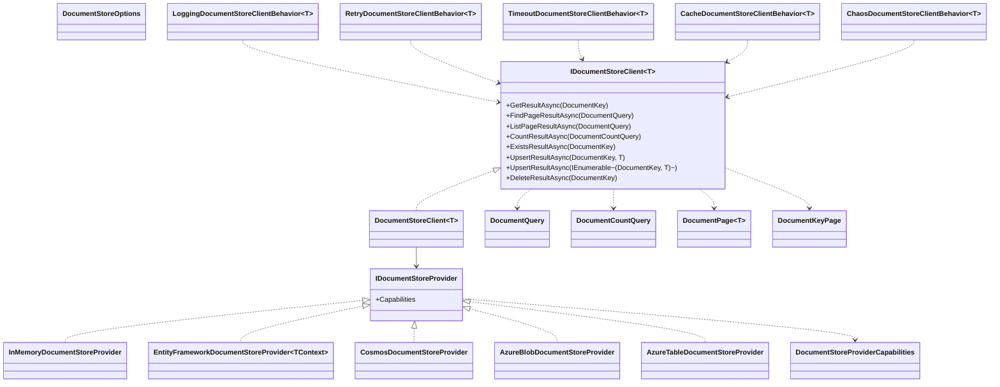
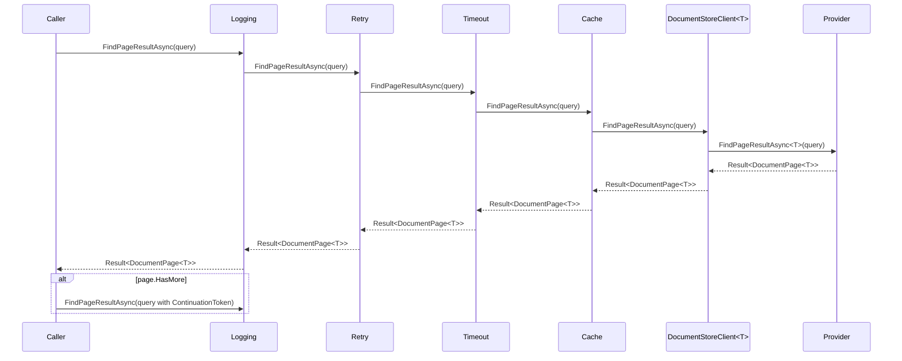
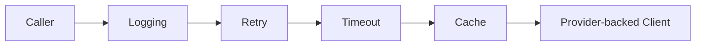

# Document Storage Feature Documentation

> Store typed JSON-like documents through a provider-agnostic, Result-native, continuation-paged API.

[TOC]

## Overview

Document Storage provides a type-safe abstraction for storing, retrieving, listing, counting, and deleting JSON-like documents keyed by `DocumentKey` (`PartitionKey` + `RowKey`). Consumers use `IDocumentStoreClient<T>`, and every operation returns `Result` or `Result<T>` for consistent recoverable error handling.

Read operations are bounded. Query reads return one page at a time, and continuation tokens are opaque strings that can be passed back to the same provider with the same query shape to retrieve the next page.

The cache behavior described here builds on the shared abstractions documented in [Common Caching](./common-caching.md), and document payload serialization follows the serializer conventions covered in [Common Serialization](./common-serialization.md).

## Challenges

- Consistent access: Unified API across in-memory, relational, and cloud providers without leaking implementation details.
- Bounded reads: Prevent accidental unbounded reads by requiring page-based query APIs.
- Query safety: Make full scans, page-size limits, unsupported query shapes, and client-side filtering explicit.
- Keyed access patterns: Efficient reads by partition and row key with full, prefix, and provider-supported suffix matching.
- Resilience and latency: Support retries, timeouts, diagnostics, and typed Result failures without exception-based control flow.
- Caching and invalidation: Avoid repeated exact-key reads while invalidating cache entries after writes and deletes.

## Solution

- Core contracts: `IDocumentStoreClient<T>` and `IDocumentStoreProvider` define the Result-native client and provider surface.
- Query model: `DocumentQuery`, `DocumentCountQuery`, and `DocumentQueries` provide explicit bounded query shapes.
- Paging model: `DocumentPage<T>` and `DocumentKeyPage` return items plus opaque continuation tokens.
- Query safety: `DocumentStoreOptions`, `DocumentStoreProviderCapabilities`, and `DocumentQueryValidator` enforce provider-aware limits.
- Providers: In-memory, Entity Framework, Cosmos DB, Azure Blob Storage, and Azure Table Storage implementations.
- Behaviors: Decorator pipeline around the client for logging, retry, timeout, caching, and chaos testing.

## Architecture

The Document Storage architecture consists of a provider-backed client decorated by optional behaviors. Consumers depend on `IDocumentStoreClient<T>`, while providers implement `IDocumentStoreProvider`.

- Components:
  - `IDocumentStoreClient<T>`: Public API for exact reads, paged reads, key listing, counting, existence checks, writes, and deletes.
  - `DocumentStoreClient<T>`: Default client that forwards operations to an `IDocumentStoreProvider`.
  - `IDocumentStoreProvider`: Backend contract implemented by providers.
  - Query types: `DocumentQuery`, `DocumentCountQuery`, `DocumentPage<T>`, `DocumentKeyPage`.
  - Behaviors: Decorators that wrap the client for logging, retry, timeout, cache, and chaos concerns.

### Class Diagram



### Flow Diagram



## Core Contracts

- `IDocumentStoreClient<T>` ([src/Application.Storage/Documents/IDocumentStoreClient.cs](src/Application.Storage/Documents/IDocumentStoreClient.cs))
  - **GetResultAsync(DocumentKey)**: Retrieves one exact document. Missing documents return a typed not-found failure.
  - **FindPageResultAsync(DocumentQuery)**: Retrieves one bounded page of payload instances.
  - **ListPageResultAsync(DocumentQuery)**: Retrieves one bounded page of document keys only.
  - **CountResultAsync(DocumentCountQuery)**: Counts documents matching a query shape.
  - **ExistsResultAsync(DocumentKey)**: Checks exact-key existence.
  - **UpsertResultAsync(DocumentKey, T)**: Inserts or updates one document.
  - **UpsertResultAsync(IEnumerable<(DocumentKey, T)>)**: Inserts or updates multiple documents.
  - **DeleteResultAsync(DocumentKey)**: Deletes one exact document.
- `IDocumentStoreProvider` ([src/Application.Storage/Documents/IDocumentStoreProvider.cs](src/Application.Storage/Documents/IDocumentStoreProvider.cs))
  - Backend interface implemented by providers.
  - Exposes `DocumentStoreProviderCapabilities Capabilities`.
- `DocumentStoreClient<T>` ([src/Application.Storage/Documents/DocumentStoreClient.cs](src/Application.Storage/Documents/DocumentStoreClient.cs))
  - Default client implementation that forwards operations to the provider.
- `DocumentKey` ([src/Application.Storage/Documents/DocumentKey.cs](src/Application.Storage/Documents/DocumentKey.cs))
  - Value type: `PartitionKey`, `RowKey`.
- `DocumentQuery` and `DocumentCountQuery`
  - Query models for paged reads, key listing, and counts.
- `DocumentPage<T>` and `DocumentKeyPage`
  - Page result models containing items and continuation tokens.
- `DocumentStoreOptions`
  - Query safety settings such as `DefaultTake`, `MaxTake`, `AllowFullScans`, and `RejectClientSideFilteredQueries`.
- `DocumentStoreProviderCapabilities`
  - Describes provider support for exact, prefix, suffix, full-scan, key-listing, paging, count, and key-only projection behavior.
- `DocumentStoreCacheProvider` and `DocumentStoreCache`
  - Allow the document-store stack to act as the backing store for `ICacheProvider`.
  - Cache entries are stored as `CacheDocument` documents under the `storage-cache` partition.

## Providers

### In-Memory

- `InMemoryDocumentStoreProvider` ([src/Application.Storage/Documents/InMemory/InMemoryDocumentStoreProvider.cs](src/Application.Storage/Documents/InMemory/InMemoryDocumentStoreProvider.cs))
  - Keeps documents in a process-local store.
  - Supports exact, prefix, suffix, full-scan, and key-listing queries.
  - Supports continuation paging.
  - Uses deterministic key ordering for pages.
  - Useful for tests, local development, and ephemeral storage.

### Entity Framework

- `EntityFrameworkDocumentStoreProvider<TContext>` ([src/Infrastructure.EntityFramework/Storage/Documents/EntityFrameworkDocumentStoreProvider.cs](src/Infrastructure.EntityFramework/Storage/Documents/EntityFrameworkDocumentStoreProvider.cs))
  - Persists documents in a relational table through a `DbContext` implementing `IDocumentStoreContext`.
  - Supports exact, prefix, suffix, full-scan, key-only listing, continuation paging, and server-side count.
  - Keys are stored as `Type`, `PartitionKey`, and `RowKey`.
  - Adds hash columns and indexes for efficient logical-key lookup.
  - Coordinates writes and deletes with short-lived row leases plus optimistic concurrency handling.
  - SQL Server and PostgreSQL are recommended for active multi-host document mutation workloads.
  - SQLite is useful for development, tests, and lightweight single-node deployments.

### Azure Cosmos DB

- `CosmosDocumentStoreProvider` ([src/Infrastructure.Azure.Cosmos/Storage/Documents/CosmosDocumentStoreProvider.cs](src/Infrastructure.Azure.Cosmos/Storage/Documents/CosmosDocumentStoreProvider.cs))
  - Stores JSON documents in a Cosmos DB container via `ICosmosSqlProvider<CosmosStorageDocument>`.
  - Supports exact, prefix, suffix, full-scan, key-listing, and continuation-paged operations.
  - Uses `Type`, `PartitionKey`, and `RowKey` fields on stored items.
  - Key-only listing returns `DocumentKey` values without returning application payload instances.
  - Register: [src/Infrastructure.Azure.Cosmos/Storage/Documents/ServiceCollectionExtensions.cs](src/Infrastructure.Azure.Cosmos/Storage/Documents/ServiceCollectionExtensions.cs)

```csharp
services.AddDocumentStorage()
    .WithCosmosClient<Person>(cosmosClient);

services.AddDocumentStorage()
    .WithCosmosClient<Person>(o => o
        .Container("storage_documents")
        .PartitionKey(e => e.Type));
```

### Azure Blob Storage

- `AzureBlobDocumentStoreProvider` ([src/Infrastructure.Azure.Storage/Documents/AzureBlobDocumentStoreProvider.cs](src/Infrastructure.Azure.Storage/Documents/AzureBlobDocumentStoreProvider.cs))
  - Stores each document as a blob named `<PartitionKey>__<RowKey>` in a type-scoped container.
  - Supports exact and row-key prefix queries efficiently.
  - Supports row-key suffix queries through client-side filtering when `RejectClientSideFilteredQueries` is disabled.
  - Supports full scans, key-only listing, and continuation paging.
  - `PartitionKey` and `RowKey` must not contain the reserved blob-name separator `__`.
  - Register: [src/Infrastructure.Azure.Storage/Documents/ServiceCollectionExtensions.cs](src/Infrastructure.Azure.Storage/Documents/ServiceCollectionExtensions.cs)

```csharp
services.AddDocumentStorage()
    .WithAzureBlobClient<Person>();

services.AddDocumentStorage()
    .WithAzureBlobClient<Person>(blobServiceClient);
```

### Azure Table Storage

- `AzureTableDocumentStoreProvider` ([src/Infrastructure.Azure.Storage/Documents/AzureTableDocumentStoreProvider.cs](src/Infrastructure.Azure.Storage/Documents/AzureTableDocumentStoreProvider.cs))
  - Stores documents as table rows with `PartitionKey`, `RowKey`, and document metadata.
  - Supports exact and row-key prefix queries efficiently.
  - Does not support row-key suffix queries.
  - Supports full scans, key-only listing, and continuation paging.
  - Register: [src/Infrastructure.Azure.Storage/Documents/ServiceCollectionExtensions.cs](src/Infrastructure.Azure.Storage/Documents/ServiceCollectionExtensions.cs)

```csharp
services.AddDocumentStorage()
    .WithAzureTableClient<Person>();

services.AddDocumentStorage()
    .WithAzureTableClient<Person>(tableServiceClient);
```

## Getting Started

### DI Setup

Register a client for your document type and choose a provider.

```csharp
services.AddDocumentStorage(o => o.Enabled(true))
    .WithEntityFrameworkClient<Person, AppDbContext>();
```

Register with provider tuning and document-query safety options:

```csharp
services.AddDocumentStorage(o => o.Enabled(true))
    .WithEntityFrameworkClient<Person, AppDbContext>(
        configure: options =>
        {
            options.LeaseDuration = TimeSpan.FromSeconds(15);
            options.RetryCount = 5;
            options.RetryDelay = TimeSpan.FromMilliseconds(100);
        },
        documentStoreOptions: new DocumentStoreOptions
        {
            DefaultTake = 100,
            MaxTake = 1000,
            AllowFullScans = false,
            RejectClientSideFilteredQueries = true
        });
```

Register a custom provider:

```csharp
services.AddDocumentStorage()
    .WithClient<Person>(sp =>
    {
        var provider = new InMemoryDocumentStoreProvider(
            sp.GetRequiredService<ILoggerFactory>());

        return new DocumentStoreClient<Person>(provider);
    });
```

The document-storage builder registers a single standard ASP.NET Core health check for all configured typed clients:

```text
DocumentStorage
```

The check probes every registered `IDocumentStoreClient<T>` with a non-mutating exact-key existence check for `__bdk/healthcheck` / `probe`. A missing probe document is healthy; provider failures are reported as unhealthy with the failed client ids and error details in the health-check data. The health check is tagged with `ready`, `storage`, and `documents`.

Add optional client behaviors:

```csharp
services.AddDocumentStorage(o => o.Enabled(true))
    .WithBehavior<LoggingDocumentStoreClientBehavior<Person>>()
    .WithBehavior<RetryDocumentStoreClientBehavior<Person>>()
    .WithBehavior<TimeoutDocumentStoreClientBehavior<Person>>()
    .WithEntityFrameworkClient<Person, AppDbContext>();

services.AddDocumentStorage()
    .WithEntityFrameworkClient<Person, AppDbContext>()
    .WithBehavior<CacheDocumentStoreClientBehavior<Person>>();
```

### Dashboard Explorer

When the host also registers the Presentation Dashboard, Document Storage contributes a server-rendered dashboard page at:

```text
/_bdk/dashboard/storage/documents
```

The page is available only when `AddDocumentStorage(...)` is enabled and at least one typed document client is registered through the top-level document-storage builder. It does not expose a general-purpose REST admin API. The page renders server-side and uses dashboard-local fragment/action routes for the current browser workflow.

The explorer works through the existing `IDocumentStoreClient<T>` contract:

- first select the registered document type/client
- list document keys with bounded continuation paging and selectable page sizes of 100, 250, 500, or 1000 items remembered in browser storage
- filter by exact partition key plus row-key prefix, suffix, or exact match when the selected provider supports that mode
- reset filters without leaving the page
- create a new document for the selected client by entering partition key, row key, and pasted or written JSON
- view an exact document by key in a details dialog
- download an individual document directly from the table
- edit the serialized payload with JSON validation before it is deserialized back to `T` and saved through `UpsertResultAsync(...)`
- reject new-document creation when the entered key already exists so existing documents are not overwritten accidentally
- delete one exact document from the details dialog or delete checked documents after a browser confirmation alert that includes the affected keys
- show lightweight busy and result states while server-rendered fragments and form actions complete

Provider-specific raw storage APIs are not required. EF, Cosmos DB, Azure Blob Storage, Azure Table Storage, and custom clients can all appear in the selector when they are registered through `AddDocumentStorage(...).With...Client<T>()`.

```csharp
builder.Services.AddDocumentStorage(o => o.Enabled(true))
    .WithBehavior<LoggingDocumentStoreClientBehavior<Person>>()
    .WithEntityFrameworkClient<Person, AppDbContext>()
    .WithCosmosClient<Customer>(o => o
        .Container("storage_documents")
        .PartitionKey(e => e.Type));
```

The listing behavior still follows each selected client's `DocumentStoreOptions`. For example, a type-wide list requires full scans to be allowed by that client's provider options. When full scans are disabled, enter an exact partition key and use row-key prefix paging. The row-key mode selector defaults to prefix and only offers suffix or exact when the selected provider advertises support for that query shape.

### Using Document Storage As A Persistent Cache Backend

The same document-store infrastructure can also back the shared caching abstraction.

```csharp
builder.Services
    .AddCaching(builder.Configuration)
    .WithEntityFrameworkDocumentStoreProvider<AppDbContext>(
        new DocumentStoreCacheProviderConfiguration
        {
            SlidingExpiration = TimeSpan.FromMinutes(20),
            AbsoluteExpiration = DateTimeOffset.UtcNow.AddHours(6)
        });
```

- This registers `ICacheProvider` as a `DocumentStoreCacheProvider`.
- Cache entries are serialized into `CacheDocument` records and stored through `IDocumentStoreClient<CacheDocument>`.
- The EF variant requires the target `DbContext` to implement `IDocumentStoreContext`.
- Azure Storage and Cosmos DB document-store-backed cache registrations are also available.

### Basic Usage

```csharp
public sealed class PeopleService(IDocumentStoreClient<Person> documents)
{
    public async Task<Result> SaveAsync(Person person, CancellationToken ct)
    {
        var key = new DocumentKey(person.Country, person.Id.ToString());

        return await documents.UpsertResultAsync(key, person, ct);
    }

    public async Task<Result<Person>> GetAsync(string country, string id, CancellationToken ct)
    {
        return await documents.GetResultAsync(new DocumentKey(country, id), ct);
    }

    public async Task<Result<bool>> ExistsResultAsync(string country, string id, CancellationToken ct)
    {
        return await documents.ExistsResultAsync(new DocumentKey(country, id), ct);
    }

    public async Task<Result> DeleteResultAsync(string country, string id, CancellationToken ct)
    {
        return await documents.DeleteResultAsync(new DocumentKey(country, id), ct);
    }
}
```

### Query Usage

Create page and count queries with `DocumentQueries`.

```csharp
var pageQuery = DocumentQueries.Query()
    .ForKey("people", "DE-")
    .WithRowKeyPrefix()
    .Take(100)
    .Build();

var countQuery = DocumentQueries.Count()
    .ForKey("people", "DE-")
    .WithRowKeyPrefix()
    .Build();
```

Supported query shapes:

- `WithFullMatch()`: Exact `PartitionKey` and exact `RowKey`.
- `WithRowKeyPrefix()`: Exact `PartitionKey` and row keys starting with the provided `RowKey`.
- `WithRowKeySuffix()`: Exact `PartitionKey` and row keys ending with the provided `RowKey`, when the provider supports it.
- `AllowFullScan()`: Allows a type-wide scan for this query. Full scans also require `DocumentStoreOptions.AllowFullScans = true`.

Paging:

- `Take(n)` sets the requested page size.
- If `Take` is not specified, the provider uses `DocumentStoreOptions.DefaultTake`.
- `DocumentStoreOptions.MaxTake` caps all page sizes.
- `ContinueWith(token)` retrieves the next page for the same query shape.
- Continuation tokens are provider-bound and query-bound. Treat them as opaque strings.

### Reading One Page

```csharp
var query = DocumentQueries.Query()
    .ForKey("DE", "customer-")
    .WithRowKeyPrefix()
    .Take(50)
    .Build();

var result = await documents.FindPageResultAsync(query, cancellationToken);

if (result.IsSuccess)
{
    foreach (var person in result.Value.Items)
    {
        // process person
    }

    var nextToken = result.Value.ContinuationToken;
}
```

### Reading All Pages

```csharp
var people = new List<Person>();
string continuationToken = null;

do
{
    var builder = DocumentQueries.Query()
        .ForKey("DE", "customer-")
        .WithRowKeyPrefix()
        .Take(100);

    if (!string.IsNullOrWhiteSpace(continuationToken))
    {
        builder.ContinueWith(continuationToken);
    }

    var pageResult = await documents.FindPageResultAsync(builder.Build(), cancellationToken);
    if (pageResult.IsFailure)
    {
        return pageResult.Map(_ => people);
    }

    people.AddRange(pageResult.Value.Items);
    continuationToken = pageResult.Value.ContinuationToken;
}
while (!string.IsNullOrWhiteSpace(continuationToken));
```

### Key-Only Listing

Use `ListPageResultAsync` when you only need keys. Providers with key-only projection support avoid payload materialization.

```csharp
var keysResult = await documents.ListPageResultAsync(
    DocumentQueries.Query()
        .ForKey("DE", "customer-")
        .WithRowKeyPrefix()
        .Take(100)
        .Build(),
    cancellationToken);

if (keysResult.IsSuccess)
{
    foreach (var key in keysResult.Value.Items)
    {
        // process key.PartitionKey and key.RowKey
    }
}
```

### Counting

```csharp
var countResult = await documents.CountResultAsync(
    DocumentQueries.Count()
        .ForKey("DE", "customer-")
        .WithRowKeyPrefix()
        .Build(),
    cancellationToken);
```

### Explicit Full Scans

Full scans are intentionally guarded. The query must opt in, and provider options must allow them.

```csharp
var options = new DocumentStoreOptions
{
    AllowFullScans = true,
    DefaultTake = 100,
    MaxTake = 1000
};

var query = DocumentQueries.Query()
    .AllowFullScan()
    .Take(100)
    .Build();
```

Use full scans for administrative and maintenance workloads. Prefer partitioned exact or prefix queries for regular application paths.

## Operations & Semantics

- **GetResultAsync(DocumentKey)**: Fetches one exact document. Both `PartitionKey` and `RowKey` must be provided.
- **FindPageResultAsync(DocumentQuery)**:
  - `FullMatch`: Exact `PartitionKey` and `RowKey`.
  - `RowKeyPrefixMatch`: Exact `PartitionKey` and documents where `RowKey` starts with the provided value.
  - `RowKeySuffixMatch`: Exact `PartitionKey` and documents where `RowKey` ends with the provided value, when supported.
  - Full scan: Type-wide page read only when both query and options allow it.
- **ListPageResultAsync(DocumentQuery)**: Returns document keys only for the same query shapes.
- **CountResultAsync(DocumentCountQuery)**: Counts documents matching the query shape.
- **ExistsResultAsync(DocumentKey)**: Exact-key existence check.
- **UpsertResultAsync(DocumentKey, T)**: Inserts or updates a single document.
- **UpsertResultAsync(IEnumerable<(DocumentKey, T)>)**: Inserts or updates a batch; provider may optimize for fewer writes.
- **DeleteResultAsync(DocumentKey)**: Removes one exact document.

### Query Safety And Errors

Document Storage returns typed Result failures for recoverable failures, including:

- invalid query shape
- requested page size above `MaxTake`
- full scan not allowed
- unsupported provider query shape
- client-side filtering rejected
- malformed continuation token
- continuation token/query mismatch
- document not found
- provider failure
- serialization failure
- concurrency failure

Caller cancellation continues to use normal .NET cancellation behavior and is not converted into a Result failure.

Recommended Result handling:

```csharp
var result = await documents.GetResultAsync(new DocumentKey("DE", "42"), cancellationToken);

if (result.IsFailure)
{
    return result;
}

var person = result.Value;
```

### Entity Framework Mutation Semantics

- Exact-key writes and deletes use a unique logical identity plus lease ownership, so concurrent writers do not create duplicate rows for the same `(Type, PartitionKey, RowKey)`.
- Delivery semantics are last-writer-wins with at-least-once retries, not compare-and-swap. If several hosts update the same document concurrently, one committed payload wins and callers should treat upserts as idempotent.
- Leases are intentionally short-lived and replay-safe. SQL Server and PostgreSQL use conditional set-based updates for lease claims; SQLite uses an optimistic fallback path.
- Reads are non-blocking and ignore transient leases. A leased row is still queryable until the owning mutation commits or rolls back.

### Multi-Host Deployment Guidance

- SQL Server and PostgreSQL are the recommended EF providers for active multi-host document mutations.
- SQLite is supported for development, tests, and lightweight single-node deployments, but it is not the recommended storage engine for distributed write-heavy document workloads.
- If you register the EF document store client as a singleton, use the built-in DI registration so each operation resolves a fresh scoped `DbContext`.

### Entity Framework Schema Notes

- The provider expects the consuming `DbContext` to expose `DbSet<StorageDocument>` through `IDocumentStoreContext`.
- The raw EF columns `Type`, `PartitionKey`, and `RowKey` are all fixed at a maximum length of 256 characters.
- The document table uses hashed lookup columns (`TypeHash`, `PartitionKeyHash`, `RowKeyHash`) to keep indexes narrow enough for relational providers while still validating the original key values. These hashes exist only in the EF persistence model.
- The main relational indexes are:
  - unique logical-key index on `(TypeHash, PartitionKeyHash, RowKeyHash)`
  - lookup index on `(TypeHash, PartitionKeyHash, RowKey)`
- The library does not ship migrations for consuming applications. The owning application updates its schema to include the document-store columns and indexes.

## Behaviors (Client Decorators)

Behaviors are composable decorators applied to `IDocumentStoreClient<T>`. Registration order defines wrapping, with the first registered behavior becoming the outermost wrapper. See [src/Application.Storage/Documents/DocumentStoreBuilderContext.cs](src/Application.Storage/Documents/DocumentStoreBuilderContext.cs).

- Logging: [LoggingDocumentStoreClientBehavior.cs](src/Application.Storage/Documents/Behaviors/LoggingDocumentStoreClientBehavior.cs)
  - Purpose: Structured operation logs without raw payloads or continuation-token values.
- Retry: [RetryDocumentStoreClientBehavior.cs](src/Application.Storage/Documents/Behaviors/RetryDocumentStoreClientBehavior.cs)
  - Purpose: Retry transient exceptions while returning typed validation failures as-is.
- Timeout: [TimeoutDocumentStoreClientBehavior.cs](src/Application.Storage/Documents/Behaviors/TimeoutDocumentStoreClientBehavior.cs)
  - Purpose: Enforce time budgets while preserving caller cancellation behavior.
- Cache: [CacheDocumentStoreClientBehavior.cs](src/Application.Storage/Documents/Behaviors/CacheDocumentStoreClientBehavior.cs)
  - Purpose: Cache successful exact-key reads and invalidate on writes and deletes.
- Chaos: [ChaosDocumentStoreClientBehavior.cs](src/Application.Storage/Documents/Behaviors/ChaosDocumentStoreClientBehavior.cs)
  - Purpose: Fault injection for resilience testing.

### Built-In Behavior Matrix

| Behavior | Purpose | Recommended use |
|---|---|---|
| Logging | Emit operation logs and parameters | Always, for observability |
| Retry | Retry transient failures | External dependencies or intermittent stores |
| Timeout | Bound execution time | Prevent runaway calls; set sensible defaults |
| Cache | Cache exact-key reads | Hot exact-key paths; rely on invalidation via behavior |
| Chaos | Inject failures | Test/staging only for resilience checks |

## Best Practices

- Keys: Always supply a non-empty `PartitionKey`; supply `RowKey` for exact, prefix, and suffix query shapes.
- Query shape: Prefer prefix filters for hierarchical keys, for example `customer:{id}` or `order:{date}:{id}`.
- Paging: Keep `Take` values modest and let `DocumentStoreOptions` protect application paths.
- Key-only reads: Use `ListPageResultAsync` when only keys are needed.
- Full scans: Keep full scans disabled for normal request paths.
- Client-side filtering: Enable it only when the data volume and provider behavior are acceptable.
- Batching: Use batch `UpsertResultAsync` for multiple writes.
- Caching: Add cache behavior for hot exact-key read paths.
- Resilience: Combine Retry + Timeout behaviors for resilient clients; keep handlers idempotent because mutations may be retried after transient contention.
- Continuation tokens: Persist continuation tokens only as opaque values and only for the matching query/provider context.
- Serialization: Ensure document types are compatible with the configured serializer and stable over time.
- Provider choice: Prefer SQL Server or PostgreSQL when multiple hosts mutate the same EF document set concurrently.

## Testing

Document Storage coverage includes:

- client delegation for the Result-native API
- in-memory exact reads, paging, key listing, counts, existence, upserts, deletes, and continuation tokens
- EF document-provider behavior across SQLite, SQL Server, and PostgreSQL
- Azure Blob and Azure Table provider query semantics
- Cosmos key-only projection, paging, count, and existence paths
- DI registration and singleton-safe EF client resolution

## Appendix A — Behaviors

Behaviors are decorators that wrap `IDocumentStoreClient<T>` to add cross-cutting concerns. Registration order defines wrapping. The inner-most component is the provider-backed client.

### Pipeline Model



- Outermost behavior sees every call first.
- Each behavior should call through to the inner client and optionally act before or after the call.
- Registration uses the top-level `AddDocumentStorage()` builder. Behaviors can be registered before or after provider clients and compose in the order they are added.

### Creating A Custom Behavior

Implement `IDocumentStoreClient<T>` and wrap an inner client. Keep methods thin, call the inner client, and add your concern around the call.

```csharp
using BridgingIT.DevKit.Application.Storage;

public sealed class MetricsDocumentStoreClientBehavior<T> : IDocumentStoreClient<T>
    where T : class, new()
{
    private readonly IDocumentStoreClient<T> inner;
    private readonly IMetrics metrics;

    public MetricsDocumentStoreClientBehavior(IDocumentStoreClient<T> inner, IMetrics metrics)
    {
        this.inner = inner;
        this.metrics = metrics;
    }

    public async Task<Result<DocumentPage<T>>> FindPageResultAsync(
        DocumentQuery query,
        CancellationToken cancellationToken = default)
    {
        var start = Stopwatch.GetTimestamp();
        var result = await this.inner.FindPageResultAsync(query, cancellationToken);
        this.metrics.Observe("documents.find_page", Stopwatch.GetElapsedTime(start));

        return result;
    }

    public Task<Result<T>> GetResultAsync(DocumentKey documentKey, CancellationToken cancellationToken = default) =>
        this.inner.GetResultAsync(documentKey, cancellationToken);

    public Task<Result<DocumentKeyPage>> ListPageResultAsync(DocumentQuery query, CancellationToken cancellationToken = default) =>
        this.inner.ListPageResultAsync(query, cancellationToken);

    public Task<Result<long>> CountResultAsync(DocumentCountQuery query, CancellationToken cancellationToken = default) =>
        this.inner.CountResultAsync(query, cancellationToken);

    public Task<Result<bool>> ExistsResultAsync(DocumentKey documentKey, CancellationToken cancellationToken = default) =>
        this.inner.ExistsResultAsync(documentKey, cancellationToken);

    public Task<Result> UpsertResultAsync(DocumentKey documentKey, T entity, CancellationToken cancellationToken = default) =>
        this.inner.UpsertResultAsync(documentKey, entity, cancellationToken);

    public Task<Result> UpsertResultAsync(
        IEnumerable<(DocumentKey DocumentKey, T Entity)> entities,
        CancellationToken cancellationToken = default) =>
        this.inner.UpsertResultAsync(entities, cancellationToken);

    public Task<Result> DeleteResultAsync(DocumentKey documentKey, CancellationToken cancellationToken = default) =>
        this.inner.DeleteResultAsync(documentKey, cancellationToken);
}
```

### Registration Patterns

Behaviors are applied so that the first registered ends up as the outermost wrapper.

Type-based decorator:

```csharp
services.AddDocumentStorage()
    .WithBehavior<LoggingDocumentStoreClientBehavior<Person>>()
    .WithBehavior<RetryDocumentStoreClientBehavior<Person>>()
    .WithBehavior<TimeoutDocumentStoreClientBehavior<Person>>()
    .WithEntityFrameworkClient<Person, AppDbContext>();
```

Factory-based decorator:

```csharp
services.AddDocumentStorage()
    .WithBehavior<Person, MetricsDocumentStoreClientBehavior<Person>>((inner, sp) =>
        new MetricsDocumentStoreClientBehavior<Person>(
            inner,
            sp.GetRequiredService<IMetrics>()))
    .WithEntityFrameworkClient<Person, AppDbContext>();
```
