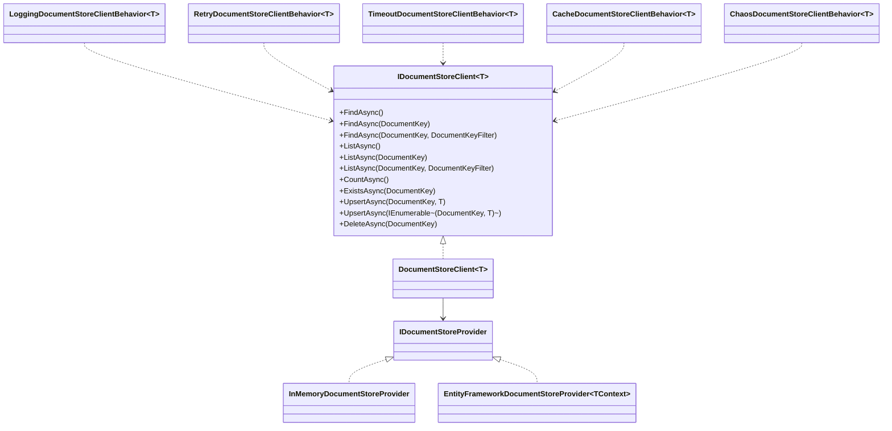
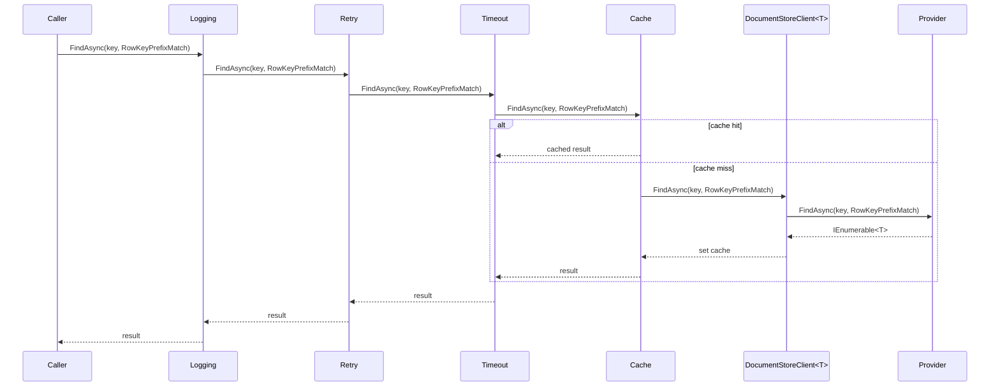
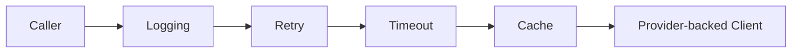

# DocumentStorage Feature Documentation

> Store and query JSON-like documents through a simple, provider-agnostic abstraction.

[TOC]

## Overview

Document Storage provides a simple, type-safe abstraction for storing and retrieving JSON-like documents keyed by a `DocumentKey` (partitionKey + rowKey). It focuses on straightforward CRUD operations, filtered lookups, and pluggable provider implementations, with optional client-side behaviors for resilience, caching, logging, and timeouts.

The cache behavior described here builds on the shared abstractions documented in [Common Caching](./common-caching.md), and document payload serialization follows the serializer conventions covered in [Common Serialization](./common-serialization.md).

## Challenges

- Consistent access: Unified API across providers (in-memory, EF-backed, cloud) without leaking implementation details.
- Keyed access patterns: Efficient reads by partition/row keys with flexible filtering (prefix/suffix).
- Resilience and latency: Retriable operations, bounded execution time, and diagnostics.
- Caching and invalidation: Avoid repeated reads while ensuring cache is invalidated on writes.

## Solution

- Core Contracts: `IDocumentStoreClient<T>` and `IDocumentStoreProvider` define the public API and provider surface.
- Keys and Filters: `DocumentKey` and `DocumentKeyFilter` standardize lookup and listing semantics.
- Providers: In-memory and Entity Framework implementations; additional providers can be added similarly.
- Behaviors: Decorator pipeline around the client for logging, retry, timeout, caching, and chaos testing.

## Architecture

The Document Storage architecture consists of a provider-backed client decorated by optional behaviors. Consumers depend on `IDocumentStoreClient<T>`, while providers implement `IDocumentStoreProvider`.

- Components:
  - `IDocumentStoreClient<T>`: Public API for CRUD, listing, filtering, and existence checks.
  - `DocumentStoreClient<T>`: Default client that forwards to an `IDocumentStoreProvider`.
  - `IDocumentStoreProvider`: Backend contract implemented by providers (e.g., In-Memory, EF).
  - Behaviors: Decorators that wrap the client (logging, retry, timeout, cache, chaos).

### Class Diagram



### Flow Diagram



## Core Contracts

- `IDocumentStoreClient<T>` ([src/Application.Storage/Documents/IDocumentStoreClient.cs](src/Application.Storage/Documents/IDocumentStoreClient.cs))
  - **FindAsync()**: Return all entities of type `T`.
  - **FindAsync(DocumentKey)**: Return entities for an exact key.
  - **FindAsync(DocumentKey, DocumentKeyFilter)**: Return entities filtered by `FullMatch`, `RowKeyPrefixMatch`, or `RowKeySuffixMatch`.
  - **ListAsync()**: Return all `DocumentKey`s for type `T`.
  - **ListAsync(DocumentKey)**: Return `DocumentKey`s for an exact key.
  - **ListAsync(DocumentKey, DocumentKeyFilter)**: Return filtered keys by `FullMatch`, `RowKeyPrefixMatch`, or `RowKeySuffixMatch`.
  - **CountAsync()**: Return number of stored entities of type `T`.
  - **ExistsAsync(DocumentKey)**: Check if an entity exists for an exact key.
  - **UpsertAsync(DocumentKey, T)**: Insert or update a single entity.
  - **UpsertAsync(IEnumerable<(DocumentKey, T)>)**: Insert or update multiple entities.
  - **DeleteAsync(DocumentKey)**: Delete the entity for an exact key.
- `DocumentStoreClientResultExtensions` ([src/Application.Storage/Documents/DocumentStoreClientResultExtensions.cs](src/Application.Storage/Documents/DocumentStoreClientResultExtensions.cs))
  - Adds `*ResultAsync(...)` wrappers for the document-store client so callers can use the shared `Result` pattern instead of exception-based control flow.
  - Read operations return `Result<TValue>` wrappers around the existing client values.
  - `UpsertResultAsync(...)` and `DeleteResultAsync(...)` translate lease/concurrency failures into `ConcurrencyError`.
- `DocumentStoreCacheProvider` and `DocumentStoreCache` ([src/Application.Storage/Caching/DocumentStoreCacheProvider.cs](src/Application.Storage/Caching/DocumentStoreCacheProvider.cs), [src/Application.Storage/Caching/DocumentStoreCache.cs](src/Application.Storage/Caching/DocumentStoreCache.cs))
  - Allow the document-store stack to act as the backing store for `ICacheProvider`, so cache entries can persist across process restarts and be shared between hosts when the underlying provider supports it.
  - Cache entries are stored as `CacheDocument` documents under the `storage-cache` partition.
- `IDocumentStoreProvider` ([src/Application.Storage/Documents/IDocumentStoreProvider.cs](src/Application.Storage/Documents/IDocumentStoreProvider.cs))
  - Backend interface; `DocumentStoreClient<T>` delegates to a provider implementation.
- `DocumentStoreClient<T>` ([src/Application.Storage/Documents/DocumentStoreClient.cs](src/Application.Storage/Documents/DocumentStoreClient.cs))
  - Default client implementation that forwards all operations to the provider.
- `DocumentKey` ([src/Application.Storage/Documents/DocumentKey.cs](src/Application.Storage/Documents/DocumentKey.cs))
  - Value type: `PartitionKey`, `RowKey`.
- `DocumentKeyFilter` ([src/Application.Storage/Documents/DocumentKeyFilter.cs](src/Application.Storage/Documents/DocumentKeyFilter.cs))
  - `FullMatch`, `RowKeyPrefixMatch`, `RowKeySuffixMatch`.

## Providers

### In-Memory

- `InMemoryDocumentStoreProvider` ([src/Application.Storage/Documents/InMemory/InMemoryDocumentStoreProvider.cs](src/Application.Storage/Documents/InMemory/InMemoryDocumentStoreProvider.cs))
  - Keeps documents in a process-local store; supports all operations and filters.
  - Useful for local development, tests, or simple ephemeral storage.

### Entity Framework

- `EntityFrameworkDocumentStoreProvider<TContext>` ([src/Infrastructure.EntityFramework/Storage/Documents/EntityFrameworkDocumentStoreProvider.cs](src/Infrastructure.EntityFramework/Storage/Documents/EntityFrameworkDocumentStoreProvider.cs))
  - Persists documents in a table (see [src/Infrastructure.EntityFramework/Storage/Documents/StorageDocument.cs](src/Infrastructure.EntityFramework/Storage/Documents/StorageDocument.cs)).
  - Keys are stored as `Type`, `PartitionKey`, and `RowKey`, each capped at **256 characters** and validated by the EF provider before any query or mutation runs.
  - The EF provider adds SHA-256 lookup hashes and a unique logical-key index to keep exact-key mutations stable at scale. These hash columns are an **EF implementation detail only**; they are not part of the public document-store contract and are not required by non-EF providers.
  - Content is serialized with `System.Text.Json` by default and persisted alongside a content hash.
  - Implements filter semantics (`FullMatch`, prefix, suffix) via LINQ queries, while exact-key operations narrow by both full values and hashed lookup columns.
  - Coordinates writes and deletes with short-lived row leases plus optimistic concurrency so multiple hosts can safely compete for the same logical document.

### Azure Cosmos DB

- `CosmosDocumentStoreProvider` ([src/Infrastructure.Azure.Cosmos/Storage/Documents/CosmosDocumentStoreProvider.cs](src/Infrastructure.Azure.Cosmos/Storage/Documents/CosmosDocumentStoreProvider.cs))
  - Stores JSON documents in a Cosmos DB container via `ICosmosSqlProvider<CosmosStorageDocument>`.
  - Supports `FullMatch`, `RowKeyPrefixMatch`, and `RowKeySuffixMatch` filters.
  - Keys: `Type` (partition key for container), with document `PartitionKey` and `RowKey` stored per item.
  - Register: [src/Infrastructure.Azure.Cosmos/Storage/Documents/ServiceCollectionExtensions.cs](src/Infrastructure.Azure.Cosmos/Storage/Documents/ServiceCollectionExtensions.cs)

```csharp
// Using a configured CosmosClient from DI
services.AddCosmosDocumentStoreClient<Person>(cosmosClient);

// Or with options builder (container, partition key etc.)
services.AddCosmosDocumentStoreClient<Person>(o => o
    .Container("storage_documents")
    .PartitionKey(e => e.Type));
```

### Azure Blob Storage

- `AzureBlobDocumentStoreProvider` ([src/Infrastructure.Azure.Storage/Documents/AzureBlobDocumentStoreProvider.cs](src/Infrastructure.Azure.Storage/Documents/AzureBlobDocumentStoreProvider.cs))
  - Stores each entity as a blob named `<PartitionKey>__<RowKey>` in a type-scoped container.
  - Supports `FullMatch` and `RowKeyPrefixMatch` efficiently; `RowKeySuffixMatch` requires enumeration.
  - Register: [src/Infrastructure.Azure.Storage/Documents/ServiceCollectionExtensions.cs](src/Infrastructure.Azure.Storage/Documents/ServiceCollectionExtensions.cs)

```csharp
// Using a BlobServiceClient from DI
services.AddAzureBlobDocumentStoreClient<Person>();

// Or provide a specific BlobServiceClient
services.AddAzureBlobDocumentStoreClient<Person>(blobServiceClient);
```

### Azure Table Storage

- `AzureTableDocumentStoreProvider` ([src/Infrastructure.Azure.Storage/Documents/AzureTableDocumentStoreProvider.cs](src/Infrastructure.Azure.Storage/Documents/AzureTableDocumentStoreProvider.cs))
  - Stores entities as rows with `PartitionKey` and `RowKey`; includes `ContentHash` metadata.
  - Supports `FullMatch` and `RowKeyPrefixMatch`; `RowKeySuffixMatch` is not supported (throws `NotSupportedException`).
  - Register: [src/Infrastructure.Azure.Storage/Documents/ServiceCollectionExtensions.cs](src/Infrastructure.Azure.Storage/Documents/ServiceCollectionExtensions.cs)

```csharp
// Using a TableServiceClient from DI
services.AddAzureTableDocumentStoreClient<Person>();

// Or provide a specific TableServiceClient
services.AddAzureTableDocumentStoreClient<Person>(tableServiceClient);
```

## Getting Started

### DI setup

Register a client for your document type and choose a provider.

```csharp
// Register an EF-backed document client
services.AddEntityFrameworkDocumentStoreClient<Person, AppDbContext>();

// Register a singleton client with explicit EF provider tuning
services.AddEntityFrameworkDocumentStoreClient<Person, AppDbContext>(
    lifetime: ServiceLifetime.Singleton,
    configure: options =>
    {
        options.LeaseDuration = TimeSpan.FromSeconds(15);
        options.RetryCount = 5;
        options.RetryDelay = TimeSpan.FromMilliseconds(100);
    });

// Or: Register a client with a custom factory (e.g., in-memory)
services.AddDocumentStoreClient<Person>(sp =>
{
    var provider = new InMemoryDocumentStoreProvider(sp.GetRequiredService<ILoggerFactory>());
    return new DocumentStoreClient<Person>(provider);
});
```

Add optional client behaviors (decorators):

```csharp
services.AddEntityFrameworkDocumentStoreClient<Person, AppDbContext>()
    .WithBehavior<LoggingDocumentStoreClientBehavior<Person>>()
    .WithBehavior<RetryDocumentStoreClientBehavior<Person>>()
    .WithBehavior<TimeoutDocumentStoreClientBehavior<Person>>();

// Cache behavior (requires an ICacheProvider in DI)
services.AddEntityFrameworkDocumentStoreClient<Person, AppDbContext>()
    .WithBehavior<CacheDocumentStoreClientBehavior<Person>>();
```

### Using document storage as a persistent cache backend

The same document-store infrastructure can also back the shared caching abstraction.

```csharp
builder.Services
    .AddCaching(builder.Configuration)
    .WithEntityFrameworkDocumentStoreProvider<AppDbContext>(
        new DocumentStoreCacheProviderConfiguration
        {
            SlidingExpiration = TimeSpan.FromMinutes(20),
            AbsoluteExpiration = DateTimeOffset.UtcNow.AddHours(6)
        });
```

- This registers `ICacheProvider` as a `DocumentStoreCacheProvider`.
- Cache entries are serialized into `CacheDocument` records and stored through `IDocumentStoreClient<CacheDocument>`.
- The EF variant requires the target `DbContext` to implement `IDocumentStoreContext`, and the consuming application still owns the schema migration for the document-store table.
- Equivalent persistent cache registrations exist for other document-store-backed providers, including Cosmos DB and Azure Storage variants.

### Basic usage

```csharp
public sealed class PeopleService
{
    private readonly IDocumentStoreClient<Person> documents;
    public PeopleService(IDocumentStoreClient<Person> documents) => this.documents = documents;

    public async Task AddOrUpdateAsync(Person p, CancellationToken ct)
    {
        var key = new DocumentKey(partitionKey: p.Country, rowKey: p.Id.ToString());
        await documents.UpsertAsync(key, p, ct);
    }

    public async Task<IEnumerable<Person>> GetAllAsync(CancellationToken ct)
    {
        return await documents.FindAsync(ct);
    }

    public async Task<IEnumerable<Person>> FindByPrefixAsync(string country, string idPrefix, CancellationToken ct)
    {
        var key = new DocumentKey(country, idPrefix);
        return await documents.FindAsync(key, DocumentKeyFilter.RowKeyPrefixMatch, ct);
    }

    public async Task<bool> ExistsAsync(string country, string id, CancellationToken ct)
    {
        return await documents.ExistsAsync(new DocumentKey(country, id), ct);
    }

    public async Task DeleteAsync(string country, string id, CancellationToken ct)
    {
        await documents.DeleteAsync(new DocumentKey(country, id), ct);
    }
}
```

### Result-pattern usage

```csharp
public sealed class PeopleResultService(IDocumentStoreClient<Person> documents)
{
    public async Task<Result> SaveAsync(Person person, CancellationToken ct)
    {
        var key = new DocumentKey(person.Country, person.Id.ToString());
        return await documents.UpsertResultAsync(key, person, ct);
    }

    public async Task<Result<IEnumerable<Person>>> FindByPrefixAsync(string country, string prefix, CancellationToken ct)
    {
        return await documents.FindResultAsync(
            new DocumentKey(country, prefix),
            DocumentKeyFilter.RowKeyPrefixMatch,
            ct);
    }
}
```

## Operations & Semantics

- **FindAsync()**: Fetch all entities of type `T`.
- **FindAsync(DocumentKey)**: Fetch entities for an exact key. Both `PartitionKey` and `RowKey` must be provided.
- **FindAsync(DocumentKey, DocumentKeyFilter)**:
  - `FullMatch`: Exact `PartitionKey` and `RowKey`.
  - `RowKeyPrefixMatch`: Exact `PartitionKey` and entities where `RowKey` starts with the provided value.
  - `RowKeySuffixMatch`: Exact `PartitionKey` and entities where `RowKey` ends with the provided value.
- **ListAsync()**: List all `DocumentKey`s for type `T`.
- **ListAsync(DocumentKey)** and **ListAsync(DocumentKey, DocumentKeyFilter)**: Same filter semantics as `FindAsync`, returning keys only.
- **CountAsync()**: Total count for type `T`.
- **ExistsAsync(DocumentKey)**: Exact match existence check.
- **UpsertAsync(DocumentKey, T)**: Insert/update a single entity.
- **UpsertAsync(IEnumerable<(DocumentKey, T)>)**: Insert/update a batch; provider may optimize for fewer writes.
- **DeleteAsync(DocumentKey)**: Remove exact entity.

### Entity Framework mutation semantics

- Exact-key writes and deletes use a unique logical identity plus lease ownership, so concurrent writers do not create duplicate rows for the same `(Type, PartitionKey, RowKey)`.
- Delivery semantics are **last-writer-wins with at-least-once retries**, not compare-and-swap. If several hosts update the same document concurrently, one committed payload wins and callers should treat upserts as idempotent.
- Leases are intentionally short-lived and replay-safe. SQL Server and PostgreSQL use conditional set-based updates for lease claims; SQLite uses an optimistic fallback path.
- Reads are non-blocking and ignore transient leases. A leased row is still queryable until the owning mutation commits or rolls back.

### Multi-host deployment guidance

- **SQL Server** and **PostgreSQL** are the recommended EF providers for active multi-host document mutations.
- **SQLite** is supported for development, tests, and lightweight single-node deployments, but it is not the recommended storage engine for distributed write-heavy document workloads.
- If you register the EF document store client as a singleton, use the built-in DI registration so each operation resolves a fresh scoped `DbContext`.

### Entity Framework schema notes

- The provider expects the consuming `DbContext` to expose `DbSet<StorageDocument>` through `IDocumentStoreContext`.
- The raw EF columns `Type`, `PartitionKey`, and `RowKey` are all fixed at a maximum length of **256 characters**.
- The document table uses hashed lookup columns (`TypeHash`, `PartitionKeyHash`, `RowKeyHash`) to keep indexes narrow enough for relational providers while still validating the original key values. These hashes exist only in the EF persistence model.
- The main relational indexes are:
  - unique logical-key index on `(TypeHash, PartitionKeyHash, RowKeyHash)`
  - lookup index on `(TypeHash, PartitionKeyHash, RowKey)`
- The library does **not** ship migrations for consuming applications. After upgrading, the owning application must update its schema to include the new document-store columns and indexes.

## Behaviors (Client Decorators)

Behaviors are composable decorators applied to `IDocumentStoreClient<T>`. Registration order defines wrapping (outermost first). See [src/Application.Storage/Documents/DocumentStoreBuilderContext.cs](src/Application.Storage/Documents/DocumentStoreBuilderContext.cs).

- Logging: [LoggingDocumentStoreClientBehavior.cs](src/Application.Storage/Documents/Behaviors/LoggingDocumentStoreClientBehavior.cs)
  - Purpose: Structured logs for CRUD and filter operations.
- Retry: [RetryDocumentStoreClientBehavior.cs](src/Application.Storage/Documents/Behaviors/RetryDocumentStoreClientBehavior.cs)
  - Purpose: Polly-based retries for transient failures; configure attempts/backoff.
- Timeout: [TimeoutDocumentStoreClientBehavior.cs](src/Application.Storage/Documents/Behaviors/TimeoutDocumentStoreClientBehavior.cs)
  - Purpose: Enforce time budgets with Polly timeout.
- Cache: [CacheDocumentStoreClientBehavior.cs](src/Application.Storage/Documents/Behaviors/CacheDocumentStoreClientBehavior.cs)
  - Purpose: Cache common reads; invalidates on writes and deletes.
- Chaos: [ChaosDocumentStoreClientBehavior.cs](src/Application.Storage/Documents/Behaviors/ChaosDocumentStoreClientBehavior.cs)
  - Purpose: Fault injection for resilience testing (use in test/staging only).

### Built-in behavior matrix (brief)

| Behavior | Purpose | Recommended use |
|---|---|---|
| Logging | Emit operation logs and parameters | Always, for observability |
| Retry | Retry transient failures | External dependencies or intermittent stores |
| Timeout | Bound execution time | Prevent runaway calls; set sensible defaults |
| Cache | Cache read operations | Hot paths; ensure invalidation via behavior |
| Chaos | Inject failures | Test/staging only for resilience checks |

## Best Practices

- Keys: Always supply non-empty `PartitionKey`; supply `RowKey` for `FullMatch` and when using prefix/suffix filters.
- Filters: Prefer prefix filter for hierarchical keys (e.g., `user:`) and suffix for versioned or trailing identifiers.
- Batching: Use batch `UpsertAsync` for multiple writes to reduce overhead.
- Caching: Add cache behavior for hot read paths; rely on behavior invalidation after writes.
- Resilience: Combine Retry + Timeout behaviors for resilient clients; keep handlers idempotent because EF mutations may be retried after transient contention.
- Serialization: EF provider uses System.Text.Json by default; ensure types are compatible and stable.
- Provider choice: Prefer SQL Server or PostgreSQL when you need multiple hosts to mutate the same document set concurrently.

## Testing

- The EF document-store provider has relational integration coverage for **SQLite**, **SQL Server**, and **PostgreSQL** in `tests/Infrastructure.IntegrationTests/EntityFramework/Storage/Documents`.
- The shared suite covers:
  - exact, prefix, and suffix query semantics
  - key listing and counting
  - exact-key existence checks
  - single-row upsert behavior
  - hashed lookup population and lease cleanup
  - competing-writer behavior for the same logical document
- The EF DI registration path is also covered by `DocumentStoreClientBuilderContextTests`, including singleton lifetime resolution with scoped `DbContext` creation.

## Appendix A — Behaviors

Behaviors are decorators that wrap `IDocumentStoreClient<T>` to add cross-cutting concerns like logging, retries, timeouts, caching, or chaos engineering. Registration order defines wrapping (outermost first). The inner-most component is the provider-backed client (e.g., Entity Framework or In-Memory).

### Pipeline Model



- Outermost behavior sees every call first; each behavior should call through to the inner client and optionally act before/after.
- Registration uses `DocumentStoreBuilderContext<T>.WithBehavior<TBehavior>()` and composes in the order behaviors are added.

### Creating a Custom Behavior

Implement `IDocumentStoreClient<T>` and wrap an inner client. Keep methods thin, call the inner client, and add your concern around the call.

```csharp
using BridgingIT.DevKit.Application.Storage;

public sealed class MetricsDocumentStoreClientBehavior<T> : IDocumentStoreClient<T>
  where T : class, new()
{
  private readonly IDocumentStoreClient<T> inner;
  private readonly IMetrics metrics;

  public MetricsDocumentStoreClientBehavior(IDocumentStoreClient<T> inner, IMetrics metrics)
  {
    this.inner = inner;
    this.metrics = metrics;
  }

  public async Task<IEnumerable<T>> FindAsync(CancellationToken ct)
  {
    var start = Stopwatch.GetTimestamp();
    var result = await inner.FindAsync(ct);
    metrics.Observe("documents.find", Stopwatch.GetElapsedTime(start));
    return result;
  }

  public Task<IEnumerable<T>> FindAsync(DocumentKey key, CancellationToken ct = default)
    => inner.FindAsync(key, ct);

  public Task<IEnumerable<T>> FindAsync(DocumentKey key, DocumentKeyFilter filter, CancellationToken ct = default)
    => inner.FindAsync(key, filter, ct);

  public Task<IEnumerable<DocumentKey>> ListAsync(CancellationToken ct)
    => inner.ListAsync(ct);

  public Task<IEnumerable<DocumentKey>> ListAsync(DocumentKey key, CancellationToken ct = default)
    => inner.ListAsync(key, ct);

  public Task<IEnumerable<DocumentKey>> ListAsync(DocumentKey key, DocumentKeyFilter filter, CancellationToken ct = default)
    => inner.ListAsync(key, filter, ct);

  public Task<long> CountAsync(CancellationToken ct = default)
    => inner.CountAsync(ct);

  public Task<bool> ExistsAsync(DocumentKey key, CancellationToken ct = default)
    => inner.ExistsAsync(key, ct);

  public Task UpsertAsync(DocumentKey key, T entity, CancellationToken ct = default)
    => inner.UpsertAsync(key, entity, ct);

  public Task UpsertAsync(IEnumerable<(DocumentKey DocumentKey, T Entity)> entities, CancellationToken ct = default)
    => inner.UpsertAsync(entities, ct);

  public Task DeleteAsync(DocumentKey key, CancellationToken ct = default)
    => inner.DeleteAsync(key, ct);
}
```

### Registration Patterns

Behaviors are applied so that the first registered ends up as the outermost wrapper.

- Type-based decorator:

```csharp
services.AddEntityFrameworkDocumentStoreClient<Person, AppDbContext>()
  .WithBehavior<LoggingDocumentStoreClientBehavior<Person>>()
  .WithBehavior<RetryDocumentStoreClientBehavior<Person>>()
  .WithBehavior<TimeoutDocumentStoreClientBehavior<Person>>();
```

- Factory-based decorator (dependencies from DI):

```csharp
services.AddEntityFrameworkDocumentStoreClient<Person, AppDbContext>()
  .WithBehavior((inner, sp) =>
    new MetricsDocumentStoreClientBehavior<Person>(inner, sp.GetRequiredService<IMetrics>()));
```
