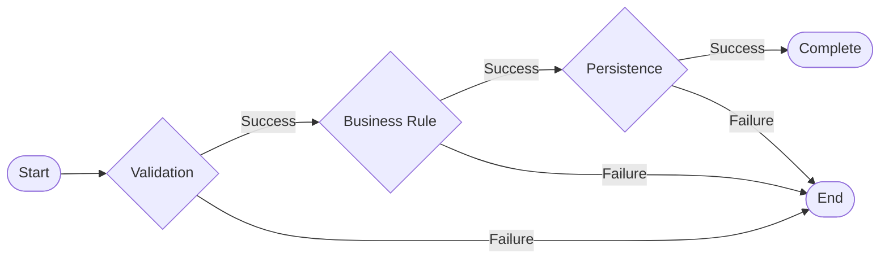
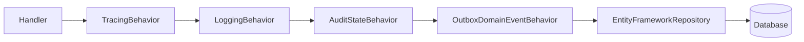
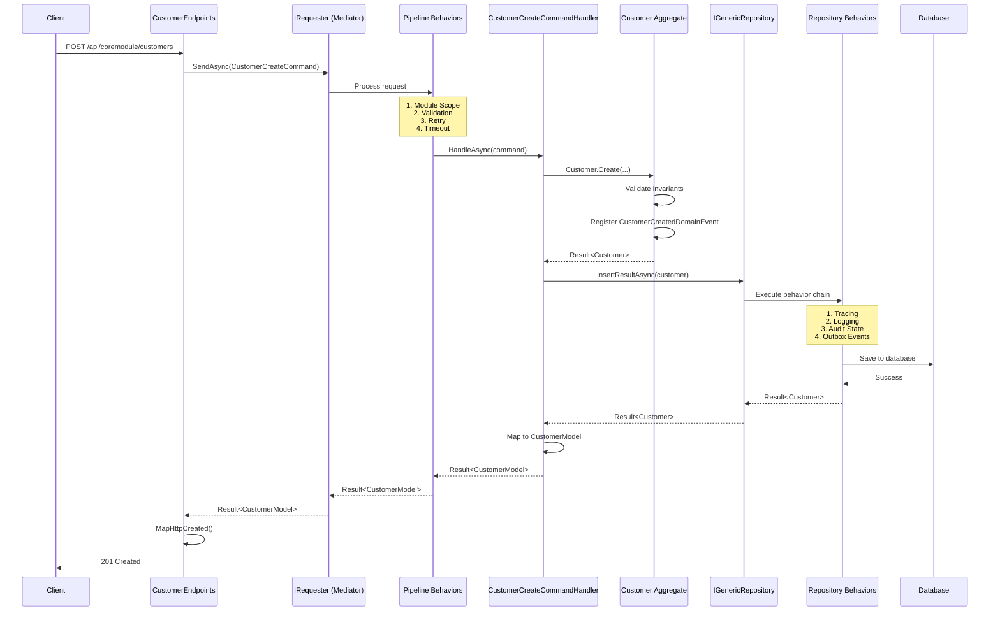

# Introduction Guide to Domain-Driven Design in bITDevKit

## 1. What is Domain-Driven Design?

Domain-Driven Design (DDD) is an approach to software development that focuses on building rich domain models that accurately represent business concepts. Rather than treating data as simple records or DTOs, DDD emphasizes:

- **Ubiquitous Language**: Shared language between domain experts and developers
- **Bounded Contexts**: Logical boundaries around specific business capabilities
- **Strategic Design**: Mapping business domains to technical boundaries
- **Tactical Design**: Patterns for implementing domain logic

bITDevKit provides building blocks to implement DDD patterns in .NET, allowing you to focus on business logic while the framework handles cross-cutting concerns. The framework promotes clean architecture with clear separation between domain, application, infrastructure, and presentation layers.

## 2. Core Domain Building Blocks

### 2.1 Aggregates and Consistency Boundaries

An **Aggregate** is a cluster of domain objects treated as a unit for data changes. It defines a **consistency boundary** - all invariants within an aggregate must be satisfied atomically. This means you cannot modify part of an aggregate in isolation; you must always work through the aggregate root.

The aggregate root is the sole entry point for modifications. It enforces invariants and ensures that the aggregate remains in a consistent state. In bITDevKit, aggregates inherit from `AggregateRoot<TId>` which provides:

- Domain events collection for event sourcing
- Invariant enforcement through fluent updates
- Concurrency control support

```csharp
[TypedEntityId<Guid>]
public class Customer : AuditableAggregateRoot<CustomerId>, IConcurrency
{
    public string FirstName { get; private set; }
    public string LastName { get; private set; }
    public EmailAddress Email { get; private set; }
    public CustomerStatus Status { get; private set; } = CustomerStatus.Lead;
}
```

The `[TypedEntityId<Guid>]` attribute automatically generates a strongly-typed `CustomerId` wrapper, preventing accidental mixing of different entity IDs. Private setters enforce encapsulation - state changes happen through methods that validate invariants.

*Reference: [Domain features documentation](features-domain.md)*

### 2.2 Value Objects

A **Value Object** is an immutable object identified by its attributes rather than identity. It encapsulates a domain concept without its own lifecycle. Value objects are ideal for concepts that don't need to be tracked individually.

Benefits of value objects:

- Self-validation on creation ensures validity
- Prevents primitive obsession (overusing strings and primitives)
- Enhances readability and type safety
- Simplifies equality comparison (based on values, not references)

```csharp
public class EmailAddress : ValueObject
{
    public string Value { get; private set; }

    public static Result<EmailAddress> Create(string value)
    {
        value = value?.Trim()?.ToLowerInvariant();

        if (string.IsNullOrWhiteSpace(value))
            return Result<EmailAddress>.Failure()
                .WithError(new ValidationError("Email cannot be empty"));

        if (!value.Contains("@"))
            return Result<EmailAddress>.Failure()
                .WithError(new ValidationError("Invalid email format"));

        return new EmailAddress(value);
    }

    protected override IEnumerable<object> GetAtomicValues()
    {
        yield return this.Value;
    }
}
```

The factory method `Create()` returns a `Result<EmailAddress>`, ensuring invalid email addresses cannot be constructed. The `GetAtomicValues()` method enables structural equality - two email addresses with the same value are considered equal.

*Reference: [Domain features documentation](features-domain.md)*

### 2.3 Smart Enumerations

Traditional C# enums have significant limitations:

- No behavior or methods
- Limited to numeric values
- Cannot store additional metadata
- No inheritance or polymorphism

**Smart Enumerations** provide rich domain objects with properties and behavior while maintaining enum-like usage patterns.

```csharp
public class CustomerStatus : Enumeration
{
    public static readonly CustomerStatus Lead = new(1, nameof(Lead), "Lead customer");
    public static readonly CustomerStatus Active = new(2, nameof(Active), "Active customer");
    public static readonly CustomerStatus Retired = new(3, nameof(Retired), "Retired customer");

    private CustomerStatus(int id, string name, string description)
        : base(id, name)
    {
        this.Description = description;
    }

    public string Description { get; private set; }

    public static IEnumerable<CustomerStatus> GetAll() => GetAll<CustomerStatus>();
}
```

Smart enumerations can:

- Store additional properties like `Description`
- Contain business logic methods
- Be used in switch expressions like regular enums
- Support polymorphic behavior through inheritance

*Reference: [Domain features documentation - Appendix A](features-domain.md)*

### 2.4 Strongly-Typed Entity IDs

Using primitive types (`Guid`, `int`, `string`) as identifiers can lead to subtle bugs where you accidentally pass a `TodoId` to a method expecting `CustomerId`. The compiler cannot catch this because both are just `Guid` values.

**Strongly-Typed IDs** prevent this through source generation that creates wrapper types for each entity.

```csharp
// Attribute triggers automatic CustomerId generation
[TypedEntityId<Guid>]
public class Customer : Entity<CustomerId>
{
    // CustomerId is automatically generated as a wrapper around Guid
}

// Usage provides compile-time safety
public async Task<Customer> GetCustomerAsync(CustomerId id) // ✅ Correct type
{
    // Implementation
}

public async Task<Customer> GetCustomerAsync(Guid id)   // ❌ Wrong - could be TodoId
{
    // Implementation
}
```

Benefits of typed IDs:

- Compile-time type checking prevents mixing entity IDs
- Self-documenting code (parameter names indicate entity type)
- Easy to refactor (change from Guid to int without affecting callers)
- Better IDE support (autocomplete knows which IDs are valid)

*Reference: [Domain features documentation - Appendix B](features-domain.md)*

### 2.5 Domain Events

**Domain Events** capture significant domain occurrences in past-tense, immutable records. They decouple producers from consumers, enabling event-driven architecture and maintaining the single responsibility principle.

When a domain event is raised:

- The producer doesn't need to know who handles it
- Multiple handlers can respond to the same event
- Handlers can run asynchronously (e.g., sending email, updating cache)
- The domain logic remains clean and focused

```csharp
public partial class CustomerCreatedDomainEvent(Customer model) : DomainEventBase
{
    public Customer Model { get; private set; } = model;
}

// Raising in aggregate factory method
public static Result<Customer> Create(
    string firstName,
    string lastName,
    string email,
    CustomerNumber number)
{
    var emailResult = EmailAddress.Create(email);
    if (emailResult.IsFailure)
        return emailResult.Unwrap();

    var customer = new Customer(firstName, lastName, emailResult.Value, number);
    customer.DomainEvents.Register(new CustomerCreatedDomainEvent(customer));

    return customer;
}
```

Domain events are collected in the aggregate's `DomainEvents` collection and published via the outbox pattern, ensuring reliable delivery even if the transaction is rolled back.

*Reference: [Domain Events documentation](features-domain-events.md)*

## 3. Application Layer Patterns

### 3.1 Command Query Separation (CQRS)

The **CQRS pattern** separates read and write operations into distinct models. While this can mean separate read/write models in complex systems, bITDevKit uses a simplified approach where the same domain model serves both, but operations are clearly separated.

**Commands** modify state (Create, Update, Delete):

- Always return void or a result indicating success/failure
- Execute use cases that change the system
- Validate business rules before executing

**Queries** read data without side effects:

- Return data (typically DTOs or domain models)
- Never modify state
- Can be optimized for specific read scenarios

Benefits of CQRS:

- Clear separation of concerns (write vs read paths)
- Independent scalability (optimize reads and writes differently)
- Simplified handler testing (each has single responsibility)
- Easier to understand what code does by looking at class name

```csharp
// Command - changes state
public class CustomerCreateCommand(CustomerModel model) : RequestBase<CustomerModel>
{
    public CustomerModel Model { get; set; } = model;

    public class Validator : AbstractValidator<CustomerCreateCommand>
    {
        public Validator()
        {
            this.RuleFor(c => c.Model).NotNull();
            this.RuleFor(c => c.Model.FirstName).NotNull().NotEmpty();
            this.RuleFor(c => c.Model.LastName).NotNull().NotEmpty();
            this.RuleFor(c => c.Model.Email).NotNull().NotEmpty().EmailAddress();
        }
    }
}

// Query - reads data
public class CustomerFindAllQuery : RequestBase<IEnumerable<CustomerModel>>
{
    public FilterModel Filter { get; set; } = null;
}

// Handler orchestrates the use case
public class CustomerCreateCommandHandler
    : RequestHandlerBase<CustomerCreateCommand, CustomerModel>
{
    protected override async Task<Result<CustomerModel>> HandleAsync(
        CustomerCreateCommand request,
        SendOptions options,
        CancellationToken ct)
    {
        // Business logic and persistence
        var customer = Customer.Create(
            request.Model.FirstName,
            request.Model.LastName,
            request.Model.Email,
            CustomerNumberGenerator.Next());

        if (customer.IsFailure)
            return customer.For<CustomerModel>();

        return await repository.InsertResultAsync(customer, cancellationToken: ct)
            .Map(mapper.Map<Customer, CustomerModel>);
    }
}
```

The `IRequester` interface acts as a mediator, dispatching commands and queries to their handlers while applying cross-cutting concerns through pipeline behaviors.

*Reference: [Commands and Queries documentation](features-application-commands-queries.md)*

### 3.2 Result Pattern (Railway-Oriented Programming)

The **Result pattern** replaces exception-based error handling with explicit success/failure types. This enables **railway-oriented programming** - operations compose cleanly with automatic error propagation.

**Problems with exception-based error handling**:

- Exceptions break control flow unexpectedly
- Hard to distinguish business errors from technical failures
- Try-catch blocks add noise to business logic
- Error context gets lost as exceptions bubble up

**Benefits of Result pattern**:

- Explicit success/failure states
- Error context preserved through call chain
- Composable operations (functions can be chained)
- No exceptions for expected business failures



```csharp
return await repository.InsertResultAsync(customer)
    .Tap(c => auditService.LogCreate(c))
    .Ensure(c => c.IsValid, new ValidationError("Invalid customer"))
    .Map(mapper.Map<Customer, CustomerModel>);
```

**Key Result operations**:

- `Bind()`: Transform success value, returns Result
- `Map()`: Convert to different type, returns Result
- `Ensure()`: Validate condition, fails if false
- `Tap()`: Execute side effect without changing result
- `Unless()`: Business rule validation (fails if rule not satisfied)

The pipeline automatically short-circuits on failure - subsequent operations are skipped, and the failure flows directly to the end. This is the "railway" metaphor: once you're on the failure track, you stay on it.

*Reference: [Results documentation](features-results.md)*

### 3.3 Business Rules

The **Rules feature** provides centralized, composable business rule evaluation. Rules encapsulate validation logic and business invariants in a declarative, readable way.

```csharp
var result = Rule
    .Add(RuleSet.IsNotEmpty(customer.FirstName))
    .Add(RuleSet.IsValidEmail(customer.Email.Value))
    .Add(RuleSet.GreaterThan(order.Amount, 0))
    .Check();
```

Benefits of the Rules feature:

- Reusable rules across different contexts
- Composable rule chains
- Clear separation of validation from domain logic
- Integration with Result pattern for consistent error handling

Rules can be:

- Sync: Evaluate immediately
- Async: Support asynchronous validation (e.g., checking external API)
- Conditional: Only apply based on runtime conditions
- Collection-based: Validate all items in a collection

*Reference: [Rules documentation](features-rules.md)*

## 4. Infrastructure Layer

### 4.1 Repositories with Behaviors

The repository pattern abstracts data access while the **behavior pattern** (decorator) adds cross-cutting concerns. This separation keeps business logic clean while automatically applying logging, tracing, auditing, and event publishing.

Behaviors wrap repository calls in a chain, executing in a specific order. Each behavior can:

- Pre-process the operation
- Execute the operation
- Post-process the result
- Handle exceptions



**Behavior chain order** (important for correctness):

1. **TracingBehavior**: Starts OpenTelemetry span for distributed tracing
2. **LoggingBehavior**: Logs operation start/end with duration
3. **AuditStateBehavior**: Sets audit metadata (CreatedBy, UpdatedDate, etc.)
4. **OutboxDomainEventBehavior**: Persists domain events to outbox for reliable delivery
5. **Repository**: Actual database operation

```csharp
services.AddEntityFrameworkRepository<Customer, CoreModuleDbContext>()
    .WithBehavior<RepositoryTracingBehavior<Customer>>()
    .WithBehavior<RepositoryLoggingBehavior<Customer>>()
    .WithBehavior<RepositoryAuditStateBehavior<Customer>>()
    .WithBehavior<RepositoryOutboxDomainEventBehavior<Customer, CoreModuleDbContext>>();
```

**Why this order matters**:

- Audit state must be set before persistence (so database has audit fields)
- Outbox needs committed events (runs after repository saves)
- Tracing spans the entire operation
- Logging captures timing for the full operation

*Reference: [Repository documentation](features-domain-repositories.md)*

### 4.2 ActiveEntity vs Repository Pattern

bITDevKit supports both persistence patterns. Choose based on your project's complexity and requirements:

| Factor | ActiveEntity | Repository |
|---------|-------------|------------|
| **Simplicity** | Embedded CRUD methods in entities | Separate abstraction layer |
| **Development Speed** | Faster for simple CRUD | More setup required |
| **Testing** | Requires in-memory provider | Easy to mock abstractions |
| **DDD Alignment** | Good for simple domains | Clearer boundary for complex aggregates |
| **Query Complexity** | Limited to embedded queries | Supports specifications, filtering |

**When to use ActiveEntity**:

- Simple CRUD scenarios
- Rapid prototyping or MVP
- Teams prefer code over abstractions
- Query logic is straightforward

**When to use Repository**:

- Complex domain with multiple aggregates
- Need for specifications and filtering
- Strict separation of concerns required
- Comprehensive test coverage needed

Both patterns support:

- Behaviors for cross-cutting concerns
- Domain events
- Typed entity IDs
- Result pattern integration

*Reference: [ActiveEntity documentation](features-domain-activeentity.md)*

## 5. Modular Monolith Architecture

### 5.1 Vertical Slices

Organize code into **modules** - each a self-contained vertical slice containing all layers. This differs from traditional layered architecture where all domains share layers.

```text
src/Modules/CoreModule/
├── CoreModule.Domain/              # Business logic
├── CoreModule.Application/         # Use cases
├── CoreModule.Infrastructure/      # Persistence
└── CoreModule.Presentation/        # HTTP endpoints
```

**Module characteristics**:

- Self-contained DbContext and migrations
- Own domain model, commands, queries, handlers
- Independent endpoints and DTOs
- Can be extracted to microservice if needed

**Benefits of modular monolith**:

- Clear ownership of business capabilities
- Easier to understand and maintain
- Gradual path to microservices if needed
- Teams can work on modules independently
- Deploy independently if configured correctly

### 5.2 Dependency Rules

Critical rules enforced by architecture tests (these tests run as part of your CI/CD):

1. **Domain → NONE**: Domain has no external dependencies (only framework abstractions)
2. **Application → Domain**: Application depends only on domain layer
3. **Infrastructure → Domain + Application**: Infrastructure implements abstractions defined by inner layers
4. **Presentation → Application**: Presentation uses application through `IRequester` mediator

**Module boundaries**:

- Modules cannot directly reference other modules' internal layers (Domain, Application, Infrastructure)
- Modules can reference other modules' `.Contracts` projects for public APIs
- Cross-module communication via integration events (async) or public APIs (sync)

**Why these rules matter**:

- Prevents circular dependencies
- Keeps domain logic pure and testable
- Makes refactoring safer (boundaries are clear)
- Enables parallel development across modules

*Reference: [Modules documentation](features-modules.md)*

## 6. Request Flow Example

Complete flow showing how a customer creation request moves through the architecture, from HTTP request to database persistence.



**Key stages**:

1. **HTTP Request**: Client sends JSON payload to endpoint
2. **Command Creation**: Endpoint creates `CustomerCreateCommand` with DTO
3. **Pipeline Processing**: Request passes through cross-cutting behaviors
4. **Handler Execution**: Handler orchestrates domain logic
5. **Domain Validation**: Aggregate enforces business rules and invariants
6. **Repository Persistence**: Entity saved with behavior chain (audit, logging, outbox)
7. **Response Mapping**: Result mapped to HTTP response (201 Created with Location header)

## 7. Getting Started Checklist

For new developers joining a bITDevKit project, follow this checklist to understand and extend the codebase:

**Domain Layer**:

- [ ] Create new aggregate inheriting from `AggregateRoot<TId>`
- [ ] Add `[TypedEntityId<T>]` attribute for type-safe IDs
- [ ] Register domain events in `DomainEvents` collection
- [ ] Use Value Objects for domain concepts without identity
- [ ] Create Smart Enumerations for fixed sets of values
- [ ] Implement factory methods (e.g., `Create()`) that validate invariants

**Application Layer**:

- [ ] Create commands for write operations (inherit `RequestBase<TResponse>`)
- [ ] Create queries for read operations (inherit `RequestBase<TResponse>`)
- [ ] Implement handlers inheriting `RequestHandlerBase<TRequest, TResponse>`)
- [ ] Add FluentValidation validators to commands/queries
- [ ] Use Result pattern for error handling
- [ ] Orchestrate domain logic in handlers (not repositories)

**Infrastructure Layer**:

- [ ] Configure DbContext with `AddDbContext<T>()`
- [ ] Register repositories with `AddEntityFrameworkRepository<T, TContext>()`
- [ ] Add behaviors: Tracing, Logging, Audit, Outbox
- [ ] Create EF Core configurations for entities
- [ ] Ensure migrations are applied via startup task

**Presentation Layer**:

- [ ] Create endpoints class inheriting from `EndpointsBase`
- [ ] Use `IRequester.SendAsync()` to dispatch commands/queries
- [ ] Map Results to HTTP responses (`.MapHttpCreated()`, `.MapHttpOk()`)
- [ ] Add authorization with `.RequireAuthorization()`
- [ ] Register endpoints in module's `Map()` method

## 8. Common Patterns Reference

### 8.1 Fluent Aggregate Updates

Fluent updates eliminate repetitive change detection code, event registration, and validation. The `.Change()` builder provides a composable way to update aggregates while maintaining invariants.

```csharp
public Result<Customer> ChangeEmail(string email)
{
    return this.Change()
        .Set(c => c.Email, EmailAddress.Create(email))
        .Check(c => c.Email.Value != null, "Email is required")
        .Register(c => new CustomerEmailChangedEvent(c.Id))
        .Apply();
}
```

**Builder methods**:

- `Set()`: Change a property value
- `Check()`: Validate condition before applying
- `Register()`: Add domain event
- `Apply()`: Commit changes and return result

*Reference: [Domain documentation - Appendix C](features-domain.md)*

### 8.2 Specifications for Querying

Specifications encapsulate query criteria in reusable, composable objects. They integrate with repositories and FilterModel for API queries.

```csharp
var spec = Customer.Specifications.IsActiveEquals(true)
    .And(Customer.Specifications.VisitsGreaterThan(5));

var customers = await repository.FindAllAsync(spec);
```

Benefits of specifications:

- Reusable across queries and handlers
- Composable (can combine with AND/OR)
- Testable in isolation
- Express domain query logic clearly

*Reference: [Filtering documentation](features-filtering.md)*

### 8.3 Transaction Scopes

Transaction scopes provide all-or-nothing semantics for operations that need multiple database operations. The Result pattern integrates with transactions to ensure rollback on failure.

```csharp
await Result<Customer>.Success(customer)
    .StartOperation(async ct => await transaction.BeginAsync(ct))
    .Tap(c => c.UpdatedAt = DateTime.UtcNow)
    .BindAsync(async (c, ct) =>
        await repository.UpdateResultAsync(c, ct), cancellationToken)
    .EndOperationAsync(cancellationToken);
```

**How it works**:

- Transaction starts lazily (on first async operation)
- All operations execute within the transaction
- On success: transaction commits
- On failure: transaction rolls back
- Integrates with Result pattern's railway-oriented flow

*Reference: [Results documentation - Result Operation Scope](features-results.md)*

## 9. Next Steps

This introduction provides a foundation for understanding DDD in bITDevKit. To deepen your knowledge, explore these resources:

1. **Study the complete example**: The GettingStarted example demonstrates all patterns working together in a real application with a Customer aggregate.

2. **Explore feature documentation** for detailed implementation guidance:
   - [Domain layer features](features-domain.md) - Aggregates, Value Objects, IDs
   - [Application CQRS](features-application-commands-queries.md) - Commands, Queries, Handlers
   - [Repositories and behaviors](features-domain-repositories.md) - Data access patterns
   - [ActiveEntity alternative](features-domain-activeentity.md) - Embedded persistence
   - [Result pattern extensions](features-results.md) - Functional error handling
   - [Rules and validation](features-rules.md) - Business rule evaluation
   - [Filtering specifications](features-filtering.md) - Query composition
   - [Entity permissions](features-entitypermissions.md) - Authorization at entity level
   - [Modules architecture](features-modules.md) - Modular monolith patterns

3. **Read module-specific documentation**: Each module's README contains implementation details for patterns in that module's context.

4. **Review architecture tests**: These tests enforce dependency rules and provide examples of correct layer boundaries.

## Summary

bITDevKit's DDD implementation provides:

- **Rich domain modeling**: Aggregates, Value Objects, Smart Enums, Typed IDs
- **Clean separation**: CQRS, Repository pattern, modular monolith
- **Robust error handling**: Result pattern with railway-oriented programming
- **Cross-cutting concerns**: Behaviors for logging, tracing, audit, events
- **Developer experience**: Fluent APIs, source generation, comprehensive documentation

By following these patterns, you can build maintainable, testable applications where business logic is clearly separated from infrastructure concerns and where domain experts can understand code through ubiquitous language.

The Customer aggregate example demonstrates all these concepts working together: creating a customer validates the email (Value Object), assigns a status (Smart Enum), registers a domain event, persists through a repository with behaviors, and returns a Result that maps to an HTTP response.
