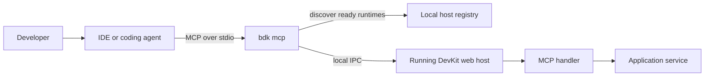

# AI Agent Support Guide

This guide describes the DevKit MCP context model, runtime connection, tool catalog, prompt patterns, project-owned diagnostics, and safety controls.

For installation and the first self-test, start with [AI Agent Support](agent-support.md).

## Agent context

DevKit MCP gives agents four kinds of context:

| Context | Tools | Use |
| --- | --- | --- |
| Guidance | `bdk_guidance_list`, `bdk_guidance_get` | Get an implementation checklist for common DevKit work. |
| Documentation | `bdk_docs_search`, `bdk_docs_get` | Read official DevKit feature docs while coding in a consuming project. |
| API reference | `bdk_api_search`, `bdk_api_get` | Find DevKit types, members, overloads, extension methods, and signatures. |
| Runtime | `bdk_project_summary`, `bdk_capabilities_get`, feature tools | Inspect the selected application, its modules, capabilities, and operational state. |

For feature work, use this flow:

```text
Guidance -> Docs -> API reference -> Code -> Runtime verification
```

The guidance API uses one generic operation. For a request to add, create, or build DevKit code, call `bdk_guidance_get` with the request in `query`. The tool selects one or more relevant topics.

Example guidance call:

```json
{
  "query": "how to implement a new job that triggers an orchestration"
}
```

Guidance covers these DevKit areas:

- application patterns such as commands, queries, events, jobs, messaging, queueing, orchestration, pipelines, and startup tasks
- domain patterns such as ActiveEntity, domain events, repositories, specifications, domain modeling, results, and rules
- shared capabilities such as caching, mapping, serialization, utilities, filtering, modules, and Requester or Notifier
- storage and presentation features such as document, blob, and file storage, storage monitoring, and dashboard pages

## Use docs while coding

`bdk mcp` exposes documentation and API reference tools directly to the agent:

| Tool | Purpose |
| --- | --- |
| `bdk_docs_search` | Search official DevKit documentation by topic. |
| `bdk_docs_get` | Load a bounded Markdown source returned by search. |
| `bdk_api_search` | Search official DevKit API symbols by type, member, namespace, topic, or keyword. |
| `bdk_api_get` | Load bounded API reference details for a symbol `uid` returned by search. |

The documentation tools read official DevKit documentation from GitHub. The API tools read generated reference metadata from GitHub Pages. Neither tool depends on a local `docs` folder in the consuming project.

A typical coding workflow is:

1. Search the DevKit docs for the feature being changed.
2. Summarize the expected pattern.
3. Search the API reference for the types and members involved.
4. Inspect the project for matching conventions.
5. Make the implementation change.
6. Use runtime tools to verify that the application advertises or executes the feature.

Example:

```text
Use the bdk MCP docs tools to read the DevKit Jobs guidance first.
Then implement a nightly customer cleanup job following the documented pattern.
After the change, use bdk_jobs_list to verify the running app advertises the job.
```

```text
Use bdk_guidance_get for results, read the linked docs, then use bdk_api_search and bdk_api_get for Result before changing error handling code.
```

## Runtime connection



The CLI discovers ready DevKit hosts for the current workspace and selects the current runtime. It forwards runtime calls over local IPC and ignores stale runtime descriptors.

## Tool catalog

The CLI owns the stable MCP tool catalog. The selected runtime advertises the application operations it supports.

| Area | Examples |
| --- | --- |
| Runtime | MCP status, self-test, capabilities, health, and metrics |
| Logs and errors | query logs, tail logs, recent errors, and inspect correlation IDs |
| Messaging | summaries, subscriptions, retained messages, retry, archive, pause, and resume |
| Queueing | queue summaries, retained queue messages, retry, archive, and queue or type pause and resume |
| Jobs | job definitions, run history, run statistics, trigger, pause, resume, and interrupt |
| Orchestrations | instances, details, history, timers, signals, and runtime control |
| Project tools | application-owned diagnostics through `bdk_project_operations` and `bdk_project_call` |
| Project summary | selected runtime, registered modules, MCP capability groups, and project-owned operations |
| Guidance | implementation checklists for jobs, messaging, queueing, orchestration, pipelines, and dashboard pages |
| Documentation | official DevKit documentation search and retrieval |
| API reference | official DevKit API symbols, signatures, summaries, and DocFX links |

Operations are grouped into toolsets:

- `diagnostics` contains the default read-oriented tools
- `operations` contains runtime controls such as retry, pause, resume, trigger, and signal
- `admin` contains destructive maintenance operations and requires explicit confirmation

Start the MCP server with explicit toolsets when you need more than diagnostics:

```powershell
dotnet tool run bdk mcp --toolset diagnostics,operations,admin
```

## Prompt library

State what the agent must inspect first, what it can change, and when it must wait for approval. These prompts assume that the application and `bdk mcp` are running.

### Runtime orientation

```text
Use the bdk MCP tools to verify the selected runtime. Run the MCP self-test, inspect the available capabilities, and summarize which diagnostics are available before changing code.
```

```text
Use bdk MCP to check whether this application exposes logs, jobs, messaging, queueing, orchestrations, and project-owned operations. Tell me which areas are available and which are not.
```

### Debug a local feature

```text
Use bdk MCP to inspect the latest errors from the running app. For the newest error, follow the correlation ID, summarize the related logs, and point me to the most likely code area.
```

```text
I just reproduced a bug locally. Use bdk MCP to tail recent warning and error logs from the last 10 minutes, then suggest the smallest code change to investigate first.
```

### Jobs, messaging, and queueing

```text
Use bdk MCP to list recent job runs and failed executions. If a job failed, inspect its run details and related logs, then summarize the failure path.
```

```text
Use bdk MCP to inspect waiting queue messages and retained broker messages. Identify messages that look stuck, leased, failed, or ready for retry, but do not perform operations yet.
```

```text
Use bdk MCP operations to retry the failed queue message I identify. Before calling any operation, show me the exact MCP tool arguments you plan to use.
```

### Orchestrations

```text
Use bdk MCP to list active orchestration instances. For any failed or stuck instance, inspect details, history, signals, and timers, then summarize what happened.
```

```text
Use bdk MCP to investigate orchestration instance <instance-id>. Include history, signals, timers, and related correlation logs if available.
```

### Project-owned diagnostics

```text
Use bdk MCP to list project-owned operations. Choose the operation that best inspects a customer or product issue, and ask me for any required identifiers before calling it.
```

```text
Use bdk_project_operations to discover application-specific diagnostics. Then call the safest read-only project operation that helps explain why product <product-id> is not visible.
```

### Documentation-aware coding

```text
Use the bdk MCP docs tools to find the DevKit guidance for queueing retries. Compare that guidance with the current code before proposing changes.
```

```text
Before implementing this feature, use bdk MCP docs search for the relevant DevKit feature docs. Summarize the expected pattern, then inspect the codebase for matching conventions.
```

```text
I need a new DevKit job. Use bdk_docs_search and bdk_docs_get to read the Jobs docs first, then implement the job and verify it with bdk_jobs_list.
```

```text
Use bdk_guidance_get for jobs, then use the linked docs and bdk_project_summary before editing. After implementation, verify with bdk_jobs_list.
```

```text
Use bdk_project_summary to orient on this app's modules and MCP capabilities. Then choose the right DevKit guidance topic before proposing code changes.
```

```text
Use bdk_api_search for IRepository and Specification. Call bdk_api_get for the exact symbols you plan to use before editing repository code.
```

### Admin operations

```text
Use bdk MCP to inspect retained local test data older than yesterday. Do not purge anything. If cleanup is appropriate, show the exact admin call and wait for my approval.
```

For a destructive action, ask the agent to inspect and propose the operation first. Approve the operation in a second prompt with the explicit confirmation arguments.

## Add project-owned tools

Applications can expose their own diagnostics by implementing `IMcpHandler` and registering the handler through the DevKit web host builder:

```csharp
var builder = DevKitWebApplication.CreateBuilder(args)
    .AddConfiguration()
    .AddLogging()
    .AddModules(c => c
        .WithModule<CoreModule>())
    .AddMcp(c => c
        .WithHandlersFromAssembly<CoreModule>());
```

Use client-safe operation names such as `catalog_inspect_product` or `orders_find_customer_context`. Agents discover these operations with `bdk_project_operations` and call them through `bdk_project_call`.

## Safety model

MCP support runs locally:

- no public MCP HTTP endpoint is exposed
- host communication uses local IPC with nonce validation
- runtime selection is workspace-aware and targets only ready runtimes
- tool responses enforce output bounds
- operations and admin tools require explicit enablement
- destructive admin operations require confirmation arguments

These controls separate local diagnostics from production administration.

## Related reference

- [MCP Client Configuration](reference/features-cli-mcp-clients.md)
- [DevKit MCP Reference](reference/features-cli-mcp.md)
- [DevKit CLI Reference](reference/features-cli.md)
