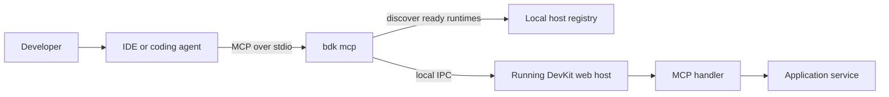

# AI Agent Support

`bITdevKit` is agent-capable through the `bdk mcp` command. It gives MCP-capable IDEs and coding agents a local, workspace-aware way to read official DevKit documentation, inspect the running application, and apply the expected patterns while they help with development.

This is designed for local development. It is not a public HTTP endpoint and it is not a production administration API.

## Why it matters

Modern coding agents are more useful when they can combine framework guidance with live runtime context. With DevKit MCP, an agent can search official DevKit docs, request curated implementation guidance, summarize the selected project runtime, and then ask the running application for bounded diagnostics instead of guessing from source code alone.

Common workflows include:

- check whether the selected local runtime is ready
- inspect application health and runtime metrics
- query retained logs and recent errors
- follow correlation ids across logs and operational features
- inspect messaging and queueing state
- inspect and operate durable jobs
- inspect orchestration instances, history, signals and timers
- call project-owned diagnostics exposed by the application
- search official DevKit documentation from the consuming project
- request curated implementation guidance for common DevKit feature work
- summarize the selected runtime, registered modules and advertised MCP capabilities
- use DevKit docs while implementing jobs, queues, handlers, modules, endpoints or project-owned MCP tools

## Three agent angles

DevKit MCP gives agents three complementary sources of context:

| Angle | Tools | Use |
| --- | --- | --- |
| Guidance | `bdk_guidance_list`, `bdk_guidance_get` | Get a concise implementation checklist for common DevKit work. |
| Documentation | `bdk_docs_search`, `bdk_docs_get` | Read official DevKit feature docs while coding in a consuming project. |
| Runtime | `bdk_project_summary`, `bdk_capabilities_get`, feature tools | Inspect the selected app, its modules, capabilities and live operational state. |

For feature work, prefer this flow:

```text
Guidance -> Docs -> Code -> Runtime verification
```

Guidance is intentionally one generic operation. When a prompt asks for "guidance", "how to implement", "add", "create" or "build" DevKit-specific code, ask the agent to call `bdk_guidance_get` with the natural-language request as `query`. The tool infers the relevant guidance topics, including combined cases such as a job that triggers an orchestration.

Example guidance call:

```json
{
  "query": "how to implement a new job that triggers an orchestration"
}
```

Guidance topics cover major DevKit areas such as jobs, messaging, queueing, orchestration, pipelines, caching, mapping, serialization, utilities, commands and queries, application events, ActiveEntity, domain events, repositories, specifications, domain modeling, filtering, modules, requester/notifier, results, rules, startup tasks, document storage, file storage, storage monitoring and dashboard pages.

## Docs-aware coding

`bdk mcp` exposes documentation tools directly to the agent:

| Tool | Purpose |
| --- | --- |
| `bdk_docs_search` | Search official DevKit documentation by topic. |
| `bdk_docs_get` | Load a bounded markdown source returned by search. |

These tools read the official DevKit documentation from GitHub, not the consuming project's local `docs` folder. That means a customer project can use `bdk` as a development assistant without vendoring the DevKit source repository.

A useful agent workflow is:

1. Search the DevKit docs for the feature being changed.
2. Summarize the expected pattern.
3. Inspect the existing project code for matching conventions.
4. Make the implementation change.
5. Use runtime MCP tools to verify the app advertises or executes the feature.

Example:

```text
Use the bdk MCP docs tools to read the DevKit Jobs guidance first.
Then implement a nightly customer cleanup job following the documented pattern.
After the change, use bdk_jobs_list to verify the running app advertises the job.
```

## How it works



The CLI discovers ready DevKit hosts for the current workspace, selects the current runtime, and forwards runtime-bound tool calls over local IPC. Stale runtime descriptors are ignored by MCP selection so agents work with currently running hosts.

## Install and enable MCP

MCP has two sides:

- the `bdk mcp` STDIO server started by your IDE or agent
- a running DevKit web host with local MCP tooling enabled

### 1. Install the `bdk` .NET tool

Install the DevKit CLI as a local .NET tool in the project repository. Local tools pin the CLI version in `.config/dotnet-tools.json`, so the MCP setup is repeatable for the team.

```powershell
dotnet new tool-manifest
dotnet tool install BridgingIT.DevKit.Cli
```

```powershell
dotnet tool run bdk --version
```

The MCP command shape is:

```powershell
dotnet tool run bdk mcp --toolset diagnostics,operations,admin
```

### 2. Enable MCP in the web host

Use the DevKit web application builder and register MCP handlers. For local development, MCP follows the DevKit local tooling policy by default.

```csharp
var builder = DevKitWebApplication.CreateBuilder(args)
    .AddConfiguration()
    .AddLogging()
    .AddModules(c => c
        .WithModule<CoreModule>())
    .AddMcp(c => c
        .WithHandlersFromAssembly<CoreModule>());
```

If the project only needs built-in handlers from DevKit feature packages, those packages can register their own handlers. Project-owned handlers are added with `.WithHandler<THandler>()` or `.WithHandlersFromAssembly<TMarker>()`.

### 3. Start the application

Run the DevKit web host in local development. When MCP is enabled, the host writes a local runtime descriptor and starts a local IPC endpoint.

The startup log should include a BDK line similar to:

```text
[BDK] mcp handlers registered (...)
```

The MCP dashboard page can also show whether MCP is enabled and whether a `bdk mcp` server is connected to the runtime.

### 4. Configure the MCP client

For VS Code, add a repo-local `.vscode/mcp.json` entry:

```json
{
  "servers": {
    "bdk": {
      "type": "stdio",
      "command": "dotnet",
      "args": [
        "run",
        "--project",
        "src/Presentation.Cli/Presentation.Cli.csproj",
        "--",
        "mcp",
        "--toolset",
        "diagnostics,operations,admin"
      ]
    }
  }
}
```

Some clients use `.mcp.json`, `.codex/config.toml`, or IDE-specific settings instead of `.vscode/mcp.json`. Keep the command and arguments equivalent.

For client-specific setup, see [MCP Client Configuration](reference/features-cli-mcp-clients.md).

### 5. Verify the setup

Ask the agent to run a self-test:

```text
Use the bdk MCP self-test and tell me whether the selected runtime is healthy.
```

Or call these tools from the MCP client:

- `bdk_mcp_status`
- `bdk_mcp_self_test`
- `bdk_runtimes_list`
- `bdk_capabilities_get`

The expected result is one ready selected runtime and a capabilities response listing the operations exposed by the host.

## What agents can access

The stable MCP tool catalog is owned by the CLI. The selected runtime advertises the app-side operations it supports.

Built-in areas include:

| Area | Examples |
| --- | --- |
| Runtime | MCP status, self-test, capabilities, health and metrics |
| Logs and errors | query logs, tail logs, recent errors, inspect correlation ids |
| Messaging | summaries, subscriptions, retained messages, retry, archive, pause and resume |
| Queueing | queue summaries, retained queue messages, retry, archive, queue/type pause and resume |
| Jobs | job definitions, run history, run statistics, trigger, pause, resume and interrupt |
| Orchestrations | instances, details, history, timers, signals and runtime control |
| Project tools | application-owned diagnostics through `bdk_project_operations` and `bdk_project_call` |
| Project summary | selected runtime, registered modules, MCP capability groups and project-owned operations |
| Guidance | curated implementation checklists for jobs, messaging, queueing, orchestration, pipelines and dashboard pages |
| Documentation | official DevKit docs search and retrieval for implementation guidance |

Operations are grouped into toolsets:

- `diagnostics`: default read-oriented tools
- `operations`: runtime control such as retry, pause, resume, trigger or signal
- `admin`: destructive maintenance operations, always requiring explicit confirmation

## Useful development prompts

Use prompts that tell the agent what to inspect first, what to change, and when to stop for approval. These examples assume the application is running locally and the MCP client has started `bdk mcp`.

### Runtime orientation

```text
Use the bdk MCP tools to verify the selected runtime. Run the MCP self-test, inspect the available capabilities, and summarize which diagnostics are available before changing code.
```

```text
Use bdk MCP to check whether this application exposes logs, jobs, messaging, queueing, orchestrations and project-owned operations. Tell me which areas are available and which are not.
```

### Debugging a failing local feature

```text
Use bdk MCP to inspect the latest errors from the running app. For the newest error, follow the correlation id, summarize the related logs, and point me to the most likely code area.
```

```text
I just reproduced a bug locally. Use bdk MCP to tail recent warning and error logs from the last 10 minutes, then suggest the smallest code change to investigate first.
```

### Jobs, messaging and queueing

```text
Use bdk MCP to list recent job runs and failed executions. If a job failed, inspect its run details and related logs, then summarize the failure path.
```

```text
Use bdk MCP to inspect waiting queue messages and retained broker messages. Identify messages that look stuck, leased, failed or ready for retry, but do not perform operations yet.
```

```text
Use bdk MCP operations to retry the failed queue message I identify. Before calling any operation, show me the exact MCP tool arguments you plan to use.
```

### Orchestrations

```text
Use bdk MCP to list active orchestration instances. For any failed or stuck instance, inspect details, history, signals and timers, then summarize what happened.
```

```text
Use bdk MCP to investigate orchestration instance <instance-id>. Include history, signals, timers and related correlation logs if available.
```

### Project-owned diagnostics

```text
Use bdk MCP to list project-owned operations, choose the operation that best inspects a customer or product issue, and ask me for any required identifiers before calling it.
```

```text
Use bdk_project_operations to discover application-specific diagnostics. Then call the safest read-only project operation that helps explain why product <product-id> is not visible.
```

### Documentation-aware coding

```text
Use the bdk MCP docs tools to find the DevKit guidance for queueing retries. Compare that guidance with the current code before proposing changes.
```

```text
Before implementing this feature, use bdk MCP docs search for the relevant DevKit feature docs, summarize the expected pattern, then inspect the codebase for existing matching conventions.
```

```text
I need a new DevKit job. Use bdk_docs_search and bdk_docs_get to read the Jobs docs first, then implement the job and verify it with bdk_jobs_list.
```

```text
Use bdk_guidance_get for jobs, then use the linked docs and bdk_project_summary before editing. After implementation, verify with bdk_jobs_list.
```

```text
Use bdk_project_summary to orient on this app's modules and MCP capabilities. Then choose the right DevKit guidance topic before proposing code changes.
```

### Admin and destructive operations

```text
Use bdk MCP to inspect retained local test data older than yesterday. Do not purge anything. If cleanup is appropriate, show the exact admin call and wait for my approval.
```

For destructive actions, prefer a two-step prompt: first ask the agent to inspect and propose the operation, then approve a second prompt with the explicit confirmation arguments.

## Configure an MCP client

For VS Code, Visual Studio, Rider and repo-local client examples, see:

- [MCP Client Configuration](reference/features-cli-mcp-clients.md)
- [DevKit MCP Reference](reference/features-cli-mcp.md)
- [DevKit CLI Reference](reference/features-cli.md)

## Add project-owned tools

Applications can expose their own diagnostics by implementing `IMcpHandler` and registering the handler through the DevKit web host builder:

```csharp
var builder = DevKitWebApplication.CreateBuilder(args)
    .AddConfiguration()
    .AddLogging()
    .AddModules(c => c
        .WithModule<CoreModule>())
    .AddMcp(c => c
        .WithHandlersFromAssembly<CoreModule>());
```

Project operations should use client-safe names such as `catalog_inspect_product` or `orders_find_customer_context`. Agents can discover them with `bdk_project_operations` and call them through `bdk_project_call`.

## Safety model

MCP support is intentionally local-first:

- no public MCP HTTP endpoint is exposed
- host communication uses local IPC with nonce validation
- runtime selection is workspace-aware and only targets ready runtimes
- responses are bounded for agent use
- operations and admin tools must be enabled explicitly
- destructive admin operations require confirmation arguments

This keeps the feature useful for development while preserving a clear boundary between local diagnostics and production operations.
