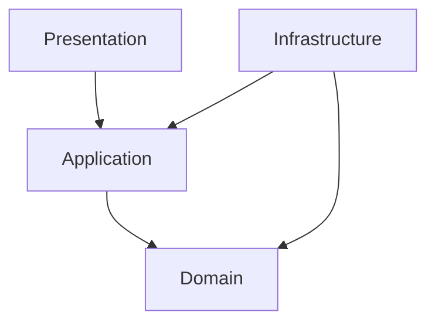
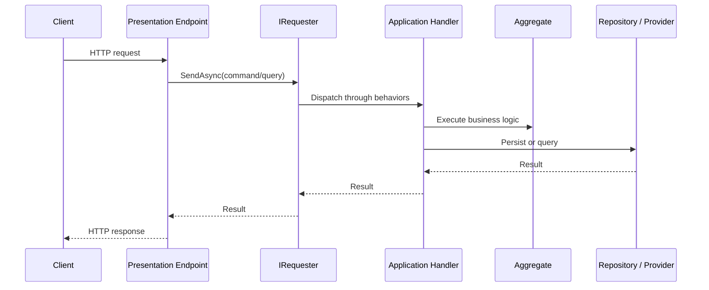

# Architecture

`bITdevKit` is designed around clean architecture with modular vertical slices. The goal is to keep
business logic explicit, testable, and isolated from infrastructure choices.

## High-level architecture map



## Layer responsibilities

### Domain

- aggregates, entities, value objects, typed ids
- domain events, domain policies, and business rules
- no dependency on outer layers

### Application

- commands, queries, handlers, DTOs, specifications
- orchestration through requester/notifier flows
- depends on domain, not on infrastructure

### Infrastructure

- persistence, messaging transports, queue brokers, storage providers
- implements abstractions required by inner layers
- contains integration details and operational mechanics

### Presentation

- minimal API endpoints, web-facing modules, console-facing features
- request/response mapping and endpoint composition

## Modular vertical slices

The preferred shape is a modular monolith where each module owns its own domain, application,
infrastructure, and presentation concerns.

```text
Module/
├── Module.Domain
├── Module.Application
├── Module.Infrastructure
└── Module.Presentation
```

This keeps business capabilities cohesive while still allowing a single host application to compose
many modules together.

## Request flow in practice



## Architectural building blocks that matter most

- [DDD Introduction](reference/introduction-ddd-guide.md)
- [Domain](reference/features-domain.md)
- [Application Commands and Queries](reference/features-application-commands-queries.md)
- [Requester and Notifier](reference/features-requester-notifier.md)
- [Modules](reference/features-modules.md)
- [Presentation Endpoints](reference/features-presentation-endpoints.md)

## Related decisions

- [Messaging vs Queueing](decisions-messaging-vs-queueing.md)
- [Repository vs ActiveEntity](decisions-repository-vs-activeentity.md)
