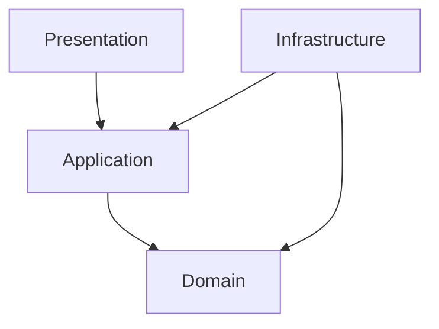
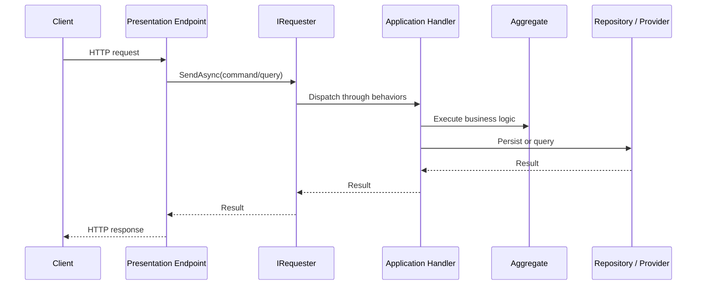

# Architecture

`bITdevKit` applies clean architecture through modular vertical slices. Domain and application code depend only on inner layers. Infrastructure and presentation provide integrations and entry points.

## High-level architecture map


```mermaid
flowchart TB
    Presentation[Presentation]
    Infrastructure[Infrastructure]
    Application[Application]
    Domain[Domain]

    Presentation --> Application
    Infrastructure --> Application
    Infrastructure --> Domain
    Application --> Domain
```

## Layer responsibilities

### Domain

- aggregates, entities, value objects, and typed IDs
- domain events, domain policies, and business rules
- no dependency on outer layers

### Application

- commands, queries, handlers, DTOs, specifications
- orchestration through requester/notifier flows
- depends on domain, not on infrastructure

### Infrastructure

- persistence, messaging transports, queue brokers, storage providers
- implements abstractions required by inner layers
- contains integration details and operational mechanics

### Presentation

- minimal API endpoints, web-facing modules, console-facing features
- request/response mapping and endpoint composition

## Modular vertical slices

A modular monolith can group each module's domain, application, infrastructure, and presentation code.

```text
Module/
├── Module.Domain
├── Module.Application
├── Module.Infrastructure
└── Module.Presentation
```

A single host application can compose multiple modules without merging their layer boundaries.

## Request flow in practice


```mermaid
sequenceDiagram
    participant Client
    participant Endpoint as Presentation Endpoint
    participant Requester as IRequester
    participant Handler as Application Handler
    participant Domain as Aggregate
    participant Repository as Repository / Provider

    Client->>Endpoint: HTTP request
    Endpoint->>Requester: SendAsync(command/query)
    Requester->>Handler: Dispatch through behaviors
    Handler->>Domain: Execute business logic
    Handler->>Repository: Persist or query
    Repository-->>Handler: Result
    Handler-->>Requester: Result
    Requester-->>Endpoint: Result
    Endpoint-->>Client: HTTP response
```

## Related architecture guides

- [DDD Introduction](reference/introduction-ddd-guide.md)
- [Domain](reference/features-domain.md)
- [Application Commands and Queries](reference/features-application-commands-queries.md)
- [Requester and Notifier](reference/features-requester-notifier.md)
- [Modules](reference/features-modules.md)
- [Presentation Endpoints](reference/features-presentation-endpoints.md)
