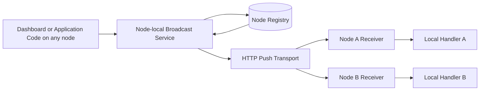
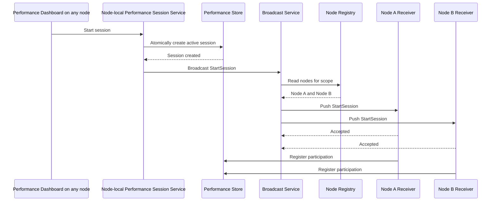

# Design Specification: Broadcast Feature (Common.Utilities.Broadcasting)

> Push short-lived control notifications to every currently registered and reachable application node without requiring a message broker or continuous signal polling.

[TOC]

## Overview

`Common.Utilities.Broadcasting` provides lightweight, deployment-aware fan-out for control notifications that must reach every currently registered and reachable application node in a broadcast scope. It is intended as a direct-push alternative where periodic polling is undesirable, too slow, or would disturb the workload being observed.

The feature is intended for operational and developer-oriented coordination where all currently reachable replicas should react immediately to the same short-lived instruction. Typical examples include starting a performance collection session, collecting an immediate runtime snapshot, triggering garbage collection, invalidating runtime-only state, or refreshing node-local developer tooling.

Broadcasting deliberately uses a different model from Messaging and Queueing:

- **Messaging** provides asynchronous application and integration messaging with broker-specific delivery, retries, persistence, and handler processing semantics.
- **Queueing** dispatches one work item to one logical consumer.
- **Broadcasting** pushes one short-lived control notification directly to every registered and reachable node in a scope.

The feature uses a shared node registry for discovery, but it does not store messages for nodes to poll. Every registered node can initiate a broadcast to all nodes already registered in the targeted scopes. For each invocation, the initiating node reads the current registrations and pushes the notification directly to each selected node over the configured transport. There is no master, leader, elected coordinator, or permanently designated broadcaster node.

Broadcasting is registered through a fluent builder that is re-entrant and additive for one application host. Higher-level features may call `AddBroadcasting` to contribute their handlers and required scopes, and application code may call it again to select the shared registry provider, configure the shared transport, or add other handlers. Repeated calls compose one host-wide broadcast runtime, node registration, registry provider, receiver, and publishing service; they do not create isolated registries.

The composed runtime has one shared enabled state. Calling `AddBroadcasting` opts the feature in by default, while the fluent builder may disable it from environment-aware configuration, for example with `Enabled(builder.Environment.IsDevelopment())`. A disabled runtime retains its composed configuration in dependency injection but performs no node registration, receiver mapping, background dispatch, registry maintenance, or transport work.

The standard multi-node design uses:

- an Entity Framework-backed node registry
- an HTTP-based push transport
- a node-local broadcast receiver hosted by the application
- typed node-local handlers resolved through dependency injection

An in-memory mode shall support single-process development and testing without a database or network transport.

## Feature Placement And Layering

The Broadcast feature is anchored in `Common.Utilities` because it is a low-level coordination utility that may be consumed by higher-level DevKit features without introducing a dependency on Application-layer messaging concepts.

The feature spans existing DevKit projects while preserving `Common.Utilities.Broadcasting` as the public core abstraction. No new project is introduced:

- `Common.Utilities.Broadcasting` owns the broadcast contracts, envelopes, scopes, publishing service, handler contract, delivery results, local dispatch semantics, node identity abstractions, the registry-store abstraction, and the in-memory registry-store provider.
- `Infrastructure.EntityFramework/Broadcasting` provides the shared Entity Framework registry-store provider inside the existing Infrastructure.EntityFramework project.
- `Presentation.Web/Broadcasting` provides the internal HTTP receiver endpoint and ASP.NET Core hosting integration inside the existing Presentation.Web project.
- higher-level features such as Metrics or the Performance Snapshot Dashboard may embed the core registration builder to contribute handlers and scopes, but depend on the core broadcast abstraction rather than directly on Entity Framework or HTTP types.

Provider packages shall not change the application-facing broadcast semantics. The core feature shall not depend on the DevKit Messaging, Queueing, Jobs, or Orchestration packages.

## Problem Statement

Applications with several running nodes sometimes need to trigger the same lightweight action on every live process. Existing alternatives are often a poor fit:

- a queue delivers work to one consumer rather than every node
- a full message broker adds infrastructure and delivery semantics that are unnecessary for developer and operational control actions
- database polling introduces permanent background traffic and can distort performance tests
- load-balanced HTTP calls do not guarantee that every process receives the request
- hardcoded node addresses do not adapt to changing local, container, or scaled deployments

The feature shall provide a small DevKit-native mechanism that knows which nodes are currently registered and pushes a bounded notification directly to each of them.

## Goals

The goals of the Broadcast feature are:

- provide typed deployment-wide broadcast notifications
- allow any registered node to initiate a broadcast without a master or leader node
- deliver one notification to every currently registered and reachable node in a broadcast scope
- avoid continuous polling for broadcast messages
- avoid a dependency on the DevKit Messaging or Queueing features
- keep delivery best-effort, immediate, and bounded
- support local single-process development with negligible setup
- allow the host to enable or disable the complete composed runtime through fluent, environment-aware configuration
- support multi-node deployments through a provider-based registry store, with Entity Framework as the standard shared provider, and direct HTTP push
- return a per-node response outcome to the caller, showing which registered nodes responded to the direct delivery attempt
- support short-lived message expiry and duplicate protection
- keep node discovery separate from the application-specific broadcast payload
- keep higher-level features independent of the concrete registry and transport providers
- integrate with normal dependency injection, logging, metrics, authorization, and Result-based outcomes
- provide a reusable low-level foundation for higher-level DevKit features such as Metrics and the Performance Snapshot Dashboard

## Non-Goals

The Broadcast feature does not provide:

- durable message delivery
- delivery to nodes that were offline when the broadcast occurred
- stored message queues
- polling workers for message discovery
- transactional outbox behavior
- dead-letter queues
- long-lived retries
- exactly-once processing
- centralized handler-completion tracking
- persisted broadcast execution history
- later completion callbacks from receiving nodes
- ordered delivery across broadcasts
- competing-consumer semantics
- application integration events
- business-event persistence
- event replay
- cross-system workflow orchestration
- general-purpose service discovery outside broadcast delivery
- load balancing
- a replacement for Messaging, Queueing, Jobs, or Orchestrations
- arbitrary large-payload transfer
- raw TCP protocol ownership

## Terminology

| Term | Meaning |
| --- | --- |
| Broadcast | One short-lived notification pushed to all targeted registered nodes. |
| Broadcast scope | Logical deployment or application boundary whose registered nodes receive the same broadcast. |
| Node | One running application process capable of receiving broadcast notifications. |
| Node identity | Identifier for one process instance, based by default on hostname or container name combined with process id. |
| Node registration | Registry record that describes a node and the direct address at which it can receive broadcasts. |
| Advertised address | Directly reachable address for one specific node, not a load-balanced application address. |
| Broadcaster role | Per-broadcast role performed by the publishing node while it resolves registrations and pushes the notification to each target. It is not a master-node role. |
| Receiver | Internal node endpoint that accepts incoming broadcast envelopes. |
| Handler | Node-local application component that handles one supported broadcast type. |
| Broadcast envelope | Transport-neutral metadata and payload sent to a node. |
| Delivery result | Per-node outcome of the immediate delivery request, indicating whether the node responded and accepted or rejected the broadcast. It does not represent handler completion. |
| Live-node delivery | Delivery only to nodes registered and reachable when the broadcast is issued. |
| Host-wide broadcast runtime | The single composed broadcast runtime created for one application host, including its shared registry provider, node registration, receiver, publisher, options, scopes, and handlers. |

## Core Design Principles

- The node registry stores registrations, not broadcast messages.
- Repeated `AddBroadcasting` calls compose one host-wide broadcast runtime and one shared registry provider.
- Higher-level features may contribute handlers and required scopes without owning a separate registry or receiver.
- One host-wide enabled state gates all runtime side effects while preserving additive registration from higher-level features.
- Broadcast delivery is push-based.
- Any registered node may initiate a broadcast.
- There is no master, leader, or elected coordinator node.
- The initiating node queries the registry only when a broadcast is sent.
- Every target node receives its own direct delivery attempt.
- A node must be directly addressable; a load-balanced address is not a node address.
- Broadcasts are short-lived control notifications, not durable business messages.
- Missing a broadcast is an accepted outcome of best-effort delivery.
- Duplicate delivery is possible and must be safe.
- The receiver responds after the broadcast has been validated and accepted for local execution.
- Local work continues independently after the delivery response when necessary.
- The broadcasting feature does not collect, persist, or reconcile later handler-completion outcomes.
- Broadcast payloads are bounded and must not be used to transfer large content.
- The caller receives a Result containing aggregate and per-node delivery outcomes.
- Provider and transport details remain hidden from application consumers.

## High-Level Architecture



The registry is consulted only for registration maintenance and when a broadcast operation resolves its target snapshot. Nodes do not poll the registry for messages. Every node hosts the same publishing service and receiver capabilities, so any registered node may initiate a broadcast to the nodes that are already registered at that moment.

## Broadcast Scope

A broadcast scope identifies the application deployment whose nodes should receive a notification.

Examples include:

- `Orders.Api.Local`
- `BackOffice.Web.Development`
- `OrdersService.Test`

Rules:

- scope configuration is optional; when no `AddBroadcasting` call contributes a scope, the host registration shall use the case-insensitive `default` scope
- the host registration shall use the distinct union of scopes contributed by every `AddBroadcasting` call
- the first explicit scope contribution shall replace only the implicit `default` fallback; an explicitly contributed `default` scope shall remain alongside later named scopes
- a node may subscribe to several scopes simultaneously
- a broadcast may target one or more explicit scopes; an omitted, null, empty, or whitespace-only target-scope collection shall target `default`
- a publishing node may target only scopes included in its own active registration
- a shared-store broadcast may be initiated only by an actively registered node
- only registrations in the targeted scopes are selected
- a node matched through several targeted scopes shall receive the broadcast only once
- applications sharing the same registry shall not receive each other's broadcasts unless they intentionally share a scope
- scope names shall be stable for the lifetime of a deployment
- the feature shall not infer cross-service scopes automatically

The performance dashboard shall normally broadcast within the scope of the application host that owns the dashboard.

## Node Identity

Each registration shall identify one running process instance.

The default node identity shall combine:

- machine, container, or host name
- process id

Example:

```text
weather-api-1:18432
```

Rules:

- the identity must distinguish concurrent processes on the same machine
- a restarted process is treated as a new node instance when its process id changes
- applications may provide a custom node identity when the default is unsuitable
- node identity is operational metadata and shall not be used as a security credential
- duplicate active registrations for the same scope and node identity shall be rejected or replaced deterministically

## Node Registration

### Registration lifecycle

A broadcast-capable node shall register after the host has started and its receiver address is known.

The node shall attempt to unregister during graceful shutdown.

Registration shall not depend on a high-frequency heartbeat or signal polling loop.

A registration contains at least:

- one or more effective broadcast scopes, including the implicit `default` scope when none is configured
- node identity
- advertised receiver address or address resolver configuration
- process start timestamp
- registration timestamp
- protocol version
- latest successful reachability timestamp when available
- latest failed reachability information when available

### Registration behavior

- registration is idempotent for the same node identity and subscribed scope set
- one application process shall maintain one node registration in the shared registry regardless of how many application modules call `AddBroadcasting`
- repeated `AddBroadcasting` calls shall update the one host registration with the distinct union of configured scopes rather than creating one registry row per call or per consuming feature
- initial registration shall begin only after the host reports `ApplicationStarted` and shall support a configurable, non-blocking startup delay
- when the Entity Framework provider is selected, initial registration shall automatically wait for the selected application `DbContext` readiness through the optional `IDatabaseReadyService`
- absence of `IDatabaseReadyService` shall not prevent or delay registration after the configured startup delay
- `IDatabaseReadyService` shall be defined in `Common.Abstractions` so infrastructure-neutral features can consume the readiness contract without referencing Domain or Entity Framework packages
- restarting, rebinding, or changing scope subscriptions may update the registration
- a registration shall not contain passwords, tokens, client secrets, or other transport credentials
- stale registrations may remain after an ungraceful process failure
- failed direct delivery may update the registration's reachability diagnostics
- registrations repeatedly proven unreachable shall be marked inactive after a configurable consecutive-failure threshold
- the default consecutive-failure threshold shall be three
- a successful delivery resets the consecutive-failure count
- registration age alone shall not be treated as proof that a node is unavailable unless an optional lease is enabled
- inactive registrations remain available for operational inspection and manual removal
- successful re-registration with the same node identity reactivates the registration and resets failure diagnostics

### Optional registration lease

The feature may maintain an optional low-frequency registration lease for deployments where stale registrations must be removed proactively.

Rules:

- registration leasing is disabled by default
- when enabled, the node renews its own registration at a configurable low frequency
- lease renewal is registration maintenance only; it is not used to discover broadcast messages
- expired registrations are marked inactive and excluded from new broadcast target snapshots
- lease renewal and cleanup intervals shall remain coarse enough to avoid continuous background pressure
- recommended defaults when enabled are a one-minute renewal interval and a three-minute lease duration
- failed delivery cleanup remains available whether or not leasing is enabled

## Addressability

The advertised receiver address must identify one specific process instance.

Valid examples include:

- a localhost address for one local process
- a Docker Compose service or container DNS address
- a directly reachable pod address or pod-specific DNS address
- a machine hostname and application port
- an IIS-hosted node address that resolves to one worker process rather than the shared site
- an Azure-hosted instance address or platform-provided instance endpoint that resolves to one application instance

A shared load-balanced address is invalid because repeated calls may reach the same node.

### Address resolution

The feature shall resolve the advertised address through a pluggable node-address resolver chain using the following precedence:

1. explicit configured node address
2. custom application or platform address resolver
3. Kestrel-bound address derivation when the binding is concrete and directly reachable by peer nodes
4. registration failure when no resolver can provide a valid per-node address

The resolver chain shall support:

- direct process-local addresses for single-process development
- explicitly configured per-node addresses
- container and orchestration metadata such as container DNS names, pod addresses, or injected instance addresses
- IIS and Azure hosting integrations where the hosting environment can expose a per-instance address
- Kestrel-bound address derivation as a fallback for concrete directly reachable bindings

Rules:

- automatic resolution must never register a wildcard binding such as `0.0.0.0`, `[::]`, `*`, or `+` as the advertised host
- shared load-balanced addresses are documented as invalid for per-node delivery; the feature cannot reliably detect every such address automatically
- the resolved address must use an allowed scheme and contain the configured receiver route
- startup shall fail clearly for a shared multi-node registry when no direct node address can be resolved
- applications may replace or extend the resolver chain for platform-specific hosting environments
- IIS, Azure App Service, container platforms, and orchestration environments may not expose a directly reachable per-process address automatically; in that case a platform integration or explicit per-node address is required
- an address is valid only when another registered node can use it to reach that exact process instance rather than an arbitrary replica behind a shared frontend

When the publishing node is part of the target set, it shall dispatch the broadcast locally and shall not call its own HTTP endpoint.

## Standard Transport

HTTP shall be the standard transport for multi-node broadcasting.

HTTP is preferred because DevKit web hosts already use Kestrel and HTTP provides established support for:

- routing
- serialization
- cancellation
- timeouts
- authentication and authorization
- HTTPS
- diagnostics
- cross-platform and container networking

The receiver shall be exposed as an internal DevKit endpoint under the `/_bdk/api/*` route space.

The exact route remains configurable, with a default under:

```text
/_bdk/api/broadcasting
```

The transport shall:

- send one direct request per targeted node
- use bounded delivery concurrency
- enforce short connection and request timeouts
- avoid automatic long-running retries
- propagate the broadcast id and application correlation id in the envelope and the
  middleware-compatible `CorrelationId` HTTP header
- return a structured node delivery response
- never log payload content by default

Named pipes, Unix-domain sockets, raw TCP, and gRPC are not required by the standard feature. Alternative transports may be added behind the same internal transport boundary without changing application-facing broadcast semantics.

## Broadcast Envelope

A broadcast envelope shall contain enough metadata for safe bounded processing:

- unique broadcast id
- broadcast CLR full type name
- target scope
- sender node identity when available
- creation timestamp
- expiration timestamp
- protocol version
- application correlation identifier when available
- serialized payload

Rules:

- the application correlation identifier is independent from the distributed tracing `TraceId`
- publishers shall obtain the current correlation identifier through `CorrelationId.Current`
- receiver and handler execution shall expose the transported value through
  `CorrelationId.Current`
- the broadcast type identifier shall be the CLR full type name of the registered message type
- only types with a locally registered handler may be deserialized and dispatched
- unknown CLR type names shall return `Unsupported` without arbitrary runtime type activation
- payload size shall be bounded by configuration
- payload content shall not be written to logs
- expired envelopes shall not be handled
- node registrations shall not advertise or synchronize supported message types
- the publishing node shall target every registered node in scope regardless of its local handler set
- unknown message types shall return an optional `Unsupported` outcome without invoking a handler
- malformed envelopes shall be rejected without invoking handlers

## Publishing

Application code shall publish through a broadcast service rather than resolving the registry or HTTP transport directly.

Conceptually, the caller supplies:

- target scope
- typed broadcast message
- optional expiration or delivery deadline

Publishing performs the following steps on whichever node initiated the call:

1. validate the scopes, message, and payload size
2. resolve the current registration snapshot for the targeted scopes
3. deduplicate registrations that match more than one targeted scope
4. dispatch locally when the publishing node is part of the target set
5. attempt direct delivery to all other selected nodes with bounded concurrency
6. collect one outcome per target node
7. return an aggregate Result

The target set is fixed from the registration snapshot taken by the publishing node for that broadcast. Only nodes already registered in at least one targeted scope at that moment are selected. Nodes that register afterward are not added to the in-progress broadcast. Concurrent broadcasts from different nodes are allowed and remain independent operations.

An empty target set returns a successful broadcast result with zero deliveries unless the caller explicitly requires at least one target.

## Receiving And Local Dispatch

Each node hosts one internal receiver endpoint.

The receiver shall:

- apply the configured transport authentication extension when one is enabled
- validate the envelope and expiry
- detect recently processed broadcast ids
- resolve the single registered local handler for the message type
- enqueue the broadcast into bounded node-local execution
- return a structured response without waiting for handler completion

Exactly one effective node-local handler is allowed per broadcast type. Duplicate handler registration shall fail clearly. A handler may delegate internally when several local components must react.

`Accepted` means that the node received, validated, deduplicated, and accepted the broadcast for local execution. It does not mean that handler execution completed successfully.

The node-local execution path shall:

- execute accepted broadcasts asynchronously through the node-local dispatcher after the receiver response
- create an application service scope for each handler execution
- keep accepted local work bounded
- reject new work when local execution capacity cannot accept it
- preserve acceptance order for broadcasts of the same broadcast CLR type
- allow different broadcast CLR types to execute concurrently within configured bounds
- make no cross-node ordering guarantee
- never report later completion back to the initiating node

The core feature shall not persist or aggregate handler completion, handler failure, or execution history. Receiving applications may log their own local handler failures through normal application logging.

## Duplicate Handling

The transport cannot guarantee that a response is always observed by the sender. Duplicate delivery must therefore be safe.

Each node shall keep a bounded record of recently processed broadcast ids.

When a duplicate id is received:

- the handler shall not be accepted again
- the receiver shall return `AlreadyProcessed`

The duplicate record may be in memory because broadcasts are short-lived and are not replayed after node restart.

Application handlers shall still be idempotent where repeated side effects would be harmful.

## Broadcast Semantics

### Delivery model

The feature provides best-effort live-node fan-out.

This means:

- all nodes present in the selected registry snapshot are targeted
- all reachable nodes should receive the notification
- unreachable nodes do not receive it later
- newly registered nodes do not receive an earlier broadcast
- removed or crashed nodes may appear as failed delivery targets until their registrations are cleaned up

### Reliability

The feature does not guarantee:

- exactly-once delivery
- durable delivery
- delivery after node restart
- offline delivery
- ordering between different broadcasts
- transactionality between registry state and node-side handling

### Expiration

Every broadcast shall have a bounded lifetime.

A node receiving the envelope after its expiration shall return `Expired` without invoking the handler.

Short expiration windows are appropriate for developer controls such as performance-session participation.

### Retries

The core feature shall not perform long-lived retries.

Any immediate retry policy must remain bounded by the envelope expiration and must preserve duplicate protection. The conservative default is one delivery attempt per node.

## Delivery Outcomes

A per-node delivery result shall distinguish at least:

- `Accepted`
- `AlreadyProcessed`
- `Expired`
- `Unsupported`
- `Rejected`
- `Failed`
- `Unreachable`
- `TimedOut`

A broadcast result shall expose:

- broadcast id
- target scope
- started and completed timestamps for the delivery operation
- total target count
- responded count
- accepted count
- failed or unreachable count
- expired count
- per-node response outcomes

The outer Result shall fail only when the broadcast operation itself cannot be meaningfully executed, such as invalid input or unavailable registry infrastructure. Expected per-node delivery failures belong in the broadcast result.

Broadcast delivery results are returned to the caller. They are not persisted as broadcast history, handler history, or completion state by the core feature.

## Registry Store Providers

The shared node registry shall be accessed through a provider-neutral registry-store abstraction. The broadcast service and node registrar shall depend on that abstraction rather than on Entity Framework, database entities, or a concrete storage technology.

The registry store is responsible only for node-discovery state:

- register or update one node and its subscribed scopes
- unregister one node during graceful shutdown
- resolve a snapshot of active registrations for one or more scopes
- record lightweight reachability diagnostics
- disable, reactivate, or remove stale registrations
- maintain optional registration-lease timestamps when leasing is enabled

The registry store shall not persist broadcast envelopes, pending deliveries, handler outcomes, or broadcast history.

Required standard providers are:

- an in-memory registry-store provider
- an Entity Framework registry-store provider

Additional providers may be added without changing broadcast contracts or delivery semantics.

### In-memory registry-store provider

The in-memory provider supports:

- tests
- local development
- single-process applications
- direct local dispatch

It does not provide cross-process discovery and loses all registrations when the process stops.

### Entity Framework registry-store provider

The Entity Framework provider is the standard shared provider for multi-node deployments. It supports:

- shared registration across application nodes
- atomic registration updates
- registration lookup by one or more scopes
- deterministic replacement or update of duplicate registrations
- reachability diagnostics and consecutive-failure tracking
- optional lease renewal and expiry
- operational cleanup and manual removal

The consuming application owns and registers the Entity Framework `DbContext`. The context shall opt into Broadcasting by implementing `IBroadcastingContext` and exposing `DbSet<BroadcastNodeRegistrationEntity> BroadcastNodeRegistrations` and `DbSet<BroadcastNodeScopeEntity> BroadcastNodeScopes`. The application also owns the migration that creates the broadcast-registry tables.

```csharp
public sealed class AppDbContext : DbContext, IBroadcastingContext
{
    public DbSet<BroadcastNodeRegistrationEntity> BroadcastNodeRegistrations { get; set; }

    public DbSet<BroadcastNodeScopeEntity> BroadcastNodeScopes { get; set; }
}
```

The context contract and entities shall follow the established patterns used by other `Infrastructure.EntityFramework` features such as Messaging and Jobs:

- `IBroadcastingContext` is a small feature-capability interface implemented by the application `DbContext`
- the public entities live under `Infrastructure.EntityFramework/Broadcasting/Entities`
- `BroadcastNodeRegistrationEntity` maps to `__Broadcasting_NodeRegistrations`
- `BroadcastNodeScopeEntity` maps to `__Broadcasting_NodeScopes`
- mappings use Entity Framework data annotations and conventions, including `[Table]`, `[Index]`, `[Key]` or `[PrimaryKey]`, `[Required]`, `[MaxLength]`, and `[ConcurrencyCheck]` where applicable
- the entities carry sufficient mapping metadata to avoid requiring a Broadcasting-specific `OnModelCreating` call
- `BroadcastNodeRegistrationEntity` contains the node identity, advertised address, process and registration timestamps, protocol version, active state, reachability diagnostics, optional lease timestamps, and a `Guid` concurrency version
- `BroadcastNodeRegistrationEntity` provides an `AdvanceConcurrencyVersion()` method consistent with other concurrently updated DevKit EF entities
- `BroadcastNodeScopeEntity` normalizes the node-to-scope relationship rather than storing the scope collection as JSON
- the registration table enforces one logical registration per node identity, and the scope table enforces one association per node registration and normalized scope
- scope lookup is indexed from scope to active node registrations

One node may be associated with several scope rows, but node-level address, reachability, failure-count, active-state, and lease data shall be stored once on the node registration row. The EF model shall not partition or duplicate registry state by the application module or `AddBroadcasting` call that contributed a handler or scope.

The provider shall use operation-owned scopes or otherwise follow normal Entity Framework lifetime rules. It shall not retain a scoped application `DbContext` inside a singleton broadcaster or transport service.

The EF provider stores node registrations only. It does not store broadcast payloads for polling, replay, delivery tracking, or handler completion.

### Store registration

All fluent registration calls in one host shall resolve to one effective registry-store provider. The first `AddBroadcasting` call establishes the shared runtime and may use the in-memory provider as the single-process fallback. A later explicit Entity Framework or custom provider selection replaces only that fallback for the entire shared runtime.

The developer experience shall support:

- selecting the in-memory store for local or single-process usage
- selecting the Entity Framework store with an application-owned `DbContext`
- reopening the shared builder through repeated `AddBroadcasting` calls
- treating repeated selection of the same effective provider as idempotent
- failing clearly when different explicit registry providers are selected for the same host
- registering the required receiver endpoint and HTTP transport independently from the store
- replacing the store provider without changing callers or handlers

The application-facing broadcast API shall not expose registry-store queries, EF entities, `DbContext`, or provider-specific options.

## Failure Behavior

### Registry unavailable

When the registry cannot be read:

- the broadcast shall return a failed Result
- no assumption shall be made that all nodes were reached
- the application shall remain running

### Individual node unavailable

When one target cannot be reached:

- other node deliveries continue
- the node receives an `Unreachable` or `TimedOut` result
- the registration's reachability diagnostics may be updated
- the complete broadcast may still be considered partially successful

### Local handler failure

Because the receiver returns after acceptance, a later handler failure does not change the delivery outcome already returned to the initiating node. The accepted delivery remains `Accepted`; no completion callback, completion collection, or later delivery-status update is sent. Other node executions remain unaffected.

### Sender failure

If the initiating process fails after some direct deliveries have completed, already delivered nodes may still process the broadcast. The feature does not provide transaction rollback across nodes.

## Security

Broadcasting exposes a node-level control endpoint and therefore must be treated as an internal privileged surface.

Requirements:

- the receiver endpoint shall support a dedicated transport-authentication abstraction
- no transport authentication is enabled by default, and the application must explicitly enable authentication whenever the receiver is exposed beyond a trusted development boundary
- the DevKit shall provide shared-secret authentication as a supported built-in HTTP authentication mode rather than only as a sample implementation
- the fluent HTTP configuration shall accept the shared secret obtained from application configuration; every node communicating within a scope shall use the same configured value
- shared-secret configuration shall accept every string value without trimming, including empty and whitespace-only values; a missing configuration value shall be treated as an empty string
- the built-in HTTP sender shall place a header-safe Base64 representation of the exact configured UTF-8 secret bytes in the `X-Bdk-Broadcast-Key` request header, and the inbound receiver shall read, decode, and validate that header; the encoding provides transport fidelity rather than encryption
- when the configured secret is empty, a missing or empty `X-Bdk-Broadcast-Key` header shall represent the same empty value and authenticate successfully
- when the configured secret is non-empty, a missing, malformed, multiply-valued, or non-matching header shall be rejected before envelope payload deserialization, local queue admission, or handler dispatch
- shared-secret comparison shall use a fixed-time comparison of the configured and received secret bytes
- the configured shared secret shall exist only in the application's configuration/options memory and its transient encoded outbound request header; it shall not be persisted in the registry, envelope, diagnostics, results, logs, or metrics
- authentication extensions shall still be able to add bearer-token, certificate, or platform-specific authentication without changing broadcast contracts
- authentication failures shall be rejected before local dispatch
- the broadcast endpoint's dedicated transport authentication shall not register, replace, select, challenge, or otherwise modify the application's ASP.NET Core authentication schemes or authorization policies
- the mapped broadcast endpoint shall explicitly bypass the application's default or fallback authorization policy, including OAuth or bearer policies, and shall enforce its configured transport authentication independently
- a host that uses bearer authentication for its application endpoints shall be able to use shared-secret authentication alone for the broadcast endpoint; the broadcast request shall not require an `Authorization` header
- mapping Broadcasting shall not make any non-broadcast application endpoint anonymous or change its authentication or authorization behavior
- registry entries shall not contain credentials
- transport credentials shall be resolved from configuration or an authentication integration
- advertised addresses shall be validated before use
- only supported HTTP or HTTPS schemes shall be accepted
- payload content shall not be logged
- the endpoint shall enforce the configured payload-size limit
- the receiver shall reject a scope that does not match the local configured scope
- operational registry management shall require privileged authorization

## Configuration And Defaults

The feature shall expose configuration for:

- enabled state
- initial registration startup delay
- optional database-readiness coordination name and timeout
- optional broadcast scopes, with `default` used when none are configured
- node identity
- advertised receiver address or address resolver configuration
- receiver route
- registry provider
- HTTP transport timeout
- maximum concurrent node deliveries
- maximum payload size
- default broadcast lifetime
- duplicate-record capacity and retention
- unreachable-registration failure threshold
- optional registration lease and renewal interval
- node-local handler queue capacity
- HTTP authentication mode, including a built-in shared-secret value supplied from application configuration

Recommended defaults:

- disabled until explicitly registered
- enabled after `AddBroadcasting` unless the shared builder sets `Enabled(false)`
- case-insensitive `default` registration and publication scope when scopes are omitted
- initial registration startup delay of zero
- Entity Framework registration waits up to two minutes for its application `DbContext` when the optional database-readiness service is registered
- node identity based on hostname plus process id
- receiver route under `/_bdk/api/broadcasting`
- JSON payload serialization using the DevKit serializer abstraction
- maximum serialized payload size of 64 KB
- per-node HTTP request timeout of 2 seconds
- maximum of 16 concurrent node deliveries
- one delivery attempt per node
- default broadcast lifetime of 5 seconds
- node-local queue capacity of 32 accepted broadcasts per handler
- duplicate-record capacity of 1,024 broadcast ids
- duplicate-record retention of 10 minutes and always longer than the broadcast lifetime
- consecutive delivery failure threshold of three
- failed registrations are marked inactive and retained for inspection
- registration leasing disabled by default
- when leasing is enabled, one-minute renewal and three-minute lease duration
- expired leased registrations are marked inactive and retained for inspection
- no transport authentication by default
- when built-in shared-secret authentication is selected, a missing configuration value is accepted as the empty development secret; production deployments should configure a non-empty value
- in-memory registry for single-process use
- Entity Framework registry for multi-node use

When the shared enabled state is `false`:

- the host does not register or renew a node in the registry
- the HTTP receiver endpoint is not mapped
- local dispatcher readers and registration-maintenance loops are not started
- publishing returns a failed `Result<BroadcastResult>` with a specific Broadcasting-disabled error and performs no registry, serialization, local dispatch, or transport work
- provider, address, and scope settings that are required only for execution are not required to start the disabled host
- operational diagnostics may report that Broadcasting is disabled but shall not expose the configured shared secret

## Registration And Developer Experience

The feature shall provide fluent, re-entrant registration consistent with other DevKit features.

`AddBroadcasting` shall return a `BroadcastingBuilderContext`. Every call for the same `IServiceCollection` shall reopen the same host-wide registration state. Builder extensions implemented by `Common.Utilities`, `Infrastructure.EntityFramework`, and `Presentation.Web` shall contribute to that shared state.

Conceptually, independent application modules and the host may compose the feature as follows:

```csharp
services.AddBroadcasting()
    .AddHandler<StartSessionBroadcast, StartSessionBroadcastHandler>();

services.AddBroadcasting()
    .AddHandler<InvalidateCacheBroadcast, InvalidateCacheBroadcastHandler>();

services.AddBroadcasting(options => options
        .Enabled(builder.Environment.IsDevelopment())
        .StartupDelay("00:00:15")
        .Scopes("DoFiesta.Web.Development"))
    .WithEntityFrameworkRegistry<AppDbContext>()
    .WithHttpTransport(options => options
        .SharedSecret(builder.Configuration["Broadcasting:SharedSecret"]));
```

These calls shall produce one `IBroadcastService`, one effective registry-store provider, one node registration lifecycle, one receiver, and one handler catalog for the host.

The developer experience shall support:

- registering the Common.Utilities Broadcast feature
- registering the feature repeatedly from independent application modules
- merging and deduplicating scopes contributed by repeated registration calls
- enabling or disabling the one composed runtime from environment-aware host configuration
- delaying initial registration without delaying application startup
- automatically coordinating Entity Framework registration with optional application-database readiness
- selecting an in-memory or Entity Framework registry-store provider
- supplying an application-owned DbContext when the Entity Framework provider is selected
- optionally configuring one or more scopes, with `default` used when omitted
- configuring or resolving the node address
- registering exactly one typed handler per broadcast type
- enabling the internal receiver endpoint
- configuring the built-in HTTP shared-secret authentication mode from application configuration
- optionally registering another transport authentication extension
- registering console commands for node inspection and built-in probe publication
- publishing a typed broadcast through dependency injection

The application-facing API shall not expose transport URLs, HttpClient usage, EF entities, or registry queries.

Multiple application modules may register handlers. Re-registering the same handler implementation for the same broadcast CLR type shall be idempotent so that an embedded feature can be registered safely more than once. Registering different handler implementations for the same broadcast CLR type shall fail clearly. A handler should take care of the fan-out of any internal work that must be performed by several local components.

Repeated selection of the same registry provider or HTTP transport shall be idempotent and may continue configuring the shared component. Selecting different explicit registry provider types or incompatible transport implementations for one host shall fail clearly during registration or startup. Embedded higher-level features should contribute handlers and required scopes; the application host retains control of shared deployment-specific provider, address, authentication, and transport configuration.

The latest explicit `Enabled(...)` value applied during service registration controls the one shared runtime. This allows an embedded feature to register Broadcasting safely while the application host makes the final environment-specific enablement decision.

## Operational Visibility

The feature shall provide a Broadcasting plugin for the existing Razor dashboard. The page shall expose:

- registered nodes grouped by scope
- node identity and advertised address
- registration and process start times
- protocol version
- latest successful delivery
- latest failed delivery
- consecutive delivery failures
- registration and optional lease timestamps
- process-local successful publication count from the shared metrics snapshot
- process-local receiver admission count labelled `Accepted locally`
- a test-publish action targeting one registered scope

The test action shall publish a built-in no-op `BroadcastProbe` through `IBroadcastService` and display
the resulting broadcast identifier, aggregate acceptance counts, and immediate per-node outcomes. It
shall not accept arbitrary CLR type names or payload JSON. The probe handler shall perform no
application work.

The dashboard shall derive its process-local counters from the `broadcasting_publish_*` and
`broadcasting_receiver_*_accepted` series exposed under the shared metrics snapshot's `broadcasting`
feature group. `Accepted locally` means the receiver validated and admitted the broadcast to the
bounded local handler queue; it shall not be labelled as processed or completed.

The page and test action shall inherit the existing dashboard endpoint-group authorization. They shall
not weaken receiver authentication, map an anonymous management route, expose transport credentials,
or retain broadcast payload or execution history. Provider-neutral diagnostics and privileged manual
removal remain available through their service contracts; stale-registration removal is not required
on the initial dashboard page.

## Observability

The feature shall emit structured logs and metrics for:

- node registration and unregistration
- registration update failures
- broadcast count
- target-node count
- accepted delivery count
- failed delivery count
- node delivery latency
- unreachable and timed-out nodes
- expired broadcasts
- unsupported message types
- duplicate broadcasts
- stale-registration removal

Metrics shall use low-cardinality dimensions such as scope, message type, and outcome. Node identity and endpoint addresses shall not be used as metric dimensions.

Logs may contain scope, broadcast CLR type, node identity, and delivery outcome. Logs shall not contain payload content or credentials.

## Potential Integration With Key/Value Storage

Key/Value Storage may later use Broadcasting as an optional fast-path adapter for immediate node-local cache eviction or synchronization notifications.

Such integration shall remain optional and shall not couple Broadcasting to Key/Value Storage. Because broadcasts are best-effort and non-durable, a consumer that requires deterministic eventual convergence must retain an independent recovery mechanism such as durable change-log processing, fresh backend reads, or bounded local expiry. Broadcasting provides immediate notification to currently registered and reachable nodes; it does not replace missed-notification recovery.

## Integration With The Performance Snapshot Dashboard

The Performance Snapshot Dashboard shall use Broadcasting for:

- starting a deployment-wide multi-node collection session
- stopping a collection session on all available nodes
- collecting an immediate snapshot on all available nodes
- triggering `GC.Collect()` on all available nodes

The performance feature remains responsible for:

- atomically enforcing one active performance session
- storing session definitions and snapshots
- recording node participation
- applying the one-second participation deadline
- deciding which accepted nodes become session participants

Broadcasting is responsible only for resolving the current target nodes and pushing the control notification.

## Example Flow: Start Performance Collection



No node polls the registry or performance store for the start command.

## Acceptance Criteria

### Broadcast to all reachable nodes

- Given three nodes are registered in one scope, when a broadcast is published, then each registered node receives an independent direct delivery attempt.
- Given two nodes accept and one node is unreachable, when the broadcast completes, then the result contains two accepted outcomes and one unreachable outcome.
- Given a node registers after the publishing node captured the target set, then it does not receive the in-progress broadcast.

### Publish from any node

- Given a broadcast is published without target scopes, or with only empty or whitespace target values, then it targets the case-insensitive `default` scope.
- Given several nodes are registered in the same scope, when any one of those nodes publishes a broadcast, then it resolves the current registry snapshot and targets every registered node in that scope.
- Given a node is not actively registered in the shared registry, when it attempts to publish, then the operation fails clearly.
- Given a node targets a scope outside its own active registration, when it attempts to publish, then the operation fails validation.
- Given no master node exists, when the node that published the previous broadcast stops, then any other registered node can publish the next broadcast without election or failover.
- Given two nodes publish different broadcasts concurrently, then both operations resolve and deliver independently.
- Given the publishing node belongs to the target set, then it handles its own broadcast through local dispatch and directly contacts only the other target nodes.

### Avoid message polling

- Given the feature is idle, then nodes do not poll the registry for broadcast messages.
- Given a broadcast is issued from any registered node, then that publishing node queries the registry and pushes notifications directly to the target nodes.
- Given the Entity Framework registry-store provider is used, then it stores node registrations but no pending broadcast-message queue.

### Register and unregister nodes

- Given no `AddBroadcasting` call contributes a scope, when the node registers, then it registers in the case-insensitive `default` scope.
- Given a node starts successfully, when its receiver address is resolved, then it registers its scopes, identity, address, and protocol metadata.
- Given a startup delay is configured, when the host reports `ApplicationStarted`, then host startup completes without waiting and initial node registration begins only after that delay.
- Given the Entity Framework provider and `IDatabaseReadyService` are registered, when the database is still initializing, then initial node registration waits for the selected application `DbContext` readiness before accessing the registry.
- Given database-readiness coordination is enabled but no `IDatabaseReadyService` is registered, when the startup delay completes, then initial node registration proceeds without a readiness wait.
- Given several application modules call `AddBroadcasting`, when the host starts, then the process creates or updates one shared node registration containing the distinct union of configured scopes.
- Given a node shuts down gracefully, then it attempts to remove its registration.
- Given a node crashes without unregistering, then later failed deliveries expose the stale registration without preventing delivery to healthy nodes.

### Compose repeated fluent registrations

- Given independent application modules call `AddBroadcasting`, when dependency injection is built, then the calls compose one host-wide `IBroadcastService`, registry provider, receiver, node lifecycle, and handler catalog.
- Given an earlier registration call contributed no scope and a later call contributes a named scope, when registration completes, then the named scope replaces the implicit `default` fallback.
- Given a registration call explicitly contributes `default` and a later call contributes a named scope, when registration completes, then both explicit scopes remain registered.
- Given repeated registration calls contribute different scopes, when the node registers, then the shared registry contains one node registration associated with the distinct union of those scopes.
- Given the same broadcast CLR type and handler implementation are registered more than once, when registration completes, then the effective handler is registered once.
- Given different handler implementations are registered for the same broadcast CLR type, when registration is validated, then registration fails clearly.
- Given the in-memory fallback exists and the host later selects the Entity Framework provider, when registration completes, then the Entity Framework provider becomes the one effective provider for the shared runtime.
- Given the same explicit provider or transport is selected repeatedly, when registration completes, then selection is idempotent and no duplicate runtime infrastructure is created.
- Given different explicit registry provider types or incompatible transport implementations are selected, when registration is validated, then registration fails clearly.

### Enable and disable the composed runtime

- Given `AddBroadcasting` is called without an explicit enabled value, when the host starts, then the one composed Broadcasting runtime is enabled.
- Given the host configures `Enabled(builder.Environment.IsDevelopment())` in a development environment, when the host starts, then Broadcasting is enabled.
- Given the host configures `Enabled(builder.Environment.IsDevelopment())` outside development, when the host starts, then no node is registered, no receiver endpoint is mapped, and no dispatcher or lease-maintenance work starts.
- Given Broadcasting is disabled, when a caller publishes a broadcast, then it receives the specific Broadcasting-disabled Result error and no registry, serialization, dispatch, or transport dependency is invoked.
- Given an embedded feature registers handlers or scopes before the host calls `Enabled(false)`, when dependency injection is built, then those contributions remain composed but the complete host-wide runtime remains inactive.
- Given configuration required only by an enabled provider or authentication mode is absent while Broadcasting is disabled, when the host starts, then the disabled feature does not fail startup for that absent runtime-only value.

### Use provider-based registry storage

- Given the in-memory registry-store provider is configured, when one process registers and broadcasts locally, then no Entity Framework or shared database dependency is required.
- Given the Entity Framework registry-store provider is configured, when several nodes use the same application database, then every node can resolve the same current registration snapshot.
- Given the Entity Framework provider is selected, when the consuming application context does not expose the required Broadcasting context contract, then registration or startup fails clearly.
- Given the Entity Framework provider is selected, when the consuming application context implements `IBroadcastingContext`, then it exposes the node-registration and node-scope sets required by the provider.
- Given the Entity Framework provider is selected, when migrations are created, then the consuming application owns the migration for `__Broadcasting_NodeRegistrations` and `__Broadcasting_NodeScopes`.
- Given the Broadcasting entities are included through `IBroadcastingContext`, when the EF model is created, then their table, key, index, length, required, and concurrency mappings are supplied through entity attributes and conventions without a Broadcasting-specific `OnModelCreating` call.
- Given one node subscribes to several scopes, when its registration is persisted, then node-level reachability and lease state is stored once and the scopes are stored as distinct relational associations.
- Given a singleton broadcast service uses the Entity Framework provider, when it performs a registry operation, then it resolves an operation-owned scope and does not retain the application `DbContext`.
- Given a custom registry-store provider is added, when it implements the registry-store contract, then publishing and receiving semantics remain unchanged.

### Enforce direct addressability

- Given a registration advertises a load-balanced shared address, then the configuration is documented as invalid and broadcast delivery to individual nodes is not expected to work.
- Given a concrete node address is resolved automatically or configured explicitly, then whichever node publishes a broadcast sends directly to that address.
- Given automatic address resolution cannot produce a direct address in a shared multi-node deployment, then explicit per-node configuration is required and startup fails clearly when it is absent.
- Given the publishing node is targeted, then local dispatch occurs without calling its own HTTP endpoint.

### Handle duplicate and expired broadcasts

- Given the same broadcast id is delivered twice, then the handler executes once and the second delivery returns `AlreadyProcessed`.
- Given a broadcast reaches a node after its expiration, then the handler does not execute and the receiver returns `Expired`.

### Isolate scopes

- Given two applications share the same registry but use different scopes, when one application broadcasts, then only nodes registered in its target scope are selected.
- Given one node is registered in several targeted scopes, when the publishing node builds the target set, then that node receives one delivery.
- Given one node subscribes to several targeted scopes, when one broadcast resolves the target set, then that node receives one delivery rather than one delivery per matching scope.

### Return per-node outcomes

- Given a broadcast targets several nodes with mixed results, then the caller receives one outcome per target and aggregate counts.
- Given one node fails, then deliveries to other nodes continue.
- Given the registry itself is unavailable, then the outer Result fails clearly.

### Protect the receiver

- Given no transport authentication extension is configured, when a valid internal request reaches the receiver, then it is processed without authentication.
- Given built-in shared-secret authentication is configured from application configuration, when the sender delivers a broadcast, then it includes the Base64 representation of the exact configured UTF-8 value in `X-Bdk-Broadcast-Key`.
- Given built-in shared-secret authentication is configured, when an inbound request contains the matching secret, then authentication succeeds and normal receiver validation continues.
- Given built-in shared-secret authentication is configured with a null or empty value, when the inbound header is missing or empty, then it matches the configured empty secret and normal receiver validation continues.
- Given built-in shared-secret authentication is configured with a whitespace-only value, when the sender and receiver communicate, then the exact whitespace UTF-8 bytes survive the header-safe encoding and authenticate successfully without being trimmed.
- Given built-in shared-secret authentication is configured with a non-empty value, when the inbound header is missing, malformed, multiply valued, or decodes to a different value, then the request is rejected before payload deserialization, queue admission, or local dispatch.
- Given a shared secret is configured, when registry state, diagnostics, Results, logs, and metrics are inspected, then the secret is not present.
- Given another authentication extension is configured, when a request fails authentication, then it is rejected before local dispatch.
- Given the application has a default or fallback OAuth/bearer authorization policy, when a broadcast request supplies only the matching shared-secret header, then the broadcast endpoint bypasses that application policy and processes the request through its dedicated transport authentication.
- Given the application has a protected non-broadcast endpoint, when Broadcasting is registered, then that endpoint retains its existing OAuth/bearer authentication and authorization requirements.
- Given a broadcast request supplies a valid application bearer token but an incorrect non-empty shared secret, then the broadcast endpoint rejects the request through its dedicated transport authentication.
- Given a registered node has no handler for the broadcast CLR type, when it receives the broadcast, then it returns `Unsupported` without invoking local work.
- Given an oversized payload is sent, then the receiver rejects it safely.

### Preserve local execution ordering

- Given two accepted broadcasts of the same broadcast CLR type arrive in order on one node, then their local handlers begin in acceptance order.
- Given accepted broadcasts of different broadcast CLR types arrive on one node, then they may execute concurrently within configured local bounds.
- Given several nodes receive the same broadcasts, then no cross-node execution ordering is guaranteed.

### Inspect and test from the dashboard

- Given Broadcasting and the DevKit dashboard are registered, when an authorized operator opens the Broadcasting page, then current registrations are shown with scope, identity, address, protocol, activity, reachability, registration, and lease details.
- Given Broadcasting is not registered, when dashboard navigation is built, then the Broadcasting page is hidden.
- Given Broadcasting is disabled, when dashboard navigation is built, then the Broadcasting page and badge are absent; when the page is opened directly, it reports the disabled runtime and does not offer an enabled probe action.
- Given Broadcasting is enabled, when dashboard navigation is built, then the Broadcasting item is shown without a count badge.
- Given the shared metrics snapshot is registered, when the Broadcasting page is rendered, then it shows successful publications made by this process as `Published` and receiver admissions on this process as `Accepted locally`.
- Given a broadcast is accepted into a local handler queue, when its dashboard metric is shown, then the label does not imply that handler processing completed successfully.
- Given an authorized operator activates the compact probe action in the dashboard header, then the built-in no-op `BroadcastProbe` targets the `default` scope through the normal broadcast pipeline without scope selection.
- Given dashboard input is untrusted, when a probe is published, then the endpoint never resolves an arbitrary CLR type or accepts an arbitrary payload.
- Given the host protects its dashboard, when the Broadcasting page or probe endpoint is requested, then the existing dashboard authorization applies unchanged.
- Given Broadcasting console commands are registered, when an operator runs `broadcasting list`, then the console displays provider-neutral node and scope diagnostics.
- Given Broadcasting console commands are registered, when an operator runs `broadcasting probe` without a scope option, then the built-in no-op probe targets the `default` scope through the normal broadcast pipeline.
- Given either Broadcasting command renders tabular output, then it uses the same minimal table border as the established DevKit Console Commands.

### Support the Performance Dashboard

- Given a performance session is started, when the performance feature publishes a start broadcast, then all registered and reachable nodes receive the start command without polling.
- Given nodes accept within the performance participation window, then the performance feature can record those nodes as participants.

## Resolved Design Decisions

- Broadcasting is a standalone DevKit feature.
- The feature is named `Common.Utilities.Broadcasting` and is anchored in `Common.Utilities`.
- The feature is implemented inside existing projects only: `Common.Utilities/Broadcasting`, `Infrastructure.EntityFramework/Broadcasting`, and `Presentation.Web/Broadcasting`; no new project is introduced.
- The feature does not depend on DevKit Messaging or Queueing.
- Registration uses a fluent `BroadcastingBuilderContext`.
- `AddBroadcasting` is re-entrant and additive; repeated calls from independent modules compose one host-wide runtime.
- All registrations in one host share one registry provider, node registration lifecycle, receiver, publishing service, options set, and handler catalog.
- Scopes contributed by repeated registration calls are merged and deduplicated into the one host node registration.
- Re-registering the same handler implementation for the same broadcast CLR type is idempotent; a different handler for that type is a configuration error.
- Repeated selection of the same provider or transport is idempotent; conflicting explicit providers or incompatible transports are configuration errors.
- Multi-node discovery uses a provider-based shared registry store.
- The standard registry-store providers are in-memory and Entity Framework.
- The Entity Framework provider uses an application-owned DbContext and migration.
- The Entity Framework provider uses `IBroadcastingContext`, `BroadcastNodeRegistrationEntity`, and `BroadcastNodeScopeEntity` following the existing Messaging and Jobs EF context/entity conventions.
- Broadcasting EF entities use attribute-and-convention mapping, DevKit-prefixed table names, normalized scope associations, and optimistic concurrency without requiring a Broadcasting-specific model-builder call.
- One EF node-registration row stores node-level address, reachability, active-state, failure-count, and lease data; multiple scope rows associate that node with its configured scopes.
- The registry stores node registrations, not broadcast messages.
- Nodes do not poll for broadcast messages.
- Broadcasting is intended as a direct-push alternative when polling is unsuitable.
- Multi-node delivery uses direct push.
- There is no master, leader, or elected broadcaster node.
- Every registered node can publish to all nodes already registered in the targeted scopes.
- The node initiating a broadcast performs target resolution and delivery for that invocation only.
- Concurrent broadcasts initiated by different nodes are supported as independent operations.
- HTTP is the standard transport.
- The receiver lives under the `/_bdk/api/*` route space.
- Nodes may subscribe to multiple broadcast scopes.
- Exactly one effective node-local handler is allowed per broadcast type.
- Node addresses must identify individual processes rather than a load-balanced application endpoint.
- Address resolution is pluggable and uses explicit configuration first, then a custom platform resolver, then concrete Kestrel-bound-address derivation as fallback.
- The publishing node handles its own broadcast through local dispatch and does not call its own HTTP endpoint.
- `Accepted` means the node responded and accepted the broadcast for local execution; it does not mean handler completion.
- The core feature does not collect handled/completed broadcast records or later handler outcomes.
- Local handler execution uses a bounded asynchronous dispatcher.
- Calling `AddBroadcasting` enables the one composed runtime by default; the shared fluent configuration may disable all Broadcasting runtime behavior, including environment-aware use such as `Enabled(builder.Environment.IsDevelopment())`.
- Disabled Broadcasting retains additive registration state but does not register a node, map its receiver, start dispatch or maintenance work, query the registry, serialize a publication, or use a transport.
- No transport authentication is enabled initially, but the DevKit provides built-in HTTP shared-secret authentication through fluent configuration in addition to the dedicated authentication extension abstraction.
- Built-in shared-secret authentication accepts the exact configured value, including null/empty and whitespace, transports its UTF-8 bytes in header-safe Base64 form through `X-Bdk-Broadcast-Key`, and validates inbound bytes with fixed-time comparison before payload deserialization or dispatch.
- The broadcast endpoint opts out of application default/fallback authorization and applies only its dedicated transport authentication; Broadcasting does not alter the host's authentication schemes, authorization policies, or protection of other endpoints.
- Shared secrets are never persisted in Broadcasting storage or exposed through envelopes, diagnostics, Results, logs, or metrics.
- Unreachable registrations are marked inactive after a configurable consecutive-failure threshold, defaulting to three, and remain available for inspection.
- Optional low-frequency registration leasing is supported and disabled by default; expired leased registrations are marked inactive rather than deleted.
- Broadcast delivery is best-effort and limited to currently registered and reachable nodes.
- Broadcast messages are short-lived and bounded.
- The caller receives per-node delivery outcomes.
- Node identity defaults to hostname or container name plus process id.
- In-memory operation is supported for single-process development and tests.
- The existing DevKit dashboard includes an authorized Broadcasting page for registration inspection and a compact header action for a built-in no-op delivery probe in the `default` scope.
- The Presentation.Web contribution can register `broadcasting list` and `broadcasting probe` Console Commands.
- Higher-level features such as Metrics and the Performance Snapshot Dashboard are intended consumers but remain separate features.
- Node registrations do not advertise supported message types; every registered node in scope is targeted and may respond with `Unsupported`.
- Broadcast type identity uses the CLR full type name.
- A shared-store broadcast may be initiated only by an actively registered node and only for scopes in that node's own registration.
- Default limits are 64 KB payloads, 2-second per-node timeout, 16 concurrent deliveries, one attempt, and a 5-second broadcast lifetime.
- Node-local dispatch uses one bounded queue per handler with a default capacity of 32.
- Duplicate protection retains up to 1,024 broadcast ids for 10 minutes by default.
- Local execution preserves acceptance order per broadcast CLR type while allowing different message types to execute concurrently within configured bounds.
- There is no cross-node ordering guarantee.

## Finalization Status

Implemented and verified on 2026-08-05. The final implementation preserves the fixed Entity
Framework contracts and entities, re-entrant fluent registration, environment-aware enablement,
dedicated shared-secret receiver authentication, sender/correlation propagation, provider-neutral
diagnostics, and authorized dashboard probe described above. Registry contracts pass against SQLite,
SQL Server, and PostgreSQL, and the HTTP path is covered by shared-secret authentication-isolation and
real two-node Kestrel delivery tests.
