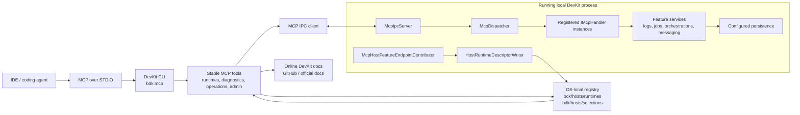

# Design Specification: DevKit STDIO MCP

> This design document specifies a local-development Model Context Protocol (MCP) surface for DevKit-based applications. The feature lands as the MCP command module inside `bdk`, the DevKit CLI specified in [spec-presentation-cli.md](spec-presentation-cli.md), and depends on the DevKit web host foundation specified in [spec-presentation-devkit-web-host.md](spec-presentation-devkit-web-host.md). The `bdk mcp` command hosts a STDIO MCP server and connects to running local DevKit application processes through a local IPC channel. The application process serves MCP operations through feature-owned `IMcpHandler` implementations backed by normal application services.

[TOC]

## Introduction

DevKit applications already contain rich operational information: logs, errors, health checks, jobs, messaging, queueing, orchestrations, metrics, and retained runtime state. The dashboard makes that information usable for humans. MCP makes it usable for coding agents.

The DevKit web host foundation is specified separately in [spec-presentation-devkit-web-host.md](spec-presentation-devkit-web-host.md) and must be implemented before the CLI and this MCP command module. The base `bdk` CLI foundation is specified separately in [spec-presentation-cli.md](spec-presentation-cli.md) and must be implemented before this MCP command module. This specification owns the MCP behavior that plugs into those foundations: STDIO MCP hosting, MCP use of shared host discovery and selection, IPC forwarding, MCP tools, MCP endpoint metadata, full MCP IPC dispatch, app-side capabilities, and app-side MCP handlers.

The MCP feature provides a local STDIO MCP server started by the agent:

```text
dotnet tool run bdk mcp
```

## Implementation Status

Implemented on this branch:

* `bdk mcp` hosts a newline-delimited JSON-RPC STDIO MCP server with `initialize`, `tools/list`, and `tools/call`.
* the CLI exposes the stable `bdk_*` MCP tool catalog and keeps stdout protocol-clean.
* runtime discovery, runtime selection, status, self-test, capability lookup, toolset enforcement, and local IPC forwarding use the shared host descriptor registry.
* app-side MCP handlers use SDK-free contracts in `Common.Abstractions/Mcp`.
* `Presentation.Web` hosts the MCP IPC bridge in local development, validates the runtime nonce, dispatches `mcp.capabilities`, and routes operations to registered `IMcpHandler` implementations.
* `RuntimeDiagnosticsMcpHandler` provides `health.snapshot` when ASP.NET Core health checks are registered and returns a structured unavailable result otherwise.
* project-owned handlers can be registered with `DevKitWebApplicationBuilder.AddMcp(...)` using `WithHandler<THandler>()` or `WithHandlersFromAssembly<TMarker>()`.
* documentation tools search bounded official DevKit documentation and return official source links.

Feature-owned handlers for logs, jobs, messaging, queueing, and orchestrations are intentionally separate extension points. Until those feature packages register handlers for their operations, the stable CLI tools return structured `feature_unavailable` responses from the selected runtime.

The MCP server is not hosted by the ASP.NET Core application. Instead, the `bdk mcp` command exposes a stable MCP tool catalog to the agent, discovers running local DevKit hosts through runtime descriptors, connects to the selected process over local IPC, and forwards MCP operations to handlers inside that process.

```text
IDE / coding agent
  -> MCP over STDIO
  -> bdk mcp
  -> runtime descriptor discovery
  -> selected local DevKit process
  -> local IPC
  -> IMcpHandler implementations
  -> feature services and persistence
```

The running application remains the source of truth for MCP runtime data. The `bdk mcp` command is an MCP adapter. The app-side IPC server is a local development bridge into the application process.

## Positioning

This feature is:

* a local-development MCP surface for coding agents
* the MCP command module for the broader DevKit CLI
* a stable STDIO MCP server hosted by the `bdk mcp` command
* a local IPC bridge into running DevKit application processes
* a feature-owned MCP operation model through `IMcpHandler`
* a way to inspect and operate local DevKit features through normal feature services

This feature is not:

* an application-hosted MCP server
* a web endpoint surface
* a dashboard replacement
* an OpenAPI surface
* a database reader
* the base DevKit CLI specification
* a production operations plane
* a Docker or distributed runtime discovery system
* an authorization bypass for remote systems

The core boundary is:

```text
The base CLI owns command routing and feature composition.
The MCP command module owns MCP behavior.
The running app owns feature state.
IPC connects MCP to the running app locally.
Feature handlers execute operations through normal services.
```

## Goals

## Stable MCP tool catalog

The MCP server shall expose a stable tool catalog when the agent starts `bdk mcp`.

Tool availability must not depend on whether a specific application host is already selected or whether a specific feature is registered in the selected host. If a tool cannot run because no runtime is selected or the selected runtime lacks the required feature, the tool returns a structured unavailable result.

## Local IPC into the running process

The MCP server shall connect to the selected running application process over local IPC.

Supported transports:

* Windows: named pipes
* Linux/macOS: Unix domain sockets

The transport difference must be hidden behind shared IPC server and client abstractions.

## Feature-owned MCP handlers

DevKit features shall contribute MCP handlers close to the feature implementation.

Examples:

```text
Application.Utilities/Logging/Mcp/LogMcpHandler
Application.Jobs/Mcp/JobMcpHandler
Application.Orchestrations/Mcp/OrchestrationMcpHandler
Application.Messaging/Mcp/MessagingMcpHandler
Application.Queueing/Mcp/QueueingMcpHandler
```

Handlers call the same feature services used by the application. They must not depend on the MCP SDK.

## Project-owned MCP handlers

The MCP feature shall be an extensible platform for applications that use DevKit.

Projects shall be able to add their own `IMcpHandler` implementations so coding agents can inspect, validate, explain, investigate, seed, reset, or run project-specific local development workflows through the same MCP infrastructure used by DevKit features.

Project-owned MCP handlers run inside the application process and may use project services through dependency injection.

Project handlers must follow the same local-development-only registration, toolset, bounded response, and safety rules as built-in DevKit handlers.

## Frictionless local development

An application should only need to enable local MCP once.

Feature registration should contribute its MCP handlers automatically when MCP is enabled in a local development environment.

Example:

```csharp
var builder = DevKitWebApplication.CreateBuilder(args);

builder.Services.AddJobScheduler();
builder.Services.AddOrchestrations();
builder.Services.AddMessaging();
builder.Services.AddQueueing();
```

`DevKitWebApplication.CreateBuilder(args)` enables the local MCP host capability in Development by default unless MCP is disabled through DevKit web application options.

The feature must never prevent the application from starting. If the IPC server cannot bind, the app starts without MCP and logs the reason.

## Local development only

MCP handlers, IPC hosting, runtime descriptors, and CLI-discoverable metadata shall be registered only for local development.

The feature is not intended for staging, production, or publicly exposed environments.

## Operational actions are in scope

The MCP feature shall include operational and administrative tools for features that support them.

Examples:

* purge retained logs, messages, queue messages, job occurrences, or orchestration data
* trigger or dispatch jobs
* retry, archive, pause, resume, or release retained messages and queue messages
* signal, pause, resume, cancel, terminate, or repair orchestrations

Operational and administrative tools must be enabled through explicit MCP toolsets and handled through the selected process.

## Bounded results

MCP operations shall return bounded, structured results by default.

Handlers must enforce limits for logs, message payloads, orchestration history, job occurrences, and other potentially large result sets.

## Agent-oriented responses

MCP tools shall return results shaped for coding-agent investigation, not dashboard rendering.

Responses should include:

* compact structured data
* a short human-readable summary
* unavailable or failure reason codes
* truncation indicators
* continuation hints where applicable
* suggested next tool calls when useful

Handlers must not return HTML, CSS classes, Razor models, or dashboard-specific view state.

## Guided investigation workflows

The MCP feature shall provide higher-level investigation tools that aggregate feature data for common local debugging workflows.

Examples:

* inspect recent errors
* inspect a correlation id
* inspect a job run
* inspect an orchestration instance
* inspect the current MCP/runtime setup

These tools should reduce the number of manual tool calls an agent needs to understand a local failure.

## Online DevKit documentation access

The MCP feature shall provide a documentation lookup tool for DevKit documentation hosted online, for example on GitHub.

The tool should help agents answer DevKit usage questions and explain feature behavior while working in a local application.

The documentation tool is distinct from runtime tools:

* it does not require a selected runtime
* it does not connect to the app process
* it should prefer official DevKit documentation sources
* it should return source links and concise excerpts or summaries
* it must avoid returning large unbounded documents by default

## Non-Goals

## No application-hosted MCP transport

The ASP.NET Core application shall not expose an MCP transport endpoint such as `/_bdk/mcp`.

The only MCP protocol server is the CLI process started by the agent over STDIO.

## No HTTP endpoint dependency

The MCP process shall not depend on DevKit HTTP operational endpoints for its normal operation.

Application HTTP endpoints may still exist for dashboards or custom application UIs, but the MCP feature uses local IPC and app-side `IMcpHandler` implementations.

## No direct database access from the CLI

The CLI shall not:

* load application configuration
* rebuild the application dependency injection container
* resolve application DbContexts
* query application databases directly
* inspect feature persistence schemas directly

All feature data is retrieved through `IMcpHandler` implementations inside the running process.

## No shadow application API

Project-owned MCP tools shall not mimic the normal application API.

The MCP feature must not become a parallel CRUD API for creating, reading, updating, and deleting application resources.

Application APIs remain responsible for normal application use cases. MCP project tools are intended for local development assistance, inspection, validation, explanation, investigation, seeding, resetting, and controlled workflow execution.

## No Docker support

Docker and devcontainer scenarios are outside this specification.

The supported scenario is a local machine with a local running application process and a local CLI process. The CLI and app process must be able to access the same runtime descriptor location and local IPC transport.

## No registration outside local development

MCP handlers and IPC services must not be registered outside local development.

Configuration alone must not enable MCP on non-development servers.

## Terminology

| Term | Meaning |
| ---- | ------- |
| MCP server | The STDIO MCP server hosted by `bdk mcp`. |
| MCP tool | An agent-facing tool exposed by the CLI MCP server. |
| MCP operation | An internal operation name sent over IPC, such as `logs.query` or `jobs.trigger`. |
| MCP handler | An app-side `IMcpHandler` implementation that handles one or more MCP operations. |
| MCP IPC server | The local IPC server hosted inside the running application process. |
| MCP IPC client | The CLI-side local IPC client. |
| Runtime | One discovered running local DevKit host process. |
| Runtime descriptor | A local JSON file written by a running host so `bdk mcp` can discover and connect to it. |
| Selected runtime | The runtime used for normal MCP tool calls. |
| Toolset | A named group of tools, such as `diagnostics`, `operations`, or `admin`. |

## High-Level Architecture



```text
Developer workspace
  .config/dotnet-tools.json

Running local host
  writes shared host descriptor
  starts MCP IPC server
  registers feature MCP handlers
  contributes features.mcp endpoint metadata

bdk mcp
  exposes stable MCP tools over STDIO
  discovers descriptors
  connects to selected runtime over IPC
  maps MCP tool calls to MCP operations
```

## Package and Project Placement

## Common MCP abstractions

Shared protocol-neutral abstractions should live in a common package.

Suggested placement:

```text
src/Common.Abstractions/Mcp
```

Core abstractions:

```text
IMcpHandler
McpRequest
McpResponse
McpResult
McpOperation
McpCapability
McpToolset
McpErrorCode
```

These types are DevKit abstractions and must not depend on the official MCP SDK.

Shared host descriptor DTOs such as `HostRuntimeDescriptor` and `HostFeatureEndpointMetadata` are owned by `src/Common.Abstractions/HostDiscovery` as specified in [spec-presentation-devkit-web-host.md](spec-presentation-devkit-web-host.md) and consumed by the CLI foundation in [spec-presentation-cli.md](spec-presentation-cli.md). MCP uses those shared descriptor contracts and contributes only MCP-specific endpoint metadata under `features.mcp`.

## Feature handlers

Feature packages own their app-side handlers.

Suggested placement:

```text
src/Application.Utilities/Logging/Mcp
src/Application.Jobs/Mcp
src/Application.Orchestrations/Mcp
src/Application.Messaging/Mcp
src/Application.Queueing/Mcp
src/Application.Utilities/Health/Mcp
```

Feature handlers call feature services and return compact MCP DTOs.

Project-specific handlers should live near the project module or application feature that owns the domain knowledge.

Example:

```text
src/Modules/Customers/Application/Mcp
src/Modules/Billing/Application/Mcp
src/Modules/Inventory/Application/Mcp
```

## Presentation.Web hosting dependency

The DevKit web host foundation in [spec-presentation-devkit-web-host.md](spec-presentation-devkit-web-host.md) owns the shared app-side descriptor infrastructure:

```text
src/Presentation.Web/HostDiscovery
  HostRuntimeDescriptorWriter
  HostFeatureEndpointContributor
  HostDescriptorOptions
  HostDescriptorCleanupService

src/Presentation.Web/Mcp
  McpIpcServer
  McpDispatcher
  McpHostFeatureEndpointContributor
  McpOptions
  McpBuilder
```

The shared host discovery infrastructure integrates with the ASP.NET Core host lifecycle and writes host descriptors. The web host foundation owns descriptor writing and the local MCP endpoint shell. This MCP specification owns the full MCP-specific behavior that plugs into that endpoint: request envelopes, dispatching, capabilities, toolsets, operation routing, feature and project handler activation, and handler safety rules.

## CLI dependency and MCP command module

The DevKit CLI foundation is specified in [spec-presentation-cli.md](spec-presentation-cli.md). This MCP specification depends on that foundation and does not define the base `bdk` tool identity, global command routing, Console Commands integration, host selection commands, or future non-MCP command modules.

Suggested MCP command module placement:

```text
src/Presentation.Cli/Mcp
  McpIpcClient
  RuntimeMcpTools
  InvestigationMcpTools
  DocumentationMcpTools
  McpDocumentationClient
```

MCP-specific concerns, such as MCP endpoint metadata, MCP runtime validation, toolsets, MCP tools, STDIO hosting, and IPC clients, belong under the MCP command module and must not become assumptions for unrelated CLI features.

MCP tools are not Console Commands. The MCP command module may use the CLI foundation for launching and configuring `bdk mcp`, but the agent-facing MCP tool catalog remains the protocol surface described in this specification. Likewise, app-side `IMcpHandler` implementations remain distinct from in-process `IConsoleCommand` implementations unless a future feature explicitly bridges them.

MCP command module surface:

```text
bdk mcp
```

Shared host inspection and selection commands such as `bdk hosts list`, `bdk hosts current`, `bdk hosts select`, and `bdk hosts clean` are defined by the base CLI specification.

## Naming Rules

Do not prefix core class names with `DevKit`.

Use:

```text
IMcpHandler
McpDispatcher
McpIpcServer
McpIpcClient
McpHostFeatureEndpointContributor
```

Avoid:

```text
IDevKitMcpHandler
DevKitMcpDispatcher
DevKitMcpHostFeatureEndpointContributor
```

Ownership is expressed by namespace and package:

```csharp
namespace BridgingIT.DevKit.Common.Abstractions.Mcp;
namespace BridgingIT.DevKit.Presentation.Web.Mcp;
namespace BridgingIT.DevKit.Application.Jobs.Mcp;
```

## Local Tool Installation

The preferred setup is a repository-local .NET tool manifest.

In the solution root:

```bash
dotnet new tool-manifest
dotnet tool install BridgingIT.DevKit.Cli
```

The generated file is committed:

```text
.config/dotnet-tools.json
```

Every developer restores tools with:

```bash
dotnet tool restore
```

The MCP server is started by an MCP client using:

```bash
dotnet tool run bdk mcp
```

## MCP Client Configuration

Example VS Code MCP configuration:

```json
{
  "servers": {
    "bdk": {
      "type": "stdio",
      "command": "dotnet",
      "args": ["tool", "run", "bdk", "mcp"],
      "cwd": "${workspaceFolder}"
    }
  }
}
```

The application process must be running separately. The MCP server does not start the application.

## Example Agent Prompts

These examples show how a developer should be able to ask a coding agent to use the BDK MCP during regular local development.

The prompts are intentionally written as natural requests. The agent decides which stable MCP tools to call, checks runtime availability first where needed, and reports unavailable features explicitly.

### Runtime and setup checks

```text
Use the bdk MCP and check whether the local commerce-api runtime is available. If more than one runtime is running, show me the options and select commerce-api.
```

Expected tool usage:

```text
bdk_mcp_status
bdk_runtimes_list
bdk_runtimes_select
bdk_capabilities_get
```

```text
Use the bdk MCP self-test and tell me whether the app process, IPC connection, protocol version, and enabled toolsets are all healthy.
```

Expected tool usage:

```text
bdk_mcp_self_test
bdk_capabilities_get
```

### Logs, errors, and correlation ids

```text
Use the bdk MCP to inspect the latest errors in the selected runtime. For the newest error, follow its correlation id and summarize the complete flow.
```

Expected tool usage:

```text
bdk_investigate_recent_errors
bdk_investigate_correlation
bdk_logs_query
bdk_errors_details
```

```text
Use the bdk MCP to find logs from the last hour that mention order import or payment capture. If any log has a correlation id, make it the focus of the investigation.
```

Expected tool usage:

```text
bdk_logs_query
bdk_investigate_correlation
```

```text
Use the bdk MCP to tail the local logs while I trigger the workflow manually. Stop once you see the job, orchestration, message, and queue message for the same correlation id.
```

Expected tool usage:

```text
bdk_logs_tail
bdk_investigate_correlation
```

### Health and runtime state

```text
Use the bdk MCP to check the current health snapshot. Summarize unhealthy checks first and include any data that explains why they are unhealthy.
```

Expected tool usage:

```text
bdk_health_snapshot
```

```text
Before changing the code, use the bdk MCP to check whether jobs, queueing, messaging, logs, and orchestrations are available in this runtime.
```

Expected tool usage:

```text
bdk_capabilities_get
bdk_mcp_status
```

### Jobs and orchestrations

```text
Use the bdk MCP to inspect recent runs of the order import job. If a run failed, show its messages, logs, and correlation context.
```

Expected tool usage:

```text
bdk_jobs_list
bdk_jobs_runs
bdk_investigate_job_run
bdk_investigate_correlation
```

```text
Use the bdk MCP to trigger the commerce checkout simulation job and then follow the created orchestration, message, queue message, and logs by correlation id.
```

Expected tool usage:

```text
bdk_jobs_trigger
bdk_jobs_runs
bdk_orchestrations_instances
bdk_investigate_correlation
```

This prompt requires the `operations` toolset because it triggers a job.

```text
Use the bdk MCP to inspect the latest orchestration instance. Explain its status, history, related logs, and whether it published or queued any messages.
```

Expected tool usage:

```text
bdk_orchestrations_instances
bdk_orchestrations_instance_details
bdk_orchestrations_history
bdk_investigate_orchestration_instance
```

### Messaging and queueing

```text
Use the bdk MCP to check whether any commerce messages or queue messages are waiting, leased, failed, or archived. For failures, include payload details and correlation context.
```

Expected tool usage:

```text
bdk_messages_summary
bdk_messages_waiting
bdk_messages_details
bdk_messages_content
bdk_queueing_summary
bdk_queueing_waiting
bdk_queueing_message_details
bdk_investigate_correlation
```

```text
Use the bdk MCP to retry the failed hello-world queue message and then follow the logs for the resulting correlation id.
```

Expected tool usage:

```text
bdk_queueing_message_details
bdk_queueing_retry
bdk_investigate_correlation
```

This prompt requires the `operations` toolset because it retries retained queue state.

### Local cleanup for testing

```text
Use the bdk MCP to purge retained logs, messages, queue messages, job runs, and orchestration data so I can rerun the scenario from a clean local state. Preview what will be affected first.
```

Expected tool usage:

```text
bdk_logs_purge
bdk_messages_purge
bdk_queueing_purge
bdk_jobs_purge_runs
bdk_orchestrations_purge
```

This prompt requires the `admin` toolset and explicit confirmation arguments for destructive operations.

### Project-specific commerce tools

```text
Use the bdk MCP project tools to inspect customer CUST-10042. Tell me whether the customer exists, whether the account has warnings, whether recent orders failed, and which correlation ids are relevant.
```

Expected tool usage:

```text
bdk_project_operations
bdk_project_call commerce_inspect_customer
bdk_investigate_correlation
```

```text
Use the bdk MCP project tools to validate why product SKU-123 cannot be purchased. Check product setup, inventory state, price configuration, reservation job registration, and recent checkout errors.
```

Expected tool usage:

```text
bdk_project_operations
bdk_project_call commerce_validate_product_availability
bdk_logs_query
bdk_investigate_correlation
```

### DevKit documentation lookup

```text
Use the bdk MCP docs tools to find the DevKit documentation for queueing retries and summarize the relevant guidance for the code I am looking at.
```

Expected tool usage:

```text
bdk_docs_search
bdk_docs_get
```

```text
Use the bdk MCP docs tools to explain how job scheduling and orchestration execution jobs are supposed to be wired in DevKit, then compare that with this project.
```

Expected tool usage:

```text
bdk_docs_search
bdk_docs_get
bdk_jobs_list
bdk_capabilities_get
```

## Runtime Descriptor Registry

## Descriptor directory

Each running eligible local host writes one shared host descriptor file as specified in [spec-presentation-devkit-web-host.md](spec-presentation-devkit-web-host.md). MCP contributes endpoint metadata to that shared descriptor under `features.mcp`.

The descriptor registry lives in an OS user-local runtime location, not in the workspace.

Default locations:

```text
Windows:     %LOCALAPPDATA%\bdk\hosts\runtimes
Linux/macOS: $XDG_RUNTIME_DIR/bdk/hosts/runtimes
Fallback:    $TMPDIR/bdk/hosts/runtimes
```

Examples:

```text
%LOCALAPPDATA%\bdk\hosts\runtimes\commerce-api.5001.json
$XDG_RUNTIME_DIR/bdk/hosts/runtimes/billing-api.5001.json
```

The selected runtime should be stored in the same OS user-local registry, scoped by workspace hash:

```text
%LOCALAPPDATA%\bdk\hosts\selections\<workspace-hash>.json
$XDG_RUNTIME_DIR/bdk/hosts/selections/<workspace-hash>.json
```

Descriptors include `workspacePath`, `contentRootPath`, and process metadata so the CLI can filter runtimes for the current workspace without writing runtime files into the repository. MCP-specific transport metadata lives under `features.mcp`.

## Descriptor ownership

Each host owns only its own descriptor.

The descriptor should be written on startup and removed on graceful shutdown where possible.

Stale descriptors are expected and must be handled by the CLI.

## Descriptor schema

Example:

```json
{
  "schemaVersion": 1,
  "runtimeId": "commerce-api-5001",
  "applicationName": "CommerceApi",
  "environmentName": "Development",
  "workspacePath": "F:/projects/bit/bITdevKit",
  "contentRootPath": "F:/projects/acme/commerce/src/CommerceApi.Presentation.Web.Server",
  "projectPath": "F:/projects/acme/commerce/src/CommerceApi.Presentation.Web.Server/CommerceApi.Presentation.Web.Server.csproj",
  "processId": 23844,
  "startedAt": "2026-06-19T14:20:00Z",
  "features": {
    "mcp": {
      "protocolVersion": 1,
      "transport": "named-pipe",
      "endpoint": "bdk-commerce-api-5001-mcp",
      "nonce": "local-random-token"
    }
  }
}
```

Linux/macOS example:

```json
{
  "features": {
    "mcp": {
      "protocolVersion": 1,
      "transport": "unix-socket",
      "endpoint": "$XDG_RUNTIME_DIR/bdk/mcp/ipc/commerce-api-5001.sock",
      "nonce": "local-random-token"
    }
  }
}
```

## Required descriptor fields

| Field | Required | Description |
| ----- | -------: | ----------- |
| `schemaVersion` | yes | Runtime descriptor schema version. |
| `runtimeId` | yes | Stable id for the current host instance. |
| `applicationName` | yes | Display name of the running application. |
| `environmentName` | yes | ASP.NET Core environment name. |
| `workspacePath` | yes | Solution or workspace root. |
| `contentRootPath` | yes | Application content root. |
| `processId` | yes | Local process id. |
| `startedAt` | yes | UTC start timestamp. |
| `features.mcp.protocolVersion` | yes, when MCP enabled | MCP IPC protocol version. |
| `features.mcp.transport` | yes, when MCP enabled | `named-pipe` or `unix-socket`. |
| `features.mcp.endpoint` | yes, when MCP enabled | Pipe name or socket path. |
| `features.mcp.nonce` | yes, when MCP enabled | Random handshake token generated for each app startup or IPC rebind. |

The nonce is stable for the lifetime of a running IPC endpoint. Descriptor heartbeat or refresh writes must not rotate the nonce because that would invalidate active CLI sessions without changing the trust boundary.

## Runtime Discovery

`bdk mcp` and the shared `bdk hosts list` command discover runtimes in this order:

```text
1. Explicit --runtime-id
2. OS user-local bdk/hosts/runtimes descriptors matching the current workspace
3. OS user-local bdk/hosts/runtimes descriptors when --all is supplied
4. No runtime found
```

Runtime validation:

```text
1. Parse descriptor JSON.
2. Check schemaVersion.
3. Check process id when possible.
4. Check MCP protocol version compatibility.
5. Try local IPC connection.
6. Send nonce handshake.
7. Call capabilities operation.
8. Mark runtime as Ready, Stale, Unreachable, Invalid, or VersionMismatch.
```

## Runtime statuses

| Status | Meaning |
| ------ | ------- |
| `Ready` | Descriptor is valid and the IPC server is reachable. |
| `Unreachable` | The IPC endpoint cannot be reached. |
| `Stale` | The process is gone or descriptor no longer matches a live host. |
| `Invalid` | Descriptor cannot be parsed or required fields are missing. |
| `VersionMismatch` | CLI and app-side MCP protocol versions are incompatible. |
| `Unknown` | Runtime has not been validated yet. |

## Runtime Selection

The MCP server supports one selected runtime for normal tool calls.

MCP runtime selection tools:

```text
bdk_runtimes_list
bdk_runtimes_select
bdk_runtimes_current
bdk_runtimes_refresh
```

Selection behavior:

* if exactly one runtime is ready, the MCP server may auto-select it
* if multiple runtimes are ready and no runtime is selected, diagnostic and operational tools return `runtime_selection_required`
* if the selected runtime is no longer valid, tools return `selected_runtime_unavailable`
* the MCP server never aggregates across runtimes by default

## IPC Transport

## Transport abstraction

The transport implementation must be abstracted.

Suggested app-side abstractions:

```text
IMcpIpcServer
IMcpIpcServerTransport
NamedPipeMcpIpcServerTransport
UnixSocketMcpIpcServerTransport
```

Suggested CLI-side abstractions:

```text
IMcpIpcClient
IMcpIpcClientTransport
NamedPipeMcpIpcClientTransport
UnixSocketMcpIpcClientTransport
```

The protocol payload above the transport is identical across operating systems.

## Windows named pipes

Windows uses named pipes.

Example endpoint:

```text
bdk-commerce-api-5001
```

The implementation uses:

```text
NamedPipeServerStream
NamedPipeClientStream
```

The pipe disappears when the process exits.

## Linux/macOS Unix domain sockets

Linux and macOS use Unix domain sockets.

Example endpoint:

```text
$XDG_RUNTIME_DIR/bdk/mcp/ipc/commerce-api-5001.sock
```

The implementation uses `AddressFamily.Unix` sockets.

Unix socket files can remain after crashes. The server must handle stale socket files before binding.

## IPC bind failure behavior

MCP must never prevent the application from starting.

If the IPC server cannot bind:

* log a warning with the reason
* do not start the IPC server
* do not write a ready runtime descriptor, or mark the descriptor unavailable
* keep the application running normally

Examples of bind failures:

* pipe name collision
* stale socket file cannot be removed
* socket path too long
* insufficient local file permissions
* transport API unavailable on the current platform

The developer should see the failure in logs, but the app must continue without MCP.

## IPC Protocol

The IPC protocol is internal to DevKit and independent from the public MCP SDK.

Request envelope:

```json
{
  "id": "01J...",
  "protocolVersion": 1,
  "nonce": "local-random-token",
  "operation": "logs.query",
  "toolset": "diagnostics",
  "arguments": {
    "rows": 100,
    "correlationId": "abc"
  }
}
```

Response envelope:

```json
{
  "id": "01J...",
  "available": true,
  "operation": "logs.query",
  "data": {}
}
```

Unavailable response:

```json
{
  "id": "01J...",
  "available": false,
  "operation": "jobs.runs",
  "code": "feature_unavailable",
  "reason": "Job services are not registered in the selected runtime."
}
```

Error response:

```json
{
  "id": "01J...",
  "available": false,
  "operation": "logs.query",
  "code": "operation_failed",
  "reason": "The operation failed. See application logs for details."
}
```

## Common error codes

| Code | Meaning |
| ---- | ------- |
| `runtime_selection_required` | Multiple runtimes exist and none is selected. |
| `selected_runtime_unavailable` | Selected runtime is stale or unreachable. |
| `feature_unavailable` | The selected app does not have the feature registered. |
| `operation_unavailable` | No handler supports the requested operation. |
| `unauthorized_toolset` | The requested operation requires a disabled toolset. |
| `confirmation_required` | A destructive admin operation is missing the required explicit confirmation argument. |
| `invalid_arguments` | Arguments failed validation. |
| `version_mismatch` | CLI and app-side protocol versions are incompatible. |
| `timeout` | The operation exceeded its timeout. |
| `operation_failed` | The app-side operation failed. |

## App-Side MCP Handlers

## Handler contract

Suggested contract:

```csharp
public interface IMcpHandler
{
    IReadOnlyCollection<McpOperation> Operations { get; }

    Task<McpResult> HandleAsync(
        McpRequest request,
        CancellationToken cancellationToken);
}
```

Handlers may support one or more operations.

## Handler registration

Feature packages register their built-in MCP handlers from their presentation registration extensions when MCP is enabled for the feature.

Project handlers are registered through `DevKitWebApplicationBuilder.AddMcp(...)`. The registration builder follows the host's evaluated local MCP tooling decision by default, so project handlers are only added when local MCP hosting is enabled unless the application explicitly overrides registration with `.Enabled(true)` or `.Enabled(false)`.

MCP registration should be frictionless:

```csharp
var builder = DevKitWebApplication.CreateBuilder(args)
    .AddMcp(mcp => mcp
        .WithHandler<CommerceCustomerMcpHandler>());

builder.Services.AddJobScheduling();  // contributes JobSchedulingMcpHandler when MCP is enabled
builder.Services.AddOrchestrations(); // contributes OrchestrationMcpHandler when MCP is enabled
builder.Services.AddMessaging();      // contributes MessagingMcpHandler when MCP is enabled
```

Handler registration must no-op when local MCP hosting is disabled.

Using `DevKitWebApplication.CreateBuilder(args)` outside Development must not register MCP handlers, start the MCP IPC server, or write MCP endpoint metadata unless explicitly overridden for tests. This keeps shared startup code safe while still failing closed.

## Missing features

The IPC server and MCP dispatcher must be safe when features are missing.

Rules:

* no registered handler means the operation is unavailable
* a handler with missing dependencies returns `feature_unavailable`
* a handler exception returns sanitized `operation_failed`
* capability reporting only lists registered and available operations
* one missing feature must not affect other features

## Handler scope

The dispatcher should create a DI scope per request.

Handlers should be stateless or scoped.

Cancellation tokens and request timeouts must be propagated to feature services.

## Capabilities

The app-side MCP server exposes a capabilities operation.

Operation:

```text
mcp.capabilities
```

Example result:

```json
{
  "protocolVersion": 1,
  "applicationName": "CommerceApi",
  "environmentName": "Development",
  "devKitVersion": "1.0.0",
  "enabledToolsets": ["diagnostics"],
  "limits": {
    "defaultRows": 100,
    "maximumRows": 1000
  },
  "features": {
    "logs": true,
    "errors": true,
    "health": true,
    "jobs": true,
    "orchestrations": false,
    "messaging": true,
    "queueing": true
  },
  "unavailable": {
    "orchestrations": "Orchestration services are not registered."
  },
  "operations": [
    {
      "name": "logs.query",
      "toolset": "diagnostics",
      "feature": "logs",
      "category": "query",
      "description": "Queries retained log entries.",
      "arguments": {
        "from": "optional UTC timestamp",
        "to": "optional UTC timestamp",
        "search": "optional search text",
        "correlationId": "optional correlation id",
        "rows": "optional row limit"
      },
      "limits": {
        "defaultRows": 100,
        "maximumRows": 1000
      },
      "destructive": false
    },
    {
      "name": "logs.purge",
      "toolset": "admin",
      "feature": "logs",
      "category": "purge",
      "description": "Purges retained log entries.",
      "destructive": true,
      "confirmationRequired": true
    },
    {
      "name": "jobs.trigger",
      "toolset": "operations",
      "feature": "jobs",
      "category": "run",
      "description": "Triggers a registered job.",
      "destructive": false
    },
    {
      "name": "commerce_inspect_customer",
      "toolset": "diagnostics",
      "feature": "project",
      "owner": "Commerce.Customers",
      "category": "inspect",
      "description": "Inspects a commerce customer and related account state.",
      "destructive": false
    }
  ]
}
```

The CLI uses capabilities to improve responses and runtime summaries. The MCP tool catalog remains stable even when capabilities differ between runtimes.

Capabilities should include enough metadata for agents to explain what can be inspected or operated in the selected runtime without trial-and-error calls.

Operation metadata should include:

* operation name
* owner or feature
* category
* toolset
* short description
* argument schema or argument summary
* required arguments
* limits
* destructive flag
* confirmation requirement
* concise result-shape summary where useful

Capabilities should not expose full dashboard view models, large nested DTO schemas, or implementation-specific service names.

Capabilities include built-in DevKit operations and project-owned operations.

## Toolsets

The MCP server supports separate toolsets.

| Toolset | Purpose | Enabled by default |
| ------- | ------- | -----------------: |
| `diagnostics` | Read-only inspection tools. | yes |
| `operations` | Trigger, retry, pause, resume, cancel, signal, release lease. | no |
| `admin` | Purge, destructive cleanup, broad maintenance. | no |

CLI option:

```bash
dotnet tool run bdk mcp --toolset diagnostics
dotnet tool run bdk mcp --toolset diagnostics,operations
dotnet tool run bdk mcp --toolset diagnostics,operations,admin
```

App-side handlers must enforce the requested toolset. The CLI should also avoid invoking operations outside enabled toolsets.

## Operation safety

Operational tools should be usable without unnecessary friction, but destructive tools must be deliberate.

Rules:

* `operations` toolset actions may execute directly when the toolset is enabled and arguments are valid.
* `admin` toolset actions that purge or destructively clean retained data must require an explicit confirmation argument in the operation payload.
* destructive operations must not require a second confirmation message over IPC.
* destructive tools should support dry-run or preview behavior when practical.
* destructive results must return a summary of what was affected.

Example destructive call shape:

```json
{
  "olderThan": "2026-06-19T00:00:00Z",
  "confirm": true,
  "confirmation": "purge logs"
}
```

If the confirmation argument is missing or invalid, the handler must return `confirmation_required`.

## MCP Tool Catalog

The CLI exposes stable MCP tools.

## Runtime tools

```text
bdk_mcp_status
bdk_mcp_self_test
bdk_mcp_explain_setup
bdk_runtimes_list
bdk_runtimes_current
bdk_runtimes_select
bdk_runtimes_refresh
bdk_capabilities_get
```

## Investigation tools

```text
bdk_investigate_recent_errors
bdk_investigate_correlation
bdk_investigate_job_run
bdk_investigate_orchestration_instance
```

## Logs and errors

```text
bdk_logs_query
bdk_logs_tail
bdk_logs_purge
bdk_errors_recent
bdk_errors_details
bdk_correlation_inspect
```

## Health and metrics

```text
bdk_health_snapshot
bdk_metrics_snapshot
bdk_metrics_query
```

## Messaging

```text
bdk_messages_summary
bdk_messages_subscriptions
bdk_messages_waiting
bdk_messages_list
bdk_messages_details
bdk_messages_content
bdk_messages_retry
bdk_messages_release_lease
bdk_messages_archive
bdk_messages_pause_type
bdk_messages_resume_type
bdk_messages_purge
```

## Queueing

```text
bdk_queueing_summary
bdk_queueing_subscriptions
bdk_queueing_waiting
bdk_queueing_messages
bdk_queueing_message_details
bdk_queueing_retry
bdk_queueing_release_lease
bdk_queueing_archive
bdk_queueing_pause_queue
bdk_queueing_resume_queue
bdk_queueing_pause_type
bdk_queueing_resume_type
bdk_queueing_purge
```

## Jobs

```text
bdk_jobs_list
bdk_jobs_details
bdk_jobs_runs
bdk_jobs_run_stats
bdk_jobs_trigger
bdk_jobs_pause
bdk_jobs_resume
bdk_jobs_interrupt
bdk_jobs_purge_runs
```

## Orchestrations

```text
bdk_orchestrations_list
bdk_orchestrations_instances
bdk_orchestrations_instance_details
bdk_orchestrations_history
bdk_orchestrations_signals
bdk_orchestrations_timers
bdk_orchestrations_signal
bdk_orchestrations_pause
bdk_orchestrations_resume
bdk_orchestrations_cancel
bdk_orchestrations_terminate
bdk_orchestrations_repair
bdk_orchestrations_purge
```

## Documentation

```text
bdk_docs_search
bdk_docs_get
```

Documentation tools use online DevKit documentation sources and do not require a selected runtime.

## Project operations

```text
bdk_project_operations
bdk_project_call
```

`bdk_project_operations` lists project-owned operations exposed by the selected runtime.

`bdk_project_call` invokes a selected project-owned operation by name.

Project-owned operations remain discoverable through capabilities. The stable `bdk_project_call` tool avoids requiring MCP clients to support dynamically changing tool catalogs.

Project-owned operations must not be exposed as dynamic MCP tools by default. Agents discover them through `bdk_project_operations` and invoke them through `bdk_project_call`. This keeps the MCP tool catalog stable when runtimes start later or when different applications expose different project operations.

## Investigation tool behavior

Investigation tools aggregate multiple MCP operations into one agent-oriented result.

`bdk_investigate_correlation` should include, where available:

* matching logs
* matching errors
* related job runs
* related orchestration instances
* related messages and queue messages
* a compact timeline
* summary counts
* suggested next tool calls

`bdk_investigate_recent_errors` should include the latest errors, their correlation ids, exception summaries, and suggested correlation-inspection calls.

`bdk_investigate_job_run` and `bdk_investigate_orchestration_instance` should include related logs and correlation context when available.

Investigation tools must be bounded and may omit unavailable feature sections with explicit unavailable reasons.

Correlation investigation targets the selected runtime. Cross-runtime correlation inspection is not part of the default tool catalog. Agents can switch runtimes explicitly with `bdk_runtimes_select` and call `bdk_investigate_correlation` again when needed.

## Documentation tool behavior

Documentation tools query official DevKit documentation sources.

Expected behavior:

* `bdk_docs_search` searches documentation by query text and returns bounded ranked results.
* `bdk_docs_get` retrieves a specific documentation page or section by source identifier or URL.
* results include source title, URL, and concise content.
* responses indicate when online documentation is unreachable.
* documentation tools do not require a runtime selection or IPC connection.

## Project-Specific MCP Tools

Project-specific MCP tools are first-class extension points for applications that use DevKit.

They should help coding agents understand and manipulate local development state in ways that are difficult to infer from source code alone.

## Recommended project tool categories

Project tools should use these categories:

| Category | Purpose | Example |
| -------- | ------- | ------- |
| `inspect` | Inspect an aggregate, entity, flow, or local runtime state with related signals. | `commerce_inspect_customer` |
| `validate` | Check local data or configuration consistency. | `commerce_validate_product_availability` |
| `explain` | Explain why a domain object or workflow is in its current state. | `orders_explain_checkout_state` |
| `investigate` | Aggregate logs, jobs, messages, orchestrations, and domain state for one business concept. | `orders_investigate_order` |
| `seed` | Create local development or test data. | `catalog_seed_demo_products` |
| `reset` | Reset local development data or scenarios. | `billing_reset_local_invoice_scenario` |
| `run` | Execute a local workflow or simulation useful for development. | `orders_run_payment_simulation` |

## Project tool anti-patterns

Project tools should not be generic CRUD wrappers.

Avoid tools like:

```text
customer.create
customer.update
order.submit
order.cancel
city.add
city.delete
```

Prefer tools that are explicitly local-development and agent-assistance oriented:

```text
orders_inspect_order
orders_validate_projection_consistency
orders_explain_status
orders_investigate_order
orders_seed_failed_payment_scenario
orders_reset_local_scenario
orders_run_payment_simulation
```

## Project tool naming

The `bdk_` operation prefix is reserved for built-in DevKit operations. Public CLI MCP tool names use the `bdk_*` naming convention.

Project operation names must be client-safe: use lowercase letters, digits, underscores or hyphens. Avoid dots and camelCase because MCP clients surface and cache operation names even when they are passed through `bdk_project_call`.

Project tools should use a project, module, or bounded-context prefix:

```text
commerce_inspect_customer
billing_investigate_invoice
inventory_validate_stock_item
orders_run_payment_simulation
```

Project tools should use stable names and should include metadata that helps agents use them correctly:

* description
* toolset
* argument schema
* result shape
* limits
* destructive-action confirmation requirements where applicable

## Commerce example tools

A fictional commerce application can use project-specific MCP tools in its Customer and Catalog modules to show how application-owned tools should feel.

These tools are not replacements for the commerce HTTP API. They are local development tools that help an agent inspect, validate, and explain the state behind the running application.

### `commerce_inspect_customer`

Category: `inspect`

Toolset: `diagnostics`

Purpose:

Inspect one ecommerce customer as a local development concept, not as a CRUD resource.

The tool should answer questions such as:

* Is this customer known locally?
* Which account state, segment, locale, and primary contact metadata are stored?
* Are there recent failed orders?
* Are there active account warnings or payment issues?
* When was the customer profile last synchronized?
* Are there recent logs or errors that mention this customer or related checkout flows?

Example operation metadata:

```json
{
  "name": "commerce_inspect_customer",
  "category": "inspect",
  "toolset": "diagnostics",
  "owner": "Commerce.Customers",
  "description": "Inspects a commerce customer, account state, recent orders, and related local diagnostic signals."
}
```

Arguments:

```json
{
  "customerId": "optional customer id",
  "customerNumber": "optional customer number",
  "includeRecentOrders": true,
  "maxOrders": 10,
  "includeRelatedLogs": true
}
```

At least one of `customerId` or `customerNumber` should be supplied. If the lookup is ambiguous, the response should return candidates and ask the agent to call again with `customerId`.

Example result:

```json
{
  "available": true,
  "summary": "Customer CUST-10042 is active, has 2 recent failed orders, and was synchronized 12 minutes ago.",
  "data": {
    "customer": {
      "id": "9dbb6f70-9fd7-4d97-8d8d-f8587e47823c",
      "customerNumber": "CUST-10042",
      "name": "Aster Retail GmbH",
      "segment": "business",
      "locale": "de-DE",
      "status": "active"
    },
    "orders": {
      "recentOrderCount": 8,
      "failedOrderCount": 2,
      "latestFailedOrderId": "ORD-90017"
    },
    "relatedSignals": {
      "recentErrorCount": 0,
      "recentCheckoutJobOccurrences": 1,
      "correlationIds": [
        "b8bdce13dfab480b98ce42a79612bb09"
      ]
    }
  },
  "truncated": false,
  "next": [
    {
      "tool": "bdk_investigate_correlation",
      "arguments": {
        "correlationId": "b8bdce13dfab480b98ce42a79612bb09"
      }
    }
  ]
}
```

Implementation notes:

* the handler can live in `Commerce.Application/Modules/Customers/Mcp`
* the handler may use Customer module query/application services and domain specifications
* related log, job, and correlation data should be gathered through MCP feature services or shared diagnostics services, not through dashboard HTML models
* order details must be bounded by `maxOrders`
* customer lookup should be read-only

### `commerce_validate_product_availability`

Category: `validate`

Toolset: `diagnostics`

Purpose:

Validate whether a selected product can be purchased in the local commerce runtime.

The tool should answer questions such as:

* Does the product exist?
* Is it active and visible in the selected sales channel?
* Is a valid price configured?
* Is inventory available after reservations?
* Is the inventory reservation job registered in the selected runtime?
* Are recent checkout or reservation errors visible for this SKU?

Arguments:

```json
{
  "sku": "SKU-123",
  "salesChannel": "web",
  "quantity": 1,
  "includeRecentReservations": true
}
```

The default path should validate local application state without making outbound network calls.

Example result:

```json
{
  "available": true,
  "summary": "Product SKU-123 is purchasable in the web channel. Price and inventory checks passed.",
  "data": {
    "status": "passed",
    "checks": [
      {
        "name": "product.exists",
        "status": "passed",
        "message": "Product SKU-123 exists."
      },
      {
        "name": "product.active",
        "status": "passed",
        "message": "Product is active for the web channel."
      },
      {
        "name": "pricing.configured",
        "status": "passed",
        "message": "A valid price is configured."
      },
      {
        "name": "inventory.available",
        "status": "passed",
        "message": "Inventory is available after reservations."
      },
      {
        "name": "jobs.inventoryReservationRegistered",
        "status": "passed",
        "message": "Inventory reservation job is registered in this runtime."
      }
    ]
  },
  "truncated": false,
  "next": [
    {
      "tool": "commerce_inspect_customer",
      "arguments": {
        "customerNumber": "CUST-10042",
        "includeRecentOrders": true
      }
    }
  ]
}
```

Implementation notes:

* failed checks should include next suggested calls, for example `bdk_logs_query`, `bdk_investigate_correlation`, or `commerce_inspect_customer`
* the result should be a checklist, not an exception dump
* checks must tolerate missing optional features; for example, if jobs are not registered, return a warning or unavailable check instead of failing the entire operation
* this tool must not create, update, reserve, purchase, or delete products

These two commerce tools are useful because they combine domain state with DevKit runtime signals. A coding agent investigating "why can customer CUST-10042 not buy SKU-123?" can get a compact answer without manually joining customer data, product data, inventory reservations, jobs, logs, and correlation ids.

## Project tool registration

Projects may register MCP handlers explicitly:

```csharp
var builder = DevKitWebApplication.CreateBuilder(args)
    .AddMcp(mcp => mcp
        .WithHandler<CommerceCustomerMcpHandler>());
```

Projects may also register handlers by assembly if supported:

```csharp
var builder = DevKitWebApplication.CreateBuilder(args)
    .AddMcp(mcp => mcp
        .WithHandlersFromAssembly<CommerceCustomerMcpHandler>());
```

Project handlers must not be registered outside local development.

## Limits and Defaults

## Response shape

MCP tool responses should use a common agent-oriented envelope.

Successful response:

```json
{
  "available": true,
  "summary": "Found 3 recent errors in CommerceApi. The latest error belongs to OrderImportJob.",
  "data": {},
  "truncated": false,
  "next": [
    {
      "tool": "bdk_investigate_correlation",
      "arguments": {
        "correlationId": "abc"
      }
    }
  ]
}
```

Unavailable response:

```json
{
  "available": false,
  "code": "feature_unavailable",
  "summary": "Jobs are not available in the selected runtime.",
  "reason": "Job services are not registered.",
  "next": [
    {
      "tool": "bdk_capabilities_get",
      "arguments": {}
    }
  ]
}
```

Suggested next calls are advisory. The agent may ignore them, but they should make common diagnostics flows easier.

Default limits:

| Operation | Default limit |
| --------- | ------------: |
| log query | 100 rows |
| log tail | 100 rows |
| recent errors | 50 rows |
| correlation inspection logs | 200 rows |
| message list | 100 rows |
| queue message list | 100 rows |
| job runs | 100 rows |
| orchestration instances | 100 rows |
| orchestration history | 200 rows |

Maximum limits should be enforced app-side.

Recommended maximums:

| Operation | Maximum limit |
| --------- | ------------: |
| log query | 1000 rows |
| correlation inspection logs | 2000 rows |
| message list | 1000 rows |
| queue message list | 1000 rows |
| job runs | 1000 rows |
| orchestration history | 2000 rows |

## Time Defaults

When no date range is supplied:

* logs default to recent entries or current day depending on handler support
* errors default to recent entries or current day
* correlation inspection searches recent/current day first
* jobs default to recent runs
* messages default to active/recent retained messages
* queueing defaults to active/recent retained messages
* orchestrations default to active/recent instances

All timestamps exchanged by MCP operations should be UTC.

## Safety and Security

## Development-only registration

MCP handlers, IPC server, MCP descriptor metadata, and MCP runtime metadata are registered only in local development.

Rules:

* `DevKitWebApplication.CreateBuilder(args)` must not activate MCP outside Development unless explicitly overridden for tests
* feature MCP handlers must not be registered outside Development
* the IPC server must not start outside Development
* MCP feature metadata must not be written to host descriptors outside Development
* config alone must not enable MCP on non-development servers

## Local IPC trust model

The feature assumes a local development machine.

The IPC channel is not a network security boundary. It should still use reasonable local safeguards:

* no network listener
* random runtime nonce in descriptor and request handshake
* OS defaults for local IPC permissions
* no secrets in logs
* bounded responses
* explicit toolsets for operational and admin actions

## Secrets

The runtime descriptor may contain a local feature nonce, but it must not contain application secrets.

Runtime descriptors, runtime selections, and IPC metadata are written to OS user-local `bdk/hosts` locations, so no repository `.gitignore` entries are required for normal MCP runtime state.

## Auditing

Operational and admin handlers should log meaningful activity where existing feature logging supports it.

Useful audit properties:

```text
operation
toolset
runtime id
correlation id
target id
result
```

## Failure Handling

The MCP server should start even when:

```text
no runtime is running
multiple runtimes are running
selected runtime is stale
selected runtime is unreachable
runtime descriptor is invalid
IPC bind failed in the app
capabilities operation is unavailable
a feature handler is not registered
a handler returns feature_unavailable
online documentation is unreachable
```

Common failures:

| Failure | Tool behavior |
| ------- | ------------- |
| No runtimes found | Return `no_runtime_found` with hints. |
| Multiple runtimes found | Return `runtime_selection_required`. |
| Descriptor stale | Mark runtime `Stale`; suggest runtime cleanup or app restart. |
| IPC unreachable | Return `selected_runtime_unavailable`. |
| Version mismatch | Return `version_mismatch`. |
| Feature unavailable | Return `feature_unavailable`. |
| Unauthorized toolset | Return `unauthorized_toolset`. |
| Timeout | Return `timeout`. |
| Handler exception | Return sanitized `operation_failed`. |
| Documentation unavailable | Return `documentation_unavailable` with source and retry hints. |

## Self-diagnostics

The CLI should expose self-diagnostics through `bdk_mcp_status` and `bdk_mcp_self_test`.

The status and self-test tools should report:

```text
CLI version
workspace path
descriptor directory
selected runtime
discovered runtimes
IPC connectivity
protocol version compatibility
enabled toolsets
available capabilities
last runtime validation error
documentation source reachability
```

These tools should work even when no application runtime is running.

## CLI Command Details

The commands in this section are MCP command module commands. Base CLI behavior, global commands, Console Commands integration, and future non-MCP command groups are specified in [spec-presentation-cli.md](spec-presentation-cli.md).

## bdk mcp

Starts the STDIO MCP server.

Options:

```text
--runtime-id <id>
--workspace <path>
--toolset <toolsets>
--verbose
```

Default:

```bash
dotnet tool run bdk mcp
```

Host discovery, host selection, and stale descriptor cleanup are provided by the base CLI `bdk hosts ...` commands.

## Web Host Registration

The host-side registration model is owned by [spec-presentation-devkit-web-host.md](spec-presentation-devkit-web-host.md). MCP uses its options surface to enable or tune the MCP host capability.

Target API:

```csharp
var builder = DevKitWebApplication.CreateBuilder(args, options => options
  .Cli(cli => cli.Mcp(mcp => mcp
    .Enabled(true)
    .WorkspacePathFromContentRoot())));
```

The exact API can evolve, but the behavior must remain:

```text
Development only
runtime descriptor writer enabled
IPC server enabled
feature handlers registered only when MCP is enabled
bind failure logs warning and app continues
```

## Feature Registration

Feature packages contribute handlers automatically when MCP is enabled.

Examples:

```csharp
builder.Services.AddJobScheduler();   // JobMcpHandler
builder.Services.AddOrchestrations(); // OrchestrationMcpHandler
builder.Services.AddMessaging();      // MessagingMcpHandler
builder.Services.AddQueueing();       // QueueingMcpHandler
```

Feature-level opt-out may be supported:

```csharp
builder.Services.AddJobScheduler(options => options.DisableMcp());
```

Host-level filtering may also be supported:

```csharp
var builder = DevKitWebApplication.CreateBuilder(args, options => options
  .Cli(cli => cli.Mcp(mcp => mcp
    .DisableFeature("jobs"))));
```

## Testing Strategy

## Unit tests

Cover:

```text
runtime descriptor serialization
runtime descriptor validation
runtime discovery
runtime selection behavior
stale descriptor cleanup
MCP protocol version compatibility
nonce handshake validation
IPC request/response serialization
tool-to-operation mapping
toolset enforcement
structured unavailable results
handler argument validation
```

## Transport tests

Cover:

```text
named pipe server/client connection on Windows
Unix domain socket server/client connection on Linux/macOS
bind failure does not fail application startup
stale Unix socket file handling
IPC request timeout
multiple concurrent requests
```

## Web host tests

Cover:

```text
MCP services register in Development
MCP services do not register outside Development
descriptor written on startup
descriptor removed or marked stale on shutdown
IPC server starts when bind succeeds
IPC bind failure logs warning and app continues
capabilities include registered feature handlers
unregistered feature appears unavailable
```

## CLI/MCP tests

Cover:

```text
bdk mcp starts over STDIO
runtime discovery tools return no_runtime_found when no host is running
diagnostic tools require a selected reachable running host
multiple descriptors require runtime selection
single ready runtime auto-selection
logs query maps to logs.query IPC operation
jobs trigger requires operations toolset
purge operations require admin toolset
missing feature returns feature_unavailable
bdk_mcp_status works without a running host
bdk_mcp_self_test reports descriptor and IPC status
bdk_investigate_correlation aggregates related feature data
bdk_docs_search returns bounded official documentation results
bdk_docs_get returns bounded documentation content with source link
project operations are listed through bdk_project_operations
project operations are invoked through bdk_project_call
project CRUD-style operations are not included in examples or templates
```

## Example app verification

Example applications should demonstrate:

```text
local tool manifest
VS Code MCP config
CommerceApi local runtime descriptor
BillingApi local runtime descriptor
logs query
recent errors
correlation inspection
investigation tools
health snapshot
MCP status and self-test
DevKit documentation lookup
project-specific inspect/validate/investigate tool
job runs and trigger
orchestration list and details
purge retained data with admin toolset
runtime selection
```

## Finalized Decisions

* `DevKitWebApplication.CreateBuilder(args)` does not activate MCP outside Development unless explicitly overridden for tests as specified by the DevKit web host foundation.
* host descriptors and runtime selections use OS user-local `bdk/hosts` locations, not workspace files.
* MCP transport metadata is stored under `features.mcp` in the shared host descriptor.
* descriptor metadata includes workspace paths so the CLI can filter runtimes for the current workspace.
* the runtime nonce is generated on app startup or IPC rebind and remains stable during descriptor heartbeat refreshes.
* destructive admin operations require an explicit confirmation argument in the operation payload.
* destructive admin operations do not require a second IPC confirmation exchange.
* correlation investigation is scoped to the selected runtime.
* capabilities expose operation metadata sufficient for agent use, but not full dashboard view models or large result schemas.
* project-owned operations are discovered through `bdk_project_operations` and invoked through `bdk_project_call`.
* project-owned operations are not exposed as dynamic MCP tools by default.

## Summary

The STDIO MCP feature provides a local coding-agent surface for running DevKit applications. It depends on the DevKit web host foundation specified in [spec-presentation-devkit-web-host.md](spec-presentation-devkit-web-host.md) and is implemented as an MCP command module inside the base `bdk` CLI specified in [spec-presentation-cli.md](spec-presentation-cli.md).

The important boundaries are:

```text
MCP is STDIO-only.
The bdk mcp command hosts MCP.
The app does not host MCP.
The bdk mcp command connects to the running app through local IPC.
The app invokes feature-owned IMcpHandler implementations.
Handlers use normal feature services.
No direct database access happens from the CLI.
No HTTP endpoint dependency exists for MCP operations.
No Docker support is included.
MCP is local development only.
MCP registration must never prevent app startup.
```

This keeps the MCP feature useful for local coding agents while preserving feature ownership, keeping setup friction low, and avoiding HTTP authentication complexity. The broader CLI direction, Console Commands integration, and future `bdk` command groups are handled by the base CLI specification.
