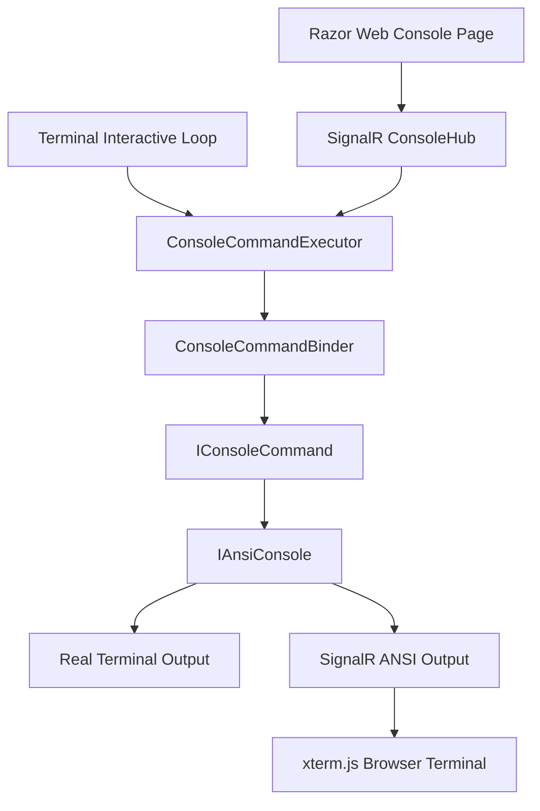
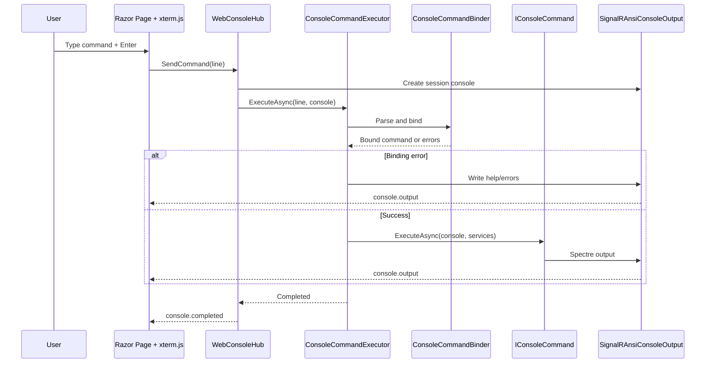

# Design Specification: Web Console for Console Commands

> Add a browser-based interactive console for the existing Console Commands feature while keeping the existing Kestrel terminal console fully functional.

[TOC]

## Introduction

The Console Commands feature already provides an interactive in-process shell for local development and operational diagnostics. Commands are discovered through dependency injection, parsed and bound through the existing command binder, and executed using the existing command abstraction.

This specification extends the feature with a web-based console hosted by the ASP.NET Core application itself.

The web console is not a replacement for the Kestrel terminal console. Both frontends must work side by side:

* the existing terminal-based interactive console remains available
* the new browser-based console exposes the same command runtime
* commands continue to write output through Spectre.Console
* no global redirection of `Console.Out`, `Console.Error`, or `Console.In` is used

The web console uses a Razor `.cshtml` page, SignalR for interactive communication, and xterm.js for terminal rendering in the browser.

## Goals

* Provide an interactive browser console for existing console commands.
* Reuse the existing command discovery, binding, validation, help, grouping, and execution logic.
* Preserve the existing Kestrel terminal console behavior.
* Support Spectre.Console output, especially tables, panels, markup, rules, colors, and aligned text.
* Stream command output to the browser while the command is executing.
* Keep command implementations unchanged.
* Provide a secure, development-oriented operational surface.
* Allow future extension toward command history, cancellation, session tracking, and authorization policies.

## Non-Goals

* Do not replace the existing terminal interactive console.
* Do not globally redirect process stdout, stderr, or stdin.
* Do not expose a general-purpose OS shell.
* Do not execute arbitrary PowerShell, CMD, Bash, or process commands.
* Do not convert Spectre.Console output to native HTML in v1.
* Do not require command authors to implement separate web-specific rendering.
* Do not make the web console production-facing by default.

## Design Summary

The feature introduces a second frontend for the existing console command runtime.

```text
Terminal frontend
  -> reads from real console
  -> executes command line
  -> writes to real Spectre console

Web frontend
  -> reads command lines from SignalR
  -> executes command line
  -> writes ANSI output to SignalR
  -> browser renders output with xterm.js
```

Both frontends use the same command executor.

```text
Console input source
  -> ConsoleCommandExecutor
  -> ConsoleCommandBinder
  -> IConsoleCommand.ExecuteAsync(...)
  -> IAnsiConsole
```

The key change is to extract the current interactive loop’s command execution logic into a reusable service.

## Architecture



## Core Components

| Component                                 | Responsibility                                                                                    |
| ----------------------------------------- | ------------------------------------------------------------------------------------------------- |
| `ConsoleCommandExecutor`                  | Shared command-line execution service used by terminal and web frontends.                         |
| `TerminalConsoleFrontend`                 | Existing interactive console loop, refactored to call the shared executor.                        |
| `WebConsoleHub`                           | SignalR hub receiving command lines and streaming output back to the browser.                     |
| `WebConsoleSession`                       | Represents one browser console connection/session.                                                |
| `SignalRAnsiConsoleOutput`                | Spectre.Console output adapter that sends rendered ANSI/text output to SignalR.                   |
| `SignalRTextWriter`                       | TextWriter used by Spectre output to push text fragments to the browser.                          |
| `WebConsoleEndpoints` or `WebConsolePage` | Maps the Razor `.cshtml` page and static assets.                                                  |
| `WebConsoleOptions`                       | Configuration for enabling, route paths, authorization, dimensions, and environment restrictions. |

## Execution Model

### Terminal Execution

The existing terminal frontend continues to work as before from the user perspective.

Internally, it should call the shared executor:

```csharp
await executor.ExecuteAsync(
    line,
    AnsiConsole.Console,
    app.Services,
    cancellationToken);
```

### Web Execution

The browser sends a command line through SignalR:

```text
browser input -> ConsoleHub.SendCommand(line)
```

The hub creates a session-specific Spectre console:

```csharp
var console = WebAnsiConsoleFactory.Create(
    output => Clients.Caller.SendAsync("console.output", output));
```

Then executes:

```csharp
await executor.ExecuteAsync(
    line,
    console,
    rootServices,
    Context.ConnectionAborted);
```

Output is streamed back to the same caller only.

## Output Rendering Strategy

v1 uses ANSI terminal output.

```text
Spectre.Console
  -> ANSI/text rendering
  -> SignalR message
  -> xterm.js
```

This is preferred because commands frequently use Spectre tables. ANSI terminal rendering preserves the current command output model without requiring custom HTML rendering for every Spectre construct.

### Browser Rendering

The Razor page loads xterm.js and opens a terminal instance.

Recommended defaults:

```js
const terminal = new Terminal({
    cols: 120,
    rows: 32,
    convertEol: true,
    cursorBlink: true
});
```

The server-side Spectre console should use matching dimensions:

```csharp
var settings = new AnsiConsoleSettings
{
    Ansi = AnsiSupport.Yes,
    ColorSystem = ColorSystemSupport.TrueColor,
    Out = new SignalRAnsiConsoleOutput(sendAsync)
};
```

The output adapter should expose width and height matching the web terminal.

## SignalR Contract

### Hub Route

Default route:

```text
/_bdk_/console/hub
```

### Client-to-Server Methods

| Method                          | Purpose                                                                              |
| ------------------------------- | ------------------------------------------------------------------------------------ |
| `SendCommand(string line)`      | Executes one command line in the current browser session.                            |
| `CancelCommand()`               | Requests cancellation of the currently running command. Optional in v1, recommended. |
| `Resize(int columns, int rows)` | Updates the server-side console dimensions for future rendering. Optional in v1.     |

### Server-to-Client Events

| Event               | Payload           | Purpose                                  |
| ------------------- | ----------------- | ---------------------------------------- |
| `console.output`    | `string text`     | ANSI/text output to write into xterm.js. |
| `console.error`     | `string text`     | Error output, rendered as terminal text. |
| `console.started`   | `object metadata` | Command execution started.               |
| `console.completed` | `object metadata` | Command execution completed.             |
| `console.cancelled` | `object metadata` | Command was cancelled.                   |

## Razor Page

Default route:

```text
/_bdk_/console
```

The `.cshtml` page contains:

* terminal container
* command input handled by xterm.js
* SignalR connection setup
* command submission on Enter
* output appending from `console.output`
* reconnect handling
* optional status indicator

The page does not use normal form postbacks. Interaction happens through SignalR.

## Command Submission Flow



## Session Model

Each browser connection gets its own session.

A session owns:

* connection id
* optional user identity
* command history buffer
* current cancellation token source
* terminal dimensions
* session-local `IAnsiConsole`
* last activity timestamp

Sessions must not share output by default.

```text
Browser A command output -> Browser A only
Browser B command output -> Browser B only
Terminal command output  -> terminal only
```

Shared broadcast output is out of scope for v1.

## Command History

v1 may reuse existing command history for submitted web commands, but the safer default is separate web history.

Recommended model:

* terminal history remains unchanged
* web history is stored per browser session in memory
* optional persistent history can be added later
* commands like `history list` continue to work against the existing feature history if that is how they are currently implemented

## Cancellation

A browser session should be able to cancel its currently running command.

The hub stores a `CancellationTokenSource` for the active command.

```csharp
public Task CancelCommand()
{
    this.session.CancelCurrentCommand();
    return Task.CompletedTask;
}
```

Command implementations should already honor cancellation where long-running work is involved.

## Concurrency Rules

For v1, each browser session should execute only one command at a time.

If a command is already running and another line is submitted, the hub should either:

1. reject the second command with a clear message, or
2. queue it in session order

Recommended v1 behavior: reject while busy.

```text
A command is already running. Wait until it completes or cancel it.
```

This avoids hidden queues and accidental long-running execution chains.

## Registration API

Add a fluent web registration to the existing console commands builder.

Example:

```csharp
builder.Services
    .AddConsoleCommandsInteractive(cfg =>
    {
        cfg.WithCommand<SeedDataConsoleCommand>();
        cfg.WithCommand<StatusConsoleCommand>();
    })
    .AddWebConsole(options =>
    {
        options.Enabled = builder.Environment.IsDevelopment();
        options.PagePath = "/_bdk_/console";
        options.HubPath = "/_bdk_/console/hub";
        options.RequireAuthorization = true;
        options.Columns = 120;
        options.Rows = 32;
    });
```

Application mapping:

```csharp
app.UseConsoleCommandsInteractive();
app.MapConsoleCommandsWebConsole();
```

Alternative if aligned with existing endpoint conventions:

```csharp
builder.Services
    .AddConsoleCommandsInteractive(...)
    .AddWebConsoleEndpoints(options => options.RequireAuthorization());

app.MapEndpoints();
```

## Configuration

Example appsettings:

```json
{
  "ConsoleCommands": {
    "WebConsole": {
      "Enabled": true,
      "PagePath": "/_bdk_/console",
      "HubPath": "/_bdk_/console/hub",
      "RequireAuthorization": true,
      "AllowedEnvironments": [ "Development", "Local" ],
      "Columns": 120,
      "Rows": 32,
      "MaxCommandLength": 4000,
      "CommandTimeout": "00:05:00"
    }
  }
}
```

## Security

The web console is powerful because it exposes operational commands. It must be treated as an administrative surface.

v1 requirements:

* disabled by default outside local/development environments
* authorization enabled by default
* optional role or policy restriction
* no anonymous access
* no arbitrary shell/process execution
* no global stdin/stdout bridge
* command length limit
* one active command per session
* command execution audit logging
* sensitive commands should still guard themselves internally

Recommended default:

```csharp
options.Enabled = environment.IsDevelopment();
options.RequireAuthorization = true;
options.RequiredPolicy = "SystemConsole";
```

## Auditing and Logging

Every command execution should log:

* command line, optionally redacted
* command name
* user identity if available
* connection id
* start timestamp
* end timestamp
* duration
* success/failure/cancelled status

Avoid logging secrets from arguments. Add an optional redaction hook:

```csharp
public interface IConsoleCommandLineRedactor
{
    string Redact(string line);
}
```

## Error Handling

Errors should be rendered into the web terminal the same way as terminal errors.

Binding errors:

* show validation message
* show command help if applicable

Execution errors:

* write concise error message to terminal
* log exception server-side
* do not expose stack traces by default

SignalR failures:

* client shows disconnected/reconnecting status
* active command cancellation is requested when the connection is aborted

## Browser Assets

v1 requires:

* SignalR JavaScript client
* xterm.js
* xterm.css

Asset delivery options:

1. embedded static web assets in the package
2. host application references assets manually
3. CDN for demos only

Recommended package behavior: embedded static web assets.

## Razor Page Sketch

```html
@page "/_bdk_/console"
@{
    Layout = null;
}

<!DOCTYPE html>
<html>
<head>
    <title>Console</title>
    <link rel="stylesheet" href="/_content/BridgingIT.DevKit.Presentation.Web.Console/xterm.css" />
    <style>
        html, body {
            height: 100%;
            margin: 0;
            background: #111;
        }

        #terminal {
            height: 100vh;
            width: 100vw;
        }
    </style>
</head>
<body>
    <div id="terminal"></div>

    <script src="/_content/BridgingIT.DevKit.Presentation.Web.Console/signalr.min.js"></script>
    <script src="/_content/BridgingIT.DevKit.Presentation.Web.Console/xterm.js"></script>
    <script>
        const terminal = new Terminal({
            cols: 120,
            rows: 32,
            convertEol: true,
            cursorBlink: true
        });

        terminal.open(document.getElementById("terminal"));

        const connection = new signalR.HubConnectionBuilder()
            .withUrl("/_bdk_/console/hub")
            .withAutomaticReconnect()
            .build();

        let currentLine = "";

        connection.on("console.output", text => {
            terminal.write(text);
        });

        connection.on("console.completed", _ => {
            terminal.write("\r\n> ");
        });

        connection.on("console.cancelled", _ => {
            terminal.write("\r\nCommand cancelled.\r\n> ");
        });

        terminal.onData(async data => {
            if (data === "\r") {
                const line = currentLine;
                currentLine = "";
                terminal.write("\r\n");

                if (line.trim().length > 0) {
                    await connection.invoke("SendCommand", line);
                } else {
                    terminal.write("> ");
                }

                return;
            }

            if (data === "\u007F") {
                if (currentLine.length > 0) {
                    currentLine = currentLine.substring(0, currentLine.length - 1);
                    terminal.write("\b \b");
                }

                return;
            }

            currentLine += data;
            terminal.write(data);
        });

        connection.start().then(() => {
            terminal.write("Connected to web console.\r\n> ");
        });
    </script>
</body>
</html>
```

## Server-Side Output Adapter Sketch

```csharp
public sealed class SignalRAnsiConsoleOutput : IAnsiConsoleOutput
{
    private readonly SignalRTextWriter writer;

    public SignalRAnsiConsoleOutput(
        Func<string, CancellationToken, Task> sendAsync,
        int width,
        int height,
        CancellationToken cancellationToken)
    {
        this.writer = new SignalRTextWriter(sendAsync, cancellationToken);
        this.Width = width;
        this.Height = height;
    }

    public TextWriter Writer => this.writer;

    public bool IsTerminal => true;

    public int Width { get; }

    public int Height { get; }

    public void SetEncoding(Encoding encoding)
    {
    }
}
```

```csharp
public sealed class SignalRTextWriter : TextWriter
{
    private readonly Func<string, CancellationToken, Task> sendAsync;
    private readonly CancellationToken cancellationToken;

    public SignalRTextWriter(
        Func<string, CancellationToken, Task> sendAsync,
        CancellationToken cancellationToken)
    {
        this.sendAsync = sendAsync;
        this.cancellationToken = cancellationToken;
    }

    public override Encoding Encoding => Encoding.UTF8;

    public override void Write(char value)
    {
        this.Write(value.ToString());
    }

    public override void Write(string? value)
    {
        if (string.IsNullOrEmpty(value))
        {
            return;
        }

        this.sendAsync(value, this.cancellationToken)
            .GetAwaiter()
            .GetResult();
    }

    public override async Task WriteAsync(string? value)
    {
        if (string.IsNullOrEmpty(value))
        {
            return;
        }

        await this.sendAsync(value, this.cancellationToken);
    }
}
```

## Web Console Factory Sketch

```csharp
public sealed class WebAnsiConsoleFactory
{
    public IAnsiConsole Create(
        Func<string, CancellationToken, Task> sendAsync,
        int columns,
        int rows,
        CancellationToken cancellationToken)
    {
        return AnsiConsole.Create(new AnsiConsoleSettings
        {
            Ansi = AnsiSupport.Yes,
            ColorSystem = ColorSystemSupport.TrueColor,
            Out = new SignalRAnsiConsoleOutput(
                sendAsync,
                columns,
                rows,
                cancellationToken)
        });
    }
}
```

## Hub Sketch

```csharp
[Authorize]
public sealed class WebConsoleHub(
    IConsoleCommandExecutor executor,
    WebAnsiConsoleFactory consoleFactory,
    IServiceProvider services,
    IOptions<WebConsoleOptions> options,
    ILogger<WebConsoleHub> logger) : Hub
{
    private static readonly ConcurrentDictionary<string, WebConsoleSession> Sessions = new();

    public override Task OnConnectedAsync()
    {
        Sessions[this.Context.ConnectionId] = new WebConsoleSession(
            this.Context.ConnectionId,
            options.Value.Columns,
            options.Value.Rows);

        return base.OnConnectedAsync();
    }

    public override Task OnDisconnectedAsync(Exception? exception)
    {
        if (Sessions.TryRemove(this.Context.ConnectionId, out var session))
        {
            session.CancelCurrentCommand();
            session.Dispose();
        }

        return base.OnDisconnectedAsync(exception);
    }

    public async Task SendCommand(string line)
    {
        var session = Sessions[this.Context.ConnectionId];

        if (!session.TryStartCommand(out var commandCancellation))
        {
            await this.Clients.Caller.SendAsync(
                "console.output",
                "A command is already running.\r\n",
                this.Context.ConnectionAborted);

            return;
        }

        try
        {
            var console = consoleFactory.Create(
                async (text, cancellationToken) =>
                {
                    await this.Clients.Caller.SendAsync(
                        "console.output",
                        text,
                        cancellationToken);
                },
                session.Columns,
                session.Rows,
                commandCancellation.Token);

            await this.Clients.Caller.SendAsync(
                "console.started",
                new { line },
                this.Context.ConnectionAborted);

            await executor.ExecuteAsync(
                line,
                console,
                services,
                commandCancellation.Token);

            await this.Clients.Caller.SendAsync(
                "console.completed",
                new { line },
                this.Context.ConnectionAborted);
        }
        catch (OperationCanceledException)
        {
            await this.Clients.Caller.SendAsync(
                "console.cancelled",
                new { line },
                this.Context.ConnectionAborted);
        }
        catch (Exception ex)
        {
            logger.LogError(ex, "Web console command failed.");

            await this.Clients.Caller.SendAsync(
                "console.output",
                $"Command failed: {ex.Message}\r\n",
                this.Context.ConnectionAborted);

            await this.Clients.Caller.SendAsync(
                "console.completed",
                new { line, failed = true },
                this.Context.ConnectionAborted);
        }
        finally
        {
            session.CompleteCommand();
        }
    }

    public Task CancelCommand()
    {
        if (Sessions.TryGetValue(this.Context.ConnectionId, out var session))
        {
            session.CancelCurrentCommand();
        }

        return Task.CompletedTask;
    }

    public Task Resize(int columns, int rows)
    {
        if (Sessions.TryGetValue(this.Context.ConnectionId, out var session))
        {
            session.Resize(columns, rows);
        }

        return Task.CompletedTask;
    }
}
```

## Refactoring Existing Interactive Loop

The current terminal loop should be refactored so that it does not own command binding and execution directly.

Before:

```text
RunLoopAsync
  -> read line
  -> parse
  -> bind
  -> execute command
```

After:

```text
RunLoopAsync
  -> read line
  -> executor.ExecuteAsync(line, AnsiConsole.Console, services, ct)
```

This makes terminal and web behavior consistent and avoids duplicate command execution logic.

## Compatibility

Existing commands should not change.

Supported command pattern remains:

```csharp
public override Task ExecuteAsync(
    IAnsiConsole console,
    IServiceProvider services)
{
    console.MarkupLine("[green]Done[/]");
    return Task.CompletedTask;
}
```

Commands that use `Console.WriteLine(...)` directly will not stream to the browser. They should be migrated to the provided `IAnsiConsole`.

## Package Placement

Recommended package split:

```text
Presentation.ConsoleCommands
  -> existing command abstractions and terminal loop

Presentation.Web.ConsoleCommands
  -> Razor page
  -> SignalR hub
  -> web console options
  -> xterm.js static assets
  -> mapping extensions
```

If the existing Console Commands feature already lives in `Presentation.Web`, the web console can be added there as an optional subfeature.

## Testing Strategy

### Unit Tests

* executor parses and executes known command
* executor renders binding errors to provided console
* web output adapter writes text through callback
* session rejects concurrent command
* cancellation requests cancel active command

### Integration Tests

* SignalR hub accepts command and returns output
* command using Spectre table produces output
* authorization blocks anonymous access when required
* terminal loop still uses same executor
* browser session output is isolated per connection

### Manual Verification

* open terminal interactive console and run `help`
* open web console and run `help`
* run a table-heavy command in both
* run grouped commands such as `diag perf`
* run invalid command and verify help/error output
* disconnect browser during long-running command
* cancel long-running command from browser

## Operational Considerations

* The web console should be visibly marked as a system/admin page.
* Default routes should sit below `_bdk_`.
* Endpoint metadata should allow exclusion from public OpenAPI descriptions unless explicitly enabled.
* Long-running commands should be cancellable.
* Sensitive commands should perform their own environment/authorization checks.
* In production, the feature should be disabled unless explicitly enabled.

## Future Extensions

* Persistent per-user command history.
* Command autocomplete using registered command metadata.
* Browser-side command history with arrow up/down.
* Resize synchronization from xterm.js to server console width.
* Download command output as text.
* Optional transcript persistence.
* Optional structured command metadata endpoint.
* Optional HTML renderers for selected high-value commands.
* Optional integration with log streaming.
* Optional session administration page.
