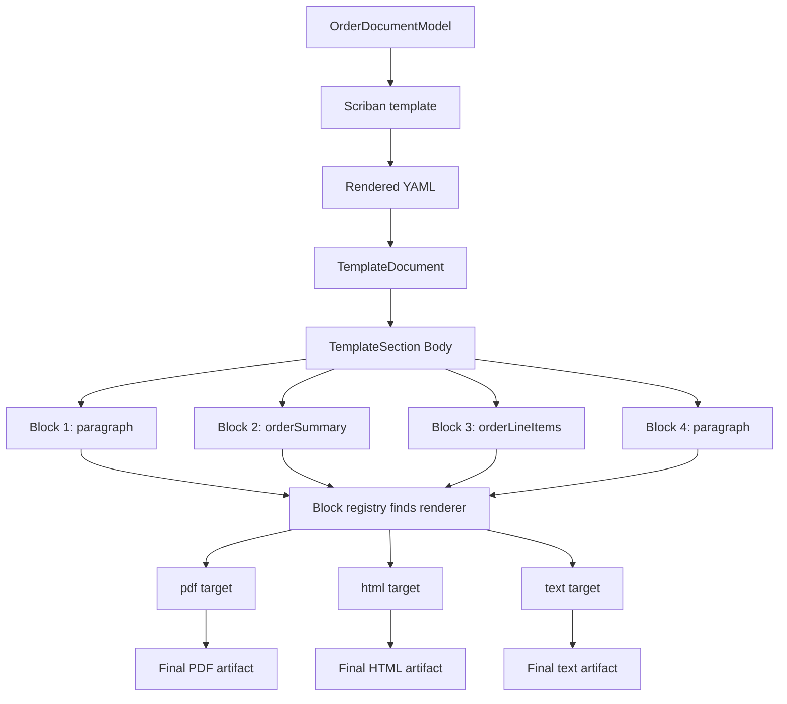

# Usage Guide: Application Templating

[TOC]

This document contains usage-oriented walkthroughs and appendices for the application templating feature. The architecture and core design live in `design-application-templating.md`.

---

## Appendix A. End-to-end Order PDF walkthrough

This appendix shows a slightly contrived but complete example.

The goal is to render an order confirmation PDF with:

- a normal business model (`OrderDocumentModel`)
- two custom blocks (`orderSummary` and `orderLineItems`)
- a module-specific template (`Module = "Sales"`)
- the standard templating pipeline
- the public `Result<T>` based engine API

Important:
For this block-rendered order example, you do not create a brand-new root document type. The root stays `TemplateDocument`. The domain-specific customization happens through the business model, template content, and registered custom blocks.

### A.1 What we are building

We want a developer to be able to call:

```csharp
var result = await orderDocumentService.RenderOrderConfirmationPdfAsync(order, cancellationToken);
```

and receive:

- `Result<byte[]>` on success with PDF bytes
- typed errors on failure

The rendered document should contain:

- a heading
- customer/order metadata
- a line items table
- a totals section

### A.2 Step 1: define the business model

Start with a simple model that the application already understands.

```csharp
namespace MyProject.Orders.Documents;

public sealed class OrderDocumentModel
{
    public string OrderNumber { get; set; } = default!;
    public string CustomerName { get; set; } = default!;
    public string CustomerNumber { get; set; } = default!;
    public DateTimeOffset OrderedAtUtc { get; set; }
    public string Currency { get; set; } = "EUR";
    public string ShippingMethod { get; set; } = default!;
    public string PaymentMethod { get; set; } = default!;
    public decimal Subtotal { get; set; }
    public decimal Tax { get; set; }
    public decimal GrandTotal { get; set; }
    public List<OrderLineItemModel> LineItems { get; set; } = [];
}

public sealed class OrderLineItemModel
{
    public string Sku { get; set; } = default!;
    public string Description { get; set; } = default!;
    public decimal Quantity { get; set; }
    public decimal UnitPrice { get; set; }
    public decimal Total { get; set; }
}
```

> note: Keep the business model focused on your application data. Do not mix concrete renderer objects or rendering concerns into it.

### A.3 Step 2: define the custom blocks

The template should stay readable, so we introduce two custom blocks:

- `orderSummary` for the header-like metadata area
- `orderLineItems` for the tabular lines and totals

```csharp
using BridgingIT.DevKit.Application.Templating.Schema;

namespace MyProject.Orders.Documents.Blocks;

public sealed class OrderSummaryBlock : IBlock
{
    public string Name => "orderSummary";
    public string OrderNumber { get; set; } = default!;
    public string CustomerName { get; set; } = default!;
    public string CustomerNumber { get; set; } = default!;
    public string OrderedAt { get; set; } = default!;
    public string ShippingMethod { get; set; } = default!;
    public string PaymentMethod { get; set; } = default!;
}

public sealed class OrderLineItemsBlock : IBlock
{
    public string Name => "orderLineItems";
    public string Currency { get; set; } = "EUR";
    public bool ShowSku { get; set; } = true;
    public decimal Subtotal { get; set; }
    public decimal Tax { get; set; }
    public decimal GrandTotal { get; set; }
    public List<OrderLineItemBlockRow> Items { get; set; } = [];
}

public sealed class OrderLineItemBlockRow
{
    public string Sku { get; set; } = default!;
    public string Description { get; set; } = default!;
    public decimal Quantity { get; set; }
    public decimal UnitPrice { get; set; }
    public decimal Total { get; set; }
}
```

>note: hese block classes describe the YAML schema after Scriban rendering. They are not the original business model.

The important separation is:

- `OrderDocumentModel` is the full input model for the whole document
- `OrderSummaryBlock` and `OrderLineItemsBlock` are smaller fragment DTOs for specific parts of that document

The template is what performs that decomposition. Scriban reads `OrderDocumentModel` and emits block-shaped YAML. YAML deserialization then materializes those emitted fragments into typed block objects.

### A.4 Step 3: implement validators for the custom blocks

Validation keeps bad templates from reaching the renderer.

```csharp
using BridgingIT.DevKit.Application.Templating;
using BridgingIT.DevKit.Application.Templating.Schema;

namespace MyProject.Orders.Documents.Blocks;

public sealed class OrderSummaryBlockValidator : BlockValidator<OrderSummaryBlock>
{
    public override string Name => "orderSummary";

    public override IEnumerable<TemplateValidationError> Validate(
        OrderSummaryBlock block,
        ValidationContext context)
    {
        if (string.IsNullOrWhiteSpace(block.OrderNumber))
        {
            yield return new TemplateValidationError("Order number is required")
            {
                Path = context.Path,
                Code = "orders.summary.orderNumber.required"
            };
        }
    }
}

public sealed class OrderLineItemsBlockValidator : BlockValidator<OrderLineItemsBlock>
{
    public override string Name => "orderLineItems";

    public override IEnumerable<TemplateValidationError> Validate(
        OrderLineItemsBlock block,
        ValidationContext context)
    {
        if (block.Items.Count == 0)
        {
            yield return new TemplateValidationError("At least one line item is required")
            {
                Path = context.Path,
                Code = "orders.lineItems.empty"
            };
        }
    }
}
```

>note: Put template-related validation here. Keep domain validation in your normal application/domain layer.

### A.5 Step 4: implement the custom block renderers

Each renderer family translates the same block into its own target format.

The example below is intentionally simple. It shows one block rendered by `pdf`, `html`, and `text`, and one block that only has a `pdf` implementation.

```csharp
using BridgingIT.DevKit.Application.Templating;
using BridgingIT.DevKit.Application.Templating.Schema;
using HtmlTags;

namespace MyProject.Orders.Documents.Blocks;

public sealed class OrderSummaryPdfBlockRenderer
    : BlockRenderer<OrderSummaryBlock, MigraDocSectionTarget>
{
    public override string Renderer => "pdf";
    public override string BlockName => "orderSummary";

    public override Task RenderAsync(
        OrderSummaryBlock block,
        MigraDocSectionTarget target,
        BlockRenderContext context,
        CancellationToken cancellationToken = default)
    {
        target.Section.AddParagraph($"Order {block.OrderNumber}", "Heading2");
        target.Section.AddParagraph($"Customer: {block.CustomerName} ({block.CustomerNumber})");
        target.Section.AddParagraph($"Ordered: {block.OrderedAt}");
        target.Section.AddParagraph($"Shipping: {block.ShippingMethod}");
        target.Section.AddParagraph($"Payment: {block.PaymentMethod}");
        target.Section.AddParagraph();

        return Task.CompletedTask;
    }
}

public sealed class OrderSummaryHtmlBlockRenderer
    : BlockRenderer<OrderSummaryBlock, HtmlRenderTarget>
{
    public override string Renderer => "html";
    public override string BlockName => "orderSummary";

    public override Task RenderAsync(
        OrderSummaryBlock block,
        HtmlRenderTarget target,
        BlockRenderContext context,
        CancellationToken cancellationToken = default)
    {
        var section = new HtmlTag("section").AddClass("order-summary");
        section.Append(new HtmlTag("h2").Text($"Order {block.OrderNumber}"));
        section.Append(new HtmlTag("p").Text($"Customer: {block.CustomerName} ({block.CustomerNumber})"));
        section.Append(new HtmlTag("p").Text($"Ordered: {block.OrderedAt}"));
        section.Append(new HtmlTag("p").Text($"Shipping: {block.ShippingMethod}"));
        section.Append(new HtmlTag("p").Text($"Payment: {block.PaymentMethod}"));

        target.Root.Append(section);

        return Task.CompletedTask;
    }
}

public sealed class OrderSummaryTextBlockRenderer
    : BlockRenderer<OrderSummaryBlock, TextRenderTarget>
{
    public override string Renderer => "text";
    public override string BlockName => "orderSummary";

    public override Task RenderAsync(
        OrderSummaryBlock block,
        TextRenderTarget target,
        BlockRenderContext context,
        CancellationToken cancellationToken = default)
    {
        target.WriteLine($"Order {block.OrderNumber}");
        target.WriteLine($"Customer: {block.CustomerName} ({block.CustomerNumber})");
        target.WriteLine($"Ordered: {block.OrderedAt}");
        target.WriteLine($"Shipping: {block.ShippingMethod}");
        target.WriteLine($"Payment: {block.PaymentMethod}");
        target.WriteLine(string.Empty);

        return Task.CompletedTask;
    }
}

public sealed class OrderLineItemsPdfBlockRenderer
    : BlockRenderer<OrderLineItemsBlock, MigraDocSectionTarget>
{
    public override string Renderer => "pdf";
    public override string BlockName => "orderLineItems";

    public override Task RenderAsync(
        OrderLineItemsBlock block,
        MigraDocSectionTarget target,
        BlockRenderContext context,
        CancellationToken cancellationToken = default)
    {
        // Same PDF table rendering as before, omitted here for brevity.
        target.Section.AddParagraph($"Grand total: {block.GrandTotal:0.00} {block.Currency}", "Heading3");

        return Task.CompletedTask;
    }
}
```

> note: The block is defined once in YAML, but it can have multiple renderers. Here `orderSummary` supports `pdf`, `html`, and `text`, while `orderLineItems` only supports `pdf`. If `html` or `text` is selected for `orderLineItems`, the chosen renderer should emit a visible placeholder plus diagnostics.

The same rule applies to built-in blocks. A YAML entry like `type: paragraph` does not bypass the registry. It is resolved to `ParagraphBlock`, and then the selected renderer family uses its own built-in block renderer such as `ParagraphPdfBlockRenderer`, `ParagraphHtmlBlockRenderer`, or `ParagraphTextBlockRenderer`. For the HTML family, those renderers should preferably append typed `HtmlTag` nodes rather than writing raw strings.

The casts now live only inside the generic adapter base classes `BlockRenderer<TBlock, TTarget>` and `BlockValidator<TBlock>`. Normal extension implementations stay strongly typed.

### A.6 Step 5: use global block discovery in startup

Block discovery should work like this:

- built-in blocks follow the same pattern, for example `ParagraphBlock` plus `ParagraphPdfBlockRenderer`, `ParagraphHtmlBlockRenderer`, and `ParagraphTextBlockRenderer`
- built-in validators may follow the same pattern, for example `ParagraphBlockValidator : BlockValidator<ParagraphBlock>`
- `OrderSummaryBlock` exposes `Name = "orderSummary"`
- `OrderSummaryPdfBlockRenderer` exposes `Renderer = "pdf"` and `BlockName = "orderSummary"`
- `OrderSummaryHtmlBlockRenderer` exposes `Renderer = "html"` and `BlockName = "orderSummary"`
- `OrderSummaryTextBlockRenderer` exposes `Renderer = "text"` and `BlockName = "orderSummary"`
- `OrderSummaryBlockValidator` exposes `Name = "orderSummary"` if validation is needed
- the feature setup wires them together automatically by block name and renderer family (see `.AddBlocks()`)

Validators stay optional. If no validator is discovered for a block name, the block is still registered and renderable.

### A.7 Step 6: create the Scriban YAML template

The resolver loads candidate templates, then the template cache reads the static `metadata` section and indexes the template by that metadata. A template can optionally declare `tenantId` when it should only apply to one tenant.

Example template:

```yaml
metadata:
  name: order-confirmation
  tenantId: tenant-42
  module: Sales
  culture: en-US

document:
  version: 1
  kind: page
  templateType: orderConfirmation

  styles:
    - name: Heading1
      font:
        size: 18
        bold: true
    - name: Heading2
      font:
        size: 12
        bold: true
    - name: Heading3
      font:
        size: 11
        bold: true

  sections:
    - body:
        - type: paragraph # built in block
          style: Heading1
          text: "Order confirmation"

        - type: paragraph # built in block
          text: "Thank you for your purchase, {{ model.customerName }}."

        - type: orderSummary # custom block name
          orderNumber: "{{ model.orderNumber }}"
          customerName: "{{ model.customerName }}"
          customerNumber: "{{ model.customerNumber }}"
          orderedAt: "{{ format_date model.orderedAtUtc 'yyyy-MM-dd' }}"
          shippingMethod: "{{ model.shippingMethod }}"
          paymentMethod: "{{ model.paymentMethod }}"

        - type: orderLineItems # custom block name
          currency: "{{ model.currency }}"
          showSku: true
          subtotal: {{ model.subtotal }}
          tax: {{ model.tax }}
          grandTotal: {{ model.grandTotal }}
          items:
            {{ for item in model.lineItems }}
            - sku: "{{ item.sku }}"
              description: "{{ item.description }}"
              quantity: {{ item.quantity }}
              unitPrice: {{ item.unitPrice }}
              total: {{ item.total }}
            {{ end }}

        - type: paragraph # built in block
          text: "Generated by {{ globals.generatedBy }}."
```

> note: The `metadata` section must stay static. The `document` section uses normal YAML plus Scriban expressions. The custom part is the `type` value for each entry, and that value is the registered block name.

This YAML is the decomposition step. The template takes the full `OrderDocumentModel` and projects it into smaller document fragments. For example, the `orderSummary` entry materializes into an `OrderSummaryBlock`, and the `orderLineItems` entry materializes into an `OrderLineItemsBlock`.

### A.8 Step 7: wire the services in startup

This is the application setup a developer would typically do in `Program.cs`.

```csharp
builder.Services
    .AddTemplating(c =>
    {
        c.Enabled = true;
        c.DefaultCulture = "en-US";
        c.EnableCaching = true;
        c.EnableValidation = true;
    })
    .AddCoreTemplates()
    .AddBlocks<OrderDocumentAssemblyMarker>()
    .AddBlocks<SharedSalesDocumentAssemblyMarker>()
    .AddModelRenderers<SharedSalesDocumentAssemblyMarker>()
    .AddEmbeddedResourceResolver(
        typeof(OrderTemplatesAssemblyMarker).Assembly)
    .AddGlobalsProvider<ProjectTemplateGlobalsProvider>()
    .AddAssetResolver<ProjectAssetResolver>()
    .AddRenderer<MigraDocPdfRenderer>()
    .AddRenderer<ProjectHtmlRenderer>()
    .AddRenderer<ProjectTextRenderer>();
```

> note: The exact renderer type names can differ in the final implementation. The important idea is that each registered renderer exposes a family `Name` such as `pdf`, `html`, or `text` and knows how to traverse the document for that family. The `AddBlocks<TMarker>()` calls are the global discovery setup for all block types, family-specific block renderers, and optional validators found in those assemblies. `AddModelRenderers<TMarker>()` does the same for whole-document model renderers keyed by `(renderer, templateName)`. `AddEmbeddedResourceResolver(assembly)` scans that assembly for embedded `*.yaml.scriban` templates automatically.

### A.9 Step 8: call the engine from an application service

Now the caller does not need to know about YAML, renderer internals, or template lookup details.

```csharp
using BridgingIT.DevKit.Application.Templating;
using BridgingIT.DevKit.Common;

namespace MyProject.Orders.Documents;

public sealed class OrderDocumentService
{
    private readonly IDocumentTemplateEngine _engine;

    public OrderDocumentService(IDocumentTemplateEngine engine)
    {
        _engine = engine;
    }

    public Task<Result<byte[]>> RenderOrderConfirmationPdfAsync(
        OrderDocumentModel model,
        CancellationToken cancellationToken = default)
    {
        var context = new TemplateRenderContext
        {
            Culture = "en-US",
            TenantId = "tenant-42",
            Brand = "default",
            Module = "Sales",
            Globals = new Dictionary<string, object?>
            {
                ["generatedBy"] = "Orders"
            }
        };

        return _engine.RenderPdfAsync(
            templateName: "order-confirmation",
            model: model,
            context: context,
            cancellationToken: cancellationToken);
    }
}
```

If the render succeeds, `Result<byte[]>.Value` contains the PDF.

If it fails, the caller can inspect:

- `result.Messages`
- `result.Errors`
- `result.GetErrors<TemplateValidationError>()`
- `result.GetError<TemplateNotFoundError>()`

### A.10 Step 9: understand the runtime flow

This Appendix A example uses the normal block-rendered path.

At runtime the sequence is:

1. The application calls `RenderPdfAsync`.
2. The engine builds a resolution context from `TemplateRenderContext`.
3. On first use, the template cache loads templates from the configured sources.
4. The cache parses YAML metadata where needed and indexes templates by name/tenant/module/culture.
5. The engine resolves the best matching cached template, preferring `TenantId = "tenant-42"` and `Module = "Sales"` and then falling back to non-tenant and global templates.
6. Scriban renders the cached template using `OrderDocumentModel` and `Globals`.
7. The rendered YAML wrapper is deserialized and the inner `document` becomes `TemplateDocument`.
8. The validator checks both standard and custom blocks.
9. The selected renderer family creates its native target and dispatches block renderers by `(renderer, blockName)`.
10. The renderer emits the final artifact and diagnostics, for example PDF bytes, HTML, or plain text.
11. The engine returns `Result<T>` in the shape of the selected convenience API or `RenderedArtifactResult`.

If another loaded template has the same full logical key, the later-loaded one overwrites the earlier cached entry.

The assembly point that is easy to miss is that all blocks end up in the same `TemplateDocument`, and the selected renderer family appends them in order into its own native target.



Read this diagram from top to bottom:

- the business model does not render the final output directly
- the template first becomes one `TemplateDocument`
- that document contains one or more ordered block lists
- each block is rendered in sequence into the selected renderer family's native target
- the final PDF, HTML, or text artifact is the accumulated result of those block renderers

This is why the setup feels larger than a plain string template:

- the model describes business data
- the YAML template describes document structure
- the blocks describe reusable document parts
- the block renderers translate those parts into the selected renderer family

Most of the complexity is one-time setup. After the blocks, templates, and resolver setup exist, normal application code usually only calls the engine with a model and context.

### A.11 Step 10: beginner checklist

If a developer wants to add another document like `delivery-note`, the checklist is:

1. Create or reuse a business model.
2. Decide whether standard blocks are enough.
3. If yes, continue with blocks as shown in Appendix A.
4. If no, jump to Appendix B and use the code-first model template path.
5. For the block path, add custom block classes as needed.
6. Add optional validators for those blocks.
7. Add block renderers for each renderer family that should support those blocks.
8. Ensure the relevant assemblies are included in block discovery and resolver setup.
9. Add the Scriban YAML template as an embedded resource or another resolver source.
10. Call the engine with the correct `templateName`, `renderer`, and optional `module`.

This is the main mental model for the block path:
the business model feeds Scriban, Scriban produces YAML, YAML becomes `TemplateDocument`, custom blocks extend that document, and the selected renderer family turns it into the final artifact.

## Appendix B. Model-renderer walkthrough

Appendix B shows the simpler code-first model path where a template resolves normally, but the engine does not build blocks or a `TemplateDocument`. Instead, it picks one whole-document model renderer by `(renderer, templateName)`.

This is the right choice when:

- the output is naturally renderer-native, such as `excel`
- the document is mostly one big family-specific layout
- forcing the shape into blocks would feel artificial or would lose useful renderer features

This is not the right choice when:

- standard blocks already express the document well
- you want the same document structure reused across `pdf`, `html`, and `text`
- you want normal block validators and block degradation processing

### B.1 The mental model

Appendix A mental model:

- model -> Scriban -> YAML blocks -> `TemplateDocument` -> block renderers -> final artifact

Appendix B mental model:

- model -> template resolution -> model renderer -> final artifact

Shared pieces still stay the same:

- template lookup by `name + tenantId + module + culture`
- globals
- model processors
- artifact processors
- diagnostics

Skipped pieces in the model path:

- Scriban rendering
- YAML-to-`TemplateDocument` deserialization
- document processors
- block validation
- block renderer dispatch

### B.2 Example use case

Assume a developer needs an Excel export for orders.

That export:

- has one worksheet with tabular rows
- wants native Excel cells and formats
- does not need reusable paragraph/table/image blocks

That is a good candidate for a code-first template registration with `RenderMode = Model`.

### B.3 Example template registration

The template still participates in normal logical resolution, but it is registered directly in `AddTemplating(...)` instead of being defined in a YAML wrapper:

```csharp
builder.Services
    .AddTemplating(c =>
    {
        c.Enabled = true;
        c.DefaultCulture = "en-US";
        c.EnableCaching = true;
        c.EnableValidation = true;
        c.RegisterModelTemplate(
            name: "order-export",
            module: "Sales");
    })
    .AddModelRenderers<OrderExportsAssemblyMarker>();
```

> note: The important values are still the logical identity plus execution mode:

- `name: order-export`
- `module: Sales`
- `culture: chosen at render time` in the renderer, not in registration. The renderer reads it from `RenderContext` and falls back to the template's `culture` if needed, and then to the engine default culture.
- `renderMode: model`

The difference is that those values now live in code instead of in YAML. This registration is culture-neutral. The shared renderer reads the requested culture from the render context and loads localized labels from resource files.

### B.4 Example business model

```csharp
public sealed class OrderExportModel
{
    public string TenantId { get; init; } = default!;
    public string Currency { get; init; } = "EUR";
    public List<OrderExportRowModel> Rows { get; init; } = [];
}

public sealed class OrderExportRowModel
{
    public string OrderNumber { get; init; } = default!;
    public string CustomerName { get; init; } = default!;
    public decimal TotalAmount { get; init; }
}
```

### B.4a Package reference

If the renderer lives in its own project, reference `ClosedXML`:

```xml
<ItemGroup>
  <PackageReference Include="ClosedXML" />
</ItemGroup>
```

In this repo, the package version is already managed centrally in `Directory.Packages.props`.

### B.4b Fictional resource files

Assume the Excel project also contains these resource files:

- `Resources/OrderExportExcelResources.resx`
- `Resources/OrderExportExcelResources.de-DE.resx`

With generated strongly typed accessors such as:

- `WorksheetName`
- `OrderNumberHeader`
- `CustomerHeader`
- `TotalAmountHeader`
- `GrandTotalLabel`

### B.5 Example model renderer

```csharp
using System;
using System.IO;
using System.Globalization;
using BridgingIT.DevKit.Common;
using ClosedXML.Excel;
using BridgingIT.DevKit.Application.Templating.Excel.Resources;

namespace BridgingIT.DevKit.Application.Templating.Excel;

public sealed class OrderExportExcelRenderer
    : IDocumentModelRenderer<OrderExportModel>
{
    public string Renderer => "excel";
    public string TemplateName => "order-export";

    public Task<Result<RenderedArtifactResult>> RenderAsync(
        OrderExportModel model,
        ModelRenderContext context,
        CancellationToken cancellationToken = default)
    {
        var cultureName = context.RenderContext.Culture ?? context.Template.Culture ?? "en-US";
        var culture = CultureInfo.GetCultureInfo(cultureName);
        var worksheetName = OrderExportExcelResources.ResourceManager.GetString(
                nameof(OrderExportExcelResources.WorksheetName), culture)
            ?? "Orders";
        var orderNumberLabel = OrderExportExcelResources.ResourceManager.GetString(
                nameof(OrderExportExcelResources.OrderNumberHeader), culture)
            ?? "Order Number";
        var customerLabel = OrderExportExcelResources.ResourceManager.GetString(
                nameof(OrderExportExcelResources.CustomerHeader), culture)
            ?? "Customer";
        var totalAmountLabel = OrderExportExcelResources.ResourceManager.GetString(
                nameof(OrderExportExcelResources.TotalAmountHeader), culture)
            ?? "Total Amount";
        var grandTotalLabel = OrderExportExcelResources.ResourceManager.GetString(
                nameof(OrderExportExcelResources.GrandTotalLabel), culture)
            ?? "Grand Total";
        var amountFormat = model.Currency == "USD"
            ? "$#,##0.00"
            : culture.Name == "de-DE" ? "#.##0,00" : "#,##0.00";

        using var workbook = new XLWorkbook();
        var worksheet = workbook.Worksheets.Add(worksheetName);

        worksheet.Cell(1, 1).Value = orderNumberLabel;
        worksheet.Cell(1, 2).Value = customerLabel;
        worksheet.Cell(1, 3).Value = totalAmountLabel;

        var headerRange = worksheet.Range(1, 1, 1, 3);
        headerRange.Style.Font.SetBold(true);
        headerRange.Style.Fill.BackgroundColor = XLColor.LightGray;

        var currentRow = 2;
        foreach (var row in model.Rows)
        {
            cancellationToken.ThrowIfCancellationRequested();

            worksheet.Cell(currentRow, 1).Value = row.OrderNumber;
            worksheet.Cell(currentRow, 2).Value = row.CustomerName;
            worksheet.Cell(currentRow, 3).Value = row.TotalAmount;
            worksheet.Cell(currentRow, 3).Style.NumberFormat.Format = amountFormat;

            currentRow++;
        }

        var lastDataRow = currentRow - 1;
        var totalRow = currentRow;

        worksheet.Cell(totalRow, 1).Value = grandTotalLabel;
        worksheet.Cell(totalRow, 1).Style.Font.SetBold(true);

        if (model.Rows.Count > 0)
        {
            worksheet.Cell(totalRow, 3).FormulaA1 = $"=SUM(C2:C{lastDataRow})";

            var dataRange = worksheet.Range(1, 1, lastDataRow, 3);
            dataRange.CreateTable("Orders");
        }
        else
        {
            worksheet.Cell(totalRow, 3).Value = 0m;
        }

        worksheet.Cell(totalRow, 3).Style.Font.SetBold(true);
        worksheet.Cell(totalRow, 3).Style.NumberFormat.Format = amountFormat;

        worksheet.SheetView.FreezeRows(1);
        worksheet.Columns(1, 3).AdjustToContents();

        context.Diagnostics.RenderDiagnostics.Add(
            new TemplateRenderDiagnostic
            {
                Code = "templating.model.closedxml.workbook_created",
                Message = $"Created ClosedXML workbook for culture '{culture.Name}' with {model.Rows.Count} order rows.",
                Renderer = Renderer
            });

        using var stream = new MemoryStream();
        workbook.SaveAs(stream);
        var bytes = stream.ToArray();

        return Task.FromResult(
            Result<RenderedArtifactResult>.Success(
                new RenderedArtifactResult
                {
                    Renderer = Renderer,
                    ContentType = ContentType.XLSX,
                    Content = bytes,
                    ExecutionMode = TemplateExecutionMode.Model,
                    ModelRenderer = nameof(OrderExportExcelRenderer),
                    Diagnostics = context.Diagnostics
                }));
    }

    Task<Result<RenderedArtifactResult>> IDocumentModelRenderer.RenderAsync(
        object model,
        ModelRenderContext context,
        CancellationToken cancellationToken)
    {
        if (model is not OrderExportModel typedModel)
        {
            return Task.FromResult(
                Result<RenderedArtifactResult>.Failure(
                    new TemplateRenderError(
                        "Model type mismatch for model renderer 'excel/order-export'.",
                        Renderer)));
        }

        return RenderAsync(typedModel, context, cancellationToken);
    }
}
```

> note: This renderer does not receive a `TemplateDocument`. It receives the original `OrderExportModel` directly and builds a real `.xlsx` workbook with `ClosedXML`. The same renderer handles both `en-US` and `de-DE` by reading `context.RenderContext.Culture` and loading localized labels from `OrderExportExcelResources.resx` and `OrderExportExcelResources.de-DE.resx`.

### B.6 Optional validator

If the model path needs validation, add a validator for the same `(renderer, templateName)` pair:

```csharp
public sealed class OrderExportExcelValidator
    : IModelRendererValidator<OrderExportModel>
{
    public string Renderer => "excel";
    public string TemplateName => "order-export";

    public IReadOnlyList<TemplateValidationError> Validate(
        OrderExportModel model,
        ModelRenderContext context)
    {
        var errors = new List<TemplateValidationError>();

        if (model.Rows.Count == 0)
        {
            errors.Add(new TemplateValidationError
            {
                Path = "model.rows",
                Code = "templating.model.empty_rows",
                Message = "At least one export row is required."
            });
        }

        return errors;
    }

    IReadOnlyList<TemplateValidationError> IModelRendererValidator.Validate(
        object model,
        ModelRenderContext context)
    {
        if (model is OrderExportModel typedModel)
        {
            return Validate(typedModel, context);
        }

        return new List<TemplateValidationError>
        {
            new()
            {
                Path = "model",
                Code = "templating.model.invalid_type",
                Message = "The model type does not match the validator."
            }
        };
    }
}
```

### B.7 Registration

```csharp
builder.Services
    .AddTemplating(c =>
    {
        c.Enabled = true;
        c.DefaultCulture = "en-US";
        c.EnableCaching = true;
        c.EnableValidation = true;
        c.RegisterModelTemplate(
            name: "order-export",
            module: "Sales");
    })
    .AddModelRenderers<OrderExportsAssemblyMarker>();
```

> note: `RegisterModelTemplate(...)` defines one culture-neutral model template. `AddModelRenderers<TMarker>()` still discovers only one renderer implementation for `("excel", "order-export")`, and that renderer is responsible for localization.

### B.8 Calling the engine

Rendering:

```csharp
var resultEn = await engine.RenderAsync(
    templateName: "order-export",
    renderer: "excel",
    model: exportModel,
    context: new TemplateRenderContext
    {
        Module = "Sales",
        Culture = "en-US"
    },
    cancellationToken: cancellationToken);
```

German rendering uses the same renderer with a different culture:

```csharp
var resultDe = await engine.RenderAsync(
    templateName: "order-export",
    renderer: "excel",
    model: exportModel,
    context: new TemplateRenderContext
    {
        Module = "Sales",
        Culture = "de-DE"
    },
    cancellationToken: cancellationToken);
```

Renderer-aware validation:

```csharp
var validation = await engine.ValidateAsync(
    templateName: "order-export",
    renderer: "excel",
    model: exportModel,
    context: new TemplateRenderContext
    {
        Module = "Sales",
        Culture = "en-US"
    },
    cancellationToken: cancellationToken);
```

### B.9 Runtime flow

At runtime the sequence is:

1. The application calls `RenderAsync(..., renderer: "excel", ...)`.
2. On first use, the cache loads both resolver-backed templates and code-first template registrations.
3. The engine resolves the `order-export` template through the normal cache lookup rules.
4. The engine reads the configured execution descriptor `RenderMode = Model`.
5. The engine merges globals and runs model processors.
6. The engine resolves the model renderer with key `("excel", "order-export")`.
7. The engine optionally runs the matching model-renderer validator.
8. The shared model renderer reads the requested culture from the render context, loads the matching resources, and builds the localized workbook directly from the input model.
9. Artifact processors run.
10. The engine returns the final artifact and diagnostics.

### B.10 Beginner checklist

If a developer wants to add a model-rendered document:

1. Confirm that the document does not fit the shared block model well.
2. Create the business model.
3. Register the model template in `AddTemplating(...)` with a stable name.
4. Implement one `IDocumentModelRenderer<TModel>` for the target renderer family.
5. If the renderer is shared across cultures, load translated labels from resource files and read the requested culture from `TemplateRenderContext`.
6. Register discovery with `AddModelRenderers<TMarker>()`.
7. Call `RenderAsync(templateName, renderer, model, context)`.
8. Add an optional `IModelRendererValidator<TModel>` and use the renderer-aware `ValidateAsync(templateName, renderer, model, context)` overload when you want validation before rendering.

This is the main mental model:
the template still helps the engine find the correct document definition, but the actual output is produced directly by one renderer-native model renderer instead of by YAML blocks.

### B.11 Advanced option: separate renderers per culture

If you truly need different renderer implementations per culture, the current simple key of `(renderer, templateName)` is not enough. In that case, the design should add an optional culture qualifier to the model-renderer contract and registry.

One reasonable shape is:

```csharp
public interface ICultureAwareDocumentModelRenderer : IDocumentModelRenderer
{
    string? Culture { get; }
}
```

With discovery and lookup rules changed to:

- prefer an exact `(renderer, templateName, culture)` match
- fall back to a neutral renderer where `Culture = null`
- fail fast on duplicate exact matches

Example:

```csharp
public sealed class OrderExportExcelRendererEnUs
    : IDocumentModelRenderer<OrderExportModel>, ICultureAwareDocumentModelRenderer
{
    public string Renderer => "excel";
    public string TemplateName => "order-export";
    public string? Culture => "en-US";
}

public sealed class OrderExportExcelRendererDeDe
    : IDocumentModelRenderer<OrderExportModel>, ICultureAwareDocumentModelRenderer
{
    public string Renderer => "excel";
    public string TemplateName => "order-export";
    public string? Culture => "de-DE";
}
```

Recommendation:

- use one shared renderer plus resource files for normal localization
- only introduce culture-specific renderer classes when the rendering logic itself diverges substantially between cultures

---

## Appendix C. Shared letter templates with partials/includes

Appendix C shows the recommended block-path approach when several letter templates share almost the same layout and structure, but a few sections differ.

This is the right choice when:

- the page layout, address area, styles, and signature are mostly identical
- each letter variant only changes a few paragraphs or one body section
- you still want the normal `TemplateDocument` path, shared block validation, and reuse across `pdf`, `html`, or `text`

This is usually a better fit than a model renderer because the document shape is still fundamentally a letter and is still well expressed as shared blocks.

### C.1 The mental model

For a family of similar letters, prefer composition over duplication:

- keep one shared layout structure in the root template
- move repeated fragments into partials/includes
- create one small root template per letter variant when the body text differs materially
- keep branding, logos, and legal text in globals/branding providers where possible

That means you usually do not create one giant template full of `if` branches. Instead, you create a few root templates that all include the same shared partials and only swap the variant-specific body partial.

### C.2 Example use case

Assume a project needs three customer letters:

- payment reminder
- contract renewal notice
- address verification request

All three letters share:

- the same page margins and typography
- the same sender/recipient area
- the same greeting structure
- the same signature and legal footer block

Only these parts differ:

- subject line
- one or two body paragraphs
- one optional call-to-action block

In this appendix, the body mostly uses standard blocks such as `paragraph` and `spacer`, but the repeating legal footer is modeled as one custom block so the example also demonstrates how a reusable custom block fits into the same approach.

### C.3 Recommended template layout

A practical resolver layout could look like this:

```text
Templates/
  letters/
    payment-reminder.yaml.scriban
    contract-renewal.yaml.scriban
    address-verification.yaml.scriban
    partials/
      _shared-styles.yaml.scriban
      _address-window.yaml.scriban
      _signature.yaml.scriban
      _payment-reminder-body.yaml.scriban
      _contract-renewal-body.yaml.scriban
      _address-verification-body.yaml.scriban
```

> note: The underscore prefix is only a naming convention to indicate that those files are partials. The resolver still treats them as normal templates/includes. Their actual matching and lookup rules still come from the cache and include loader, not from the file name itself.

### C.4 Example business model

```csharp
public sealed class LetterDocumentModel
{
    public string RecipientName { get; init; } = default!;
    public string RecipientStreet { get; init; } = default!;
    public string RecipientPostalCode { get; init; } = default!;
    public string RecipientCity { get; init; } = default!;
    public string ReferenceNumber { get; init; } = default!;
    public DateTimeOffset CreatedOnUtc { get; init; }
    public decimal? OutstandingAmount { get; init; }
    public DateTimeOffset? DueDateUtc { get; init; }
    public DateTimeOffset? ContractEndUtc { get; init; }
}
```

### C.5 Example custom footer block

No custom blocks are needed for the address area or the body paragraphs in this example because standard blocks are enough there. The footer is a good place to demonstrate one small reusable custom block:

```csharp
using BridgingIT.DevKit.Application.Templating.Schema;

namespace MyProject.Correspondence.Documents.Blocks;

public sealed class LetterFooterBlock : IBlock
{
    public string Name => "letterFooter";
    public string CompanyName { get; set; } = default!;
    public string SupportEmail { get; set; } = default!;
    public string LegalDisclaimer { get; set; } = default!;
}
```

Novice note:
This block represents one semantic fragment of the final `TemplateDocument`. The business model stays `LetterDocumentModel`; the template projects data from that business model and from branding/globals into this smaller reusable footer block.

### C.6 Example root template for one letter variant

The payment reminder root template keeps the overall letter structure and includes shared fragments plus one variant-specific body partial:

```yaml
metadata:
  name: payment-reminder-letter
  module: Correspondence
  culture: en-US

document:
  version: 1
  renderMode: blocks
  kind: page
  templateType: customerLetter

  styles:
{{ include "letters/partials/_shared-styles" }}

  sections:
    - footer:
        - type: letterFooter
          companyName: "{{ branding.companyName }}"
          supportEmail: "{{ branding.values.supportEmail }}"
          legalDisclaimer: "{{ branding.texts.legalDisclaimer }}"

      body:
{{ include "letters/partials/_address-window" }}
        - type: paragraph
          style: Heading1
          text: "Payment reminder"

        - type: paragraph
          text: "Dear {{ model.recipientName }},"

{{ include "letters/partials/_payment-reminder-body" }}
{{ include "letters/partials/_signature" }}
```

> note: This appendix uses the built-in `page` document kind. The root template still uses only standard blocks in the body. The reusable footer is modeled separately as a custom block placed in the section `footer`, which makes it easier to keep footer rendering consistent across renderer families. A built-in `workbook` template would use `document.kind: workbook` and `sheets:` instead of `sections:`.
>
> `header`, `body`, and `footer` are predefined section slots from the shared `TemplateDocument` schema. They are not arbitrary names invented by this template. The selected renderer family maps those slots into its own native concepts, for example real page headers/footers in `pdf`, semantic regions in `html`, or flattened output in `text`.

### C.7 Example footer block renderers

The same `letterFooter` block can then be rendered differently by each renderer family:

```csharp
public sealed class LetterFooterPdfBlockRenderer
    : BlockRenderer<LetterFooterBlock, MigraDocSectionTarget>
{
    public override string Renderer => "pdf";
    public override string BlockName => "letterFooter";

    public override Task RenderAsync(
        LetterFooterBlock block,
        MigraDocSectionTarget target,
        BlockRenderContext context,
        CancellationToken cancellationToken = default)
    {
        target.Section.Footers.Primary.AddParagraph(block.CompanyName);
        target.Section.Footers.Primary.AddParagraph($"Support: {block.SupportEmail}");
        target.Section.Footers.Primary.AddParagraph(block.LegalDisclaimer);

        return Task.CompletedTask;
    }
}

public sealed class LetterFooterHtmlBlockRenderer
    : BlockRenderer<LetterFooterBlock, HtmlRenderTarget>
{
    public override string Renderer => "html";
    public override string BlockName => "letterFooter";

    public override Task RenderAsync(
        LetterFooterBlock block,
        HtmlRenderTarget target,
        BlockRenderContext context,
        CancellationToken cancellationToken = default)
    {
        var footer = new HtmlTag("footer").AddClass("letter-footer");
        footer.Append(new HtmlTag("p").Text(block.CompanyName));
        footer.Append(new HtmlTag("p").Text($"Support: {block.SupportEmail}"));
        footer.Append(new HtmlTag("p").Text(block.LegalDisclaimer));

        target.Root.Append(footer);
        return Task.CompletedTask;
    }
}

public sealed class LetterFooterTextBlockRenderer
    : BlockRenderer<LetterFooterBlock, TextRenderTarget>
{
    public override string Renderer => "text";
    public override string BlockName => "letterFooter";

    public override Task RenderAsync(
        LetterFooterBlock block,
        TextRenderTarget target,
        BlockRenderContext context,
        CancellationToken cancellationToken = default)
    {
        target.WriteLine(block.CompanyName);
        target.WriteLine($"Support: {block.SupportEmail}");
        target.WriteLine(block.LegalDisclaimer);

        return Task.CompletedTask;
    }
}
```

### C.8 Example shared partial

The address partial emits only the YAML fragment that belongs in the body list:

```yaml
        - type: paragraph
          text: "{{ model.recipientName }}"

        - type: paragraph
          text: "{{ model.recipientStreet }}"

        - type: paragraph
          text: "{{ model.recipientPostalCode }} {{ model.recipientCity }}"

        - type: spacer
          size: 12

        - type: paragraph
          text: "Reference: {{ model.referenceNumber }}"

        - type: paragraph
          text: "Date: {{ format_date model.createdOnUtc 'yyyy-MM-dd' }}"

        - type: spacer
          size: 8
```

### C.9 Example variant-specific body partial

The payment reminder body partial contains only the unique part of that letter:

```yaml
        - type: paragraph
          text: "Our records show an outstanding balance of {{ model.outstandingAmount }}."

        - type: paragraph
          text: "Please settle the amount by {{ format_date model.dueDateUtc 'yyyy-MM-dd' }}."

        - type: paragraph
          text: "If payment has already been made, please disregard this reminder."

        - type: spacer
          size: 8
```

The contract renewal letter would have its own root template and own body partial, but it would still include the same shared address and signature partials and the same `letterFooter` block.

### C.10 Startup setup

Because this appendix now includes one custom block, block discovery must include the assembly where `LetterFooterBlock` and its block renderers live:

```csharp
builder.Services
    .AddTemplating(c =>
    {
        c.Enabled = true;
        c.DefaultCulture = "en-US";
        c.EnableCaching = true;
        c.EnableValidation = true;
    })
    .AddCoreTemplates()
    .AddBlocks<LetterBlocksAssemblyMarker>()
    .AddEmbeddedResourceResolver(typeof(LetterTemplatesAssemblyMarker).Assembly)
    .AddRenderer<MigraDocPdfRenderer>()
    .AddRenderer<ProjectHtmlRenderer>()
    .AddRenderer<ProjectTextRenderer>();
```

### C.11 When to use one root template vs several

Use one root template plus a few `if` statements when:

- only one paragraph or heading changes
- the overall block order stays identical
- the template is still easy to read

Use several root templates plus shared partials when:

- the body differs enough that conditionals become noisy
- different teams own different letters
- legal/compliance wording differs by variant
- some letters need extra blocks that others do not

A good rule is: if the template starts to feel like a mini program, split it into multiple root templates and keep the common structure in partials.

### C.12 Calling the engine

Each letter variant is selected by template name:

```csharp
var result = await engine.RenderPdfAsync(
    templateName: "payment-reminder-letter",
    model: letterModel,
    context: new TemplateRenderContext
    {
        Module = "Correspondence",
        Culture = "en-US"
    },
    cancellationToken: cancellationToken);
```

The contract renewal letter would use another template name, for example `contract-renewal-letter`, but still reuse the same partials and the same renderer family.

### C.13 Runtime flow

At runtime the sequence is:

1. The application calls `RenderPdfAsync(...)` or another renderer-specific entry point.
2. The engine resolves the selected root letter template by name/module/culture.
3. Scriban expands the root template and resolves the included partials through the shared include loader.
4. The combined YAML is deserialized into one `TemplateDocument`, including the custom `letterFooter` block.
5. Document validation runs as usual.
6. The selected renderer family renders the standard body blocks and the custom footer block.

The important detail is that partials are only a template-authoring reuse mechanism. After Scriban finishes, the engine still sees one normal rendered YAML document and one normal `TemplateDocument`.

### C.14 Beginner checklist

If several letters share the same structure, use this checklist:

1. Keep the overall letter on the normal block path.
2. Put the shared layout and repeated fragments into partials/includes.
3. Use standard blocks where they are already sufficient.
4. Introduce a small custom block only when one fragment becomes semantic and worth reusing, such as a footer block.
5. Keep one small root template per meaningful letter variant.
6. Use globals/branding providers for organization-wide text, logos, and legal values that should not be repeated in templates.
7. Only fall back to the model-renderer path if the letter is no longer naturally expressible as shared blocks.

This is the main mental model:
partials help you reuse letter fragments during template authoring, but they do not introduce a second runtime document model. The final output still goes through the normal block-based `TemplateDocument` pipeline.
