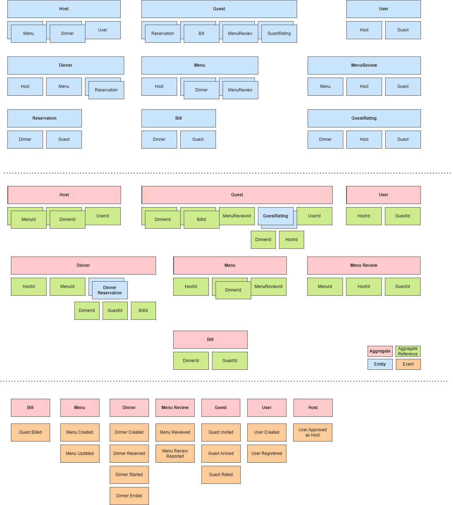

# Architecture overview

> An application built using .NET and following a Domain-Driven Design approach, that is structurally divided into modular components, but still operates as a single monolithic application.

## Features
- Multiple Application Modules (Identity/ Core/ ...)
- Rich domain model with multiple Aggregates, Entities and ValueObjects
- Strongly typed ids for Aggregates and Entities, to prevent "primitive obsession"
- Repository per Aggregate
- [OpenAPI specification](https://swagger.io/specification/) for ApiController and ApiClient generation
- [Testcontainers](https://dotnet.testcontainers.org/) for fast integration tests

## Frameworks
- .NET
- Entity Framework Core
- [ASP.NET Core Identity](https://learn.microsoft.com/en-us/aspnet/core/security/authentication/identity)

## Modules

### Core

### Identity

### Marketing

#### Presentation

#### Application

#### Domain

#### Infrastructure

---
# Application Mockup

## Header
- Logo or website name
- Signup/Login/Logout buttons
- Account management dropdown menu
- Dinner search bar
- Light/Dark theme toggle

## Left Navigation Bar
- Home
- Dinners
- Menus

## Home Page
- Showcase featured dinners and menus

## Dinner Listings
- Browse available dinners hosted by users
- Display dinner name, date and time, location, cuisine type, and image
- Click on a dinner for more details and reservations

## Dinner Details Page
- View comprehensive information about a specific dinner
- Display dinner name, date, time, location, cuisine type, host information, and description
- Highlight the specific menu being served
- Include dietary information or restrictions
- Show dinner schedule and available reservations

## Reservation Process
- Reserve a dinner by following a simple process
- Select number of guests, provide contact information, and specify dietary preferences or restrictions
- Confirmation of the reservation with relevant details

## Host Dinner and Menu Management
- Add new dinners and menus through a dedicated form
- Capture details such as dinner name, date, time, location, cuisine, and menu
- View and manage existing dinners and menus
- Edit details and update schedules

## Account Management
- Signup, login, and logout functionality
- Manage user account settings
- Options to update personal information, change password, etc.
