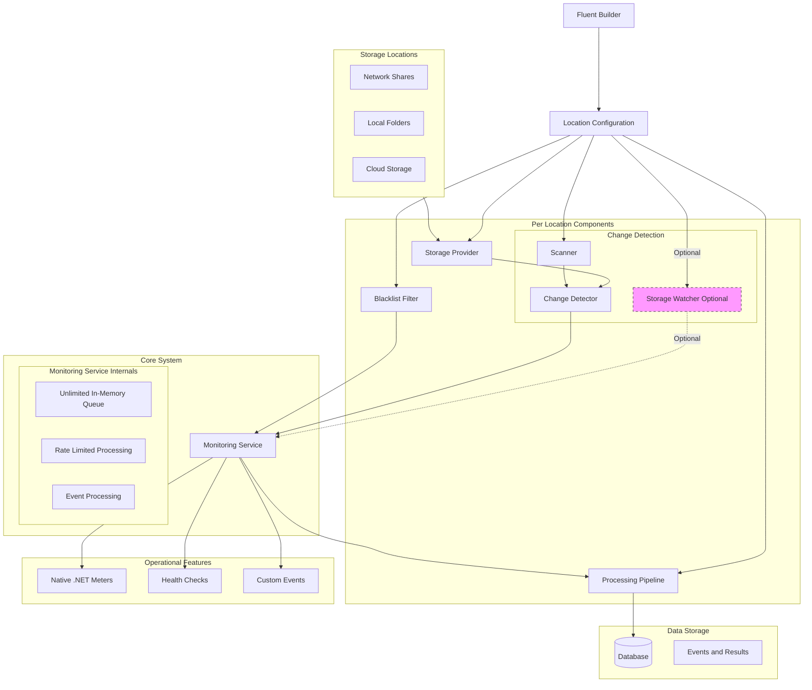
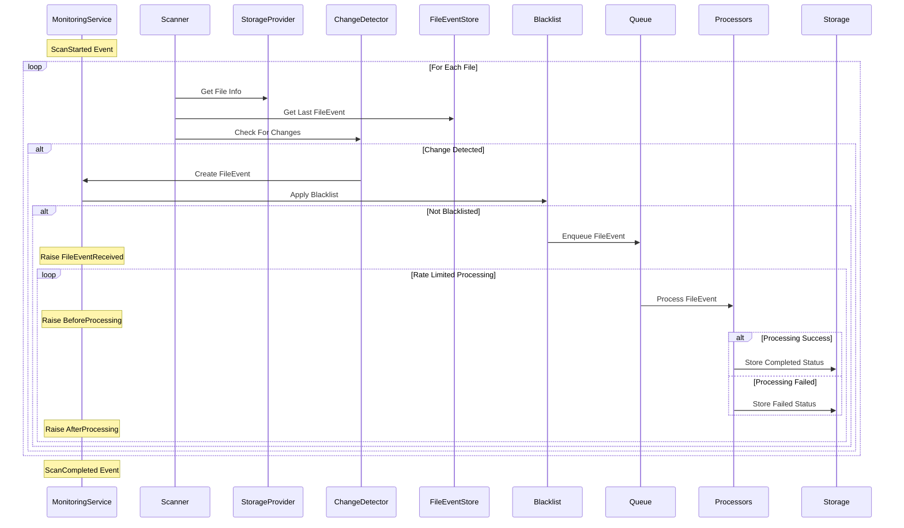

# File Monitoring System - Architecture

[TOC]

> The File Monitoring System provides robust file change monitoring across various storage types. Changes can be detected through two distinct mechanisms: real-time watching and on-demand scanning. Events from both sources flow through a common processing pipeline, ensuring consistent handling regardless of the detection method. The system is designed for reliability, extensibility, and clear operational boundaries.

## Architectural Component Overview
The system is composed of several key component groups that work together to provide comprehensive file monitoring capabilities. Each group has specific responsibilities and clear interfaces with other components, ensuring a modular and maintainable architecture.

## Core Components

### Monitoring Service
The Monitoring Service acts as the central orchestrator of the system, managing all aspects of file monitoring and event processing. It provides comprehensive control and insight into the system's operation through various interfaces and events. The service maintains independence between locations while ensuring consistent processing and reliable operation.

Key responsibilities include:
- Location lifecycle management and control through pause, resume, and restart operations
- Event queue handling with rate-limited processing
- Processing coordination across multiple locations
- Health monitoring and status reporting
- Operational controls for runtime configuration
- Custom event publishing for external integration

### Change Detection
The system employs two fundamentally different approaches to change detection, each serving specific use cases while ensuring consistent event generation. This dual approach provides flexibility in how changes are detected while maintaining uniform event processing.

#### Watchers (Real-time)
File system watchers provide immediate change detection through system notifications:
- File system event-based detection requiring no active polling
- Direct event generation without state comparison
- Immediate notification of changes
- Optional per location with default enabled state

#### Scanners (On-demand)
Scanners actively inspect the file system and compare with known state:
- Systematic traversal of configured locations
- State comparison with previously stored events
- Change detection through configured strategy
- Event generation for detected differences
- Support for startup and on-demand scanning

### Processing Pipeline
The event processing pipeline ensures reliable and controlled handling of all detected changes. It implements rate limiting and sequential processing to maintain system stability while providing clear tracking and error handling capabilities.

Core features:
- In-memory queue with unlimited capacity
- Rate-limited processing with configurable thresholds
- Strictly sequential event processing
- Optional processor retry policies
- Comprehensive status tracking
- Event correlation throughout the flow

### Storage Layer
The storage layer focuses solely on maintaining file event history and processing results. It provides efficient access to historical data while maintaining clear boundaries around what is persisted.

Responsibilities:
- File event persistence with full state
- Processing result storage
- Efficient event lookup by id or path
- Historical event tracking
- Clear storage boundaries

### Operational Features
The system provides comprehensive operational features through standard .NET interfaces, ensuring easy integration with existing monitoring and management systems.

Key features:
- Native .NET meters for performance metrics
- Standard health checks for monitoring
- Rich event publication for external integration
- Comprehensive operational control interfaces

## Event Flows

### Real-time Watching Flow
The watcher-based detection provides immediate notification of file system changes:

### Scanning Flow
The scanner provides systematic change detection through state comparison:

## Design Principles
The system is built on key design principles that ensure reliable operation, clear boundaries, and maintainable code.

### Independence
Component independence is a fundamental principle:
- Each location operates completely independently
- Storage providers are self-contained
- Processors handle specific, focused tasks
- Clear component boundaries and interfaces

### Reliability
The system prioritizes reliable operation:
- Consistent event processing regardless of source
- Comprehensive error handling
- Optional retry policies where appropriate
- Complete status tracking

### Observability
Comprehensive monitoring is built into the system:
- Native .NET metrics for performance monitoring
- Standard health checks for system status
- Rich event publishing for external integration
- Clear operational insights

### Extensibility
The system is designed for extension:
- Custom storage provider implementation
- New change detection strategies
- Additional event processors
- Event handler integration

## System Boundaries

### Processing Boundaries
The system maintains clear processing boundaries:
- Strictly sequential event processing
- Rate-limited queue processing
- No parallel execution
- Clear retry policies and limits

### Storage Boundaries
Storage is focused and limited:
- Event and result persistence only
- No metrics storage (uses .NET meters)
- Efficient state tracking
- Clear lookup capabilities

### Queue Boundaries
Queue operation is well-defined:
- Pure in-memory implementation
- Rate-limited processing
- No persistence requirements
- Clear capacity handling

## Operational Capabilities
The system provides comprehensive operational features:

### Monitoring
Built-in monitoring capabilities:
- Native .NET meters for metrics
- Standard health checks
- Queue inspection interfaces
- Status tracking and reporting

### Control
Runtime control features:
- Location pause/resume operations
- Processor enable/disable capabilities
- Queue management functions
- Health verification interfaces

### Event Publication
Rich event publication for integration:
- File event notifications
- Processing status updates
- Error notifications
- Operational state changes

Through these architectural decisions and clear boundaries, the system provides robust file monitoring capabilities while maintaining reliability, extensibility, and operational excellence.