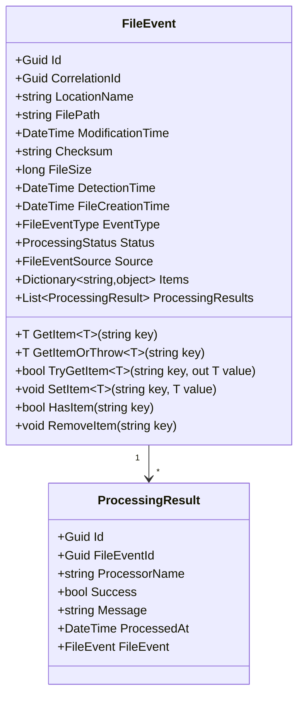
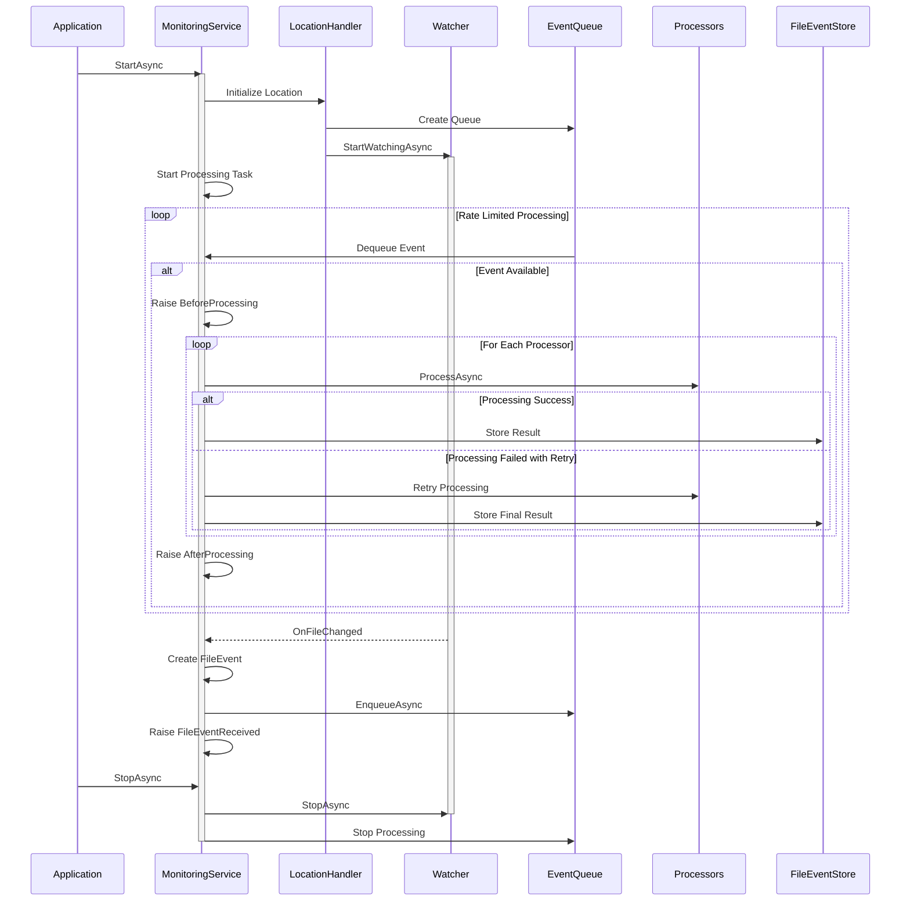
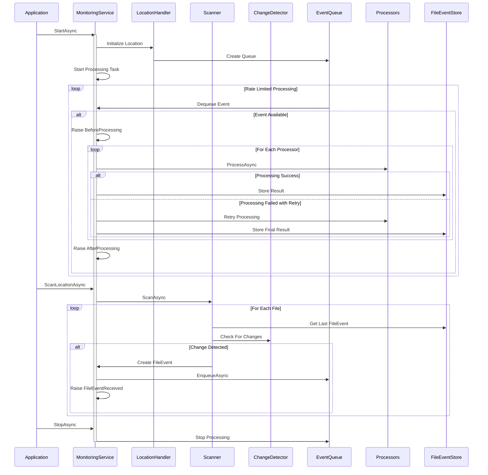

# File Monitoring System - Technical Design

## System Overview
The File Monitoring System's technical design focuses on clear interfaces, well-defined responsibilities, and efficient implementation patterns. The system uses modern .NET features for metrics and health monitoring while maintaining clear boundaries around core file monitoring functionality.

## Core Entity Model
The file event model forms the foundation of the system, capturing all necessary information about file changes and their processing state. The model supports both persistent state through the Items dictionary and maintains clear relationships between events and their processing outcomes.



## Event Detection and Processing Flows
The system implements two distinct approaches for detecting and handling file changes. Each flow is optimized for its specific use case while ensuring consistent event processing through the pipeline.

### Real-time Watcher Flow
Real-time monitoring through filesystem watchers provides immediate notification of changes. The watcher operates independently of change detection strategies as it receives direct filesystem events.



### Scanner-based Flow
The scanner actively compares the current filesystem state with previously stored events, using the configured change detection strategy to identify modifications. This approach ensures thorough change detection, especially useful after system downtime.



## Core Interfaces

### Change Detection
The change detection strategy pattern enables flexible implementations for determining file changes. Strategies can leverage the storage provider when needed, for example to calculate checksums.

```csharp
public interface IChangeDetector
{
    ChangeDetectionStrategy Strategy { get; }
    Task<bool> HasChangedAsync(FileInfo currentFile, FileEvent lastEvent, CancellationToken token);
}
```

### Storage Provider
The storage provider abstraction handles all file system interactions, providing a consistent interface across different storage types. Each implementation manages the specifics of its storage technology while maintaining consistent behavior.

```csharp
public interface IFileStorageProvider : IDisposable
{
    string LocationName { get; }

    // File Operations
    Task<bool> ExistsAsync(string path, CancellationToken token);
    Task<Stream> ReadFileAsync(string path, CancellationToken token);
    Task WriteFileAsync(string path, Stream content, CancellationToken token);
    Task DeleteFileAsync(string path, CancellationToken token);
    Task<string> GetChecksumAsync(string path, CancellationToken token);

    // File Information
    Task<FileInfo> GetFileInfoAsync(string path, CancellationToken token);
    Task<IEnumerable<string>> ListFilesAsync(string path, string searchPattern, bool recursive, int page, int pageSize, CancellationToken token);
    Task<bool> IsDirectoryAsync(string path, CancellationToken token);

    // Directory Operations
    Task CreateDirectoryAsync(string path, CancellationToken token);
    Task DeleteDirectoryAsync(string path, bool recursive, CancellationToken token);
    Task<IEnumerable<string>> ListDirectoriesAsync(string path, string searchPattern, bool recursive, int page, int pageSize, CancellationToken token);

    // Health Check
    Task<bool> CheckHealthAsync(CancellationToken token);
}
```

### Event Storage
The event storage interface focuses solely on event persistence and retrieval. It provides efficient access to historical events and their processing results.

```csharp
public interface IFileEventStore
{
    Task<FileEvent> GetFileEventAsync(Guid id);
    Task<FileEvent> GetFileEventAsync(string filePath);
    Task<List<FileEvent>> GetFileEventsForLocationAsync(string locationName, int page, int pageSize);
    Task StoreEventAsync(FileEvent fileEvent);
    Task StoreProcessingResultAsync(ProcessingResult result);
}
```

### Event Processing
The processor interface defines the contract for implementing file event processors. Each processor receives context containing the file event and can store processing-specific information.

```csharp
public interface IFileEventProcessor
{
    string ProcessorName { get; }
    Task<(bool CanHandle, string ReasonIfNot)> CanHandleAsync(ProcessingContext context, CancellationToken token);
    Task<(bool Success, string Message)> ProcessAsync(ProcessingContext context, CancellationToken token);
}

public class ProcessingContext
{
    public string LocationName { get; }
    public Guid CorrelationId { get; }
    public FileEvent FileEvent { get; }
    public Dictionary<string, object> Items { get; } = new();
    public ProcessingStatus Status { get; set; }
    public List<string> ProcessingMessages { get; } = new();
    public DateTime ProcessingStarted { get; }
    public CancellationToken CancellationToken { get; }

    // Helper methods for type-safe item access
    public T GetItem<T>(string key);
    public T GetItemOrThrow<T>(string key);
    public bool TryGetItem<T>(string key, out T value);
    public void SetItem<T>(string key, T value);
    public bool HasItem(string key);
    public void RemoveItem(string key);
}
```

### Monitoring Service
The monitoring service provides comprehensive control over the system's operation, offering both monitoring capabilities and operational control.

```csharp
public class MonitoringService
{
    // Core operations
    Task StartAsync(CancellationToken token);
    Task StopAsync(CancellationToken token);

    // Location control
    Task RestartLocationAsync(string locationName, CancellationToken token);
    Task PauseLocationAsync(string locationName);
    Task ResumeLocationAsync(string locationName);

    // Status and control
    Task<LocationStatus> GetLocationStatusAsync(string locationName);
    Task<Dictionary<string, LocationStatus>> GetAllLocationStatusAsync();
    Task<bool> IsLocationActiveAsync(string locationName);
    Task<bool> IsHealthyAsync();

    // Queue inspection
    int GetQueueSize(string locationName);
    Task<bool> IsQueueEmptyAsync(string locationName);
    Task WaitForQueueEmptyAsync(string locationName, TimeSpan timeout);

    // Processor operations
    Task<IEnumerable<string>> GetActiveProcessorsAsync(string locationName);
    Task EnableProcessorAsync(string locationName, string processorName);
    Task DisableProcessorAsync(string locationName, string processorName);

    // Events
    event EventHandler<FileEventReceivedEventArgs> FileEventReceived;
    event EventHandler<FileEventDiscardedEventArgs> FileEventDiscarded;
    event EventHandler<ProcessingEventArgs> BeforeProcessing;
    event EventHandler<ProcessingEventArgs> AfterProcessing;
    event EventHandler<ProcessingErrorEventArgs> ProcessingError;
    event EventHandler<ProcessorStartedEventArgs> ProcessorStarted;
    event EventHandler<ProcessorCompletedEventArgs> ProcessorCompleted;
    event EventHandler<ProcessorErrorEventArgs> ProcessorError;
    event EventHandler<LocationStatusChangedEventArgs> LocationStatusChanged;
    event EventHandler<ScanStartedEventArgs> ScanStarted;
    event EventHandler<ScanCompletedEventArgs> ScanCompleted;
}
```

## Implementation Guidelines

### Change Detection Strategy Implementation
When implementing a new change detection strategy, follow these guidelines to ensure reliable operation:

Implementation Rules:
- Clear, single responsibility for change detection
- Efficient comparison logic
- Proper resource management and cleanup
- Clear error handling and logging
- Performance characteristics documentation

### Storage Provider Implementation
Storage providers must adhere to these principles to maintain system reliability:

Provider Requirements:
- Complete error handling for all operations
- Efficient streaming for file operations
- Proper resource cleanup in all scenarios
- Clear timeout handling
- Comprehensive health check implementation

### Processor Implementation
Processors should follow these guidelines to ensure reliable event processing:

Processor Guidelines:
- Single, focused processing responsibility
- Clear error handling with proper logging
- Proper correlation ID usage
- Resource-conscious operation
- Document retry requirements
- Proper context usage for state

## Design Boundaries and Constraints

### Processing Boundaries
The system enforces clear processing boundaries:

Processing Limits:
- Sequential processing only, no parallel execution
- Rate-limited operations with defaults
- Clear retry policies and limits
- Well-defined error handling paths

### Storage Boundaries
Storage focuses solely on event data:

Storage Constraints:
- Event and result storage only
- No metrics storage (use .NET meters)
- Clear lookup patterns
- Efficient state tracking

### Queue Boundaries
Queue operation has clear constraints:

Queue Limits:
- Pure in-memory implementation
- Rate-limited processing
- No persistence requirements
- Clear capacity handling

Through these design decisions and implementation guidelines, the system maintains clear boundaries while providing robust file monitoring capabilities.