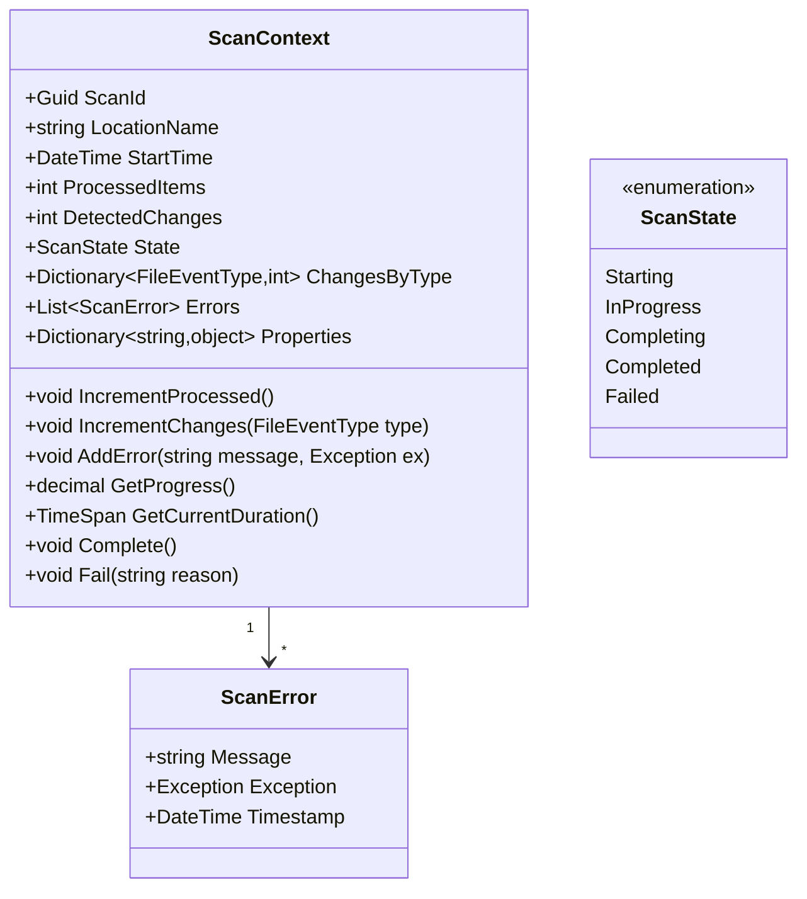
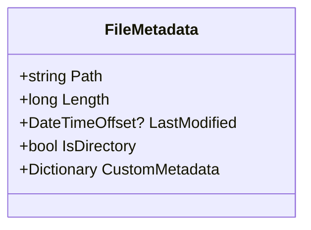
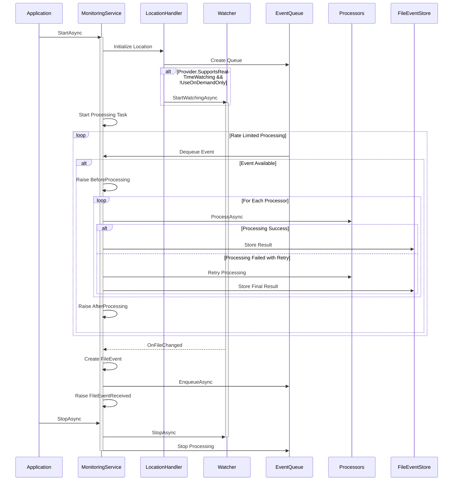
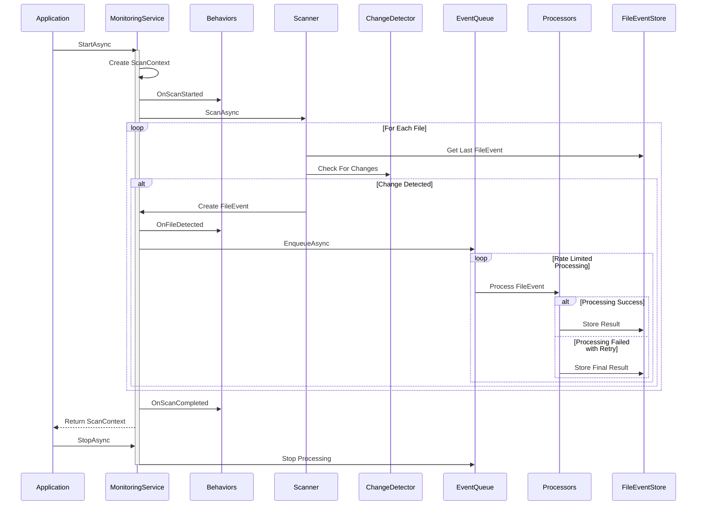

# File Monitoring System - Technical Design

> The File Monitoring System's technical design focuses on clear interfaces, well-defined responsibilities, and efficient implementation patterns. The system uses modern .NET features for metrics and health monitoring while maintaining clear boundaries around core file monitoring functionality, with extensible behaviors providing rich monitoring capabilities. The updated `IFileStorageProvider` interface supports both traditional file shares and cloud storage (e.g., Azure Blob Storage) using a generic abstraction.

[TOC]

## Core Entity Models

### File Event Model
The file event model forms the foundation of the system, capturing all necessary information about file changes and their processing state. The model supports both persistent state through the `Items` dictionary and maintains clear relationships between events and their processing outcomes.


### Scan Context Model
The scan context model provides rich contextual information about scan operations, enabling behavior-based monitoring and analysis.



### File Metadata Model
To support diverse storage systems, including cloud-based solutions like Azure Blob Storage, the system uses an abstracted `FileMetadata` class instead of `FileInfo`. This provides a generic representation of file metadata, accommodating both file shares and object storage where paths may mimic hierarchical structures (e.g., `folder/subfolder/file.txt` in blob names).



- **Path**: The full path or name (e.g., `folder/subfolder/file.txt`), interpreted as a blob name in object storage or a file path in file systems.
- **Length**: The size of the file or blob in bytes.
- **LastModified**: The last modification time, if available (nullable for systems where it’s not applicable).
- **IsDirectory**: Indicates if the entity is a directory (true for virtual folders in cloud storage inferred from path prefixes).
- **CustomMetadata**: Key-value pairs for additional metadata (e.g., blob metadata or file attributes).

## Event Detection and Processing Flows

### Real-time Watcher Flow
Real-time monitoring through filesystem watchers provides immediate notification of changes. The watcher operates independently of change detection strategies as it receives direct filesystem events, but only if the provider supports it and real-time watching is enabled.



The watcher is started only if the storage provider supports real-time watching (`SupportsRealTimeWatching` is `true`) and `UseOnDemandOnly` is not specified in the location configuration. Otherwise, the location relies solely on on-demand scanning.

### Scanner-based Flow with Behaviors
The scanner actively compares the current filesystem state with previously stored events, using the configured change detection strategy to identify modifications while providing progress information through behaviors.



## Core Interfaces

### Monitoring Behavior
The behavior interface defines the contract for implementing monitoring behaviors that track and analyze scan operations.

```csharp
public interface IMonitoringBehavior
{
    void OnScanStarted(ScanContext context);
    void OnFileDetected(ScanContext context, FileEvent fileEvent);
    void OnScanCompleted(ScanContext context, TimeSpan duration);
}
```

### Change Detection
The change detection strategy pattern enables flexible implementations for determining file changes. Strategies use `FileMetadata` from the storage provider to compare current state with past events.

```csharp
public interface IChangeDetector
{
    ChangeDetectionStrategy Strategy { get; }
    Task<bool> HasChangedAsync(FileMetadata currentFile, FileEvent lastEvent, CancellationToken token);
}
```

### Storage Provider
The `IFileStorageProvider` interface abstracts file system interactions for both traditional file shares and cloud storage systems like Azure Blob Storage. It assumes hierarchical structure is mimicked via path naming (e.g., blob names like `folder/subfolder/file.txt`) and supports scalable listing with continuation tokens. Containers or shares are configured during provider initialization.

```csharp
public interface IFileStorageProvider : IDisposable
{
    string LocationName { get; }

    /// <summary>
    /// Indicates whether the provider supports real-time change detection (e.g., via FileSystemWatcher or cloud event subscriptions).
    /// </summary>
    bool SupportsRealTimeWatching { get; }

    // File Operations
    Task<bool> ExistsAsync(string path, CancellationToken token);
    Task<Stream> ReadFileAsync(string path, CancellationToken token);
    Task WriteFileAsync(string path, Stream content, CancellationToken token);
    Task DeleteFileAsync(string path, CancellationToken token);
    Task<string> GetChecksumAsync(string path, CancellationToken token);

    // File Information
    Task<FileMetadata> GetFileInfoAsync(string path, CancellationToken token);
    /// <summary>
    /// Lists files matching the search pattern under the specified path. For cloud storage, supports continuation tokens for scalability.
    /// </summary>
    /// <param name="path">The base path (e.g., directory or container prefix).</param>
    /// <param name="searchPattern">Pattern to filter files (e.g., "*.txt").</param>
    /// <param name="recursive">Whether to include subdirectories (inferred from path hierarchy).</param>
    /// <param name="continuationToken">Token for pagination; null for first page, returned token for subsequent pages.</param>
    /// <returns>A tuple of file paths and the next continuation token (null if no more pages).</returns>
    Task<(IEnumerable<string> Files, string? NextContinuationToken)> ListFilesAsync(
        string path,
        string searchPattern,
        bool recursive,
        string? continuationToken,
        CancellationToken token);
    Task<bool> IsDirectoryAsync(string path, CancellationToken token);

    // Directory Operations
    Task CreateDirectoryAsync(string path, CancellationToken token);
    Task DeleteDirectoryAsync(string path, bool recursive, CancellationToken token);
    Task<IEnumerable<string>> ListDirectoriesAsync(string path, string searchPattern, bool recursive, CancellationToken token);

    // Health Check
    Task<bool> CheckHealthAsync(CancellationToken token);
}
```

### Event Storage
The event storage interface focuses solely on event persistence and retrieval. It provides efficient access to historical events and their processing results.

```csharp
public interface IFileEventStore
{
    Task<FileEvent> GetFileEventAsync(Guid id);
    Task<FileEvent> GetFileEventAsync(string filePath);
    Task<List<FileEvent>> GetFileEventsForLocationAsync(string locationName, int page, int pageSize);
    Task StoreEventAsync(FileEvent fileEvent);
    Task StoreProcessingResultAsync(ProcessingResult result);
}
```

### Event Processing
The processor interface defines the contract for implementing file event processors. Each processor receives context containing the file event and can store processing-specific information.

```csharp
public interface IFileEventProcessor
{
    string ProcessorName { get; }
    Task<(bool CanHandle, string ReasonIfNot)> CanHandleAsync(ProcessingContext context, CancellationToken token);
    Task<(bool Success, string Message)> ProcessAsync(ProcessingContext context, CancellationToken token);
}

public class ProcessingContext
{
    public string LocationName { get; }
    public Guid CorrelationId { get; }
    public FileEvent FileEvent { get; }
    public Dictionary<string, object> Items { get; } = new();
    public ProcessingStatus Status { get; set; }
    public List<string> ProcessingMessages { get; } = new();
    public DateTime ProcessingStarted { get; }
    public CancellationToken CancellationToken { get; }

    // Helper methods for type-safe item access
    public T GetItem<T>(string key);
    public T GetItemOrThrow<T>(string key);
    public bool TryGetItem<T>(string key, out T value);
    public void SetItem<T>(string key, T value);
    public bool HasItem(string key);
    public void RemoveItem(string key);
}
```

### Monitoring Service
The monitoring service provides comprehensive control over the system's operation, offering both monitoring capabilities and operational control.

```csharp
public class MonitoringService
{
    // Core operations
    /// <summary>
    /// Starts the monitoring service, initializing all configured locations.
    /// Real-time watchers are started only for locations where the provider supports it and UseOnDemandOnly is not specified.
    /// </summary>
    Task StartAsync(CancellationToken token);
    Task StopAsync(CancellationToken token);

    // Scanning operations
    Task<ScanContext> ScanLocationAsync(string locationName, CancellationToken token);

    // Location control
    Task RestartLocationAsync(string locationName, CancellationToken token);
    Task PauseLocationAsync(string locationName);
    Task ResumeLocationAsync(string locationName);

    // Status and control
    Task<LocationStatus> GetLocationStatusAsync(string locationName);
    Task<Dictionary<string, LocationStatus>> GetAllLocationStatusAsync();
    Task<bool> IsLocationActiveAsync(string locationName);
    Task<bool> IsHealthyAsync();

    // Queue inspection
    int GetQueueSize(string locationName);
    Task<bool> IsQueueEmptyAsync(string locationName);
    Task WaitForQueueEmptyAsync(string locationName, TimeSpan timeout);

    // Processor operations
    Task<IEnumerable<string>> GetActiveProcessorsAsync(string locationName);
    Task EnableProcessorAsync(string locationName, string processorName);
    Task DisableProcessorAsync(string locationName, string processorName);

    // Events
    event EventHandler<FileEventReceivedEventArgs> FileEventReceived;
    event EventHandler<FileEventDiscardedEventArgs> FileEventDiscarded;
    event EventHandler<ProcessingEventArgs> BeforeProcessing;
    event EventHandler<ProcessingEventArgs> AfterProcessing;
    event EventHandler<ProcessingErrorEventArgs> ProcessingError;
    event EventHandler<ProcessorStartedEventArgs> ProcessorStarted;
    event EventHandler<ProcessorCompletedEventArgs> ProcessorCompleted;
    event EventHandler<ProcessorErrorEventArgs> ProcessorError;
    event EventHandler<LocationStatusChangedEventArgs> LocationStatusChanged;
}
```

## Implementation Guidelines

### Behavior Implementation
Behaviors should follow these guidelines to ensure reliable operation:

**Behavior Guidelines:**
- Single, focused monitoring responsibility
- Non-blocking operation wherever possible
- Proper error handling without affecting scan operation
- Efficient resource usage and cleanup
- Clear documentation of collected metrics
- Thread-safe state management
- Proper usage of `ScanContext` properties

**Example Behavior Implementation:**
```csharp
public class MetricsBehavior : IMonitoringBehavior
{
    private readonly Meter meter;
    private readonly Counter<long> scanStarted;
    private readonly Counter<long> changesDetected;
    private readonly Histogram<double> scanDuration;
    private readonly ObservableGauge<int> activeScanCount;
    private readonly ConcurrentDictionary<Guid, DateTime> activeScanTimes = new();

    public MetricsBehavior()
    {
        meter = new Meter("FileMonitoring");
        scanStarted = meter.CreateCounter<long>("file_monitoring.scans.started");
        changesDetected = meter.CreateCounter<long>("file_monitoring.changes.detected");
        scanDuration = meter.CreateHistogram<double>("file_monitoring.scan.duration", "ms");
        activeScanCount = meter.CreateObservableGauge<int>(
            "file_monitoring.scans.active",
            () => activeScanTimes.Count);
    }

    public void OnScanStarted(ScanContext context)
    {
        scanStarted.Add(1);
        activeScanTimes.TryAdd(context.ScanId, DateTime.UtcNow);
        meter.CreateObservableGauge($"file_monitoring.scan.progress.{context.ScanId}", () => context.GetProgress());
    }

    public void OnFileDetected(ScanContext context, FileEvent fileEvent)
    {
        changesDetected.Add(1);
    }

    public void OnScanCompleted(ScanContext context, TimeSpan duration)
    {
        scanDuration.Record(duration.TotalMilliseconds);
        activeScanTimes.TryRemove(context.ScanId, out _);
        meter.RemoveInstrument($"file_monitoring.scan.progress.{context.ScanId}");
    }
}
```

### Change Detection Strategy Implementation
When implementing a new change detection strategy, follow these guidelines to ensure reliable operation:

**Implementation Rules:**
- Clear, single responsibility for change detection
- Efficient comparison logic using `FileMetadata`
- Proper resource management and cleanup
- Clear error handling and logging
- Performance characteristics documentation

### Storage Provider Implementation
Storage providers must adhere to these principles to maintain system reliability and support both file shares and cloud storage:

**Provider Requirements:**
- Complete error handling for all operations
- Efficient streaming for file operations
- Proper resource cleanup in all scenarios
- Clear timeout handling
- Comprehensive health check implementation
- Use path-based hierarchy (e.g., `folder/subfolder/file.txt`) for both file systems and cloud storage
- Support continuation tokens in `ListFilesAsync` for scalability; return `null` for local file systems

**Example Implementation for Local File System:**
```csharp
public class LocalFileStorageProvider : IFileStorageProvider
{
    private readonly string _rootPath;

    public LocalFileStorageProvider(string rootPath)
    {
        _rootPath = rootPath;
    }

    public string LocationName => _rootPath;
    public bool SupportsRealTimeWatching => true; // Supports FileSystemWatcher

    public async Task<bool> ExistsAsync(string path, CancellationToken token)
    {
        return await Task.FromResult(File.Exists(Path.Combine(_rootPath, path)));
    }

    public async Task<Stream> ReadFileAsync(string path, CancellationToken token)
    {
        return await Task.FromResult(File.OpenRead(Path.Combine(_rootPath, path)));
    }

    public async Task<FileMetadata> GetFileInfoAsync(string path, CancellationToken token)
    {
        var fullPath = Path.Combine(_rootPath, path);
        var info = new FileInfo(fullPath);
        return new FileMetadata
        {
            Path = path,
            Length = info.Length,
            LastModified = info.LastWriteTimeUtc,
            IsDirectory = false,
            CustomMetadata = new Dictionary<string, string>()
        };
    }

    public async Task<(IEnumerable<string> Files, string? NextContinuationToken)> ListFilesAsync(
        string path,
        string searchPattern,
        bool recursive,
        string? continuationToken,
        CancellationToken token)
    {
        var fullPath = Path.Combine(_rootPath, path);
        var files = Directory.EnumerateFiles(
            fullPath,
            searchPattern,
            recursive ? SearchOption.AllDirectories : SearchOption.TopDirectoryOnly);
        return (files.Select(f => Path.GetRelativePath(_rootPath, f)), null); // No pagination needed
    }

    // ... Implement other methods (WriteFileAsync, DeleteFileAsync, etc.)
    public void Dispose() { }
}
```

**Example Implementation for Azure Blob Storage:**
```csharp
public class AzureBlobStorageProvider : IFileStorageProvider
{
    private readonly BlobContainerClient _containerClient;

    public AzureBlobStorageProvider(string connectionString, string containerName)
    {
        _containerClient = new BlobContainerClient(connectionString, containerName);
    }

    public string LocationName => _containerClient.Name;
    public bool SupportsRealTimeWatching => false; // No native watcher; requires external event system

    public async Task<bool> ExistsAsync(string path, CancellationToken token)
    {
        var blobClient = _containerClient.GetBlobClient(path);
        return await blobClient.ExistsAsync(token);
    }

    public async Task<Stream> ReadFileAsync(string path, CancellationToken token)
    {
        var blobClient = _containerClient.GetBlobClient(path);
        var response = await blobClient.OpenReadAsync(new BlobOpenReadOptions(false), token);
        return response;
    }

    public async Task<FileMetadata> GetFileInfoAsync(string path, CancellationToken token)
    {
        var blobClient = _containerClient.GetBlobClient(path);
        var props = await blobClient.GetPropertiesAsync(cancellationToken: token);
        return new FileMetadata
        {
            Path = path,
            Length = props.Value.ContentLength,
            LastModified = props.Value.LastModified,
            IsDirectory = false, // Blobs are files; directories inferred from prefixes
            CustomMetadata = props.Value.Metadata
        };
    }

    public async Task<(IEnumerable<string> Files, string? NextContinuationToken)> ListFilesAsync(
        string path,
        string searchPattern,
        bool recursive,
        string? continuationToken,
        CancellationToken token)
    {
        var prefix = string.IsNullOrEmpty(path) ? null : path + "/";
        var blobs = _containerClient.GetBlobsAsync(
            prefix: prefix,
            cancellationToken: token,
            traits: BlobTraits.None,
            states: BlobStates.None);

        var files = new List<string>();
        await foreach (var blobPage in blobs.AsPages(continuationToken))
        {
            files.AddRange(blobPage.Values
                .Where(b => WildcardPattern.IsMatch(b.Name, searchPattern) &&
                            (recursive || !b.Name.Substring(prefix?.Length ?? 0).Contains("/")))
                .Select(b => b.Name));
            return (files, blobPage.ContinuationToken);
        }
        return (files, null);
    }

    // ... Implement other methods (WriteFileAsync, DeleteFileAsync, etc.)
    public void Dispose() { }
}
```

### Processor Implementation
Processors should follow these guidelines to ensure reliable event processing:

**Processor Guidelines:**
- Single, focused processing responsibility
- Clear error handling with proper logging
- Proper correlation ID usage
- Resource-conscious operation
- Document retry requirements
- Proper context usage for state

### Location Configuration Guidelines
When configuring locations, consider the following:
- **Real-Time Watching**: Enabled by default if `SupportsRealTimeWatching` is `true`. Use `UseOnDemandOnly()` to disable watchers and restrict to on-demand scanning.
- **Consistency**: Ensure the detection strategy (e.g., timestamp or checksum) aligns with the intended use case, whether real-time or on-demand.

**Example:**
```csharp
builder.Services.AddFileMonitoring(monitoring =>
{
    monitoring.UseShare("ManualScan", "\\\\server\\manual", options =>
    {
        options.FilePattern = "*.log";
        options.UseOnDemandOnly(); // Explicitly on-demand only
    });
});
```

### Processing Rate Limiting

The Processing Pipeline uses rate limiting to control the rate at which events are dequeued from the unlimited in-memory queue and processed sequentially. This stabilizes resource usage by throttling processing, not enqueueing, via two parameters: `EventsPerSecond` (steady-state rate, e.g., 100 events/second) and `MaxBurstSize` (burst capacity, e.g., 1000 events). Configured per location, it employs a token bucket model—processing events up to the burst size, then at the specified rate.

**Example Configuration:**
```csharp
builder.Services.AddFileMonitoring(monitoring =>
{
    monitoring
        .UseShare("Documents", "\\\\server\\docs", options =>
        {
            options.FilePattern = "*.pdf";
            options.RateLimit
                .WithEventsPerSecond(100)  // Process 100 events per second
                .WithMaxBurstSize(1000);   // Allow a burst of 1000 events
            options.UseProcessor<FileReadProcessor>();
        });
});
```

For 1200 events in one second, 1000 process immediately, and 200 queue, processed over 2 seconds. This ensures reliable handling but may grow the queue if production exceeds processing, relying on memory availability.

## Design Boundaries and Constraints

### Behavior Boundaries
Behaviors must operate within clear constraints:

**Behavior Constraints:**
- Read-only access to scan context
- Non-blocking operation required
- Independent operation from other behaviors
- No direct storage access
- Clear cleanup of resources
- Thread-safe state management

### Processing Boundaries
The system enforces clear processing boundaries:

**Processing Limits:**
- Sequential processing only, no parallel execution
- Rate-limited operations with defaults
- Clear retry policies and limits
- Well-defined error handling paths

### Storage Boundaries
Storage focuses solely on event data:

**Storage Constraints:**
- Event and result storage only
- No metrics storage (use behaviors)
- Clear lookup patterns
- Efficient state tracking

### Queue Boundaries
Queue operation has clear constraints:

**Queue Limits:**
- Pure in-memory implementation
- Rate-limited processing
- No persistence requirements
- Clear capacity handling

Through these design decisions and implementation guidelines, the system maintains clear boundaries while providing robust file monitoring capabilities across diverse storage types.