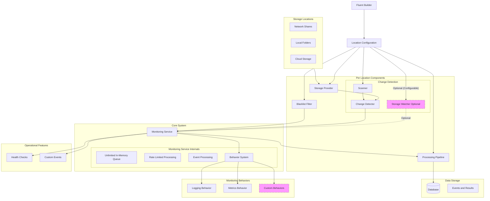
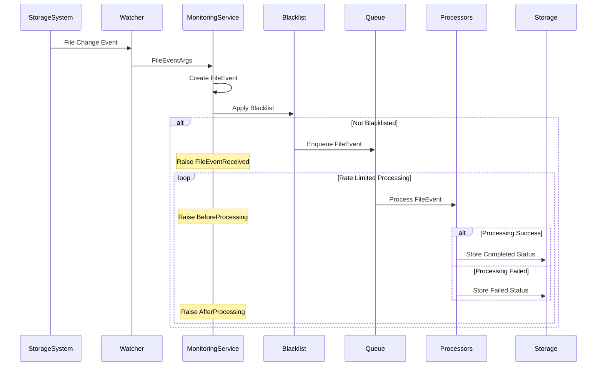
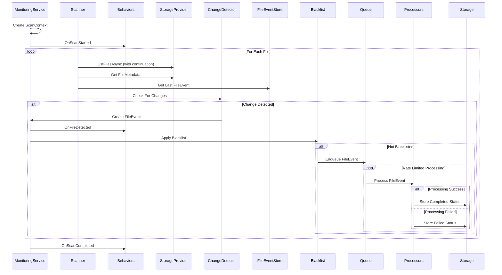

# File Monitoring System - Architecture

[TOC]

> The File Monitoring System provides robust file change monitoring across various storage types, including traditional file shares and cloud storage systems like Azure Blob Storage. Changes can be detected through two distinct mechanisms: real-time watching (where supported) and on-demand scanning. Events from both sources flow through a common processing pipeline, with extensible behaviors providing monitoring and insight capabilities. The system is designed for reliability, extensibility, and clear operational boundaries.

## Architectural Component Overview
The system is composed of several key component groups that work together to provide comprehensive file monitoring capabilities. Each group has specific responsibilities and clear interfaces with other components, ensuring a modular and maintainable architecture.



The `Storage Watcher (SW)` is optional and configurable per location. By default, it is enabled if supported by the provider (`SupportsRealTimeWatching` is `true`) and not disabled via `UseOnDemandOnly`. The `Storage Provider (SP)` abstracts both file shares and cloud storage, using `FileMetadata` for file information and supporting scalable listing operations with continuation tokens.

## Core Components

### Monitoring Service
The Monitoring Service acts as the central orchestrator of the system, managing all aspects of file monitoring and event processing. It provides comprehensive control and insight into the system's operation through various interfaces and events. The service maintains independence between locations while ensuring consistent processing and reliable operation.

**Key Responsibilities:**
- Location lifecycle management and control through pause, resume, and restart operations
- Event queue handling with rate-limited processing
- Processing coordination across multiple locations
- Behavior system coordination
- Health monitoring and status reporting
- Operational controls for runtime configuration, including enabling/disabling real-time watching based on provider support and configuration

### Behavior System
The behavior system provides extensible monitoring and insight capabilities through a plug-in architecture. Behaviors receive notifications about scan operations and can provide various monitoring, logging, and analysis capabilities.

**Key Aspects:**
- Plug-in architecture for monitoring operations
- Rich context sharing between behaviors
- Clear lifecycle events (start, detection, completion)
- Built-in behaviors for common needs
- Custom behavior support

#### ScanContext
The `ScanContext` provides rich contextual information about ongoing scan operations:
- Unique scan identifier for correlation
- Location and timing information
- Progress tracking and state management
- Error collection and handling
- Performance metrics collection
- Extensible properties for behavior communication

### Change Detection
The system employs two fundamentally different approaches to change detection, each serving specific use cases while ensuring consistent event generation. This dual approach provides flexibility in how changes are detected while maintaining uniform event processing.

#### Watchers (Real-time)
File system watchers provide immediate change detection through system notifications:
- File system event-based detection requiring no active polling
- Direct event generation without state comparison
- Immediate notification of changes
- Optional per location, enabled by default if the storage provider’s `SupportsRealTimeWatching` is `true`, configurable via the `UseOnDemandOnly` option to disable real-time watching and restrict to on-demand scanning

#### Scanners (On-demand)
Scanners actively inspect the storage system and compare with known state:
- Systematic traversal of configured locations, using scalable listing with continuation tokens where necessary
- State comparison with previously stored events
- Change detection through configured strategy using `FileMetadata`
- Event generation for detected differences
- Support for startup and on-demand scanning
- Integration with behavior system for progress tracking

### Processing Pipeline
The event processing pipeline ensures reliable and controlled handling of all detected changes. It implements rate limiting and sequential processing to maintain system stability while providing clear tracking and error handling capabilities.

**Core Features:**
- In-memory queue with unlimited capacity
- Rate-limited processing with configurable thresholds
- Strictly sequential event processing
- Optional processor retry policies
- Comprehensive status tracking
- Event correlation throughout the flow

### Storage Layer
The storage layer focuses solely on maintaining file event history and processing results. It provides efficient access to historical data while maintaining clear boundaries around what is persisted.

**Responsibilities:**
- File event persistence with full state
- Processing result storage
- Efficient event lookup by id or path
- Historical event tracking
- Clear storage boundaries

### Operational Features
The system provides comprehensive operational features through standard .NET interfaces, ensuring easy integration with existing monitoring and management systems.

**Key Features:**
- Behavior-based monitoring and metrics
- Standard health checks for monitoring
- Rich event publication for external integration
- Comprehensive operational control interfaces

## Event Flows

### Real-time Watching Flow
The watcher-based detection provides immediate notification of file system changes where supported by the storage provider:



**Note**: This flow occurs only for locations where the `Storage Provider` supports real-time watching (`SupportsRealTimeWatching` is `true`) and `UseOnDemandOnly` is not set.

### Scanning Flow with Behaviors
The scanner provides systematic change detection with behavior integration, adaptable to both file shares and cloud storage:



**Note**: The scanner uses `ListFilesAsync` with continuation tokens to handle large-scale cloud storage listings efficiently, while functioning seamlessly for local file systems without pagination.

## Design Principles
The system is built on key design principles that ensure reliable operation, clear boundaries, and maintainable code.

### Independence
Component independence is a fundamental principle:
- Each location operates completely independently
- Storage providers are self-contained, supporting diverse storage types
- Processors handle specific, focused tasks
- Behaviors operate independently
- Clear component boundaries and interfaces

### Reliability
The system prioritizes reliable operation:
- Consistent event processing regardless of source
- Comprehensive error handling
- Optional retry policies where appropriate
- Complete status tracking
- Independent behavior operation

### Observability
Comprehensive monitoring is built into the system:
- Behavior-based monitoring system
- Standard health checks for system status
- Rich event publishing for external integration
- Clear operational insights
- Extensible metrics collection

### Extensibility
The system is designed for extension:
- Custom storage provider implementations for file shares or cloud storage
- New change detection strategies
- Additional event processors
- Custom behavior implementation
- Event handler integration

## System Boundaries

### Processing Boundaries
The system maintains clear processing boundaries:
- Strictly sequential event processing
- Rate-limited queue processing
- No parallel execution
- Clear retry policies and limits
- Behavior independence

### Storage Boundaries
Storage is focused and limited:
- Event and result persistence only
- No metrics storage (handled by behaviors)
- Efficient state tracking
- Clear lookup capabilities

### Queue Boundaries
Queue operation is well-defined:
- Pure in-memory implementation
- Rate-limited processing
- No persistence requirements
- Clear capacity handling

### Behavior Boundaries
Behavior operation is well-defined:
- Independent operation
- No direct storage access
- Clear lifecycle events
- Controlled state sharing
- Non-blocking operation

## Operational Capabilities

### Monitoring
Built-in monitoring capabilities:
- Behavior-based metrics collection
- Standard health checks
- Queue inspection interfaces
- Status tracking and reporting
- Custom monitoring extension

### Control
Runtime control features:
- Location pause/resume operations
- Processor enable/disable capabilities
- Queue management functions
- Health verification interfaces
- Behavior management

### Event Publication
Rich event publication for integration:
- File event notifications (real-time where supported)
- Processing status updates
- Error notifications
- Operational state changes
- Behavior events

## Appendix A: Built-in Behaviors

### LoggingBehavior
The `LoggingBehavior` provides structured logging for scan operations:

```csharp
public class LoggingBehavior : IMonitoringBehavior
{
    private readonly ILogger<LoggingBehavior> logger;

    public LoggingBehavior(ILogger<LoggingBehavior> logger)
    {
        this.logger = logger;
    }

    public void OnScanStarted(ScanContext context)
    {
        using var scope = logger.BeginScope(new Dictionary<string, object>
        {
            ["CorrelationId"] = context.ScanId,
            ["LocationName"] = context.LocationName
        });

        logger.LogInformation(
            "Started scanning location: {LocationName}. Start time: {StartTime}. Scan ID: {ScanId}",
            context.LocationName,
            context.StartTime,
            context.ScanId);
    }

    public void OnFileDetected(ScanContext context, FileEvent fileEvent)
    {
        using var scope = logger.BeginScope(new Dictionary<string, object>
        {
            ["CorrelationId"] = context.ScanId,
            ["LocationName"] = context.LocationName
        });

        logger.LogDebug(
            "Found change in {Path} of type {EventType}. Total changes: {TotalChanges}",
            fileEvent.FilePath,
            fileEvent.EventType,
            context.DetectedChanges);
    }

    public void OnScanCompleted(ScanContext context, TimeSpan duration)
    {
        using var scope = logger.BeginScope(new Dictionary<string, object>
        {
            ["CorrelationId"] = context.ScanId,
            ["LocationName"] = context.LocationName
        });

        logger.LogInformation(
            "Scan completed. Location: {LocationName}, Duration: {Duration}, Total changes: {TotalChanges}, Scan ID: {ScanId}",
            context.LocationName,
            duration,
            context.DetectedChanges,
            context.ScanId);
    }
}
```

### MetricsBehavior
The `MetricsBehavior` collects performance metrics during scan operations:

```csharp
public class MetricsBehavior : IMonitoringBehavior
{
    private readonly Meter meter;
    private readonly Counter<long> scanStarted;
    private readonly Counter<long> changesDetected;
    private readonly Histogram<double> scanDuration;
    private readonly ObservableGauge<int> activeScanCount;
    private readonly ConcurrentDictionary<Guid, DateTime> activeScanTimes = new();

    public MetricsBehavior()
    {
        meter = new Meter("FileMonitoring");
        scanStarted = meter.CreateCounter<long>("file_monitoring.scans.started");
        changesDetected = meter.CreateCounter<long>("file_monitoring.changes.detected");
        scanDuration = meter.CreateHistogram<double>("file_monitoring.scan.duration", "ms");
        activeScanCount = meter.CreateObservableGauge<int>(
            "file_monitoring.scans.active",
            () => activeScanTimes.Count);
    }

    public void OnScanStarted(ScanContext context)
    {
        scanStarted.Add(1);
        activeScanTimes.TryAdd(context.ScanId, DateTime.UtcNow);

        meter.CreateObservableGauge(
            $"file_monitoring.scan.progress.{context.ScanId}",
            () => context.GetProgress());
    }

    public void OnFileDetected(ScanContext context, FileEvent fileEvent)
    {
        changesDetected.Add(1);
    }

    public void OnScanCompleted(ScanContext context, TimeSpan duration)
    {
        scanDuration.Record(duration.TotalMilliseconds);
        activeScanTimes.TryRemove(context.ScanId, out _);

        meter.RemoveInstrument($"file_monitoring.scan.progress.{context.ScanId}");
    }
}
```

Through these architectural decisions and clear boundaries, the system provides robust file monitoring capabilities across diverse storage types, maintaining reliability, extensibility, and operational excellence. The behavior system ensures comprehensive monitoring and analysis capabilities that can be extended for specific needs.