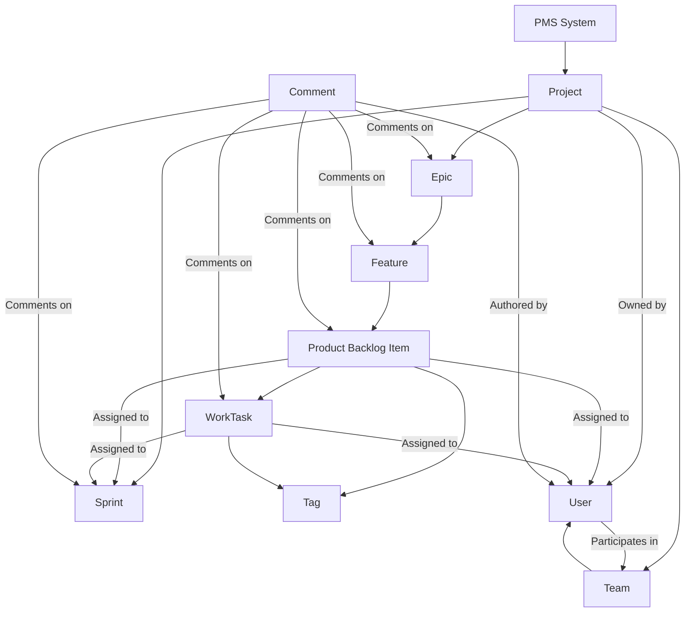
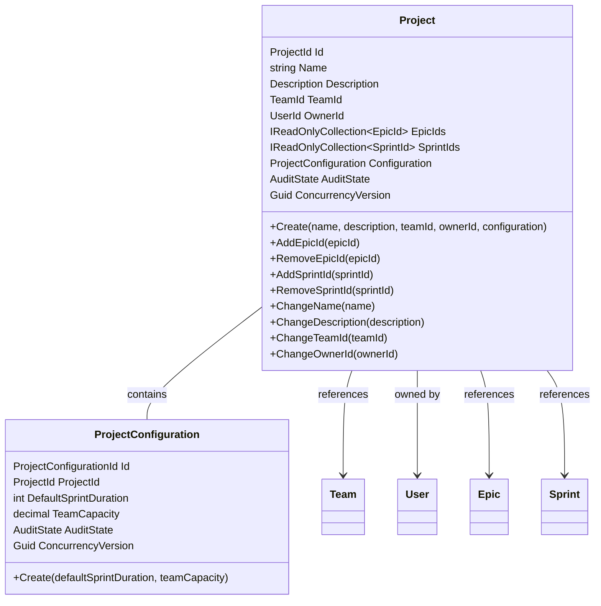
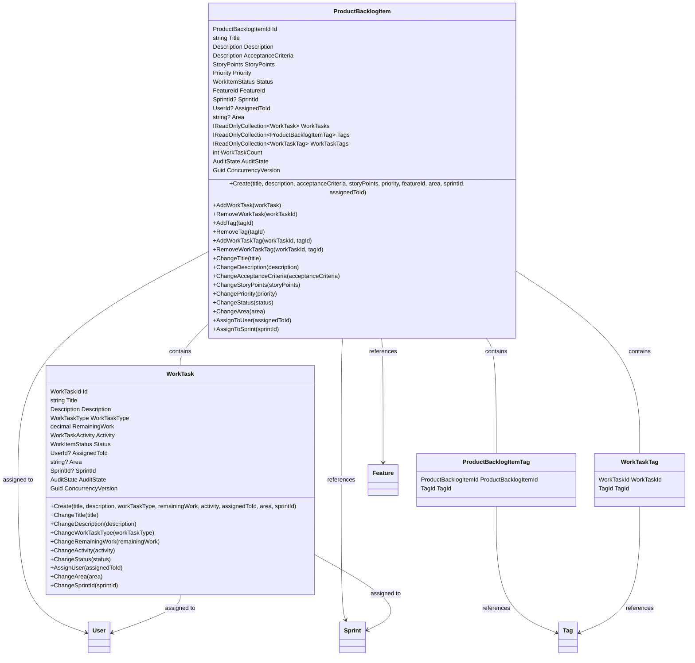
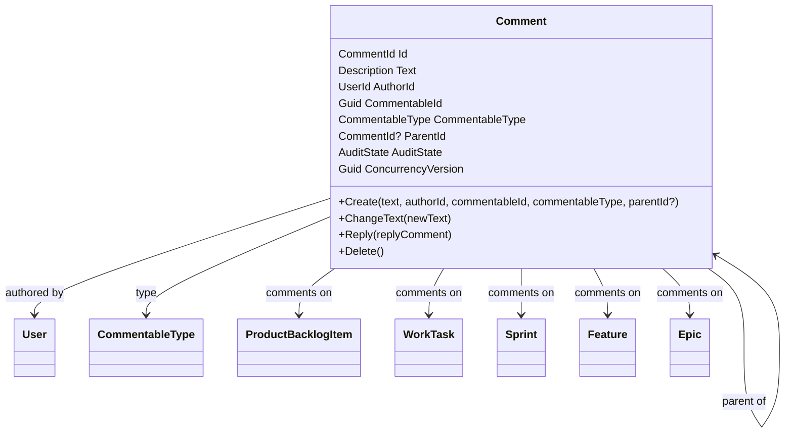
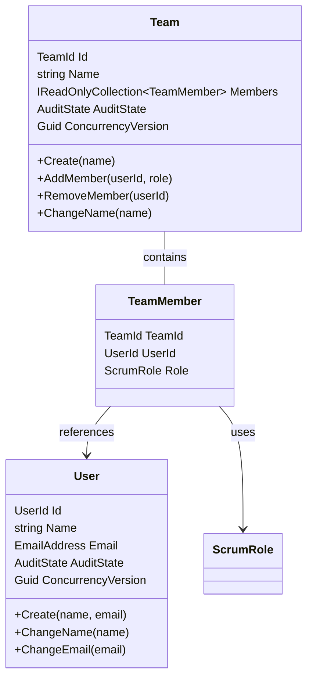
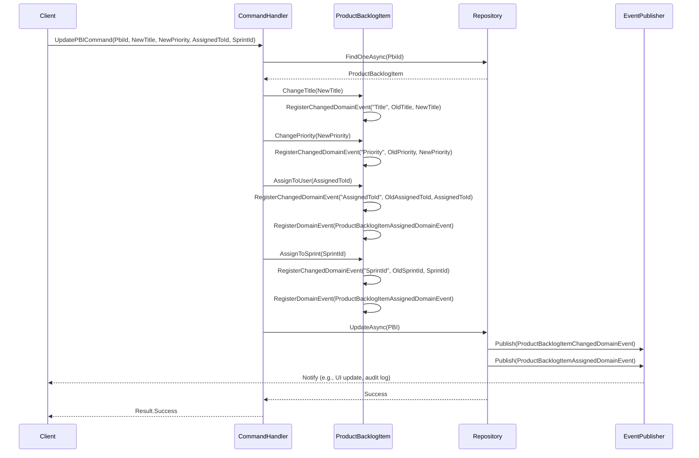

# Project Management System (PMS) Domain Model

## Overview
The **Project Management System (PMS)** is a Scrum-based system inspired by the Azure DevOps Scrum template, designed to manage agile projects, work items, and teams. It supports multi-project environments, where each project encapsulates Epics, Features, Product Backlog Items (PBIs), WorkTasks, Sprints, and Comments, with Teams assigned to Projects. The domain model follows Domain-Driven Design (DDD) principles, ensuring a rich, behavior-driven model with clear boundaries and consistency, including domain events for reactive workflows.

This document targets all stakeholders—Product Owners, Scrum Masters, Development Team members, Stakeholders, and developers—to provide a clear understanding of the domain. It includes:
- **Ubiquitous Language**: Defines key terms and concepts.
- **Strongly-Typed IDs**: Describes the use of `[TypedEntityId<Guid>]` for type-safe identifiers.
- **Aggregates and Entities**: Details the core components, their relationships, and associated domain events.
- **Value Objects and Smart Enumerations**: Describes immutable types and strongly-typed enums.
- **Domain Events**: Describes events for domain changes and workflows.
- **Relationships**: Explains one-to-many, many-to-many, one-to-one, and optional foreign keys.
- **Invariants**: Lists rules ensuring consistency, validated via `Result` with `ValidationError`.
- **Diagrams**: Visualizes the model with a context diagram, class diagrams, and a sequence diagram for event flows.

The model is implemented using Active Entity for persistence, supporting auditing (`IAuditable`) via `AuditState` (capturing creation/update timestamps and metadata) and concurrency (`IConcurrency`), with strongly-typed IDs for type safety via source generation.

## Ubiquitous Language
The following terms form the core of the PMS domain, ensuring alignment between stakeholders and developers:
- **Project**: A container for a specific initiative or product, grouping Epics, Sprints, one Team, and a configuration.
- **ProjectConfiguration**: Settings for a Project, such as default sprint duration and team capacity.
- **Epic**: A high-level business objective within a Project, grouping Features.
- **Feature**: A product capability within a Project, grouping PBIs.
- **Product Backlog Item (PBI)**: A user story delivering value, optionally assigned to a User or Sprint, containing WorkTasks and Tags, with Comments for discussion.
- **WorkTask**: A unit of work within a PBI, with subtypes (Task, Bug, Impediment, Issue), optionally assigned to a User or Sprint, supporting Tags and Comments.
- **Sprint**: A time-boxed iteration within a Project, with a goal and planning details, containing committed PBIs, with Comments for planning or retrospectives.
- **SprintPlan**: Planning details for a Sprint, such as effort and risk assessment.
- **SprintGoal**: The objective and success criteria for a Sprint.
- **Comment**: A discussion entry on a PBI, WorkTask, Sprint, Feature, or Epic, supporting threaded replies.
- **Team**: A group of Users with per-team roles, assigned to one Project.
- **User**: An individual (e.g., team member or stakeholder) participating in Teams or as an owner/assignee.
- **TeamMember**: A link between a User and a Team, specifying the User’s role (e.g., Product Owner).
- **Tag**: A label for categorizing PBIs and WorkTasks within a Project.
- **Priority**: A value object for prioritizing work items (1–4).
- **StoryPoints**: A value object for estimating PBI effort (Fibonacci-like).
- **Description**: A value object for rich text (e.g., user story details, comment text).
- **DueDate**: A value object for dates (e.g., sprint start/end).
- **EmailAddress**: A value object for user email addresses.
- **WorkItemStatus**, **WorkTaskType**, **WorkTaskActivity**, **SprintStatus**, **ScrumRole**, **CommentableType**: Smart enumerations for workflows, task types, activities, sprint states, roles, and commentable entities.

## Strongly-Typed IDs
The PMS model uses strongly-typed IDs to enhance type safety and domain clarity, avoiding the *primitive obsession* anti-pattern where primitive types like `Guid` are used for identifiers. This is achieved through the `[TypedEntityId<Guid>]` attribute, which triggers a source generator to create wrapper classes (e.g., `ProductBacklogItemId`, `WorkTaskId`, `CommentId`) for entity IDs.

### Overview
Using primitive `Guid` types for identifiers can lead to errors, such as passing a `WorkTaskId` where a `ProductBacklogItemId` is expected. The `[TypedEntityId<Guid>]` attribute generates strongly-typed ID classes that encapsulate a `Guid` value, ensuring compile-time type safety and semantic clarity.

### Source Generation
The source generator scans classes marked with `[TypedEntityId<T>]` (where `T` is `Guid` in PMS) and creates ID classes with:
- A `Value` property (type `Guid`).
- Constructors and factory methods (e.g., `Create(Guid value)`).
- Implicit/explicit conversions to/from `Guid`.
- JSON serialization support.
- Equality comparison and debugging visualization.

**Example Generated ID Class**:
```csharp
public class ProductBacklogItemId
{
    public Guid Value { get; }
    private ProductBacklogItemId(Guid value) => Value = value;
    public static ProductBacklogItemId Create(Guid value) => new(value);
    public static implicit operator Guid(ProductBacklogItemId id) => id.Value;
    public static explicit operator ProductBacklogItemId(Guid value) => Create(value);
    // Equality, ToString, JSON support...
}
```

### Usage in PMS
Entities like `ProductBacklogItem`, `WorkTask`, `Sprint`, `Feature`, `Epic`, `Tag`, `Team`, `User`, and `Comment` use `[TypedEntityId<Guid>]` to generate IDs (e.g., `ProductBacklogItemId`, `CommentId`). This ensures methods like `AddWorkTask(WorkTask workTask)` or `CreateComment(CommentableId id, CommentableType type)` enforce type safety.

**Example**:
```csharp
public Result AddWorkTask(WorkTask workTask) // WorkTaskId, not ProductBacklogItemId
{
    // Compile-time error if WorkTaskId is mixed with ProductBacklogItemId
}
```

### Entity Framework Configuration
Strongly-typed IDs are mapped to database columns using Entity Framework Core value converters:
```csharp
public class ProductBacklogItemEntityTypeConfiguration : IEntityTypeConfiguration<ProductBacklogItem>
{
    public void Configure(EntityTypeBuilder<ProductBacklogItem> builder)
    {
        builder.Property(e => e.Id)
            .ValueGeneratedOnAdd()
            .HasConversion(id => id.Value, value => ProductBacklogItemId.Create(value));
        builder.Property(e => e.SprintId)
            .HasConversion(id => id?.Value, value => value.HasValue ? SprintId.Create(value.Value) : null);
        builder.Property(e => e.AssignedToId)
            .HasConversion(id => id?.Value, value => value.HasValue ? UserId.Create(value.Value) : null);
        builder.Property(e => e.FeatureId)
            .HasConversion(id => id.Value, value => FeatureId.Create(value));
    }
}
```

### Benefits
- **Type Safety**: Prevents mixing IDs (e.g., `WorkTaskId` vs. `CommentId`).
- **Domain Clarity**: IDs reflect their domain purpose (e.g., `CommentId` for comments).
- **Persistence**: Seamless mapping to `Guid` columns.
- **Debugging**: Meaningful string representations.
- **Extensibility**: Supports future entities without breaking code.

## Aggregates and Entities
The PMS model is organized into aggregates, each acting as a consistency boundary controlling its child entities and enforcing invariants. Entities use strongly-typed IDs via `[TypedEntityId<Guid>]`, inherit from `ActiveEntity<TEntity, TId>`, implement `IAuditable` (via `AuditState`) and `IConcurrency`, and provide private constructors with `Create` methods returning `Result<TEntity>` for validation. Update methods (e.g., `ChangeTitle`) return `Result` with `ValidationError` using `Result<TEntity>.Failure(new ValidationError(...))`, registering domain events for successful changes, batching property updates into a single `ChangedDomainEvent<TEntity>` per transaction, overwriting same-property changes. Creation methods register only `CreatedDomainEvent` and, if applicable, `AssignedDomainEvent` for initial assignments (e.g., `AssignedToId`, `SprintId`), not `ChangedDomainEvent`.

Domain events are registered using `RegisterDomainEvent` and `RegisterChangedDomainEvent` helpers and published post-persistence via `ActiveEntityDomainEventPublishingBehavior` (with `PublishBefore = false`).

### Project Aggregate
- **Root**: `Project`
  - **Properties**: `Id` (ProjectId), `Name` (string), `Description` (Description), `TeamId` (TeamId), `OwnerId` (UserId), `EpicIds` (IReadOnlyCollection<EpicId>), `SprintIds` (IReadOnlyCollection<SprintId>), `Configuration` (ProjectConfiguration), `AuditState`, `ConcurrencyVersion`.
  - **Methods**: `Create(name, description, teamId, ownerId, configuration)`, `AddEpicId(epicId)`, `RemoveEpicId(epicId)`, `AddSprintId(sprintId)`, `RemoveSprintId(sprintId)`, `ChangeName(name)`, `ChangeDescription(description)`, `ChangeTeamId(teamId)`, `ChangeOwnerId(ownerId)`. Update methods return `Result` with `ValidationError` using `Result.Failure(new ValidationError(...))`. `Create` registers only `ProjectCreatedDomainEvent`.
  - **Domain Events**:
    - `ProjectCreatedDomainEvent(Project project)`: Triggered on `Create`, exposes `ProjectId`.
    - `ProjectChangedDomainEvent(Project project)`: Triggered on property updates (e.g., `Name`, `Description`), batching changes, exposes `ProjectId`.
    - `ProjectEpicAddedDomainEvent(Project project, EpicId epicId)`: Triggered on `AddEpicId`.
    - `ProjectEpicRemovedDomainEvent(Project project, EpicId epicId)`: Triggered on `RemoveEpicId`.
    - `ProjectSprintAddedDomainEvent(Project project, SprintId sprintId)`: Triggered on `AddSprintId`.
    - `ProjectSprintRemovedDomainEvent(Project project, SprintId sprintId)`: Triggered on `RemoveSprintId`.
- **Child**: `ProjectConfiguration` (one-to-one)
  - **Properties**: `Id` (ProjectConfigurationId), `ProjectId` (ProjectId), `DefaultSprintDuration` (int), `TeamCapacity` (decimal), `AuditState`, `ConcurrencyVersion`.
  - **Methods**: `Create(defaultSprintDuration, teamCapacity)`.

### Epic Aggregate
- **Root**: `Epic`
  - **Properties**: `Id` (EpicId), `Title` (string), `Description` (Description), `Priority` (Priority), `Status` (WorkItemStatus), `ProjectId` (ProjectId), `OwnerId` (UserId), `FeatureIds` (IReadOnlyCollection<FeatureId>), `AuditState`, `ConcurrencyVersion`.
  - **Methods**: `Create(title, description, priority, projectId, ownerId)`, `AddFeatureId(featureId)`, `RemoveFeatureId(featureId)`, `ChangeTitle(title)`, `ChangeDescription(description)`, `ChangePriority(priority)`, `ChangeStatus(status)`, `ChangeOwnerId(ownerId)`. Update methods return `Result` with `ValidationError` using `Result.Failure(new ValidationError(...))`. `Create` registers only `EpicCreatedDomainEvent`.
  - **Domain Events**:
    - `EpicCreatedDomainEvent(Epic epic)`: Triggered on `Create`, exposes `EpicId`.
    - `EpicChangedDomainEvent(Epic epic)`: Triggered on property updates, batching changes, exposes `EpicId`.
    - `EpicFeatureAddedDomainEvent(Epic epic, FeatureId featureId)`: Triggered on `AddFeatureId`.
    - `EpicFeatureRemovedDomainEvent(Epic epic, FeatureId featureId)`: Triggered on `RemoveFeatureId`.

### Feature Aggregate
- **Root**: `Feature`
  - **Properties**: `Id` (FeatureId), `Title` (string), `Description` (Description), `Priority` (Priority), `Status` (WorkItemStatus), `EpicId` (EpicId), `OwnerId` (UserId), `ProductBacklogItemIds` (IReadOnlyCollection<ProductBacklogItemId>), `AuditState`, `ConcurrencyVersion`.
  - **Methods**: `Create(title, description, priority, epicId, ownerId)`, `AddProductBacklogItemId(pbiId)`, `RemoveProductBacklogItemId(pbiId)`, `ChangeTitle(title)`, `ChangeDescription(description)`, `ChangePriority(priority)`, `ChangeStatus(status)`, `ChangeOwnerId(ownerId)`. Update methods return `Result` with `ValidationError` using `Result.Failure(new ValidationError(...))`. `Create` registers only `FeatureCreatedDomainEvent`.
  - **Domain Events**:
    - `FeatureCreatedDomainEvent(Feature feature)`: Triggered on `Create`, exposes `FeatureId`.
    - `FeatureChangedDomainEvent(Feature feature)`: Triggered on property updates, batching changes, exposes `FeatureId`.
    - `FeaturePBIAddedDomainEvent(Feature feature, ProductBacklogItemId pbiId)`: Triggered on `AddProductBacklogItemId`.
    - `FeaturePBIRemovedDomainEvent(Feature feature, ProductBacklogItemId pbiId)`: Triggered on `RemoveProductBacklogItemId`.

### Product Backlog Item (PBI) Aggregate
- **Root**: `ProductBacklogItem`
  - **Properties**: `Id` (ProductBacklogItemId), `Title` (string), `Description` (Description), `AcceptanceCriteria` (Description), `StoryPoints` (StoryPoints), `Priority` (Priority), `Status` (WorkItemStatus), `FeatureId` (FeatureId), `SprintId` (SprintId?, optional), `AssignedToId` (UserId?, optional), `Area` (string?, optional), `WorkTasks` (IReadOnlyCollection<WorkTask>), `Tags` (IReadOnlyCollection<ProductBacklogItemTag>), `WorkTaskTags` (IReadOnlyCollection<WorkTaskTag>), `WorkTaskCount` (int), `AuditState`, `ConcurrencyVersion`.
  - **Methods**: 
    - `Create(title, description, acceptanceCriteria, storyPoints, priority, featureId, area, sprintId, assignedToId)`: Returns `Result<ProductBacklogItem>` with `ValidationError` using `Result.Failure(new ValidationError(...))`. Registers only `ProductBacklogItemCreatedDomainEvent` and, if applicable, `ProductBacklogItemAssignedDomainEvent`.
    - `AddWorkTask(workTask)`, `RemoveWorkTask(workTaskId)`, `AddTag(tagId)`, `RemoveTag(tagId)`, `AddWorkTaskTag(workTaskId, tagId)`, `RemoveWorkTaskTag(workTaskId, tagId)`: Return `Result` with `ValidationError` using `Result.Failure(new ValidationError(...))`.
    - `ChangeTitle(title)`, `ChangeDescription(description)`, `ChangeAcceptanceCriteria(acceptanceCriteria)`, `ChangeStoryPoints(storyPoints)`, `ChangePriority(priority)`, `ChangeStatus(status)`, `ChangeArea(area)`, `AssignToUser(assignedToId)`, `AssignToSprint(sprintId)`: Return `Result` with `ValidationError` using `Result.Failure(new ValidationError(...))`.
  - **Domain Events**:
    - `ProductBacklogItemCreatedDomainEvent(ProductBacklogItem pbi)`: Triggered on `Create`, exposes `ProductBacklogItemId`.
    - `ProductBacklogItemChangedDomainEvent(ProductBacklogItem pbi)`: Triggered on property updates (e.g., `Title`, `Status`), batching changes, exposes `ProductBacklogItemId`.
    - `ProductBacklogItemWorkTaskAddedDomainEvent(ProductBacklogItem pbi, WorkTask workTask)`: Triggered on `AddWorkTask`, exposes `ProductBacklogItemId`, `WorkTaskId`.
    - `ProductBacklogItemWorkTaskRemovedDomainEvent(ProductBacklogItem pbi, WorkTask workTask)`: Triggered on `RemoveWorkTask`, exposes `ProductBacklogItemId`, `WorkTaskId`.
    - `ProductBacklogItemAssignedDomainEvent(ProductBacklogItem pbi, UserId? assignedToId, SprintId? sprintId)`: Triggered on `Create` (if `AssignedToId` or `SprintId` is set), `AssignToUser`, or `AssignToSprint`, exposes `ProductBacklogItemId`, `AssignedToId`, `SprintId`.
    - `ProductBacklogItemStatusChangedDomainEvent(ProductBacklogItem pbi, WorkItemStatus oldStatus, WorkItemStatus newStatus)`: Triggered on `ChangeStatus`, exposes `ProductBacklogItemId`, `OldStatus`, `NewStatus`.
- **Children**:
  - `WorkTask` (one-to-many): `Id` (WorkTaskId), `Title` (string), `Description` (Description), `WorkTaskType` (WorkTaskType), `RemainingWork` (decimal), `Activity` (WorkTaskActivity), `Status` (WorkItemStatus), `AssignedToId` (UserId?, optional), `Area` (string?, optional), `SprintId` (SprintId?, optional, must match PBI’s `SprintId`), `AuditState`, `ConcurrencyVersion`.
    - **Methods**: `Create(title, description, workTaskType, remainingWork, activity, assignedToId, area, sprintId)`, `ChangeTitle(title)`, `ChangeDescription(description)`, `ChangeWorkTaskType(workTaskType)`, `ChangeRemainingWork(remainingWork)`, `ChangeActivity(activity)`, `ChangeStatus(status)`, `AssignUser(assignedToId)`, `ChangeArea(area)`, `ChangeSprintId(sprintId)`. Update methods return `Result` with `ValidationError` using `Result.Failure(new ValidationError(...))`. `Create` registers no domain events.
    - **Domain Events**:
      - `WorkTaskChangedDomainEvent(WorkTask workTask)`: Triggered on property updates, batching changes, exposes `WorkTaskId`.
  - `ProductBacklogItemTag` (many-to-many): `ProductBacklogItemId` (ProductBacklogItemId), `TagId` (TagId).
  - `WorkTaskTag` (many-to-many): `WorkTaskId` (WorkTaskId), `TagId` (TagId).

### Sprint Aggregate
- **Root**: `Sprint`
  - **Properties**: `Id` (SprintId), `Name` (string), `Goal` (SprintGoal), `StartDate` (DueDate), `EndDate` (DueDate), `Status` (SprintStatus), `ProjectId` (ProjectId), `OwnerId` (UserId), `ProductBacklogItemIds` (IReadOnlyCollection<ProductBacklogItemId>), `Plan` (SprintPlan), `AuditState`, `ConcurrencyVersion`.
  - **Methods**: `Create(name, goal, startDate, endDate, projectId, ownerId, plan)`, `AddProductBacklogItemId(pbiId)`, `RemoveProductBacklogItemId(pbiId)`, `ChangeName(name)`, `ChangeGoal(goal)`, `ChangeStartDate(startDate)`, `ChangeEndDate(endDate)`, `ChangeStatus(status)`, `ChangeOwnerId(ownerId)`. Update methods return `Result` with `ValidationError` using `Result.Failure(new ValidationError(...))`. `Create` registers only `SprintCreatedDomainEvent`.
  - **Domain Events**:
    - `SprintCreatedDomainEvent(Sprint sprint)`: Triggered on `Create`, exposes `SprintId`.
    - `SprintChangedDomainEvent(Sprint sprint)`: Triggered on property updates, batching changes, exposes `SprintId`.
    - `SprintPBIAddedDomainEvent(Sprint sprint, ProductBacklogItemId pbiId)`: Triggered on `AddProductBacklogItemId`.
    - `SprintPBIRemovedDomainEvent(Sprint sprint, ProductBacklogItemId pbiId)`: Triggered on `RemoveProductBacklogItemId`.
    - `SprintStatusChangedDomainEvent(Sprint sprint, SprintStatus oldStatus, SprintStatus newStatus)`: Triggered on `ChangeStatus`, exposes `SprintId`, `OldStatus`, `NewStatus`.
- **Child**: `SprintPlan` (one-to-one)
  - **Properties**: `Id` (SprintPlanId), `SprintId` (SprintId), `PlannedEffort` (decimal), `RiskAssessment` (string), `AuditState`, `ConcurrencyVersion`.
  - **Methods**: `Create(plannedEffort, riskAssessment)`.

### Comment Aggregate
- **Root**: `Comment`
  - **Properties**: `Id` (CommentId), `Text` (Description), `AuthorId` (UserId), `CommentableId` (Guid), `CommentableType` (CommentableType, e.g., ProductBacklogItem, WorkTask, Sprint, Feature, Epic), `ParentId` (CommentId?, optional for threaded replies), `AuditState`, `ConcurrencyVersion`.
  - **Methods**:
    - `Create(text, authorId, commentableId, commentableType, parentId?)`: Returns `Result<Comment>` with `ValidationError` for invalid inputs (e.g., empty text, invalid author).
    - `ChangeText(newText)`: Updates the comment text, returning `Result`.
    - `Reply(replyComment)`: Adds a reply, setting `ParentId`, returning `Result`.
    - `Delete()`: Soft-deletes the comment via `AuditState.SetDeleted`, returning `Result`.
  - **Domain Events**:
    - `CommentCreatedDomainEvent(Comment comment)`: Triggered on `Create`, exposes `CommentId`, `CommentableId`, `CommentableType`.
    - `CommentChangedDomainEvent(Comment comment)`: Triggered on text updates, batching changes, exposes `CommentId`.
    - `CommentRepliedDomainEvent(Comment parent, Comment reply)`: Triggered on reply, exposes `ParentId`, `CommentId`.
    - `CommentDeletedDomainEvent(Comment comment)`: Triggered on deletion, exposes `CommentId`.
  - **Invariants**:
    - `Text` must be non-empty and within 1000 characters (via `Description`).
    - `AuthorId` must reference an existing `User` (validated externally).
    - `CommentableId` must reference an existing entity of `CommentableType` (validated externally).
    - `ParentId`, if set, must reference a `Comment` with the same `CommentableId` and `CommentableType`.

### Tag Aggregate
- **Root**: `Tag`
  - **Properties**: `Id` (TagId), `Name` (string), `ProjectId` (ProjectId), `AuditState`, `ConcurrencyVersion`.
  - **Methods**: `Create(name, projectId)`, `ChangeName(name)`. Update methods return `Result` with `ValidationError` using `Result.Failure(new ValidationError(...))`. `Create` registers only `TagCreatedDomainEvent`.
  - **Domain Events**:
    - `TagCreatedDomainEvent(Tag tag)`: Triggered on `Create`, exposes `TagId`.
    - `TagChangedDomainEvent(Tag tag)`: Triggered on property updates, batching changes, exposes `TagId`.

### Team Aggregate
- **Root**: `Team`
  - **Properties**: `Id` (TeamId), `Name` (string), `Members` (IReadOnlyCollection<TeamMember>), `AuditState`, `ConcurrencyVersion`.
  - **Methods**: `Create(name)`, `AddMember(userId, role)`, `RemoveMember(userId)`, `ChangeName(name)`. Update methods return `Result` with `ValidationError` using `Result.Failure(new ValidationError(...))`. `Create` registers only `TeamCreatedDomainEvent`.
  - **Domain Events**:
    - `TeamCreatedDomainEvent(Team team)`: Triggered on `Create`, exposes `TeamId`.
    - `TeamChangedDomainEvent(Team team)`: Triggered on property updates, batching changes, exposes `TeamId`.
    - `TeamMemberAddedDomainEvent(Team team, UserId userId, ScrumRole role)`: Triggered on `AddMember`.
    - `TeamMemberRemovedDomainEvent(Team team, UserId userId)`: Triggered on `RemoveMember`.
- **Child**: `TeamMember` (many-to-many)
  - **Properties**: `TeamId` (TeamId), `UserId` (UserId), `Role` (ScrumRole).

### User Aggregate
- **Root**: `User`
  - **Properties**: `Id` (UserId), `Name` (string), `Email` (EmailAddress), `AuditState`, `ConcurrencyVersion`.
  - **Methods**: `Create(name, email)`, `ChangeName(name)`, `ChangeEmail(email)`. Update methods return `Result` with `ValidationError` using `Result.Failure(new ValidationError(...))`. `Create` registers only `UserCreatedDomainEvent`.
  - **Domain Events**:
    - `UserCreatedDomainEvent(User user)`: Triggered on `Create`, exposes `UserId`.
    - `UserChangedDomainEvent(User user)`: Triggered on property updates, batching changes, exposes `UserId`.

## Value Objects
Value objects are immutable, identity-less types with validation, mapped as owned types in persistence:
- **Priority**: `Value` (int, 1–4), `Create(value)` returns `Result<Priority>` with `ValidationError`.
- **StoryPoints**: `Value` (int, Fibonacci-like: 1, 2, 3, 5, 8, 13, 20), `Create(value)` returns `Result<StoryPoints>`.
- **Description**: `Value` (string, max 1000 chars), `Create(value)` returns `Result<Description>`. Used for PBI descriptions, acceptance criteria, and comment text.
- **DueDate**: `Value` (DateTimeOffset, not in past), `Create(value)` returns `Result<DueDate>`.
- **EmailAddress**: `Value` (string, valid email), `Create(value)` returns `Result<EmailAddress>`.
- **SprintGoal**: `Objective` (string, max 500 chars), `SuccessCriteria` (string, max 1000 chars, optional), `Create(objective, successCriteria)` returns `Result<SprintGoal>`.

## Smart Enumerations
Smart enumerations inherit from `Enumeration`, use public primary constructors, and include `Id`, `Code`, `Name`, `Description`. They provide richer domain expression than standard C# enums, with Entity Framework Core value converters for persistence.

- **WorkItemStatus**: `New`, `Approved`, `Committed`, `Done`, `Removed`.
- **WorkTaskType**: `Task` (standard work), `Bug` (defect), `Impediment` (blocker), `Issue` (general issue, e.g., technical debt).
- **WorkTaskActivity**: `Development`, `Testing`, `Design`, `Documentation`.
- **SprintStatus**: `Planned`, `Active`, `Completed`.
- **ScrumRole**: `ProductOwner`, `ScrumMaster`, `DevelopmentTeam`, `Stakeholder`.
- **CommentableType**: `ProductBacklogItem`, `WorkTask`, `Sprint`, `Feature`, `Epic`.

## Domain Events
Domain events represent significant changes in the domain, capturing "what happened" for auditing, integration, or side effects (e.g., notifications). Events inherit from `DomainEventBase`, carry the entity in the constructor (e.g., `ProductBacklogItem pbi`), and expose IDs (e.g., `ProductBacklogItemId`) and relevant data. `ChangedDomainEvent<TEntity>` events batch property changes into a `List<PropertyChange>`, overwriting same-property updates, with specific ID properties (e.g., `CommentId`) in derived classes. Creation methods register only `CreatedDomainEvent` and, if applicable, `AssignedDomainEvent`, not `ChangedDomainEvent`. Events are registered using `RegisterDomainEvent` and `RegisterChangedDomainEvent` helpers and published post-persistence via `ActiveEntityDomainEventPublishingBehavior`.

For details, see the events listed under each aggregate in the **Aggregates and Entities** section.

## Relationships
The model demonstrates all relationship types:
- **One-to-Many**: `ProductBacklogItem` → `WorkTask`, `Team` → `TeamMember`.
- **Many-to-Many**: PBI ↔ Tag (`ProductBacklogItemTag`), WorkTask ↔ Tag (`WorkTaskTag`), Team ↔ User (`TeamMember`).
- **One-to-One**: `Project` → `ProjectConfiguration`, `Sprint` → `SprintPlan`.
- **Optional Foreign Key**: `ProductBacklogItem.SprintId`, `ProductBacklogItem.AssignedToId`, `WorkTask.AssignedToId`, `WorkTask.SprintId`, `Comment.ParentId`.
- **Polymorphic Reference**: `Comment.CommentableId` and `CommentableType` reference entities without hard foreign keys.
- **Owned Types**: `Priority`, `StoryPoints`, `Description`, `DueDate`, `EmailAddress`, `SprintGoal`, `AuditState`.

## Invariants
- **Project**: Valid name, existing `TeamId`, `OwnerId`, non-null `ProjectConfiguration`.
- **Epic**: Valid title, priority; existing `ProjectId`, `OwnerId`.
- **Feature**: Valid title, priority; existing `EpicId`, `OwnerId`.
- **PBI**: Valid title, story points, acceptance criteria; WorkTasks must match `SprintId`; unique Tags.
- **Sprint**: Valid name, start date before end date, valid `SprintGoal`, non-null `SprintPlan`.
- **Comment**: Non-empty `Text`, valid `AuthorId`, valid `CommentableId` for `CommentableType`, `ParentId` (if set) matches `CommentableId` and `CommentableType`.
- **Tag**: Unique name within Project.
- **Team**: Valid name, unique User-Team pairs.
- **User**: Valid name, unique email.
All invariants are validated via `Result` with `ValidationError` using `Result.Failure(new ValidationError(...))`.

## Diagrams

### Context Diagram
This diagram shows the high-level structure of the PMS domain, illustrating how Projects encapsulate Scrum elements, interact with Teams and Users, and support Comments on collaborative entities.



### Class Diagram: Project Aggregate
This diagram details the `Project` aggregate and its relationships.



### Class Diagram: Product Backlog Item Aggregate
This diagram shows the `ProductBacklogItem` aggregate with its relationships.



### Class Diagram: Comment Aggregate
This diagram illustrates the `Comment` aggregate and its relationships.



### Class Diagram: Team and User Aggregates
This diagram illustrates the `Team` and `User` aggregates with their many-to-many relationship.



### Sequence Diagram: Product Backlog Item Update
This diagram illustrates the event flow when updating a `ProductBacklogItem` (e.g., changing title, priority, and assigning to a user and sprint).



## Conclusion
The PMS domain model provides a robust, Scrum-aligned system for managing agile projects, enhanced with a flexible comment system for collaborative discussions. It supports stakeholders with clear terminology and diagrams, and developers with a DDD-based implementation featuring Active Entity persistence, strongly-typed IDs, domain events, and comprehensive auditing via `AuditState`, ensuring scalability and maintainability.